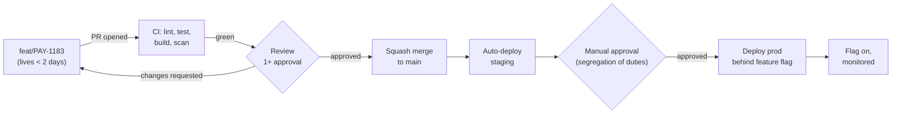

# Branching Strategy Is a Governance Decision, Not a Developer Preference

Most teams pick a branching model in the first hour of a project and live with the consequences for five years. In a regulated enterprise, that hour also decides whether you can prove to an auditor who approved what, and when.

## The Real-World Problem

A retail bank runs a core payments platform on a two-week release train. Twenty-two engineers work across four squads. They adopted GitFlow in 2019 because a blog post recommended it, and now every release week costs two days of merge-conflict resolution between `develop` and three long-lived `feature/*` branches.

Then the regulator asks a simple question during an audit: *"Show me the approval record for the change that altered the interbank settlement fee calculation on 14 March."* The change exists in six commits, spread across two merge commits, one of which was a conflict resolution that silently reverted a colleague's validation fix. Nobody can produce a clean answer. The engineering cost of the wrong branching model was visible; the compliance cost was not, until that moment.

## The Concept

A branching strategy answers three questions at once, and enterprise teams usually only think about the first:

1. **How do we integrate work?** (engineering)
2. **How do we prove a change was reviewed and approved?** (governance)
3. **How do we ship a fix to a version a customer is pinned to?** (product)

### Trunk-based development — the 2026 default

One long-lived branch (`main`). Branches live hours to two days, then squash-merge. Every merge to `main` is one reviewed, atomic, attributable commit. Unfinished work hides behind feature flags rather than behind branches.

This is the default because it makes the audit story trivial: one commit, one PR, one approver, one CI record.

### GitFlow — only for pinned versions

`develop`, `release/*`, `hotfix/*`, and long-lived features. Justified only when you genuinely support multiple concurrent versions in production — on-prem enterprise software where a customer runs v4.2 and refuses to upgrade. If you deploy a single production instance, GitFlow buys you nothing and costs you merge pain.

### The rules that matter more than the model

- **Protected `main`**: no direct pushes, 1+ approval, CI green required, approvals dismissed on new commits.
- **Squash merge**: `main` becomes one commit per logical change — bisectable, revertable, auditable.
- **Conventional Commits** (`feat:`, `fix:`, `chore:`): feeds automated changelogs and release notes, which is how you answer "what shipped in release 24.3?" without a human writing it down.
- **Branch names carry the ticket ID** (`feat/PAY-1183-settlement-fee-rounding`): this is the link between the requirement, the code, and the test — the traceability chain an auditor follows.

## How It Works



Every arrow in that diagram produces a durable record. That is the point.

## Practical Example

Repository setup for the payments platform, day one:

```bash
# .gitignore generated for the stack — never hand-written
curl -sL https://www.toptal.com/developers/gitignore/api/java,gradle,node,intellij > .gitignore

git checkout -b main
git add .gitignore README.md CONTRIBUTING.md LICENSE
git commit -m "chore: initialise repository baseline"
```

Branch protection as code (GitHub ruleset, so the config is itself reviewable):

```json
{
  "name": "protect-main",
  "target": "branch",
  "conditions": { "ref_name": { "include": ["refs/heads/main"] } },
  "rules": [
    { "type": "deletion" },
    { "type": "non_fast_forward" },
    {
      "type": "pull_request",
      "parameters": {
        "required_approving_review_count": 1,
        "dismiss_stale_reviews_on_push": true,
        "require_code_owner_review": true
      }
    },
    {
      "type": "required_status_checks",
      "parameters": {
        "required_status_checks": [{ "context": "verify" }],
        "strict_required_status_checks_policy": true
      }
    }
  ]
}
```

`CODEOWNERS` is where segregation of duties becomes mechanical:

```
# Payments core requires the payments squad; settlement logic requires two approvals
/src/main/java/com/bank/payments/       @bank/payments-squad
/src/main/java/com/bank/settlement/     @bank/payments-squad @bank/risk-engineering
/db/changelog/                          @bank/dba-team
```

Commit convention enforced in CI, not in a wiki page:

```yaml
- name: Validate commit messages
  run: npx --yes commitlint --from=${{ github.event.pull_request.base.sha }} --to=HEAD
```

## Enterprise Trade-offs

| Approach | Pros | Cons | When to use (Banking / Insurance / Enterprise) |
|---|---|---|---|
| **Trunk-based + feature flags** | Clean audit trail, no merge debt, fast integration | Requires flag discipline and real CI | Default for any single-production-instance system: internal banking platforms, insurance portals, SaaS |
| **Trunk-based + release branches** | Cuts a stable branch for regulated sign-off windows | Cherry-pick overhead for hotfixes | Systems with a fixed release calendar and formal UAT gates |
| **GitFlow** | Supports several live versions simultaneously | Heavy merge cost, muddy history, slow integration | On-prem enterprise products where customers pin versions |
| **Direct push to `main`** | Nothing | No review record, no approval evidence | Never in an enterprise — it fails the first control test |

## Why This Still Matters Through 2030

Branching is one of the few decisions that gets harder, not easier, to change over time — history is append-only and habits calcify. The industry has settled decisively on trunk-based development with feature flags because it is the only model that supports continuous delivery *and* produces the per-change approval evidence that regulators increasingly demand. As AI-assisted development raises commit volume, small reviewable units of change matter more, not less: a 400-line PR reviewed properly beats a 4,000-line one approved on faith, whoever or whatever wrote it.

→ Next: [02-environment-and-secrets.md](02-environment-and-secrets.md) · Related: [09-code-review-process.md](09-code-review-process.md) · [08-documentation-baseline.md](08-documentation-baseline.md)
