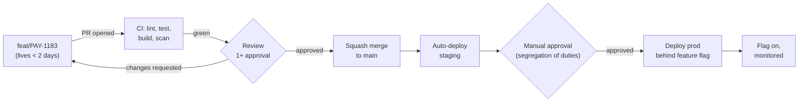

# Branching Strategy Is a Governance Decision, Not a Developer Preference

Most teams pick a branching model in the first hour of a project and live with the consequences for five years. In a regulated enterprise, that hour also decides whether you can prove to an auditor who approved what, and when.

## The Real-World Problem

A retail bank runs a core payments platform on a two-week release train. Twenty-two engineers work across four squads. They adopted GitFlow in 2019 because a blog post recommended it, and now every release week costs two days of merge-conflict resolution between `develop` and three long-lived `feature/*` branches.

Then the regulator asks a simple question during an audit: *"Show me the approval record for the change that altered the interbank settlement fee calculation on 14 March."* The change exists in six commits, spread across two merge commits, one of which was a conflict resolution that silently reverted a colleague's validation fix. Nobody can produce a clean answer. The engineering cost of the wrong branching model was visible; the compliance cost was not, until that moment.

## The Concept

A branching strategy answers three questions at once, and enterprise teams usually only think about the first:

1. **How do we integrate work?** (engineering)
2. **How do we prove a change was reviewed and approved?** (governance)
3. **How do we ship a fix to a version a customer is pinned to?** (product)

### Trunk-based development — the 2026 default

One long-lived branch (`main`). Branches live hours to two days, then squash-merge. Every merge to `main` is one reviewed, atomic, attributable commit. Unfinished work hides behind feature flags rather than behind branches.

This is the default because it makes the audit story trivial: one commit, one PR, one approver, one CI record.

### GitFlow — only for pinned versions

`develop`, `release/*`, `hotfix/*`, and long-lived features. Justified only when you genuinely support multiple concurrent versions in production — on-prem enterprise software where a customer runs v4.2 and refuses to upgrade. If you deploy a single production instance, GitFlow buys you nothing and costs you merge pain.

### The rules that matter more than the model

- **Protected `main`**: no direct pushes, 1+ approval, CI green required, approvals dismissed on new commits.
- **Squash merge**: `main` becomes one commit per logical change — bisectable, revertable, auditable.
- **Conventional Commits** (`feat:`, `fix:`, `chore:`): feeds automated changelogs and release notes, which is how you answer "what shipped in release 24.3?" without a human writing it down.
- **Branch names carry the ticket ID** (`feat/PAY-1183-settlement-fee-rounding`): this is the link between the requirement, the code, and the test — the traceability chain an auditor follows.

## How It Works



Every arrow in that diagram produces a durable record. That is the point.

## Practical Example

Repository setup for the payments platform, day one:

```bash
# .gitignore generated for the stack — never hand-written
curl -sL https://www.toptal.com/developers/gitignore/api/java,gradle,node,intellij > .gitignore

git checkout -b main
git add .gitignore README.md CONTRIBUTING.md LICENSE
git commit -m "chore: initialise repository baseline"
```

Branch protection as code (GitHub ruleset, so the config is itself reviewable):

```json
{
  "name": "protect-main",
  "target": "branch",
  "conditions": { "ref_name": { "include": ["refs/heads/main"] } },
  "rules": [
    { "type": "deletion" },
    { "type": "non_fast_forward" },
    {
      "type": "pull_request",
      "parameters": {
        "required_approving_review_count": 1,
        "dismiss_stale_reviews_on_push": true,
        "require_code_owner_review": true
      }
    },
    {
      "type": "required_status_checks",
      "parameters": {
        "required_status_checks": [{ "context": "verify" }],
        "strict_required_status_checks_policy": true
      }
    }
  ]
}
```

`CODEOWNERS` is where segregation of duties becomes mechanical:

```
# Payments core requires the payments squad; settlement logic requires two approvals
/src/main/java/com/bank/payments/       @bank/payments-squad
/src/main/java/com/bank/settlement/     @bank/payments-squad @bank/risk-engineering
/db/changelog/                          @bank/dba-team
```

Commit convention enforced in CI, not in a wiki page:

```yaml
- name: Validate commit messages
  run: npx --yes commitlint --from=${{ github.event.pull_request.base.sha }} --to=HEAD
```

## Enterprise Trade-offs

| Approach | Pros | Cons | When to use (Banking / Insurance / Enterprise) |
|---|---|---|---|
| **Trunk-based + feature flags** | Clean audit trail, no merge debt, fast integration | Requires flag discipline and real CI | Default for any single-production-instance system: internal banking platforms, insurance portals, SaaS |
| **Trunk-based + release branches** | Cuts a stable branch for regulated sign-off windows | Cherry-pick overhead for hotfixes | Systems with a fixed release calendar and formal UAT gates |
| **GitFlow** | Supports several live versions simultaneously | Heavy merge cost, muddy history, slow integration | On-prem enterprise products where customers pin versions |
| **Direct push to `main`** | Nothing | No review record, no approval evidence | Never in an enterprise — it fails the first control test |

→ Next: [02-environment-and-secrets.md](02-environment-and-secrets.md) · Related: [09-code-review-process.md](09-code-review-process.md) · [08-documentation-baseline.md](08-documentation-baseline.md)

---

# យុទ្ធសាស្ត្រ Branch គឺជាការសម្រេចចិត្តគ្រប់គ្រង មិនមែនជាចំណូលចិត្តរបស់អ្នកអភិវឌ្ឍន៍

ក្រុមភាគច្រើនជ្រើសរើសម៉ូដែល branching ក្នុងម៉ោងដំបូងនៃគម្រោង ហើយរស់នៅជាមួយផលវិបាករបស់វារហូតដល់ប្រាំឆ្នាំ។ នៅក្នុងសហគ្រាសដែលមានបញ្ញត្តិច្បាប់តឹងរឹង ម៉ោងនោះក៏សម្រេចថាតើអ្នកអាចបញ្ជាក់ទៅសវនករបានដែរឬទេថា អ្នកណាបានយល់ព្រមលើអ្វី និងនៅពេលណា។

## បញ្ហាជាក់ស្តែង

ធនាគាររាយមួយដំណើរការវេទិកាទូទាត់ស្នូល (core payments platform) លើខ្សែសង្វាក់ចេញផ្សាយរយៈពេលពីរសប្តាហ៍។ វិស្វករម្ភៃពីរនាក់ធ្វើការនៅក្នុងបួនក្រុម។ ពួកគេបានយក GitFlow មកប្រើនៅឆ្នាំ 2019 ព្រោះមានប្លុកមួយបានណែនាំ ហើយឥឡូវនេះរាល់សប្តាហ៍ចេញផ្សាយចំណាយពេលពីរថ្ងៃ ដើម្បីដោះស្រាយជម្លោះការបញ្ចូល (merge conflict) រវាង `develop` និង branch `feature/*` ចំនួនបីដែលរស់នៅយូរ។

បន្ទាប់មក អ្នកគ្រប់គ្រងច្បាប់សួរសំណួរមួយសាមញ្ញកំឡុងពេលធ្វើសវនកម្ម៖ *"សូមបង្ហាញកំណត់ត្រាការអនុម័តសម្រាប់ការផ្លាស់ប្តូរដែលបានកែប្រែការគណនាកម្រៃថ្លៃសេវាទូទាត់រវាងធនាគារ នៅថ្ងៃទី 14 ខែមិនា។"* ការផ្លាស់ប្តូរនោះមាននៅក្នុង commit ចំនួនប្រាំមួយ ខ្ចាត់ខ្ចាយលើ merge commit ពីរ ដែលមួយក្នុងនោះជាការដោះស្រាយជម្លោះដែលបានលុបចោលដោយស្ងាត់ស្ងៀមនូវការកែតម្រូវសុពលភាព (validation fix) របស់សហការីម្នាក់។ គ្មាននរណាម្នាក់អាចផ្តល់ចម្លើយច្បាស់លាស់បានទេ។ ថ្លៃដើមផ្នែកវិស្វកម្មនៃម៉ូដែល branching ខុសនេះមើលឃើញច្បាស់ ប៉ុន្តែថ្លៃដើមផ្នែកអនុលោមភាព (compliance) មិនត្រូវបានគេឃើញទេ រហូតដល់ពេលនោះ។

## គោលគំនិត

យុទ្ធសាស្ត្រ branching ឆ្លើយសំណួរបីក្នុងពេលតែមួយ ហើយក្រុមសហគ្រាសភាគច្រើនគិតតែពីសំណួរទីមួយប៉ុណ្ណោះ៖

1. **តើយើងបញ្ចូលការងារយ៉ាងដូចម្តេច?** (វិស្វកម្ម)
2. **តើយើងបញ្ជាក់យ៉ាងណាថាការផ្លាស់ប្តូរមួយត្រូវបានពិនិត្យ និងអនុម័ត?** (អភិបាលកិច្ច)
3. **តើយើងផ្តល់ការកែតម្រូវទៅកំណែមួយដែលអតិថិជនកំពុងប្រើប្រាស់ (pinned) យ៉ាងណា?** (ផលិតផល)

### Trunk-based development — លំនាំដើមឆ្នាំ 2026

branch មួយដែលរស់នៅយូរ (`main`)។ branch ផ្សេងទៀតរស់នៅចាប់ពីពីរបីម៉ោងទៅពីរថ្ងៃ រួចធ្វើ squash merge។ រាល់ merge ទៅ `main` គឺជា commit តែមួយ ដែលបានពិនិត្យ រួម និងអាចតម្រុយប្រភពបាន (attributable)។ ការងារដែលមិនទាន់ចប់ត្រូវលាក់នៅក្រោម feature flag ជំនួសឱ្យការលាក់នៅក្រោយ branch។

នេះជាជម្រើសលំនាំដើម ព្រោះវាធ្វើឱ្យរឿងសវនកម្មក្លាយជារឿងសាមញ្ញ៖ commit មួយ, PR មួយ, អ្នកអនុម័តម្នាក់, កំណត់ត្រា CI មួយ។

### GitFlow — សម្រាប់តែកំណែដែលបានជាប់ (pinned) ប៉ុណ្ណោះ

`develop`, `release/*`, `hotfix/*`, និង feature ដែលរស់នៅយូរ។ សុចរិតតែក្នុងករណីដែលអ្នកគាំទ្រកំណែផលិតកម្មច្រើនក្នុងពេលដំណាលគ្នាដោយពិតប្រាកដ — កម្មវិធីសហគ្រាសដែលដំឡើងនៅឯកន្លែង (on-prem) ដែលអតិថិជនប្រើកំណែ v4.2 ហើយមិនព្រមធ្វើបច្ចុប្បន្នភាព។ ប្រសិនបើអ្នកដាក់ឱ្យប្រើប្រាស់តែ instance ផលិតកម្មតែមួយ GitFlow មិនផ្តល់អ្វីឱ្យអ្នកទេ ផ្ទុយទៅវិញ វានាំមកនូវការឈឺក្បាលក្នុងការ merge។

### ក្បួនច្បាប់ដែលសំខាន់ជាងម៉ូដែល

- **ការពារ `main`**៖ មិនអនុញ្ញាតឱ្យ push ដោយផ្ទាល់ទេ, ត្រូវការការអនុម័តយ៉ាងតិចមួយ, CI ត្រូវជាប់ (green), ការអនុម័តត្រូវលុបចោលនៅពេលមាន commit ថ្មី។
- **Squash merge**៖ `main` ក្លាយជា commit តែមួយក្នុងមួយការផ្លាស់ប្តូរឡូជីខល — អាចធ្វើ bisect បាន, អាចត្រឡប់ក្រោយបាន, អាចធ្វើសវនកម្មបាន។
- **Conventional Commits** (`feat:`, `fix:`, `chore:`)៖ ចំណីទិន្នន័យទៅ changelog និងកំណត់ចំណាំចេញផ្សាយស្វ័យប្រវត្តិ ដែលជាវិធីឆ្លើយសំណួរ "តើអ្វីត្រូវបានចេញផ្សាយក្នុងកំណែ 24.3?" ដោយមិនចាំបាច់ឱ្យមនុស្សសរសេរដោយផ្ទាល់។
- **ឈ្មោះ branch ត្រូវផ្ទុក ticket ID** (`feat/PAY-1183-settlement-fee-rounding`)៖ នេះជាតំណភ្ជាប់រវាងតម្រូវការ, កូដ, និងតេស្ត — ខ្សែសង្វាក់តាមដានដែលសវនករតាមដាន។

## របៀបដែលវាដំណើរការ


រាល់ព្រួញនៅក្នុងដ្យាក្រាមនោះបង្កើតកំណត់ត្រាដែលស្ថិតស្ថេរ។ នោះជាចំណុចសំខាន់។

## ឧទាហរណ៍អនុវត្តជាក់ស្តែង

ការរៀបចំ repository សម្រាប់វេទិកាទូទាត់ ថ្ងៃទីមួយ៖

```bash
# .gitignore generated for the stack — never hand-written
curl -sL https://www.toptal.com/developers/gitignore/api/java,gradle,node,intellij > .gitignore

git checkout -b main
git add .gitignore README.md CONTRIBUTING.md LICENSE
git commit -m "chore: initialise repository baseline"
```

ការការពារ branch ជាកូដ (GitHub ruleset ដូច្នេះការកំណត់រចនាសម្ព័ន្ធខ្លួនឯងអាចត្រូវពិនិត្យឡើងវិញបាន)៖

```json
{
  "name": "protect-main",
  "target": "branch",
  "conditions": { "ref_name": { "include": ["refs/heads/main"] } },
  "rules": [
    { "type": "deletion" },
    { "type": "non_fast_forward" },
    {
      "type": "pull_request",
      "parameters": {
        "required_approving_review_count": 1,
        "dismiss_stale_reviews_on_push": true,
        "require_code_owner_review": true
      }
    },
    {
      "type": "required_status_checks",
      "parameters": {
        "required_status_checks": [{ "context": "verify" }],
        "strict_required_status_checks_policy": true
      }
    }
  ]
}
```

`CODEOWNERS` គឺជាកន្លែងដែលការបំបែកភារកិច្ច (segregation of duties) ក្លាយជារឿងស្វ័យប្រវត្តិ៖

```
# Payments core requires the payments squad; settlement logic requires two approvals
/src/main/java/com/bank/payments/       @bank/payments-squad
/src/main/java/com/bank/settlement/     @bank/payments-squad @bank/risk-engineering
/db/changelog/                          @bank/dba-team
```

បង្កាន់ដៃលើទម្រង់ commit ត្រូវបានអនុវត្តនៅក្នុង CI មិនមែននៅក្នុងវិគីទេ៖

```yaml
- name: Validate commit messages
  run: npx --yes commitlint --from=${{ github.event.pull_request.base.sha }} --to=HEAD
```

## ការជួញដូរសម្រាប់សហគ្រាស

| វិធីសាស្ត្រ | គុណសម្បត្តិ | គុណវិបត្តិ | ពេលណាត្រូវប្រើ (ធនាគារ / ធានារ៉ាប់រង / សហគ្រាស) |
|---|---|---|---|
| **Trunk-based + feature flag** | ខ្សែសង្វាក់សវនកម្មច្បាស់លាស់, គ្មានបំណុល merge, បញ្ចូលការងារបានរហ័ស | ត្រូវការវិន័យលើ flag និង CI ពិតប្រាកដ | លំនាំដើមសម្រាប់ប្រព័ន្ធដែលមាន production instance តែមួយ៖ វេទិកាធនាគារផ្ទៃក្នុង, ច្រកទ្វារធានារ៉ាប់រង, SaaS |
| **Trunk-based + release branch** | កាត់ branch ស្ថិតស្ថេរសម្រាប់ពេលអនុម័តតាមបញ្ញត្តិច្បាប់ | ចំណាយបន្ថែមលើ cherry-pick សម្រាប់ hotfix | ប្រព័ន្ធដែលមានប្រតិទិនចេញផ្សាយថេរ និងច្រកទ្វារ UAT ជាផ្លូវការ |
| **GitFlow** | គាំទ្រកំណែផលិតកម្មច្រើនក្នុងពេលដំណាលគ្នា | ថ្លៃដើម merge ធ្ងន់, ប្រវត្តិច្របូកច្របល់, បញ្ចូលការងារយឺត | ផលិតផលសហគ្រាសដែលដំឡើងនៅឯកន្លែង ដែលអតិថិជនប្រើកំណែជាប់ |
| **Push ដោយផ្ទាល់ទៅ `main`** | គ្មាន | គ្មានកំណត់ត្រាពិនិត្យ, គ្មានភស្តុតាងអនុម័ត | មិនត្រូវប្រើក្នុងសហគ្រាសឡើយ — វាបរាជ័យរាល់ការត្រួតពិនិត្យដំបូង |

→ បន្ទាប់៖ [02-environment-and-secrets.md](02-environment-and-secrets.md) · ពាក់ព័ន្ធ៖ [09-code-review-process.md](09-code-review-process.md) · [08-documentation-baseline.md](08-documentation-baseline.md)
