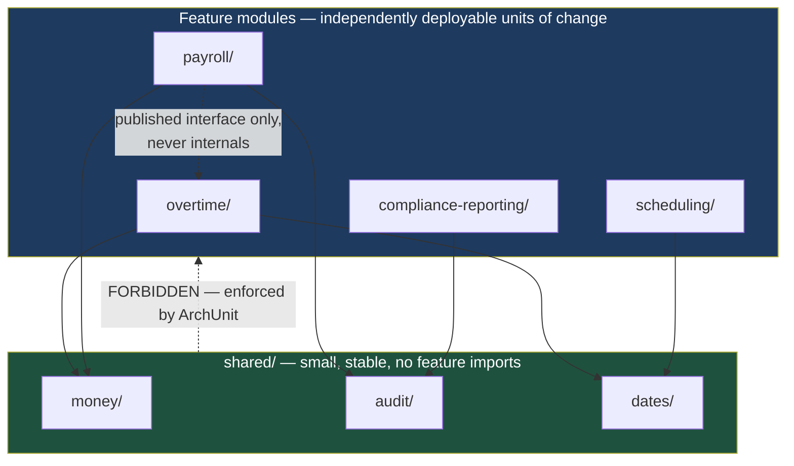

# Package by Feature: Why Enterprise Codebases Rot from the Folder Tree Up

Folder structure looks like a cosmetic decision for about six months. Then it starts deciding how many files a developer must open to change one business rule — and that number is the real measure of how maintainable a codebase is.

## The Real-World Problem

An enterprise software vendor sells a workforce management suite: scheduling, payroll, time tracking, compliance reporting. Six years in, the backend is organised layer-first — `controllers/`, `services/`, `repositories/`, `dtos/`, `mappers/`, `validators/`. There are 340 files in `services/` alone.

A customer asks for a change to overtime calculation. The engineer touches `OvertimeService`, then `PayrollService` (which duplicates part of the rule), then `TimesheetValidator`, then two mappers, then a controller. Five folders, seven files, and a code review where nobody can tell whether the change is complete because nothing in the tree groups "overtime" together.

Worse, the scheduling team and the payroll team both edit `services/`. Every sprint produces conflicts between teams that share no business concern — an organisational cost created purely by a folder layout chosen in week one.

## The Concept

### Layer-first vs. feature-first

**Layer-first** groups by technical role. Its promise is that you always know where a class type lives. Its cost is that every business change fans out across every folder, and no folder maps to anything a stakeholder can name.

**Feature-first** groups by business capability. Each feature folder owns its model, its rules, its persistence, and its HTTP surface. One business change touches one folder. A new engineer asked to "work on claims" has exactly one directory to read.

```
BAD — layer-first                 GOOD — feature-first
src/main/java/com/vendor/         src/main/java/com/vendor/
├── controllers/                  ├── overtime/
│   ├── OvertimeController        │   ├── OvertimeController.java
│   ├── PayrollController         │   ├── OvertimeCalculator.java
│   └── ... 40 more               │   ├── OvertimeRepository.java
├── services/                     │   └── OvertimeRule.java
│   ├── OvertimeService           ├── payroll/
│   ├── PayrollService            │   ├── PayrollController.java
│   └── ... 338 more              │   └── ...
├── repositories/                 ├── scheduling/
└── dtos/                         │   └── ...
                                  └── shared/
                                      ├── money/
                                      └── audit/
```

### The dependency rule

Feature-first only holds if you enforce direction:

- A feature may depend on `shared/`.
- `shared/` never depends on a feature.
- A feature should not import another feature's internals — it calls a published interface, or communicates by event.

Without enforcement, feature folders quietly become layer folders with better names. Enforcement means a linter, not a convention document.

### `shared/` is not `utils/`

Shared code is coupling with a friendly name — every feature that imports it becomes sensitive to changes in it. Keep it small and name modules by domain meaning (`money/`, `audit/`, `dates/`), never by vagueness (`utils/`, `helpers/`, `common/`). A `utils/` folder is where code goes when nobody decided where it belongs, and it grows monotonically forever.

### Monorepo vs. polyrepo

Decide now — migrating later is a multi-week project with a full CI rebuild.

## How It Works



## Practical Example

**Enforce the boundary in Java with ArchUnit** — a failing test, not a code-review comment:

```java
package com.vendor.architecture;

import com.tngtech.archunit.core.importer.ImportOption;
import com.tngtech.archunit.junit.AnalyzeClasses;
import com.tngtech.archunit.junit.ArchTest;
import com.tngtech.archunit.lang.ArchRule;

import static com.tngtech.archunit.lang.syntax.ArchRuleDefinition.noClasses;

@AnalyzeClasses(
    packages = "com.vendor",
    importOptions = ImportOption.DoNotIncludeTests.class
)
class ModuleBoundaryTest {

    @ArchTest
    static final ArchRule shared_must_not_depend_on_features =
        noClasses().that().resideInAPackage("..shared..")
            .should().dependOnClassesThat()
            .resideInAnyPackage("..overtime..", "..payroll..", "..scheduling..", "..compliance..");

    @ArchTest
    static final ArchRule features_must_not_reach_into_each_others_internals =
        noClasses().that().resideInAPackage("..payroll..")
            .should().dependOnClassesThat()
            .resideInAPackage("..overtime.internal..");

    @ArchTest
    static final ArchRule domain_must_not_depend_on_spring =
        noClasses().that().resideInAPackage("..overtime.domain..")
            .should().dependOnClassesThat()
            .resideInAnyPackage("org.springframework..", "jakarta.persistence..");
}
```

**The TypeScript equivalent** with `eslint-plugin-boundaries`:

```js
// eslint.config.js
export default [
  {
    plugins: { boundaries },
    settings: {
      'boundaries/elements': [
        { type: 'feature', pattern: 'src/features/*', capture: ['name'] },
        { type: 'shared', pattern: 'src/shared/*' },
      ],
    },
    rules: {
      'boundaries/element-types': ['error', {
        default: 'disallow',
        rules: [
          { from: 'feature', allow: ['shared', ['feature', { name: '${from.name}' }]] },
          { from: 'shared', allow: ['shared'] }, // shared can never import a feature
        ],
      }],
    },
  },
]
```

**Feature folder, front to back** (Next.js App Router, colocated):

```
src/
├── app/
│   └── (dashboard)/
│       └── overtime/
│           ├── page.tsx              # route — thin, delegates to the feature
│           ├── loading.tsx
│           └── error.tsx
├── features/
│   └── overtime/
│       ├── components/OvertimeTable.tsx
│       ├── hooks/useOvertimeFilters.ts
│       ├── api/overtime.queries.ts
│       ├── schema/overtime.schema.ts   # Zod — shared client + server
│       └── index.ts                    # the only public surface
└── shared/
    ├── money/
    └── ui/
```

`index.ts` as the single export barrel is what makes "do not import internals" mechanically checkable.

## Enterprise Trade-offs

| Approach | Pros | Cons | When to use (Banking / Insurance / Enterprise) |
|---|---|---|---|
| **Feature-first, single deployable** | One change = one folder; teams own directories, not layers | Requires linted boundaries or it degrades | Default for any codebase above ~20k lines or above two teams |
| **Layer-first** | Trivially obvious where a class type goes | Every change fans out; cross-team conflicts; no business mapping | Only for genuinely small services (a handful of endpoints) |
| **Monorepo** (Turborepo, Nx, Gradle multi-project) | Shared types between frontend and backend, atomic cross-cutting changes, one CI story | Needs build caching and CODEOWNERS discipline to stay fast | One product, several teams, shared contracts — common for enterprise suites |
| **Polyrepo** | Hard team boundaries, independent release cadence | Contract drift, cross-cutting changes span many PRs | Independent services with separate release calendars, partner-facing components |

## Why This Still Matters Through 2030

Modular monoliths have decisively displaced default-microservices as the starting architecture, and the modular monolith *is* feature-first structure with enforced boundaries — the folder tree becomes the seam along which you can later extract a service, if you ever need to. That makes structure a reversibility decision, not an aesthetic one. It also increasingly matters for AI-assisted development: a coherent feature folder is a coherent context window, while a layer-first tree forces any assistant — human or otherwise — to reconstruct the business concept from fragments scattered across five directories.

→ Next: [04-linting-formatting-hooks.md](04-linting-formatting-hooks.md) · Related: [../03-architecture/02-hexagonal-architecture.md](../03-architecture/02-hexagonal-architecture.md) · [../03-architecture/04-microservices-vs-monolith.md](../03-architecture/04-microservices-vs-monolith.md)
