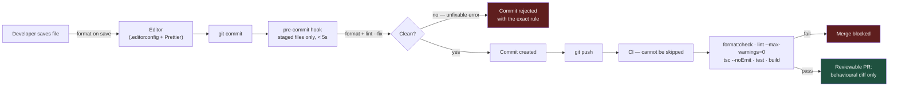

# Automate the Arguments Away: Linting, Formatting and Hooks at Team Scale

Every hour a senior engineer spends commenting on indentation is an hour not spent catching the authorization bug three files down. Formatting is a solved problem; the only remaining decision is whether you let a machine solve it.

## The Real-World Problem

A bank's digital channels group has 45 engineers across six squads, and a code review culture that has quietly become the bottleneck. A typical pull request collects 18 comments: 11 about formatting and naming, 4 opinions on whether to use `Optional` as a parameter, and 3 about the actual logic.

The measurable damage: average time-to-merge is 2.6 days, and a post-incident review finds that a null-handling defect which reached production had passed review — the reviewer's attention had been spent on 40 lines of reformatted whitespace introduced by a colleague's differently-configured IDE. The diff was 700 lines; only 60 were behavioural. Nobody could see the change for the noise.

## The Concept

Split the tooling by what it is actually for. Teams conflate these three and end up with a slow, noisy setup that people bypass.

| Tool | Purpose | Should it block the build? |
|---|---|---|
| **Formatter** | Mechanical layout — whitespace, line breaks, import order | Yes, and it should auto-fix rather than complain |
| **Linter** | Correctness and hazard detection — unused results, missing `await`, unsafe casts | Yes, on errors only |
| **Type checker** | Contract verification across the codebase | Yes, in strict mode |

### One formatter, zero configuration debate

Adopt an opinionated formatter and accept its defaults verbatim: Prettier for JS/TS, Spotless with google-java-format for Java, Ruff format for Python. The value is not that its output is optimal; it is that it ends the discussion permanently and makes diffs minimal.

Then run it across the whole repository in **one commit, before any feature work**, and record that commit hash in `.git-blame-ignore-revs` so `git blame` still attributes real authorship:

```
# .git-blame-ignore-revs
# Repo-wide Spotless + Prettier format, no behavioural change
8f2c91ae4d0b7c1e3a5f6d9b2c4e8a1f7b3d5c9e
```

### Lint for hazards, not for taste

A linter rule should catch something that can break in production. `no-floating-promises` prevents a swallowed async failure; `@typescript-eslint/no-explicit-any` protects the type contract. A rule about arrow-function parentheses catches nothing — that belongs to the formatter.

Also: **have zero warnings**. A warning that nobody fixes trains the team to ignore output, which means the one warning that mattered scrolls past unread. Either it is an error, or it is deleted.

### Hooks have a five-second budget

Pre-commit runs on staged files only, and must finish in under five seconds. Cross that threshold and developers start using `--no-verify`, at which point no hook runs at all and you have negative value. Everything slower — full test suite, whole-project type-check, integration tests — belongs in CI, which cannot be bypassed.

## How It Works



The hook exists for developer speed. CI exists for the guarantee. You need both, because the hook is optional by design and the guarantee cannot be.

## Practical Example

**JS/TS — Husky + lint-staged, the five-second setup:**

```json
// package.json
{
  "scripts": {
    "format": "prettier --write .",
    "format:check": "prettier --check .",
    "lint": "eslint . --max-warnings=0",
    "typecheck": "tsc --noEmit"
  },
  "lint-staged": {
    "*.{ts,tsx}": ["prettier --write", "eslint --fix --max-warnings=0"],
    "*.{json,md,yml,yaml,css}": ["prettier --write"]
  }
}
```

```bash
npx husky init
printf 'npx lint-staged\n' > .husky/pre-commit
```

**The ESLint rules that earn their place** in an enterprise codebase:

```js
// eslint.config.js
import tseslint from 'typescript-eslint'

export default tseslint.config(
  ...tseslint.configs.strictTypeChecked,
  {
    rules: {
      '@typescript-eslint/no-floating-promises': 'error',   // silent async failure
      '@typescript-eslint/no-misused-promises': 'error',    // async fn where void expected
      '@typescript-eslint/no-explicit-any': 'error',        // holes in the contract
      '@typescript-eslint/switch-exhaustiveness-check': 'error', // new enum case = compile error
      'no-console': 'error',                                // structured logger only
      eqeqeq: ['error', 'always'],
    },
  },
)
```

`switch-exhaustiveness-check` is worth calling out: add a new `ClaimStatus` and every unhandled switch becomes a compile error instead of a silent fall-through in production.

**TypeScript strictness — non-negotiable settings:**

```json
// tsconfig.json
{
  "compilerOptions": {
    "strict": true,
    "noUncheckedIndexedAccess": true,   // arr[0] is T | undefined — reflects reality
    "exactOptionalPropertyTypes": true,
    "noImplicitOverride": true,
    "verbatimModuleSyntax": true
  }
}
```

`noUncheckedIndexedAccess` is the highest-value flag most teams leave off. It turns an entire class of production `undefined` errors into compile errors.

**Java — Spotless plus real static analysis:**

```kotlin
// build.gradle.kts
plugins {
    id("com.diffplug.spotless") version "6.25.0"
    id("net.ltgt.errorprone") version "4.1.0"
}

spotless {
    java {
        googleJavaFormat("1.24.0")
        removeUnusedImports()
        trimTrailingWhitespace()
        endWithNewline()
    }
    kotlinGradle { ktlint() }
}

tasks.withType<JavaCompile> {
    options.errorprone {
        error("NullAway")                     // null-safety as a compile error
        option("NullAway:AnnotatedPackages", "com.bank")
    }
    options.compilerArgs.addAll(listOf("-Werror", "-Xlint:all"))
}

tasks.named("check") { dependsOn("spotlessCheck") }
```

**`.editorconfig` — so the IDE war ends before it starts:**

```ini
root = true

[*]
charset = utf-8
end_of_line = lf
insert_final_newline = true
trim_trailing_whitespace = true
indent_style = space
indent_size = 2

[*.{java,kt}]
indent_size = 4

[*.md]
trim_trailing_whitespace = false
```

`end_of_line = lf` matters specifically on mixed Windows/Linux enterprise teams, where CRLF churn otherwise shows up as thousand-line phantom diffs.

## Enterprise Trade-offs

| Approach | Pros | Cons | When to use (Banking / Insurance / Enterprise) |
|---|---|---|---|
| **Formatter + linter + hooks + CI** | Reviews discuss behaviour only; diffs are minimal | ~half a day of initial setup, one large format commit | Always. The setup cost is recovered within the first sprint on any team above three people |
| **CI checks only, no hooks** | Nothing local to install or maintain | Feedback arrives minutes later; broken commits enter history | Acceptable for small teams; frustrating above ten engineers |
| **Hooks only, no CI** | Fast local feedback | `--no-verify` bypasses everything; no guarantee at all | Never — it provides the appearance of a control without the control |
| **Style guide document, enforced by humans** | No tooling | Inconsistent, slow, and it converts senior review time into whitespace commentary | Never; this is precisely the failure in the scenario above |
| **Warnings tolerated in the build** | Feels pragmatic | Output becomes noise; real warnings go unread | Never — promote to error or delete the rule |

## Why This Still Matters Through 2030

The volume of generated code is rising sharply, and generated code is exactly what mechanical checks are best at policing: consistency, type-safety, unhandled promises, non-exhaustive switches. As more of a diff arrives pre-written, the reviewer's scarce attention has to go to intent, authorization, and failure paths — which only works if the machine has already absorbed everything mechanical. Strict type checking in particular keeps compounding in value: each flag you enable converts a class of runtime incident into a build failure, and that trade is always worth making in a system where a runtime incident means a failed payment or a rejected claim.

→ Next: [05-ci-pipeline.md](05-ci-pipeline.md) · Related: [09-code-review-process.md](09-code-review-process.md) · [../08-testing-strategies/01-the-testing-pyramid-revisited.md](../08-testing-strategies/01-the-testing-pyramid-revisited.md)
