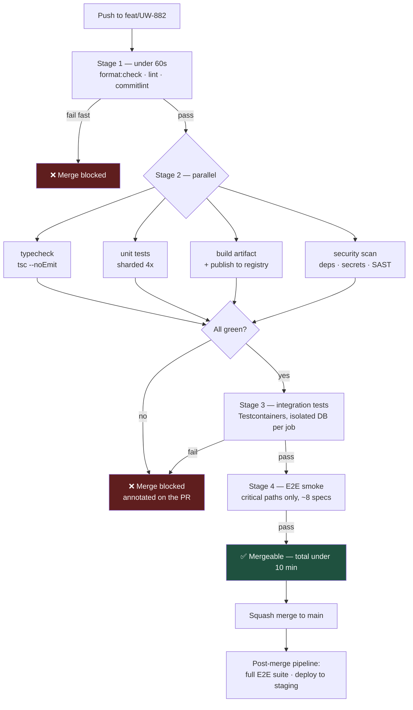

# The Ten-Minute Pipeline: CI That People Actually Wait For

A CI pipeline has one job: to make the statement "`main` is releasable" true at all times. A pipeline slow enough that developers stop watching it does not do that job — it just produces a delayed opinion nobody reads.

## The Real-World Problem

An insurer's underwriting platform has a 47-minute CI pipeline. It runs everything sequentially: lint, unit tests, a full Selenium suite against a shared staging database, and a container build.

The behaviour this produces is entirely predictable. Engineers open a PR, switch to another task, and come back an hour later. Because the E2E suite is flaky against the shared database, roughly one run in four fails for reasons unrelated to the change — so the team's normal response to a red build is to click "re-run" rather than to read the failure. Eventually somebody merges a genuine test failure that had been dismissed as flake, and a broken premium calculation reaches staging on the day of a client demo.

The pipeline was thorough and worthless at the same time, because its feedback arrived after the developer's attention had left.

## The Concept

### Order stages fast-to-slow

Put the checks that fail most often and cost least at the front. A lint error should be reported in 30 seconds, not after a 20-minute test suite has run. This is pure expected-value: fail cheap failures cheaply.

### Parallelise everything independent

Unit tests, type-checking, container build, and security scanning have no dependency on each other. Run them as concurrent jobs. Only integration and E2E tests need to wait for a build artifact.

### Build the artifact exactly once

Build the container or JAR once, publish it, and promote that same immutable artifact through staging and production. Rebuilding per environment means the thing you tested is not the thing you shipped — a distinction that matters enormously when an auditor asks what exactly was deployed.

### The ten-minute rule

The PR pipeline finishes in under ten minutes. Beyond that, developers context-switch, and a context-switched developer merges on hope. If your suite cannot fit, the answer is sharding and caching — and moving slow E2E coverage to a post-merge or nightly pipeline, not deleting the tests.

### Cache on the lockfile hash

Dependency resolution is usually the largest fixed cost. Key the cache on the hash of `package-lock.json` / `gradle.lockfile` so it invalidates precisely when dependencies change and never otherwise.

## How It Works



Note the split: the PR gate runs a small critical-path E2E set; the exhaustive suite runs after merge, where a 25-minute runtime blocks nobody.

## Practical Example

A complete pipeline for the underwriting service — parallel, cached, artifact built once:

```yaml
name: CI
on:
  pull_request:
  push:
    branches: [main]

concurrency:
  group: ci-${{ github.ref }}
  cancel-in-progress: true          # superseded runs stop burning minutes

jobs:
  static:
    name: Static checks
    runs-on: ubuntu-latest
    timeout-minutes: 5
    steps:
      - uses: actions/checkout@v4
        with: { fetch-depth: 0 }
      - uses: actions/setup-node@v4
        with: { node-version: '22', cache: 'npm' }
      - run: npm ci --prefer-offline
      - run: npm run format:check
      - run: npm run lint                 # --max-warnings=0
      - run: npx commitlint --from=origin/main --to=HEAD

  test:
    name: Unit tests (shard ${{ matrix.shard }}/4)
    runs-on: ubuntu-latest
    needs: static
    timeout-minutes: 8
    strategy:
      fail-fast: false
      matrix:
        shard: [1, 2, 3, 4]
    steps:
      - uses: actions/checkout@v4
      - uses: actions/setup-node@v4
        with: { node-version: '22', cache: 'npm' }
      - run: npm ci --prefer-offline
      - run: npx vitest run --shard=${{ matrix.shard }}/4 --coverage
      - uses: actions/upload-artifact@v4
        with:
          name: coverage-${{ matrix.shard }}
          path: coverage/

  typecheck:
    runs-on: ubuntu-latest
    needs: static
    steps:
      - uses: actions/checkout@v4
      - uses: actions/setup-node@v4
        with: { node-version: '22', cache: 'npm' }
      - run: npm ci --prefer-offline
      - run: npm run typecheck

  build:
    name: Build & publish artifact
    runs-on: ubuntu-latest
    needs: static
    permissions:
      contents: read
      packages: write
      id-token: write                    # OIDC — no long-lived registry secret
    steps:
      - uses: actions/checkout@v4
      - uses: docker/setup-buildx-action@v3
      - uses: docker/login-action@v3
        with:
          registry: ghcr.io
          username: ${{ github.actor }}
          password: ${{ secrets.GITHUB_TOKEN }}
      - uses: docker/build-push-action@v6
        with:
          push: true
          tags: ghcr.io/insurer/underwriting:${{ github.sha }}
          cache-from: type=gha
          cache-to: type=gha,mode=max

  security:
    runs-on: ubuntu-latest
    needs: static
    steps:
      - uses: actions/checkout@v4
      - uses: gitleaks/gitleaks-action@v2
      - uses: aquasecurity/trivy-action@0.28.0
        with:
          scan-type: fs
          severity: CRITICAL,HIGH
          exit-code: '1'
          ignore-unfixed: true

  integration:
    name: Integration (Testcontainers)
    runs-on: ubuntu-latest
    needs: [test, typecheck, build]
    timeout-minutes: 12
    steps:
      - uses: actions/checkout@v4
      - uses: actions/setup-java@v4
        with: { distribution: temurin, java-version: '21', cache: gradle }
      - run: ./gradlew integrationTest      # each job gets its own throwaway Postgres
      - uses: actions/upload-artifact@v4
        if: always()
        with: { name: test-report, path: build/reports/tests/ }
```

**The Gradle equivalent for the Spring Boot side**, with integration tests as their own source set so they never slow the unit run:

```kotlin
// build.gradle.kts
testing {
    suites {
        val integrationTest by registering(JvmTestSuite::class) {
            useJUnitJupiter()
            dependencies {
                implementation(project())
                implementation("org.springframework.boot:spring-boot-starter-test")
                implementation("org.testcontainers:postgresql:1.20.4")
            }
            targets.all { testTask.configure { shouldRunAfter(test) } }
        }
    }
}

tasks.test {
    useJUnitPlatform()
    maxParallelForks = (Runtime.getRuntime().availableProcessors() / 2).coerceAtLeast(1)
}
```

**Publish results where developers already are** — annotations on the PR, not a log file forty screens deep:

```yaml
      - uses: dorny/test-reporter@v1
        if: always()
        with:
          name: Unit tests
          path: 'reports/junit-*.xml'
          reporter: java-junit
          fail-on-error: true
```

## Enterprise Trade-offs

| Approach | Pros | Cons | When to use (Banking / Insurance / Enterprise) |
|---|---|---|---|
| **Fast PR gate + full suite post-merge** | Under 10 min feedback; exhaustive coverage still runs | A defect can reach `main` before the full suite finishes | Default. Pair it with staging-only deploys from `main` so nothing untested reaches production |
| **Everything in the PR gate** | Nothing merges untested | 30–60 min pipelines; developers disengage; re-run culture | Only where a broken `main` is genuinely catastrophic and the suite is genuinely fast |
| **Nightly-only integration tests** | PR pipeline is very fast | Failures are discovered a day late, against a batch of merged changes | Legacy suites too slow to shard — treat as a temporary state with an exit plan |
| **Self-hosted runners** | Access to internal networks and licensed test data; predictable cost at volume | You now operate and patch the runner fleet | Common in banking, where CI must reach internal services or PII-free test datasets behind the firewall |
| **Shared staging DB for CI** | Cheap to set up | Cross-run interference; the root cause of most flake | Never — use Testcontainers so each job gets an isolated database |

## Why This Still Matters Through 2030

Pipeline speed is the control loop on every other engineering practice: small PRs, trunk-based development, and continuous delivery all depend on feedback arriving inside the developer's attention span. That constraint is human, so it will not relax as tooling improves. What is changing is CI's second role — as the evidence system. Signed provenance (SLSA attestations, SBOM generation, artifact signing) is moving from optional to expected in regulated sectors, and CI is where that evidence is produced. A pipeline that builds each artifact once, records what went into it, and gates on that record is already positioned for those requirements; one that rebuilds per environment is not.

→ Next: [06-cd-and-deployment.md](06-cd-and-deployment.md) · Related: [../08-testing-strategies/01-the-testing-pyramid-revisited.md](../08-testing-strategies/01-the-testing-pyramid-revisited.md) · [04-linting-formatting-hooks.md](04-linting-formatting-hooks.md)
