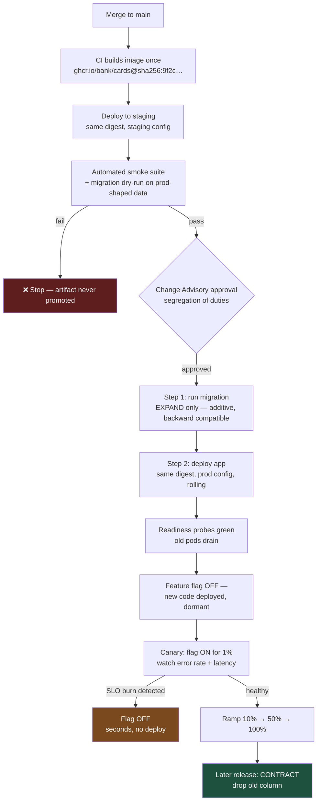

# Deploy Is Not Release: Shipping Safely When Downtime Is a Regulatory Event

The safest deployment is the one that changes nothing a user can see. Separate the act of putting code on a server from the act of turning behaviour on, and most deployment risk simply disappears.

## The Real-World Problem

A bank's card processing service deploys monthly, on a Saturday night, with a 90-minute maintenance window and eleven people on a bridge call. Release 24.7 includes a schema change: renaming `txn_amt` to `transaction_amount_minor`.

The migration runs, the new version deploys, and the smoke test passes. At 02:40 the team discovers a downstream reconciliation job — owned by another department, not in the release plan — still reads `txn_amt`. Reconciliation fails silently. The decision is to roll back, and that is when they learn the migration has no down script: the old column no longer exists. Restoring from backup means replaying four hours of transactions.

The window overruns to 06:15. Because the outage crossed the agreed service window for a payment system, it becomes a reportable operational incident with the regulator. The code change itself was eleven lines.

## The Concept

### Deploy and release are different events

**Deploying** puts a new artifact on infrastructure. **Releasing** exposes new behaviour to users. Conflate them and every deploy carries product risk, which is why organisations respond by deploying rarely — making each deploy larger, and therefore riskier still.

Separate them with feature flags and you can deploy on a Tuesday afternoon, then enable the feature for 1% of traffic on Wednesday, with an instant off-switch that requires no deployment at all.

### Promote one artifact, never rebuild

The container image built in CI is the image that reaches production. Environments differ only by injected configuration. This is what makes "what exactly is running in production?" answerable with a digest instead of a guess.

### Migrations are three deploys, not one

Never change a column in a single step. The expand/contract pattern keeps every intermediate state deployable and revertible:

1. **Expand** — add the new column, nullable. Write to both, read from the old.
2. **Migrate** — backfill in batches, then switch reads to the new column.
3. **Contract** — after the old code is fully out of production, drop the old column.

Each step is independently revertible, and at no point do the old and new application versions disagree about the schema. The scenario above failed precisely because it attempted all three in one window.

### Rollback is a rehearsed procedure

An untested rollback is a hypothesis. Rehearse it in staging every release, on a schedule, and time it — because during an incident you need a number ("rollback takes 4 minutes"), not an intention.

## How It Works



The critical property: between steps G and M there are four distinct points where you can stop safely, and only one of them requires a deployment to reverse.

## Practical Example

**Step 1 — a production-shaped container.** Multi-stage, non-root, distroless, with a real readiness probe:

```dockerfile
FROM gradle:8.12-jdk21 AS build
WORKDIR /src
COPY --chown=gradle:gradle . .
RUN gradle bootJar --no-daemon

FROM gcr.io/distroless/java21-debian12:nonroot
WORKDIR /app
COPY --from=build /src/build/libs/*.jar app.jar
USER nonroot
EXPOSE 8080
ENV JAVA_TOOL_OPTIONS="-XX:MaxRAMPercentage=75 -XX:+UseZGC"
ENTRYPOINT ["java", "-jar", "/app/app.jar"]
```

Distroless matters in banking for a concrete reason: no shell in the image means a compromised process has no `sh` to pivot with, and your CVE surface drops to the JRE plus your own dependencies.

**Step 2 — liveness and readiness must mean different things.**

```yaml
# k8s/deployment.yaml (excerpt)
spec:
  replicas: 6
  strategy:
    type: RollingUpdate
    rollingUpdate:
      maxUnavailable: 0        # never reduce capacity during a card-processing deploy
      maxSurge: 2
  template:
    spec:
      containers:
        - name: cards
          image: ghcr.io/bank/cards@sha256:9f2c8ab...   # digest, not a tag
          startupProbe:                                  # slow JVM start, don't kill it
            httpGet: { path: /actuator/health/liveness, port: 8080 }
            failureThreshold: 30
            periodSeconds: 5
          livenessProbe:                                 # is the process wedged?
            httpGet: { path: /actuator/health/liveness, port: 8080 }
            periodSeconds: 10
          readinessProbe:                                # can it serve? checks DB + broker
            httpGet: { path: /actuator/health/readiness, port: 8080 }
            periodSeconds: 5
          lifecycle:
            preStop:
              exec: { command: ["sleep", "10"] }         # let the LB deregister first
          resources:
            requests: { cpu: "500m", memory: "1Gi" }
            limits:   { memory: "1Gi" }                  # no CPU limit — avoids throttling
```

Getting liveness and readiness backwards is a classic outage: a liveness probe that checks the database will restart every pod in the fleet during a brief database blip, converting a degradation into a full outage.

**Step 3 — the expand/contract migration, as three Liquibase changesets across three releases.**

```yaml
# db/changelog/2026/release-24.7-expand.yaml   ← Release 24.7
databaseChangeLog:
  - changeSet:
      id: 24.7-1-add-transaction-amount-minor
      author: mengty.lim
      comment: "EXPAND — additive only. Old code unaffected. CARDS-1183"
      changes:
        - addColumn:
            tableName: card_transaction
            columns:
              - column:
                  name: transaction_amount_minor
                  type: BIGINT
                  constraints: { nullable: true }
      rollback:
        - dropColumn:
            tableName: card_transaction
            columnName: transaction_amount_minor
```

```yaml
# db/changelog/2026/release-24.8-migrate.yaml   ← Release 24.8, after 24.7 is stable
  - changeSet:
      id: 24.8-1-backfill-amount-minor
      author: mengty.lim
      comment: "Batched backfill — avoids a long table lock. CARDS-1183"
      changes:
        - sql:
            splitStatements: false
            sql: |
              UPDATE card_transaction
                 SET transaction_amount_minor = ROUND(txn_amt * 100)
               WHERE transaction_amount_minor IS NULL
                 AND id IN (SELECT id FROM card_transaction
                             WHERE transaction_amount_minor IS NULL
                             LIMIT 50000);
      rollback:
        - sql: "UPDATE card_transaction SET transaction_amount_minor = NULL;"
```

```yaml
# db/changelog/2026/release-24.9-contract.yaml  ← Release 24.9, old code fully retired
  - changeSet:
      id: 24.9-1-drop-txn-amt
      author: mengty.lim
      comment: "CONTRACT — only after verifying no reader remains. CARDS-1183"
      preConditions:
        - onFail: HALT
        - sqlCheck:
            expectedResult: 0
            sql: "SELECT COUNT(*) FROM card_transaction WHERE transaction_amount_minor IS NULL"
      changes:
        - dropColumn: { tableName: card_transaction, columnName: txn_amt }
```

The `preConditions` block is the guard the original incident lacked: the contract step physically cannot run while any row is unmigrated.

**Step 4 — deploy and release, decoupled.**

```java
@Service
class TransactionAmountReader {

    private final FeatureFlags flags;
    private final CardTransactionRepository repo;

    TransactionAmountReader(FeatureFlags flags, CardTransactionRepository repo) {
        this.flags = flags;
        this.repo = repo;
    }

    Money amountOf(long transactionId) {
        var txn = repo.findById(transactionId).orElseThrow();
        // Deployed dark: the new path exists in production but serves nobody
        // until CARDS_USE_MINOR_UNITS is enabled. Reversal takes seconds.
        return flags.isEnabled("CARDS_USE_MINOR_UNITS")
            ? Money.ofMinor(txn.getTransactionAmountMinor())
            : Money.ofMajor(txn.getTxnAmt());
    }
}
```

**Step 5 — make the rollback command exist before you need it.**

```bash
# runbooks/rollback-cards.sh — rehearsed in staging every release
set -euo pipefail
PREVIOUS_DIGEST=$(kubectl rollout history deployment/cards -o json \
  | jq -r '.items[-2].spec.template.spec.containers[0].image')

echo "Rolling back cards to ${PREVIOUS_DIGEST}"
kubectl set image deployment/cards cards="${PREVIOUS_DIGEST}" --record
kubectl rollout status deployment/cards --timeout=5m

# Note: no DB rollback required — EXPAND migrations are backward compatible
# by construction. That is the entire reason for the three-step pattern.
```

## Enterprise Trade-offs

| Approach | Pros | Cons | When to use (Banking / Insurance / Enterprise) |
|---|---|---|---|
| **Rolling update** | No extra infrastructure; zero-downtime with `maxUnavailable: 0` | Two versions live at once — requires backward-compatible schema and API | Default for stateless services; mandatory prerequisite is expand/contract migrations |
| **Blue/green** | Instant rollback by switching traffic; one version serves at a time | Double the infrastructure during cutover; stateful data still needs care | High-value, low-tolerance systems: payment authorisation, trading, core banking |
| **Canary + feature flags** | Smallest blast radius; rollback in seconds without deploying | Flag inventory must be actively pruned or it becomes debt | Best-in-class for user-facing enterprise apps; essential where a bad release means failed transactions |
| **Big-bang maintenance window** | Simple mental model; matches legacy change processes | Long outage, high stress, batch of changes, unrehearsed rollback | Only for genuinely non-rolling changes (major DB version upgrade) — the scenario above shows the cost |
| **Deploy straight to prod, no staging** | Fastest path | No migration dry-run, no smoke test on prod-shaped data | Never in a regulated system |

→ Next: [07-observability.md](07-observability.md) · Related: [../06-database-strategies/06-schema-migrations-in-a-regulated-environment.md](../06-database-strategies/06-schema-migrations-in-a-regulated-environment.md) · [../10-example-code/spring-boot/liquibase-changelog-example.md](../10-example-code/spring-boot/liquibase-changelog-example.md)
