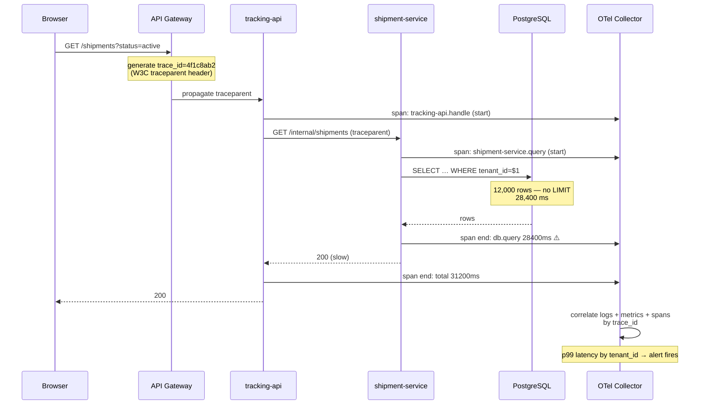

# You Cannot Debug What You Did Not Instrument

At 2am, the difference between a five-minute incident and a five-hour one is whether the data you need already exists. You cannot retroactively observe a request that has already failed.

## The Real-World Problem

An enterprise logistics SaaS serves 400 corporate customers. A single customer reports that shipment tracking "sometimes takes 30 seconds". Support cannot reproduce it. The dashboard shows average API latency at 180ms — healthy.

The team spends nine days on it. The logs are unstructured strings (`"Fetching shipment for user"`) with no customer ID, no request ID, and no timing. There is no way to filter to that customer, and no way to follow one request across the four services it touches.

The eventual cause: a tenant with 12,000 active shipments triggers an unpaginated query in a downstream service. It affects 0.3% of requests — invisible in an average, and obvious in a p99 broken down by tenant. Nine days of investigation to find something that correct instrumentation would have surfaced in one query.

## The Concept

### Three signals, one correlation key

**Logs** say what happened. **Metrics** say how often and how fast. **Traces** say where the time went across services. They are only useful together, which requires one shared identifier — the trace ID — present in all three.

### Structured logs, always

A log line is a data record, not a sentence. Emit JSON to stdout and let the platform collect it. `"Payment failed for user"` cannot be aggregated, filtered, or alerted on; a JSON object with `tenant_id`, `event`, and `duration_ms` can.

### Measure percentiles, never averages

Averages hide the failures your customers actually experience. The scenario above had a healthy mean and a p99 of 31 seconds. Alert on p95/p99, and always break down by tenant in a multi-tenant enterprise system — otherwise one large customer's pain is diluted by everyone else's success.

### Alert on symptoms, not causes

"Checkout error rate above 2% for 5 minutes" is actionable and user-relevant. "CPU above 80%" is neither — it may be perfectly healthy. Every alert needs a runbook link and a named owner; an alert with no defined action gets deleted, because a paging system people learn to ignore is worse than no paging system.

### Redact at the logger

In an enterprise handling PII, redaction cannot be a discipline applied at each call site — it must be a property of the logging pipeline. One forgotten field is a GDPR incident.

## How It Works



The alert fires because the metric is dimensioned by tenant. The trace then answers *where* in four seconds instead of nine days.

## Practical Example

**Structured logging with automatic trace correlation and redaction** (Spring Boot 3.x + Micrometer Tracing):

```java
// Structured JSON to stdout, trace_id injected automatically by Micrometer
@Service
public class ShipmentQueryService {

    private static final Logger log = LoggerFactory.getLogger(ShipmentQueryService.class);

    private final ShipmentRepository repo;
    private final MeterRegistry meters;

    ShipmentQueryService(ShipmentRepository repo, MeterRegistry meters) {
        this.repo = repo;
        this.meters = meters;
    }

    @Observed(name = "shipments.query")   // creates a span + a timer metric
    public Page<Shipment> activeFor(TenantId tenant, Pageable pageable) {
        var timer = Timer.start(meters);
        try {
            var page = repo.findActiveByTenant(tenant.value(), pageable);   // always paginated
            log.atInfo()
               .setMessage("shipments_queried")
               .addKeyValue("tenant_id", tenant.value())
               .addKeyValue("result_count", page.getNumberOfElements())
               .addKeyValue("page_size", pageable.getPageSize())
               .log();
            return page;
        } finally {
            timer.stop(Timer.builder("shipments.query.duration")
                .tag("tenant", tenant.value())      // the dimension that made it findable
                .publishPercentiles(0.5, 0.95, 0.99)
                .register(meters));
        }
    }
}
```

```yaml
# application.yml — one config block turns on all three signals
logging:
  structured:
    format:
      console: ecs          # Elastic Common Schema JSON; trace_id included
management:
  tracing:
    sampling:
      probability: 0.1      # 10% baseline; errors sampled at 100% below
  otlp:
    tracing:
      endpoint: http://otel-collector:4317
  metrics:
    distribution:
      percentiles-histogram:
        http.server.requests: true
  endpoints:
    web:
      exposure:
        include: health,prometheus,info
  endpoint:
    health:
      probes:
        enabled: true       # /health/liveness and /health/readiness split
```

**Redaction as a pipeline property**, not a per-call-site habit:

```java
@Component
public class PiiRedactingConverter extends ClassicConverter {

    private static final Pattern EMAIL = Pattern.compile("[\\w.+-]+@[\\w-]+\\.[\\w.]+");
    private static final Pattern PAN   = Pattern.compile("\\b\\d{13,19}\\b");

    @Override
    public String convert(ILoggingEvent event) {
        var msg = event.getFormattedMessage();
        msg = EMAIL.matcher(msg).replaceAll("[email-redacted]");
        msg = PAN.matcher(msg).replaceAll("[pan-redacted]");
        return msg;
    }
}
```

**Frontend spans, so the trace starts where the user does:**

```ts
// instrumentation.client.ts (Next.js)
import { WebTracerProvider } from '@opentelemetry/sdk-trace-web'
import { registerInstrumentations } from '@opentelemetry/instrumentation'
import { FetchInstrumentation } from '@opentelemetry/instrumentation-fetch'

const provider = new WebTracerProvider()
provider.register()

registerInstrumentations({
  instrumentations: [
    new FetchInstrumentation({
      // Send the W3C traceparent header to our own API only — never to third parties
      propagateTraceHeaderCorsUrls: [/^https:\/\/api\.logistics-suite\.com/],
    }),
  ],
})
```

**The alert that would have caught it**, expressed as a symptom with a tenant dimension:

```yaml
# prometheus/rules/tracking.yml
groups:
  - name: tracking-api-slo
    rules:
      - alert: TrackingLatencyP99HighForTenant
        expr: |
          histogram_quantile(0.99,
            sum by (le, tenant) (
              rate(shipments_query_duration_seconds_bucket[5m])
            )
          ) > 3
        for: 10m
        labels:
          severity: page
          owner: team-tracking
        annotations:
          summary: "p99 shipment query > 3s for tenant {{ $labels.tenant }}"
          runbook: "https://wiki.internal/runbooks/tracking-slow-tenant"
```

## Enterprise Trade-offs

| Approach | Pros | Cons | When to use (Banking / Insurance / Enterprise) |
|---|---|---|---|
| **OpenTelemetry + vendor-neutral collector** | No lock-in; swap the backend without re-instrumenting; one API for all three signals | Collector is infrastructure you operate | Default. In regulated environments the ability to change vendor without touching code is a procurement requirement |
| **Managed APM agent** (Datadog, Dynatrace, New Relic) | Fastest to value; auto-instrumentation; strong UI | Per-host/per-GB cost scales painfully; proprietary instrumentation | Good where headcount is scarcer than budget; still prefer OTel-compatible ingestion |
| **Self-hosted stack** (Prometheus + Loki + Tempo + Grafana) | Full data control; no egress of potentially sensitive telemetry; predictable cost | You own retention, scaling, upgrades | Common in banks where telemetry may contain regulated data and cannot leave the estate |
| **Sample everything at 100%** | No blind spots | Storage cost grows with traffic | Low-volume, high-value flows: payment authorisation, claims submission |
| **Tail-based sampling** (keep all errors + slow traces, sample the rest) | Retains the interesting traces at a fraction of the cost | Collector complexity; needs tuning | The right default for high-volume enterprise APIs |
| **Unstructured logs, averages only** | — | Unqueryable; hides tail latency; the nine-day investigation above | Never |

→ Next: [08-documentation-baseline.md](08-documentation-baseline.md) · Related: [../01-core-concepts/07-observability-mindset.md](../01-core-concepts/07-observability-mindset.md) · [../01-core-concepts/06-performance-budget.md](../01-core-concepts/06-performance-budget.md)
