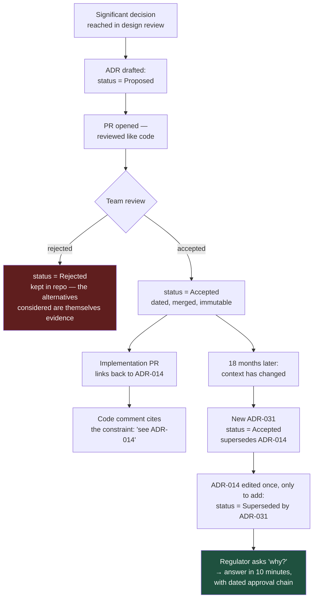

# ADRs as Audit Evidence: Documentation That Survives the People Who Wrote It

The question that costs enterprise teams the most time is not "how does this work?" — you can read the code for that. It is "why is it like this?", and the code cannot answer it.

## The Real-World Problem

A bank is three weeks into a regulatory review of its customer onboarding platform. The reviewer asks why identity verification results are retained for seven years in one table and 90 days in another. It is a reasonable question with, presumably, a reasonable answer.

Nobody knows. The two engineers who designed it left in 2023. The decision is not in the code, not in Jira (that project was migrated and comments were lost), and not in Confluence (there is a page, last edited 2022, describing a design that was never built). The team spends eleven days reverse-engineering their own retention policy from database constraints and a batch job's cron schedule, then has to defend a conclusion they are not certain about.

A four-paragraph ADR written on the day of the decision would have closed the question in ten minutes.

## The Concept

Documentation splits into two categories with completely different economics.

**Generated documentation** describes the current state: API references, schema diagrams, type definitions. Never hand-maintain this — it drifts within weeks and then actively misleads. Generate it from the source of truth (OpenAPI from annotations, schema docs from migrations).

**Written documentation** captures intent and context, which no tool can derive: why this approach, what was rejected, what constraint forced the shape. This is the documentation that appreciates in value.

### The minimum viable set

| Artifact | Answers | Owner |
|---|---|---|
| `README.md` | How do I run and test this? | Whoever onboarded most recently |
| `CONTRIBUTING.md` | How do we work here? | Tech lead |
| `docs/adr/` | Why is it like this? | Whoever made the decision |
| Generated API spec | What is the contract? | The code |
| `docs/runbooks/` | It is 3am and this alert fired — what do I do? | The on-call team |

### ADRs are immutable

An ADR is a dated record of a decision made with the information available at the time. You never edit an accepted ADR to reflect a new decision — you write a new one that supersedes it. The chain of superseded ADRs *is* the architectural history, and in a regulated environment that chain is precisely what demonstrates deliberate, reviewed change over time.

### Docs live in the repo, in the same PR

Documentation in a separate wiki drifts because it is not in the diff a reviewer reads. Put it in the repository so that changing behaviour without updating the doc is visible in review.

### Comment why, not what

The code already states what it does. A comment earns its place only by recording a reason a reader could not infer — a provider quirk, a regulatory constraint, a deliberate trade-off.

## How It Works



## Practical Example

**The ADR that would have saved eleven days** — note that the retention split is stated with its legal basis, which is the part no engineer could reconstruct later:

```markdown
# ADR-014: Split retention for identity verification data

## Status
Accepted — 2026-03-11
Deciders: Mengty LIM (eng), R. Okafor (compliance), J. Silva (data protection)
Supersedes: none

## Context
Customer onboarding stores two distinct categories of identity data:

1. **Verification outcome** — the pass/fail decision, provider, timestamp, and
   reference. Required as evidence that KYC was performed.
2. **Verification payload** — the raw document images and extracted biometric
   data submitted during the check.

AML regulation requires us to evidence that a customer was verified, and to
retain that evidence for 7 years after the relationship ends. GDPR Article 5(1)(e)
requires personal data to be kept no longer than necessary for its purpose.
These pull in opposite directions for category 2.

## Decision
Store the two categories in separate tables with separate retention:

- `kyc_verification_outcome` — retained 7 years after account closure (AML evidence).
  Contains no document images and no biometric data.
- `kyc_verification_payload` — retained 90 days from verification, then hard-deleted
  by a scheduled job. Sufficient for dispute resolution and provider re-check windows.

## Alternatives considered
- **Single table, 7-year retention for everything** — simplest to build, but retains
  biometric data (GDPR Article 9 special category) for 7 years with no purpose that
  survives the verification itself. Rejected on data-protection review.
- **Single table, 90-day retention for everything** — would delete the AML evidence
  we are legally required to produce. Rejected outright.
- **Encrypt payload and retain 7 years with key destruction at 90 days**
  ("crypto-shredding") — defensible, and avoids a second table. Rejected because key
  lifecycle management became the audit surface instead, and we could not commit to
  operating it correctly for 7 years.

## Consequences
+ Each dataset has one clearly stated purpose and one retention basis.
+ The 90-day deletion job is small, testable, and independently auditable.
- Two tables and a join for the (rare) case where both are needed.
- The deletion job is now a compliance-critical component: its failure is a
  reportable control failure, so it requires alerting and monitored success.

## Compliance references
- AML retention: 7 years post-relationship
- GDPR Art. 5(1)(e) storage limitation; Art. 9 special category data
- Control ID: KYC-RET-002 (registered in the control catalogue)
```

**Wire it up so the code points at the reason:**

```java
/**
 * Hard-deletes verification payloads older than the retention window.
 *
 * <p>Retention is 90 days by decision of ADR-014 (GDPR Art. 5(1)(e) storage
 * limitation). The 7-year AML evidence lives in {@code kyc_verification_outcome}
 * and is deliberately untouched by this job — deleting from that table would
 * destroy required regulatory evidence.
 *
 * <p>Failure of this job is a reportable control failure (control KYC-RET-002),
 * which is why it alerts on absence of success, not only on error.
 */
@Scheduled(cron = "0 30 2 * * *")
@SchedulerLock(name = "kyc-payload-retention")
void purgeExpiredPayloads() {
    var cutoff = Instant.now().minus(Duration.ofDays(90));
    int deleted = payloadRepo.deleteVerifiedBefore(cutoff);
    meters.counter("kyc.payload.purged").increment(deleted);
    log.atInfo().setMessage("kyc_payload_purge_completed")
       .addKeyValue("deleted_count", deleted)
       .addKeyValue("cutoff", cutoff.toString())
       .addKeyValue("control_id", "KYC-RET-002")
       .log();
}
```

**Generate the API reference — never write it.** springdoc reads the code, so the docs cannot drift:

```java
@RestController
@RequestMapping("/api/v1/onboarding")
@Tag(name = "Onboarding", description = "Customer onboarding and KYC verification")
class OnboardingController {

    @Operation(
        summary = "Submit an identity verification",
        description = "Payload is retained 90 days (ADR-014); the outcome is retained 7 years."
    )
    @ApiResponses({
        @ApiResponse(responseCode = "202", description = "Verification accepted for processing"),
        @ApiResponse(responseCode = "409", description = "Verification already in progress",
                     content = @Content(schema = @Schema(implementation = ProblemDetail.class)))
    })
    @PostMapping("/verifications")
    @ResponseStatus(HttpStatus.ACCEPTED)
    VerificationReceipt submit(@Valid @RequestBody VerificationRequest request) { … }
}
```

```yaml
# Publish the spec as a CI artifact so partners always get the deployed contract
- name: Export OpenAPI spec
  run: ./gradlew generateOpenApiDocs
- uses: actions/upload-artifact@v4
  with: { name: openapi-spec, path: build/openapi.json }
```

**A runbook is a script, not an essay:**

```markdown
# Runbook: KycPayloadPurgeDidNotRun

**Severity:** page · **Owner:** team-onboarding · **Control:** KYC-RET-002

## Symptom
No `kyc_payload_purge_completed` event in the last 26 hours.

## Why it matters
Retention beyond 90 days breaches ADR-014 and our stated GDPR basis. This is a
reportable control failure if it persists past 7 days — escalate before then.

## Diagnose
1. `kubectl logs deploy/onboarding --since=26h | grep kyc_payload_purge`
2. Check the lock table for a stuck entry:
   `SELECT * FROM shedlock WHERE name = 'kyc-payload-retention';`
3. If `lock_until` is in the future but no pod holds it → stale lock from a crashed pod.

## Fix
- Stale lock: `DELETE FROM shedlock WHERE name = 'kyc-payload-retention';` then
  trigger manually: `POST /actuator/scheduledtasks/kyc-payload-retention/run`
- Job erroring: read the stack trace, fix forward. Do **not** disable the schedule.

## Escalate
Compliance officer on call if unresolved after 48 hours (the control-breach reporting window is 7 days).
```

## Enterprise Trade-offs

| Approach | Pros | Cons | When to use (Banking / Insurance / Enterprise) |
|---|---|---|---|
| **ADRs in-repo, immutable, superseding chain** | Dated decision record; reviewed like code; directly usable as audit evidence | Requires the discipline to write one at decision time | Default for every significant decision in a regulated system |
| **Generated API docs** (springdoc, OpenAPI) | Cannot drift from the implementation | Only describes structure, never intent | Always, for every service contract |
| **Confluence / external wiki** | Non-engineers can edit and browse | Not in the diff, so it drifts; the 2022 page in the scenario above | Acceptable for stakeholder-facing summaries that link back to in-repo ADRs |
| **Docs generated from code comments only** | Zero drift, zero extra process | Cannot record rejected alternatives, which is often the most valuable part | Complements ADRs; does not replace them |
| **Tribal knowledge** | No cost today | Leaves with the person; produced the eleven-day investigation above | Never — this is the failure mode, not a strategy |

## Why This Still Matters Through 2030

Two forces are pushing decision records from good practice toward requirement. Regulatory frameworks increasingly ask organisations to evidence *governed* change rather than merely correct outcomes — who decided, on what basis, and what was considered and rejected — and an ADR chain is the cheapest possible way to produce that. At the same time, an increasing share of code is written with AI assistance, which means the volume of code grows faster than the volume of remembered intent. Generated code encodes decisions without recording why they were made, so the "why" documentation becomes the scarce artifact and the differentiating one. Code will keep getting cheaper to produce; understanding why it is shaped this way will not.

→ Next: [09-code-review-process.md](09-code-review-process.md) · Related: [../03-architecture/06-choosing-the-right-architecture.md](../03-architecture/06-choosing-the-right-architecture.md) · [../04-security-and-authentication/06-compliance-standards-pci-dss-gdpr-soc2.md](../04-security-and-authentication/06-compliance-standards-pci-dss-gdpr-soc2.md)
