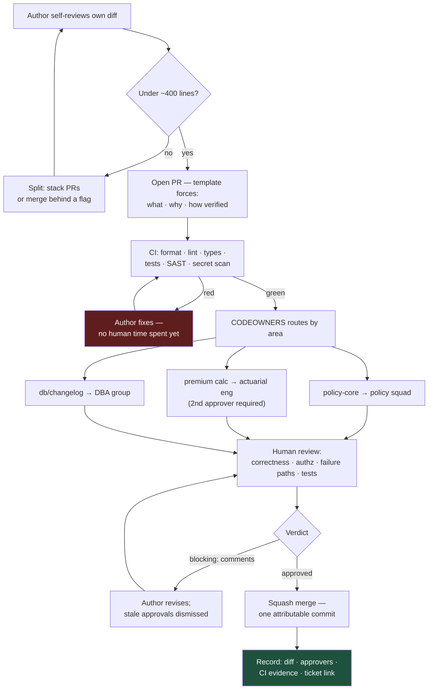

# Four Eyes, Ten Minutes: Code Review as a Control, Not a Ritual

Code review is the cheapest defect-removal step available and the main way architectural knowledge spreads through a team. In a regulated enterprise it is also a formal control — which means it can be performed and still fail, if the record shows an approval nobody meaningfully gave.

## The Real-World Problem

An insurer's policy administration team has a mandatory two-approver rule, inherited from their control framework. On paper this is exemplary segregation of duties.

In practice, PRs average 1,400 lines because the team batches a fortnight of work per branch. Reviews arrive as "LGTM 👍" within four minutes of being requested — the reviewers are genuinely busy and the diff is genuinely unreadable. The control is satisfied on every audit sample: two named approvers, timestamped.

Then a change to premium proration ships with an authorization gap: the endpoint fetches a policy by ID without scoping it to the requesting broker, so any authenticated broker can read any policy in the book. It sat inside a 1,400-line PR that two people approved in under five minutes each. The control existed, was measured, was passing — and caught nothing, because nobody had built the conditions under which a human could actually review.

## The Concept

### Size is the variable that determines everything

Review effectiveness collapses with diff size. Under roughly 400 changed lines, reviewers find real defects; well above it, they skim and approve. Every other practice here is downstream of keeping PRs small, and the way to keep them small is feature flags — merge incomplete work safely rather than accumulating it on a branch.

### Automation reviews mechanics; humans review judgment

If a human is commenting on formatting, import order, or naming conventions, the tooling is missing and senior attention is being wasted. Humans should look at exactly the things machines cannot: is this the right approach, are the failure paths handled, is authorization scoped correctly, does this match what the ticket asked for.

### Label severity, or intent gets lost

Written review comments read colder than intended, and ambiguity about whether a comment blocks the merge causes real friction. A four-word prefix convention removes it entirely:

- **blocking:** must change before merge
- **suggestion:** author decides
- **nit:** cosmetic, never blocking
- **question:** need to understand before I can approve

### The four-eyes principle needs the *right* eyes

In regulated systems, `CODEOWNERS` should route sensitive areas to people with the relevant competence, not just to whoever is available. Settlement logic goes to risk engineering. Schema changes go to the DBA group. This is what turns a headcount rule into an actual control.

### Review has an SLA

A blocked PR blocks a person. First response within four working hours, or the branch ages, conflicts accumulate, and the author starts a second branch on top of the first — which is how 1,400-line PRs are born.

## How It Works



The audit-relevant output is the box at the bottom, and it is only worth anything because of the constraint at the top.

## Practical Example

**A PR template that makes an unreviewable PR obvious before review starts:**

```markdown
<!-- .github/pull_request_template.md -->
## What changed
<!-- One paragraph. If you need more than three, split the PR. -->

## Why
Ticket: POL-____

## How I verified it
- [ ] Unit tests added for new logic
- [ ] Integration test for any new DB or HTTP path
- [ ] Manually exercised the failure path (not only the happy path)

## Risk
- [ ] Touches authorization or data access scoping
- [ ] Touches premium / payment calculation  → **requires actuarial-eng approval**
- [ ] Includes a schema change  → **requires DBA approval; expand/contract confirmed**
- [ ] Behind a feature flag: `___________` (default: OFF)

## Rollback
<!-- Exact steps. "Revert the PR" is only valid if no migration is involved. -->
```

**`CODEOWNERS` as the control implementation:**

```
# .github/CODEOWNERS — routing by competence, not availability
*                                   @insurer/policy-squad

# Money maths: second pair of eyes from actuarial engineering
/src/main/java/**/premium/          @insurer/policy-squad @insurer/actuarial-eng
/src/main/java/**/proration/        @insurer/policy-squad @insurer/actuarial-eng

# Schema changes are DBA-owned in a regulated estate
/db/changelog/                      @insurer/dba-team

# Security-relevant configuration
/src/main/java/**/security/         @insurer/security-eng
/.github/workflows/                 @insurer/platform-eng
```

**Enforce the reviewable-size constraint mechanically**, so it is not a matter of good intentions:

```yaml
# .github/workflows/pr-hygiene.yml
name: PR hygiene
on: [pull_request]

jobs:
  size:
    runs-on: ubuntu-latest
    steps:
      - uses: actions/checkout@v4
        with: { fetch-depth: 0 }
      - name: Warn on oversized diff
        run: |
          # Exclude generated files and lockfiles from the count
          CHANGED=$(git diff --numstat origin/${{ github.base_ref }}...HEAD \
            -- . ':(exclude)**/*.lock' ':(exclude)**/generated/**' \
            | awk '{ added += $1; removed += $2 } END { print added + removed }')
          echo "Reviewable lines changed: $CHANGED"
          if [ "$CHANGED" -gt 800 ]; then
            echo "::error::$CHANGED lines is not reviewable. Split the PR or stack it."
            exit 1
          elif [ "$CHANGED" -gt 400 ]; then
            echo "::warning::$CHANGED lines — consider splitting."
          fi

  ticket-link:
    runs-on: ubuntu-latest
    steps:
      - name: Require a ticket reference
        run: |
          echo "${{ github.event.pull_request.title }} ${{ github.event.pull_request.body }}" \
            | grep -qE 'POL-[0-9]+' || {
              echo "::error::PR must reference a POL- ticket for traceability."
              exit 1
            }
```

**The review that catches the bug in the scenario.** This is what "authz scoped correctly" looks like as a concrete comment:

```java
// The code as submitted
@GetMapping("/api/v1/policies/{policyId}")
public PolicyResponse get(@PathVariable UUID policyId) {
    return mapper.toResponse(policyRepo.findById(policyId).orElseThrow());
}
```

> **blocking:** this is authenticated but not authorized — any broker can read any
> policy by guessing or enumerating IDs (IDOR). Scope the query to the caller's
> brokerage: `findByIdAndBrokerageId(policyId, principal.brokerageId())`, and return
> 404 rather than 403 so we don't confirm that a policy exists. Worth adding a test
> with two brokerages asserting cross-tenant reads fail — our current tests only ever
> use one principal, which is why this passed CI.

```java
// After review
@GetMapping("/api/v1/policies/{policyId}")
public PolicyResponse get(
        @PathVariable UUID policyId,
        @AuthenticationPrincipal BrokerPrincipal principal) {

    var policy = policyRepo
        .findByIdAndBrokerageId(policyId, principal.brokerageId())
        .orElseThrow(() -> new PolicyNotFoundException(policyId));   // 404, not 403
    return mapper.toResponse(policy);
}
```

And the test that makes the class of bug non-recurring:

```java
@Test
void get_policyBelongingToAnotherBrokerage_returns404() throws Exception {
    var otherBrokeragePolicy = fixtures.policyFor(BROKERAGE_B);

    mockMvc.perform(get("/api/v1/policies/{id}", otherBrokeragePolicy.id())
            .with(authenticatedBroker(BROKERAGE_A)))
        .andExpect(status().isNotFound());
}
```

**Reviewer checklist**, kept short enough to actually use:

- [ ] Does it do what the description says, and nothing extra?
- [ ] Is every data access scoped to the caller's tenant/brokerage/customer?
- [ ] Failure paths: errors, empty results, timeouts, nulls, duplicate delivery?
- [ ] N+1 queries or unbounded result sets (no `LIMIT`, no pagination)?
- [ ] Tests cover the new behaviour **and** at least one failure case?
- [ ] Any secret, URL, or environment value hardcoded?
- [ ] Migration additive and backward compatible with the deployed version?
- [ ] Anything logged that is PII or a credential?

## Enterprise Trade-offs

| Approach | Pros | Cons | When to use (Banking / Insurance / Enterprise) |
|---|---|---|---|
| **Small PRs + 1 approval + CODEOWNERS routing** | Genuine defect detection; fast throughput; competence-matched reviewers | Requires feature-flag discipline to keep PRs small | Default for most enterprise work |
| **Two approvals on sensitive paths only** | Real segregation of duties where risk actually sits | Slower on those paths; needs accurate ownership mapping | Payments, settlement, premium calculation, auth, schema — mandated in most control frameworks |
| **Two approvals on everything** | Uniform, trivially auditable | Approval theatre; reviewer fatigue; produced the failure above | Avoid — it optimises the audit sample, not the defect rate |
| **Pair programming instead of async review** | Highest-bandwidth review; knowledge transfer in real time | Consumes two people concurrently; the approval record is weaker unless documented | Excellent for complex or high-risk changes; document the pairing to preserve the control record |
| **Post-merge review** | Maximum throughput | Defect is already in `main`; unacceptable evidence trail for regulated changes | Only for internal tooling with no production exposure |

## Why This Still Matters Through 2030

Review is shifting from defect-detection toward intent-verification, and that shift makes it more important rather than less. As a growing share of code arrives already written — by generation tools, by scaffolding, by refactoring automation — the reviewer's question changes from "is this correct syntax and structure?" to "is this the right thing to do, and does it fail safely?" Machine-generated code is characteristically plausible: idiomatic, well-formatted, well-named, and entirely capable of omitting a tenant scope on a query. Meanwhile control frameworks continue to require demonstrable human approval of changes to regulated systems, and that requirement is not one automation can satisfy. The durable practice is therefore the same one that has always worked: keep changes small enough that a human can genuinely read them, route them to someone who understands that area, and let machines handle everything mechanical.

→ Next: [10-definition-of-done.md](10-definition-of-done.md) · Related: [04-linting-formatting-hooks.md](04-linting-formatting-hooks.md) · [../01-core-concepts/05-security-by-default.md](../01-core-concepts/05-security-by-default.md)
