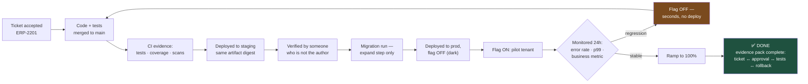

# "Done" Is Not a Feeling: A Definition of Done for Regulated Delivery

Half of the friction between engineering and product management is not disagreement about priorities. It is two people using the word "done" to mean different things, and discovering it three weeks later.

## The Real-World Problem

An enterprise resource planning vendor runs a sprint review. The engineering lead reports that multi-currency invoicing is done. The product owner tells the client's steering committee it will be live for month-end close.

What "done" actually meant: the code was merged, unit tests passed, and it worked on a developer's machine. What was missing: the currency-rounding rules had never been exercised against real ledger data, the migration adding the currency column had not been run in production, there was no monitoring on the conversion service, and the feature had never been enabled for any user.

Month-end close arrives. The feature is switched on for the pilot client at 08:00. By 09:20, rounding differences of a few cents per line item have produced ledger entries that do not reconcile, across 14,000 invoices. The finance team's month-end is now a manual exercise, the client escalates to the account executive, and engineering spends four days writing a correction script.

Nothing here was a coding failure. It was a definition failure.

## The Concept

A Definition of Done is a shared, explicit, non-negotiable checklist that converts "done" from an opinion into a verifiable state. Its value is entirely in being agreed **before** the work starts and applied uniformly afterwards.

### The stages people confuse

| Claim | What is actually true | Value delivered |
|---|---|---|
| "It works locally" | One machine, one dataset, one developer | None |
| "PR is open" | Not reviewed, not integrated | None |
| "Merged to main" | Integrated, not deployed | None |
| "Deployed to production" | Code is present, behaviour is off | None |
| "Flag on for pilot users, monitored, error rate flat" | Real users served, verified | **This is done** |

Everything above the last row is inventory, not output. Inventory is work you have paid for and not yet been paid for.

### In a regulated environment, done includes evidence

For banking, insurance, and enterprise systems under SOC 2 or equivalent, a change is not complete until the record exists: which requirement it satisfies, who approved it, which tests demonstrate it, and how it can be reversed. That evidence must be produced as a by-product of the workflow — if collecting it is a separate manual task, it will be done badly and late.

### Traceability runs both ways

You should be able to start from a requirement and find the tests that prove it, and start from a line of code and find the ticket that asked for it. The mechanism is dull and effective: ticket ID in the branch name, in the commit, in the PR, and in the test name.

### The DoD is a team contract, not a document

It belongs in the repository, is applied to every ticket without exception, and changes only by team agreement. An exception granted once becomes the new default within two sprints.

## How It Works



The loop from `J` back to `B` is the part that makes the whole thing safe: reversal is a normal, cheap, non-dramatic step rather than an incident.

## Practical Example

**The Definition of Done, as a checklist that ships with every ticket.** Copy this into the issue template so it cannot be skipped silently:

```markdown
<!-- .github/ISSUE_TEMPLATE/story.md -->
## Definition of Done — every box, every ticket

### Functionality
- [ ] All acceptance criteria in this ticket demonstrably met
- [ ] Edge cases explicitly handled: empty, maximum, zero, negative, null,
      multi-currency, timezone boundary — whichever apply
- [ ] Failure paths handled: dependency down, timeout, duplicate submission

### Code
- [ ] Merged to `main` via reviewed, squash-merged PR referencing this ticket
- [ ] Required CODEOWNERS approval obtained (2 approvers on money/auth/schema paths)
- [ ] No new `TODO` without a ticket number

### Tests
- [ ] Unit tests for new logic, including one failure case
- [ ] Integration test for every new DB or HTTP path (Testcontainers, real engine)
- [ ] One regression test per bug fixed, written before the fix
- [ ] Test names reference the ticket for traceability: `..._ERP2201`
- [ ] Full suite green in CI; coverage did not decrease

### Data
- [ ] Migration is additive (expand step only); backward compatible with the
      currently deployed version
- [ ] Rollback verified in staging (not merely written)
- [ ] Exercised against production-shaped data volume, not a 10-row fixture

### Operations
- [ ] Structured log events emitted for the new path
- [ ] Metric emitted, dimensioned by tenant
- [ ] Alert + runbook added if this feature can page someone
- [ ] Feature flag created; default state stated here: `___________`

### Documentation
- [ ] ADR written if an architectural decision was made
- [ ] OpenAPI spec regenerated (it is generated, so this means: verified)
- [ ] Runbook updated for any new operational failure mode

### Release
- [ ] Verified in staging by someone who is not the author
- [ ] Deployed to production; flag enabled for pilot tenant
- [ ] Monitored ≥24h: error rate flat, p99 within budget, business metric sane
- [ ] Rollback path written in the PR and rehearsed
```

**Traceability, made mechanical.** The ticket ID appears in four places, so any one of them leads to the others:

```java
/**
 * Multi-currency invoice line rounding.
 *
 * <p>Ticket: ERP-2201. Rounding is half-up at the line level to the currency's
 * minor unit, then summed — never summed then rounded, which produces per-line
 * drift that fails ledger reconciliation. See ADR-022.
 */
@Test
@DisplayName("ERP-2201: line totals round half-up per line, then sum to the invoice total")
void invoiceTotal_multiCurrencyLines_reconcilesToLedger_ERP2201() {
    var invoice = Invoice.builder()
        .currency(Currency.getInstance("JPY"))          // zero minor units — the trap
        .line(quantity(3), unitPrice("333.333"))
        .line(quantity(7), unitPrice("14.285"))
        .build();

    // Each line rounds to whole yen first, then sums. Rounding the sum instead
    // produced the 14,000 unreconciled entries in the ERP-2188 incident.
    assertThat(invoice.total()).isEqualTo(Money.of("1100", "JPY"));
    assertThat(invoice.total()).isEqualTo(
        invoice.lines().stream().map(InvoiceLine::total).reduce(Money.zero("JPY"), Money::plus));
}
```

**Make the evidence a by-product of the pipeline**, not a task somebody remembers:

```yaml
# .github/workflows/evidence.yml — runs on merge to main
name: Release evidence
on:
  push:
    branches: [main]

jobs:
  collect:
    runs-on: ubuntu-latest
    steps:
      - uses: actions/checkout@v4
        with: { fetch-depth: 0 }

      - name: Build evidence pack
        run: |
          mkdir -p evidence
          # What changed, who approved it, which tickets it satisfies
          gh pr list --state merged --limit 1 --json number,title,mergedAt,author,reviews \
            > evidence/approval-record.json
          git log -1 --pretty='%H %s%n%b' | grep -oE 'ERP-[0-9]+' | sort -u \
            > evidence/tickets.txt
        env:
          GH_TOKEN: ${{ secrets.GITHUB_TOKEN }}

      - name: Attach test + scan results
        run: |
          cp build/reports/tests/test/index.html evidence/ || true
          cp build/reports/jacoco/test/jacocoTestReport.xml evidence/ || true
          cp trivy-report.json evidence/ || true

      - uses: actions/upload-artifact@v4
        with:
          name: evidence-${{ github.sha }}
          path: evidence/
          retention-days: 2555      # 7 years — matches the audit retention policy
```

**The rollback line in the PR, written before it is needed:**

```markdown
## Rollback
1. Disable flag `ERP_MULTI_CURRENCY_INVOICING` in LaunchDarkly (takes effect < 30s).
   This is sufficient — the new column is additive and unread when the flag is off.
2. If already ramped to 100% and ledger entries were written:
   run `scripts/erp-2201-reverse-conversions.sql` (dry-run mode first, verified in
   staging on 2026-08-05 against a 20k-invoice dataset).
3. No schema rollback required. The `currency_minor_unit` column is nullable and
   ignored by the previous application version — expand step only, per ADR-022.
```

## Enterprise Trade-offs

| Approach | Pros | Cons | When to use (Banking / Insurance / Enterprise) |
|---|---|---|---|
| **Full DoD including monitored production ramp** | "Done" means value delivered and verified; evidence complete | Longest cycle time per ticket; needs flags and staging to exist | Default for any customer-facing or money-touching change |
| **DoD ending at "deployed dark"** | Decouples engineering completion from business rollout timing | Requires someone to own the flag-on decision, or features sit dormant forever | Good where release timing is a business decision (regulatory go-live dates, client month-end) |
| **DoD ending at merge** | Simple, fast-feeling velocity numbers | Hides all integration and operational risk; produced the scenario above | Only for internal tooling with no external consumers |
| **Per-ticket negotiated DoD** | Flexible for genuinely unusual work | Every ticket becomes a negotiation; the standard erodes within two sprints | Avoid; instead define one DoD plus a small number of named, documented exception types |
| **Separate manual evidence collection** | No pipeline work needed upfront | Done late, done inconsistently, and it is the first thing dropped under deadline pressure | Never in a regulated estate — automate evidence as a pipeline artifact |

## Why This Still Matters Through 2030

The DoD is the interface between engineering and everyone else, and interfaces outlive implementations. What is changing is the balance of what it must contain. Writing code is getting faster; verifying, deploying, monitoring, and evidencing it is not, which means the proportion of a ticket's real cost that sits *after* "the code works" keeps rising. A DoD anchored on merge measures the part that is becoming cheap and ignores the part that is becoming dominant. At the same time, operational-resilience regulation is converging on demonstrable control over change — traceability from requirement to test, evidence of approval, and a rehearsed reversal path. A team whose DoD already produces that as a by-product absorbs new regulatory requirements as a paperwork exercise. A team whose DoD ends at "merged" absorbs them as a project.

→ Domain complete. Next: [../01-core-concepts/01-solid-and-separation-of-concerns.md](../01-core-concepts/01-solid-and-separation-of-concerns.md) · Related: [../11-stakeholder-communication/02-talking-to-po.md](../11-stakeholder-communication/02-talking-to-po.md) · [../08-testing-strategies/05-testing-in-regulated-enterprise-systems.md](../08-testing-strategies/05-testing-in-regulated-enterprise-systems.md)
