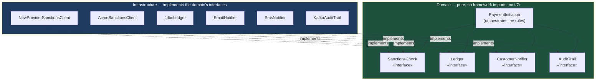

# SOLID Without the Dogma: What Actually Buys You Maintainability

SOLID is taught as five rules to memorise and applied as five rules to recite. Treated properly it is one question asked five ways: *when this requirement changes, how much of my code has to change with it?*

## The Real-World Problem

A bank's payment initiation service has a class called `PaymentService` with 1,900 lines. It validates the payment, applies sanctions screening rules, writes to the ledger via raw JDBC, publishes a SWIFT message, sends the customer an SMS, and writes an audit record.

Then compliance mandates a new sanctions provider. The change is conceptually small — call a different API, map a different response — but it lands inside a class that also owns ledger writes and SMS delivery. There is no way to unit test the new screening logic without a database and an SMS gateway, so the team tests it manually. The regression they miss is in the *ledger* code, which they had to touch only because a shared private helper method was in the way.

One compliance change, four unrelated concerns disturbed, one production defect in a system that moves money. The failure is not the developers' care; it is that the class had five reasons to change.

## The Concept

### The single question

> If this requirement changes, how many files do I open, and do I need infrastructure running to test it?

If a single-concept change touches more than two or three files, or requires a database to verify, the concerns are entangled.

### The five, restated as things you can check while coding

| Principle | The question at the keyboard | Symptom when violated |
|---|---|---|
| **S** — Single responsibility | Does this class have two reasons to change? | The class name contains "and", or a `Manager`/`Handler` suffix hiding several jobs |
| **O** — Open/closed | Can I add a case without editing existing code? | A growing `switch` on a type that you edit for every new variant |
| **L** — Liskov substitution | Can every implementation be swapped in without surprising the caller? | An implementation that throws `UnsupportedOperationException` |
| **I** — Interface segregation | Am I forcing callers to depend on methods they never call? | Test doubles that stub eight methods to exercise one |
| **D** — Dependency inversion | Does my business logic import a framework or a driver? | You cannot unit test the rules without Spring, JPA, or a network |

### Dependency inversion is the one that pays

Of the five, dependency inversion produces the largest practical return, because it is what makes business logic testable in milliseconds without infrastructure. Everything else in this knowledge base — hexagonal architecture, ports and adapters, fast test suites — is downstream of it.

The rule is directional: **the domain defines the interface; the infrastructure implements it.** A `PaymentService` should not import an SMS SDK. It should declare that it needs *something* that can notify a customer, and let the wiring decide what.

### Separation of concerns is not the same as more layers

Adding an interface for every class is not separation of concerns; it is indirection with extra steps. Separate along **axes of change** — the things that change for different reasons, on different schedules, driven by different stakeholders. Sanctions rules change when compliance says so. Ledger writes change when the accounting model changes. Those belong apart. Two helper methods that always change together do not.

## How It Works



Arrows point *inward*: infrastructure depends on the domain, never the reverse. Swapping the sanctions provider is a new class in the blue box and zero changes in the green one.

## Practical Example

**Before — one class, five reasons to change:**

```java
@Service
public class PaymentService {

    private final JdbcTemplate jdbc;
    private final RestTemplate rest;
    private final SmsClient sms;

    public void initiate(PaymentRequest req) {
        // 1. validation
        if (req.amount().signum() <= 0) throw new IllegalArgumentException("amount");

        // 2. sanctions screening — hardcoded to one provider
        var hit = rest.postForObject("https://acme-sanctions.example/screen",
                                     Map.of("name", req.beneficiaryName()), ScreenResult.class);
        if (hit != null && hit.isMatch()) throw new SanctionsHitException();

        // 3. ledger — raw SQL inline
        jdbc.update("INSERT INTO ledger_entry (debtor, creditor, amount) VALUES (?,?,?)",
                    req.debtorIban(), req.creditorIban(), req.amount());

        // 4. notification — hardcoded channel
        sms.send(req.customerPhone(), "Payment of " + req.amount() + " sent");

        // 5. audit
        jdbc.update("INSERT INTO audit_log (event, payload) VALUES (?,?)",
                    "PAYMENT_INITIATED", req.toString());
    }
}
```

Testing the sanctions change requires a database and an SMS gateway. The compliance rule and the SQL schema now share a change surface.

**After — the domain declares what it needs:**

```java
// domain/PaymentInitiation.java — no Spring, no JDBC, no HTTP. Pure rules.
public class PaymentInitiation {

    private final SanctionsCheck sanctions;
    private final Ledger ledger;
    private final CustomerNotifier notifier;
    private final AuditTrail audit;

    public PaymentInitiation(SanctionsCheck sanctions, Ledger ledger,
                             CustomerNotifier notifier, AuditTrail audit) {
        this.sanctions = sanctions;
        this.ledger = ledger;
        this.notifier = notifier;
        this.audit = audit;
    }

    public PaymentId initiate(Payment payment) {
        payment.validate();                                    // rules live on the aggregate

        var screening = sanctions.screen(payment.beneficiary());
        if (screening.isBlocked()) {
            audit.record(AuditEvent.sanctionsBlocked(payment, screening.reference()));
            throw new SanctionsBlockedException(screening.reference());
        }

        var id = ledger.post(payment.toDoubleEntry());
        audit.record(AuditEvent.paymentInitiated(id, payment));
        notifier.paymentSent(payment.customer(), payment.amount());
        return id;
    }
}
```

```java
// domain/SanctionsCheck.java — the interface belongs to the domain, not the vendor
public interface SanctionsCheck {
    ScreeningResult screen(Beneficiary beneficiary);
}
```

**Open/closed in practice** — adding a provider is additive. Nothing above changes:

```java
// infrastructure/NewProviderSanctionsClient.java
@Component
@Primary                                    // switch providers by wiring, not by editing rules
class NewProviderSanctionsClient implements SanctionsCheck {

    private final RestClient http;

    NewProviderSanctionsClient(RestClient.Builder builder,
                               @Value("${sanctions.base-url}") String baseUrl) {
        this.http = builder.baseUrl(baseUrl).build();
    }

    @Override
    public ScreeningResult screen(Beneficiary beneficiary) {
        var response = http.post()
            .uri("/v2/screen")
            .body(new ScreenRequest(beneficiary.fullName(), beneficiary.countryCode()))
            .retrieve()
            .body(ScreenResponse.class);
        return response.matched()
            ? ScreeningResult.blocked(response.caseReference())
            : ScreeningResult.clear();
    }
}
```

**And now the compliance rule is testable in milliseconds, with no infrastructure:**

```java
class PaymentInitiationTest {

    @Test
    void initiate_sanctionsHit_blocksPaymentAndAuditsBeforeThrowing() {
        var audit = new RecordingAuditTrail();          // simple fakes, not mocking frameworks
        var ledger = new RecordingLedger();
        var initiation = new PaymentInitiation(
            beneficiary -> ScreeningResult.blocked("CASE-9910"),   // interface is one method
            ledger,
            (customer, amount) -> fail("must not notify on a blocked payment"),
            audit);

        assertThatThrownBy(() -> initiation.initiate(aPayment()))
            .isInstanceOf(SanctionsBlockedException.class);

        assertThat(ledger.posted()).isEmpty();          // no ledger entry on a block
        assertThat(audit.events()).containsExactly(sanctionsBlockedFor("CASE-9910"));
    }
}
```

`SanctionsCheck` having exactly one method (interface segregation) is what makes that lambda possible. A twelve-method `ComplianceService` interface would have forced a mocking framework and a fifteen-line setup.

## Enterprise Trade-offs

| Approach | Pros | Cons | When to use (Banking / Insurance / Enterprise) |
|---|---|---|---|
| **Domain-owned interfaces, infrastructure implements** | Business rules unit-testable without infrastructure; vendors swappable; audit-relevant logic isolated | More files; requires wiring discipline | Default for any logic with regulatory or financial consequence |
| **Direct framework use in service classes** | Fewest files, fastest to write initially | Rules untestable without infrastructure; vendor changes ripple into business logic | Acceptable for genuine CRUD with no business rules — an admin reference-data screen |
| **Interface for every class** | Uniform, looks disciplined | Indirection with no benefit; navigation cost; obscures which seams matter | Avoid — extract an interface when a second implementation or a test seam genuinely exists |
| **One large orchestrating service** | Everything in one readable place, at first | Multiple reasons to change; the scenario above | Never above a few hundred lines |

→ Next: [02-yagni-kiss-dry.md](02-yagni-kiss-dry.md) · Related: [../03-architecture/02-hexagonal-architecture.md](../03-architecture/02-hexagonal-architecture.md) · [../10-example-code/spring-boot/hexagonal-architecture-example.md](../10-example-code/spring-boot/hexagonal-architecture-example.md)
