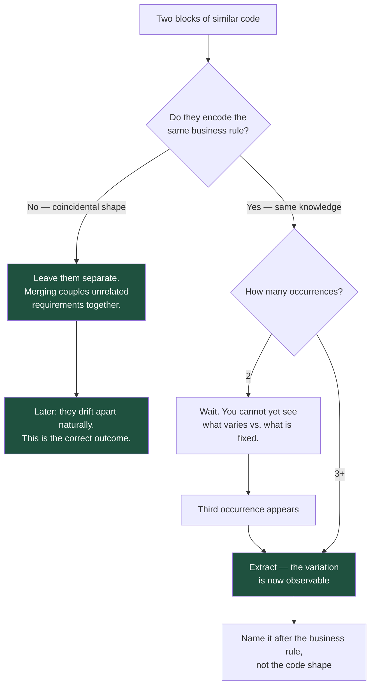

# The Abstraction You Didn't Need: YAGNI, KISS and the Two Kinds of DRY

Duplication is visible and cheap to fix. A wrong abstraction is invisible and expensive to fix, because it has already spread into every caller. Most senior engineers learn this in the wrong order.

## The Real-World Problem

An insurer builds a rating engine for motor policies. The lead engineer, anticipating that the company will eventually sell home, travel, and pet insurance, designs for all four from day one: an abstract `RatingStrategy`, a `RiskFactorPipeline` with pluggable stages, a `RatingRuleRegistry` loaded from YAML, and a generic `Coverable` interface that motor, home, travel, and pet policies will all implement.

Eighteen months later the company launches home insurance. Home rating depends on property attributes — construction year, flood zone, rebuild cost — which have no analogue in the motor model. The `Coverable` abstraction does not fit, so home rating is bolted on with a `Map<String, Object> additionalAttributes` escape hatch. Within a year, motor rating also uses that map, because it was easier than extending the "generic" model.

The result: an abstraction designed for four products that fits one, plus an untyped map that has become the real data model. Adding a rating factor now requires understanding a YAML registry, a pipeline, a strategy hierarchy, and a stringly-typed map. A junior engineer's two-line change takes a week.

Had they written motor rating plainly and extracted the abstraction when home arrived, the abstraction would have been designed from two real cases instead of one imagined one — and it would have fit.

## The Concept

### YAGNI — You Aren't Gonna Need It

Build for the requirement you have. The cost of adding flexibility later is usually *lower* than the cost of guessing wrong now, because later you have real information. Speculative generality is a bet, and the payout is poor: the future requirement either does not arrive, or arrives in a shape your abstraction did not anticipate.

The tell is any interface with exactly one implementation, added "for when we need another".

### KISS — the simplest thing that solves the actual problem

Not the simplest thing imaginable, and not the cleverest. Choose the solution the next engineer can understand without a tour. In enterprise systems, the next engineer is a certainty; the elegant generalisation is a hope.

### DRY — deduplicate knowledge, not characters

This is the most misapplied principle in the industry. DRY is about **a single source of truth for a piece of knowledge** — one place where a business rule lives. It is not about eliminating textual similarity.

Two blocks that look identical but change for different reasons are **not** duplication. Merging them creates coupling between unrelated requirements, and the merged function acquires a boolean parameter, then a second, then a `mode` enum, until nobody can tell which combination is exercised in production.

The test: *if requirement A changes, must requirement B change identically?* Yes → same knowledge, deduplicate. No → coincidental similarity, leave it alone.

### The rule of three

Duplicate once. Duplicate twice. On the **third** occurrence, abstract — by then you can see what actually varies and what stays fixed, which is precisely the information you lacked the first time.

## How It Works



## Practical Example

**YAGNI violation — the rating engine's original design, one product in production:**

```java
// Four abstractions guarding against products nobody has specified yet
public interface RatingStrategy<T extends Coverable> {
    Premium rate(T subject, RatingContext context);
}

public interface Coverable {
    Map<String, Object> additionalAttributes();   // the escape hatch that ate the model
    RiskProfile riskProfile();
}

public class RiskFactorPipeline {
    private final List<RiskFactorStage> stages;   // loaded from YAML at startup
    // ... 240 lines of stage resolution, ordering, and conditional application
}

public class RatingRuleRegistry {
    private final Map<String, RatingStrategy<?>> byProductCode;
    // ... reflection-based lookup, because the generic bound cannot be satisfied
}
```

**KISS — what should have been written on day one:**

```java
// Motor rating, stated plainly. One product exists, so one class rates it.
public class MotorPremiumCalculator {

    private static final BigDecimal BASE_RATE = new BigDecimal("340.00");

    public Premium calculate(MotorPolicy policy) {
        var premium = BASE_RATE
            .multiply(vehicleGroupFactor(policy.vehicleGroup()))
            .multiply(driverAgeFactor(policy.youngestDriverAge()))
            .multiply(noClaimsFactor(policy.noClaimsYears()))
            .multiply(postcodeFactor(policy.riskPostcode()));

        return Premium.of(premium.setScale(2, RoundingMode.HALF_UP), policy.currency());
    }

    private BigDecimal driverAgeFactor(int age) {
        if (age < 21) return new BigDecimal("1.85");
        if (age < 25) return new BigDecimal("1.40");
        if (age > 70) return new BigDecimal("1.25");
        return BigDecimal.ONE;
    }
    // ... other factors, equally explicit
}
```

Readable by an actuary. Testable without a framework. Trivially auditable — a regulator can follow the calculation. When home insurance arrives, you write `HomePremiumCalculator`, notice what the two genuinely share, and extract *that*.

**False DRY — the merge that looks right and is wrong:**

```ts
// These look identical. They are not the same knowledge.
function validateClaimantEmail(email: string): boolean {
  return /^[^\s@]+@[^\s@]+\.[^\s@]+$/.test(email)
}

function validateBrokerEmail(email: string): boolean {
  return /^[^\s@]+@[^\s@]+\.[^\s@]+$/.test(email)
}
```

Tempting merge:

```ts
function validateEmail(email: string): boolean { … }   // used by both
```

Six months later, brokers must be on an approved corporate domain, while claimants may use any address. The merged function becomes:

```ts
// The predictable end state of a false-DRY merge
function validateEmail(
  email: string,
  opts?: { requireCorporateDomain?: boolean; allowPlusAliases?: boolean; strictTld?: boolean }
): boolean { … }
```

Every call site now has to know which flags apply, and the function's behaviour is a matrix nobody has fully tested. The honest version keeps two functions and names them after their rules:

```ts
const EMAIL_SHAPE = /^[^\s@]+@[^\s@]+\.[^\s@]+$/     // shared shape, not shared rule

export function isValidClaimantEmail(email: string): boolean {
  return EMAIL_SHAPE.test(email)                      // any address — claimants are the public
}

export function isValidBrokerEmail(email: string, approvedDomains: readonly string[]): boolean {
  if (!EMAIL_SHAPE.test(email)) return false
  const domain = email.split('@')[1]?.toLowerCase()
  return domain !== undefined && approvedDomains.includes(domain)
}
```

The regex constant is genuine deduplication — it is one piece of knowledge ("what an email address looks like"). The *rules* stay separate, because they answer to different stakeholders.

**Real DRY — knowledge that must have exactly one home.** A validation rule enforced on both client and server is the canonical case: two enforcement points, one definition.

```ts
// shared/schema/claim-intake.schema.ts — the single source of truth
import { z } from 'zod'

export const claimIntakeSchema = z.object({
  policyNumber: z.string().regex(/^POL-\d{9}$/, 'Policy number must be POL- followed by 9 digits'),
  incidentDate: z.coerce.date().max(new Date(), 'Incident date cannot be in the future'),
  estimatedLoss: z.coerce.number().positive().max(1_000_000),
  description: z.string().min(20, 'Describe the incident in at least 20 characters'),
})

export type ClaimIntake = z.infer<typeof claimIntakeSchema>
```

Duplicating that rule into a client-side form validator would be true DRY violation: two definitions of one rule, guaranteed to drift, with the drift showing up as a form that accepts a claim the API then rejects.

## Enterprise Trade-offs

| Approach | Pros | Cons | When to use (Banking / Insurance / Enterprise) |
|---|---|---|---|
| **Write it plainly, abstract on the third case** | Abstraction fits reality; readable by domain experts; cheap to change | Temporary duplication that looks untidy in review | Default. Especially for business rules an auditor or actuary must be able to follow |
| **Design for anticipated variants upfront** | Feels prepared; no later refactor if the guess is right | The guess is usually wrong in shape; escape hatches appear; the scenario above | Only where the variants are contractually specified and dated — e.g. a regulator has published the second scheme |
| **Extract shared schema / single source of truth** | Genuine DRY; drift becomes impossible | Requires a shared module and a build that supports it | Always, for validation rules, money handling, status enums, and API contracts |
| **Merge on textual similarity** | Fewer lines today | Couples unrelated requirements; boolean-parameter creep | Never — check whether the rules change together first |
| **Configuration-driven rules engine** (YAML/DSL) | Business users can theoretically change rules without a deploy | You have built a programming language with no type checker, tests, or debugger | Only when non-engineers genuinely author rules *and* you invest in validation and testing for the DSL |

→ Next: [03-failure-modes-and-resilience.md](03-failure-modes-and-resilience.md) · Related: [../02-design-patterns/04-when-not-to-use-a-pattern.md](../02-design-patterns/04-when-not-to-use-a-pattern.md) · [../07-frontend-best-practices/08-forms-with-react-hook-form-and-zod.md](../07-frontend-best-practices/08-forms-with-react-hook-form-and-zod.md)
