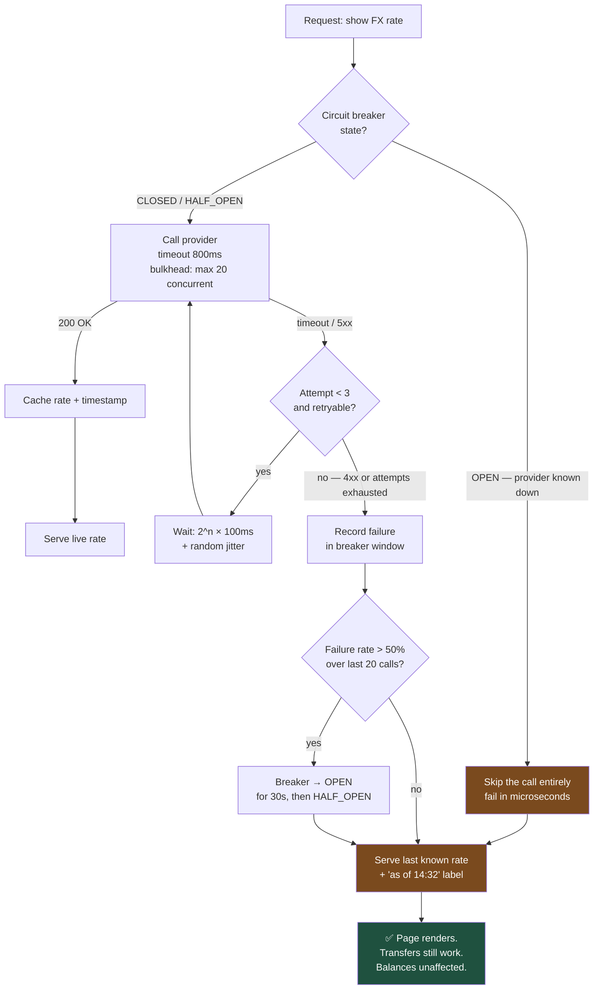

# Everything Remote Fails: Designing for the Call That Doesn't Come Back

Availability is multiplicative. Five dependencies at 99.9% each give you 99.5% — unless you have explicitly decided what happens when each one is unavailable. Most outages are not caused by a component failing; they are caused by nobody having designed the behaviour for that failure.

## The Real-World Problem

A bank's international transfer screen shows a live FX rate fetched from a third-party market data provider. The integration is three lines of code and has worked for two years.

On a Tuesday afternoon the provider has a partial outage: connections are accepted but responses never arrive. There is no timeout on the call. Each request occupies a thread waiting indefinitely. Within 90 seconds the service's 200-thread pool is exhausted, and the transfer screen stops responding — but so does the account balance endpoint, the payee list, and the standing order screen, because they share the same pool.

Then the retry logic makes it worse. A naive retry loop hammers the recovering provider with 40× normal traffic, extending their outage and guaranteeing that the bank's own service stays down through it.

A non-critical decorative feature took down the entire retail banking API for 26 minutes. The failing dependency was 100% third-party; the outage was 100% self-inflicted.

## The Concept

### The five failure modes, and the mitigation for each

| Failure mode | What it looks like | Mitigation |
|---|---|---|
| **Slow** | Connection succeeds, response never arrives | **Timeout** — always shorter than your caller's timeout |
| **Transient error** | 503, connection reset, brief blip | **Retry** with exponential backoff **and jitter**, capped attempts |
| **Persistent error** | Dependency is genuinely down | **Circuit breaker** — fail fast, stop sending traffic to a corpse |
| **Duplicate delivery** | The same request arrives twice | **Idempotency key** on every mutating operation |
| **Partial failure** | One of five dependencies is unavailable | **Degrade** — cached value, empty state, queued job. Not a 500 |

### Timeouts are the single highest-value control

A missing timeout converts a slow dependency into a resource-exhaustion outage, and it propagates: your caller waits because you wait. Every remote call needs a timeout, and timeouts must decrease as you go deeper into the call chain — if your API's SLA is 2 seconds, a downstream call cannot be allowed 5.

### Retry only what is safe to retry

Retrying is safe for idempotent operations. Retrying `POST /payments` without an idempotency key charges the customer twice, which in a payments context is worse than the original failure. And never retry a 4xx — a bad request will not become a good one.

Retries also need **jitter**. Without it, every client that failed at the same moment retries at the same moment, producing a synchronised thundering herd against the recovering service.

### Bulkheads: isolate the pools

A decorative FX widget must not be able to consume the thread pool that serves account balances. Separate pools — or separate services — mean a failure in one feature cannot starve another. This is what turned a widget outage into a full API outage in the scenario above.

### Degrade deliberately

For every remote call, decide in advance what the user sees when it fails. A stale rate with a timestamp is far better than a blank screen; a blank screen is far better than a 500 that takes the whole page down. That decision is a product decision, and it belongs in the ticket.

## How It Works



The important property: **every path ends at a rendered page.** There is no branch that returns a 500 or blocks a thread indefinitely.

## Practical Example

**Before — the three lines that caused the outage:**

```java
@Service
public class FxRateService {

    private final RestTemplate rest = new RestTemplate();   // no timeout configured at all

    public BigDecimal rateFor(String pair) {
        return rest.getForObject("https://marketdata.example/rate/" + pair, RateResponse.class)
                   .rate();                                  // also: NPE waiting to happen
    }
}
```

**After — timeout, bulkhead, breaker, and a defined degraded path** (Spring Boot + Resilience4j):

```java
@Service
public class FxRateService {

    private static final Logger log = LoggerFactory.getLogger(FxRateService.class);

    private final RestClient marketData;
    private final FxRateCache cache;

    FxRateService(RestClient.Builder builder, FxRateCache cache,
                  @Value("${fx.base-url}") String baseUrl) {
        var factory = new SimpleClientHttpRequestFactory();
        factory.setConnectTimeout(Duration.ofMillis(300));
        factory.setReadTimeout(Duration.ofMillis(800));      // shorter than our own 2s SLA
        this.marketData = builder.baseUrl(baseUrl).requestFactory(factory).build();
        this.cache = cache;
    }

    @Bulkhead(name = "fx", type = Bulkhead.Type.SEMAPHORE)   // cannot exhaust the shared pool
    @CircuitBreaker(name = "fx", fallbackMethod = "lastKnownRate")
    @Retry(name = "fx", fallbackMethod = "lastKnownRate")
    public FxRate rateFor(CurrencyPair pair) {
        var response = marketData.get()
            .uri("/v1/rate/{pair}", pair.symbol())
            .retrieve()
            .body(RateResponse.class);

        var rate = new FxRate(pair, response.rate(), Instant.now(), Freshness.LIVE);
        cache.put(rate);
        return rate;
    }

    /**
     * Degraded path. Returns the last known rate marked STALE so the UI can label it.
     * A stale rate with a timestamp is a usable product; a 500 is not.
     */
    private FxRate lastKnownRate(CurrencyPair pair, Throwable cause) {
        log.atWarn().setMessage("fx_rate_degraded")
           .addKeyValue("pair", pair.symbol())
           .addKeyValue("reason", cause.getClass().getSimpleName())
           .log();
        return cache.get(pair)
            .map(r -> r.withFreshness(Freshness.STALE))
            .orElseGet(() -> FxRate.unavailable(pair));      // UI hides the widget, page still works
    }
}
```

```yaml
# application.yml — the policy, externalised and tunable without a code change
resilience4j:
  circuitbreaker:
    instances:
      fx:
        slidingWindowType: COUNT_BASED
        slidingWindowSize: 20
        failureRateThreshold: 50          # >50% of last 20 calls failing → OPEN
        waitDurationInOpenState: 30s
        permittedNumberOfCallsInHalfOpenState: 3
        recordExceptions:
          - java.io.IOException
          - org.springframework.web.client.HttpServerErrorException
        ignoreExceptions:
          - org.springframework.web.client.HttpClientErrorException   # 4xx: never retry
  retry:
    instances:
      fx:
        maxAttempts: 3
        waitDuration: 100ms
        enableExponentialBackoff: true
        exponentialBackoffMultiplier: 2
        enableRandomizedWait: true        # jitter — prevents the synchronised herd
        randomizedWaitFactor: 0.5
  bulkhead:
    instances:
      fx:
        maxConcurrentCalls: 20            # FX can never consume more than 20 threads
        maxWaitDuration: 0                # fail immediately rather than queue
```

**Idempotency — the control that makes retries safe on a mutating endpoint:**

```java
@PostMapping("/api/v1/transfers")
public ResponseEntity<TransferReceipt> transfer(
        @RequestHeader("Idempotency-Key") @NotBlank String idempotencyKey,
        @Valid @RequestBody TransferRequest request,
        @AuthenticationPrincipal Customer customer) {

    // A replayed request returns the original result. It does not move money twice.
    var existing = idempotencyStore.find(idempotencyKey, customer.id());
    if (existing.isPresent()) {
        return ResponseEntity.ok(existing.get().receipt());
    }

    var receipt = transfers.execute(request.toCommand(customer));
    idempotencyStore.record(idempotencyKey, customer.id(), receipt, Duration.ofHours(24));
    return ResponseEntity.status(HttpStatus.CREATED).body(receipt);
}
```

Store the key with a unique constraint so two concurrent replays cannot both pass the check:

```sql
CREATE TABLE idempotency_record (
    idempotency_key VARCHAR(255) NOT NULL,
    customer_id     UUID         NOT NULL,
    receipt         JSONB        NOT NULL,
    created_at      TIMESTAMPTZ  NOT NULL DEFAULT now(),
    expires_at      TIMESTAMPTZ  NOT NULL,
    CONSTRAINT pk_idempotency PRIMARY KEY (idempotency_key, customer_id)
);
```

**The frontend side — timeout and degrade there too:**

```ts
// features/fx/api/fx.queries.ts
export function useFxRate(pair: string) {
  return useQuery({
    queryKey: ['fx-rate', pair],
    queryFn: async ({ signal }) => {
      const res = await fetch(`/api/v1/fx/rate/${pair}`, {
        signal: AbortSignal.any([signal, AbortSignal.timeout(2000)]),
      })
      if (!res.ok) throw new Error(`fx_rate_failed_${res.status}`)
      return fxRateSchema.parse(await res.json())
    },
    retry: (failureCount, error) =>
      failureCount < 2 && !(error instanceof ClientError),   // never retry a 4xx
    retryDelay: (attempt) => Math.min(1000 * 2 ** attempt, 8000) + Math.random() * 300,
    staleTime: 30_000,
    // The widget degrades on its own. It never takes the transfer form down with it.
    throwOnError: false,
  })
}
```

**Verify the failure path in a test — because untested resilience is a hypothesis:**

```java
@Test
void rateFor_providerTimesOut_returnsStaleRateAndDoesNotPropagate() {
    wireMock.stubFor(get(urlPathMatching("/v1/rate/.*"))
        .willReturn(aResponse().withFixedDelay(5_000)));      // simulate the real outage
    cache.put(new FxRate(EUR_USD, new BigDecimal("1.0842"), Instant.parse("2026-08-09T14:32:00Z"),
                         Freshness.LIVE));

    var rate = fxRateService.rateFor(EUR_USD);

    assertThat(rate.freshness()).isEqualTo(Freshness.STALE);
    assertThat(rate.value()).isEqualByComparingTo("1.0842");
    assertThat(rate.asOf()).isEqualTo(Instant.parse("2026-08-09T14:32:00Z"));
}
```

## Enterprise Trade-offs

| Approach | Pros | Cons | When to use (Banking / Insurance / Enterprise) |
|---|---|---|---|
| **Timeout + retry with jitter + breaker + bulkhead** | Contains third-party failure; predictable degradation; protects the recovering dependency | Configuration to tune; more failure paths to test | Default for every outbound call in a customer-facing financial system |
| **Timeout only** | Trivial to add; prevents resource exhaustion | Transient blips surface as user-visible errors | Minimum acceptable baseline — never ship a remote call without one |
| **Serve stale-on-failure from cache** | Feature stays usable; no user-visible outage | Stale data must be labelled, and staleness must be acceptable for that data | Market rates, reference data, product catalogues. **Never** for balances, limits, or sanctions results |
| **Queue and process asynchronously** | Caller never waits; absorbs full downstream outages | Eventual consistency; the UI must show pending state | Claims submission, batch payments, document generation — anything not needed synchronously |
| **Fail the request cleanly (no degradation)** | Honest; no risk of acting on stale data | User-visible error | Correct choice when a stale answer would be dangerous: fraud checks, credit decisions, sanctions screening |
| **Unbounded retry, no timeout** | — | Resource exhaustion; amplifies the outage; the scenario above | Never |

## Why This Still Matters Through 2030

The direction of travel guarantees this gets more important: enterprise systems keep acquiring dependencies — payment providers, KYC vendors, market data, fraud scoring, document AI, embedded finance partners — and each one is another 99.9% multiplied into your availability. Regulation is moving in step. Operational-resilience regimes such as DORA require firms to identify critical third parties and demonstrate that they can continue operating, in a degraded mode, when one of them fails. That is not a policy document; it is timeouts, breakers, bulkheads, and a defined degraded path per dependency, evidenced by tests. Platform layers will keep absorbing some of the mechanics — service meshes handle retries and outlier ejection, gateways enforce timeouts — but the decision a mesh cannot make for you is the product one: what does the user see when this specific dependency is gone? That question is permanent, and answering it deliberately for every remote call is what separates a system that degrades from one that collapses.

→ Next: [04-data-integrity-and-migrations.md](04-data-integrity-and-migrations.md) · Related: [../03-architecture/05-event-driven-architecture.md](../03-architecture/05-event-driven-architecture.md) · [../09-ux-ui-guidelines/04-loading-error-empty-states.md](../09-ux-ui-guidelines/04-loading-error-empty-states.md)
