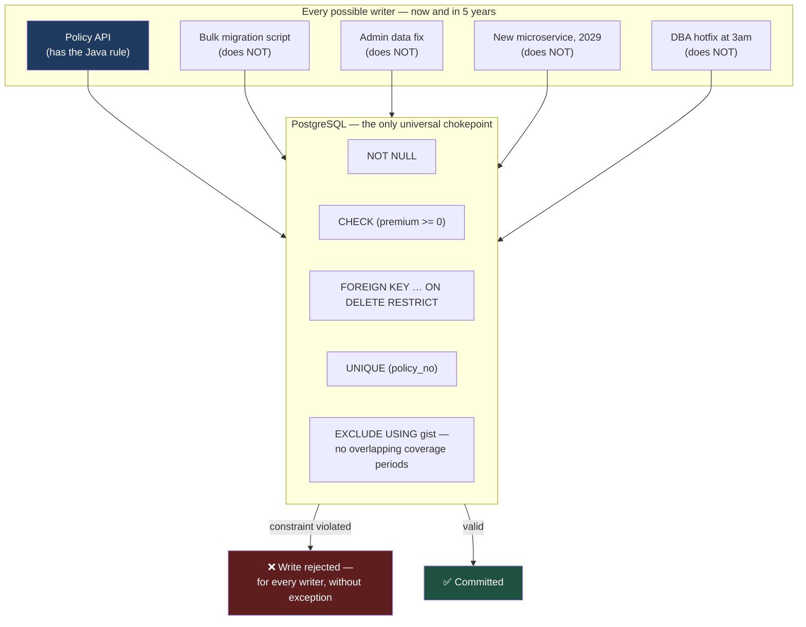

# The Database Is the Last Line of Defence

Application code gets rewritten, replaced, and bypassed. Batch jobs, admin scripts, data fixes, and the next team's microservice all reach the same tables. Only constraints declared in the database are enforced against every writer, forever.

## The Real-World Problem

An insurer's policy administration system enforces "a policy cannot have overlapping coverage periods for the same risk" in Java, inside the policy service. It is well-tested and correct.

Three years later, a migration project loads 400,000 historical policies directly via a bulk SQL script, bypassing the service entirely. The rule is not in the database, so nothing objects. Roughly 900 policies land with overlapping coverage periods.

Nobody notices for fourteen months — until a claim arrives on a policy with two overlapping periods carrying different excess amounts. The claims system picks one arbitrarily (whichever row the query returns first, which is not deterministic). Two claimants with identical circumstances receive different settlements. That is a regulatory fairness problem, a manual remediation project across 900 policies, and a data-quality finding in the next audit.

The Java rule was never wrong. It was just in the wrong place to be a guarantee.

## The Concept

### Validate at every layer, but *guarantee* only in the database

Each layer has a distinct job, and they are not substitutes:

| Layer | Purpose | What it cannot do |
|---|---|---|
| **Client (browser)** | Fast feedback, good UX | Trivially bypassed — never a control |
| **API / application** | Business rules, useful error messages, cross-aggregate logic | Bypassed by scripts, batch jobs, other services |
| **Database** | The invariant that holds against every writer | Express complex multi-entity workflow rules |

The rule of thumb: if the data would be *corrupt* without it, it belongs in the database as a constraint. If it is a workflow rule ("a claim can only be approved by someone other than the submitter"), it belongs in the application.

### Use the type system the database gives you

Most integrity bugs in enterprise systems trace back to columns that were too permissive: money as `FLOAT`, timestamps as `VARCHAR`, statuses as free text, nullable foreign keys "for flexibility".

- **Money is never a float.** `NUMERIC(19,4)` or an integer of minor units. Binary floating point cannot represent 0.1, and ledger reconciliation is unforgiving about that.
- **Timestamps are `TIMESTAMPTZ`.** A naive timestamp is ambiguous the moment two regions read it.
- **Statuses are constrained** — an enum, a lookup table with a foreign key, or a `CHECK`. Free-text status columns accumulate `ACTIVE`, `Active`, `active`, and `ACTIVE ` within a year.
- **`NOT NULL` by default.** Make nullability a deliberate, justified exception.

### Transactions define the consistency boundary

A transaction should cover exactly one business operation. Two common failures: transactions too wide (holding locks across a remote HTTP call, so a slow third party blocks the database), and too narrow (two writes that must both succeed committed separately, leaving a partially-applied state that no code path expects).

### Migrations are versioned, forward-only, and reviewed like code

Schema is code. It lives in the repository, is applied by a tool with a recorded history, and is reviewed — in a regulated environment, by the group that owns the schema. Nobody applies DDL by hand to production. Every changeset carries a rollback and a ticket reference, because the audit question is not "what does the schema look like?" but "who changed it, when, why, and who approved it?"

## How It Works



Note that four of the five writers do not know the business rule exists. That is the entire argument.

## Practical Example

**The schema that makes the incident impossible.** PostgreSQL's exclusion constraint expresses "no overlapping periods for the same risk" declaratively:

```sql
CREATE EXTENSION IF NOT EXISTS btree_gist;

CREATE TABLE policy_coverage (
    id                 UUID         PRIMARY KEY DEFAULT gen_random_uuid(),
    policy_id          UUID         NOT NULL,
    risk_id            UUID         NOT NULL,
    coverage_period    DATERANGE    NOT NULL,
    excess_minor_units BIGINT       NOT NULL,
    currency           CHAR(3)      NOT NULL,
    status             TEXT         NOT NULL,
    created_at         TIMESTAMPTZ  NOT NULL DEFAULT now(),
    created_by         TEXT         NOT NULL,

    CONSTRAINT fk_coverage_policy
        FOREIGN KEY (policy_id) REFERENCES policy (id) ON DELETE RESTRICT,
    CONSTRAINT chk_excess_non_negative
        CHECK (excess_minor_units >= 0),
    CONSTRAINT chk_currency_iso
        CHECK (currency ~ '^[A-Z]{3}$'),
    CONSTRAINT chk_status_known
        CHECK (status IN ('DRAFT', 'ACTIVE', 'LAPSED', 'CANCELLED')),
    CONSTRAINT chk_period_bounded
        CHECK (lower(coverage_period) IS NOT NULL AND upper(coverage_period) IS NOT NULL),

    -- The one that would have prevented 900 bad rows and a fairness finding.
    -- Enforced against the API, the bulk loader, the DBA, and every future service.
    CONSTRAINT excl_no_overlapping_coverage
        EXCLUDE USING gist (
            policy_id WITH =,
            risk_id   WITH =,
            coverage_period WITH &&
        ) WHERE (status IN ('ACTIVE', 'LAPSED'))
);
```

The `WHERE` clause matters: draft and cancelled coverages are allowed to overlap, because that reflects the actual business rule rather than a blunt approximation of it.

**Money, correctly typed.** Minor units as an integer, with the currency alongside it:

```sql
-- WRONG: floats cannot represent 0.1; reconciliation will drift
premium NUMERIC → premium FLOAT               -- never
premium DOUBLE PRECISION                       -- never

-- RIGHT: integer minor units, or fixed-scale numeric
premium_minor_units BIGINT NOT NULL,           -- 12345 = 123.45 for a 2-decimal currency
premium_currency    CHAR(3) NOT NULL,
CONSTRAINT chk_premium_non_negative CHECK (premium_minor_units >= 0)
```

Java side, so the type system carries the same guarantee:

```java
public record Money(long minorUnits, Currency currency) {

    public Money {
        Objects.requireNonNull(currency, "currency");
    }

    public Money plus(Money other) {
        if (!currency.equals(other.currency)) {
            throw new CurrencyMismatchException(currency, other.currency);   // never silently coerce
        }
        return new Money(Math.addExact(minorUnits, other.minorUnits), currency);
    }

    public BigDecimal toMajorUnits() {
        return BigDecimal.valueOf(minorUnits, currency.getDefaultFractionDigits());
    }
}
```

`Math.addExact` throws on overflow rather than wrapping — in a financial system, a silent wrap is far worse than an exception.

**Transaction boundaries — one business operation, no remote calls inside:**

```java
@Service
public class CoverageService {

    // WRONG: holds a DB transaction open across an HTTP call. A slow reinsurer
    // now consumes a database connection and blocks other writers.
    @Transactional
    public void addCoverageBadly(AddCoverage cmd) {
        var policy = policyRepo.findByIdForUpdate(cmd.policyId()).orElseThrow();
        var quote = reinsuranceClient.requestQuote(cmd);      // ← 4s network call inside a txn
        policy.addCoverage(cmd.toCoverage(quote.excess()));
        policyRepo.save(policy);
    }

    // RIGHT: do the remote work outside, then commit one atomic unit.
    public void addCoverage(AddCoverage cmd) {
        var quote = reinsuranceClient.requestQuote(cmd);      // outside the transaction
        persistCoverage(cmd, quote);
    }

    @Transactional
    protected void persistCoverage(AddCoverage cmd, ReinsuranceQuote quote) {
        var policy = policyRepo.findByIdForUpdate(cmd.policyId()).orElseThrow();
        policy.addCoverage(cmd.toCoverage(quote.excess()));   // aggregate enforces its own rules
        policyRepo.save(policy);
        auditRepo.record(AuditEvent.coverageAdded(policy.id(), cmd));   // same txn — atomic
    }
}
```

**Translate constraint violations into meaningful errors** so the database's guarantee produces a usable API response rather than a 500:

```java
@RestControllerAdvice
class DataIntegrityAdvice {

    @ExceptionHandler(DataIntegrityViolationException.class)
    ProblemDetail onConstraintViolation(DataIntegrityViolationException ex) {
        var constraint = constraintNameOf(ex);
        var problem = switch (constraint) {
            case "excl_no_overlapping_coverage" -> ProblemDetail.forStatusAndDetail(
                HttpStatus.CONFLICT,
                "This risk already has active coverage overlapping the requested period.");
            case "uq_policy_number" -> ProblemDetail.forStatusAndDetail(
                HttpStatus.CONFLICT, "That policy number is already in use.");
            default -> ProblemDetail.forStatusAndDetail(
                HttpStatus.CONFLICT, "The request conflicts with existing data.");
        };
        problem.setProperty("constraint", constraint);   // for support, not for the end user
        return problem;
    }
}
```

**Prove the constraint holds against a writer that does not know the rule** — this is the test that would have caught the migration:

```java
@Test
void bulkInsert_bypassingApplicationLayer_isStillRejected() {
    var policyId = fixtures.activePolicy();
    jdbc.update("""
        INSERT INTO policy_coverage
            (policy_id, risk_id, coverage_period, excess_minor_units, currency, status, created_by)
        VALUES (?, ?, daterange('2026-01-01','2026-12-31'), 50000, 'EUR', 'ACTIVE', 'migration')
        """, policyId, RISK_A);

    // Raw SQL, no service layer, no Java rule in the path — exactly the migration scenario
    assertThatThrownBy(() -> jdbc.update("""
        INSERT INTO policy_coverage
            (policy_id, risk_id, coverage_period, excess_minor_units, currency, status, created_by)
        VALUES (?, ?, daterange('2026-06-01','2027-05-31'), 25000, 'EUR', 'ACTIVE', 'migration')
        """, policyId, RISK_A))
        .isInstanceOf(DataIntegrityViolationException.class)
        .hasMessageContaining("excl_no_overlapping_coverage");
}
```

**Adding a constraint to a table that already has bad data** — the realistic enterprise case. Validate without a long lock, and quarantine what fails:

```sql
-- 1. Find the violations before attempting anything
CREATE TABLE coverage_overlap_quarantine AS
SELECT a.id AS id_a, b.id AS id_b, a.policy_id, a.risk_id
  FROM policy_coverage a
  JOIN policy_coverage b
    ON a.policy_id = b.policy_id
   AND a.risk_id   = b.risk_id
   AND a.id <> b.id
   AND a.coverage_period && b.coverage_period
 WHERE a.status IN ('ACTIVE','LAPSED') AND b.status IN ('ACTIVE','LAPSED');

-- 2. Remediate with business sign-off (never silently), then add the constraint
--    NOT VALID first: enforces new writes immediately, no full-table lock
ALTER TABLE policy_coverage
  ADD CONSTRAINT excl_no_overlapping_coverage
  EXCLUDE USING gist (policy_id WITH =, risk_id WITH =, coverage_period WITH &&)
  WHERE (status IN ('ACTIVE','LAPSED')) NOT VALID;

-- 3. Validate the existing rows separately — takes a weaker lock
ALTER TABLE policy_coverage VALIDATE CONSTRAINT excl_no_overlapping_coverage;
```

## Enterprise Trade-offs

| Approach | Pros | Cons | When to use (Banking / Insurance / Enterprise) |
|---|---|---|---|
| **Constraints in the database + validation in the app** | Guarantee holds against every writer; app still gives good error messages | Constraint violations must be translated to API errors; some rules are awkward in SQL | Default for any data with financial, regulatory, or fairness consequences |
| **Application-layer validation only** | Expressive, easy to test, good messages | Bypassed by scripts, batch loads, other services — the scenario above | Only for workflow rules that genuinely cannot be expressed as data invariants |
| **Database-only validation** | Guaranteed, minimal code | Opaque errors; hard to express multi-step workflow rules | Fine for reference data; insufficient for user-facing flows |
| **Soft delete + `ON DELETE RESTRICT`** | Preserves audit history; prevents orphaned references | Every query must filter deleted rows; unique constraints need partial indexes | Standard in regulated systems where records must never physically disappear |
| **Eventually-consistent integrity via events** | Scales across service boundaries | A window exists where data is inconsistent; needs reconciliation and alerting | Cross-service invariants only. Never within a single aggregate |
| **Trust the ORM to enforce it** | No SQL to write | Enforced only for writers using that ORM version and entity | Never treat as a control |

→ Next: [05-security-by-default.md](05-security-by-default.md) · Related: [../06-database-strategies/06-schema-migrations-in-a-regulated-environment.md](../06-database-strategies/06-schema-migrations-in-a-regulated-environment.md) · [../06-database-strategies/04-ddl-vs-dml-roles-and-ownership.md](../06-database-strategies/04-ddl-vs-dml-roles-and-ownership.md)
