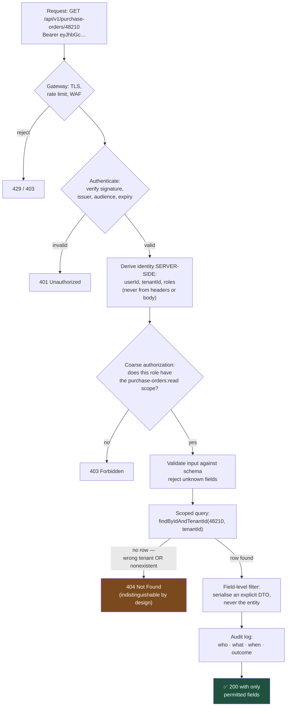

# Deny by Default: Why Authorization Is the Bug That Reaches Production

Authentication is a solved problem you can buy. Authorization is a decision made on every single request, in your code, by you — which is why broken access control remains the most commonly found serious vulnerability in real enterprise applications.

## The Real-World Problem

An enterprise vendor ships a B2B procurement portal used by 600 client organisations. Each client's buyers see their own purchase orders. Authentication is handled properly by an identity provider; sessions are solid; the login flow has been penetration tested.

A client's security team runs a routine test. They log in as a legitimate buyer, note that their purchase order URL is `/api/v1/purchase-orders/48211`, and change the number to `48210`. They receive a competitor's purchase order: supplier names, negotiated unit prices, volumes, and delivery schedules.

The endpoint was authenticated. Every request had a valid token. The controller simply looked the record up by primary key and returned it, because the developer's mental model was "logged-in users can see purchase orders" rather than "this user can see *these* purchase orders". Every automated test passed, because every test used a single tenant.

Commercially, negotiated pricing across 600 organisations was exposed to anyone with a valid login and a keyboard. The fix was one line. The contractual and disclosure consequences were not.

## The Concept

### Authentication is not authorization

**Authentication** answers *who is this?* **Authorization** answers *may they do this, to this specific record?* Confusing them produces exactly the bug above — commonly called IDOR (insecure direct object reference), and formally the top category in the OWASP Top 10 for years running.

### Deny by default

Security posture must be a whitelist. Every endpoint is denied unless explicitly permitted; every field is excluded from a response unless explicitly included; every origin is blocked unless explicitly allowed. The failure mode of a blacklist is silent exposure — you forget to add the new endpoint to the protected list, and it ships open.

### Scope the query, not the response

The reliable pattern is to make unauthorized data *unfetchable*, rather than fetching it and then deciding whether to return it. Filter in the query:

```
findById(id)                        → then check ownership   ❌ fragile
findByIdAndTenantId(id, tenantId)   → cannot return foreign data ✅
```

The second form cannot be got wrong by a later refactor, because the constraint is inside the data access itself.

### Return 404, not 403

A `403` on a record that exists confirms it exists — that is an enumeration oracle. For records the caller may not see, return `404`. Absence and denial should be indistinguishable.

### Never trust anything the client sent

Not a price in the request body, not a role claim in a token you did not verify, not a tenant ID in a header, not a redirect URL in a query parameter. Derive authority from the verified token server-side, always.

### Validate input at the boundary, with a schema

One schema per endpoint, rejecting unknown fields. Mass assignment — binding a request body straight onto an entity — is how a user sets their own `role` to `ADMIN`.

## How It Works



The decisive step is `G`. Everything before it is generic infrastructure most teams get right; `G` is application code, and it is where the incident happened.

## Practical Example

**The vulnerable endpoint, as shipped:**

```java
@GetMapping("/api/v1/purchase-orders/{id}")
public PurchaseOrder get(@PathVariable Long id) {
    return purchaseOrderRepo.findById(id).orElseThrow();   // any buyer reads any PO
}
```

Three separate defects: no tenant scoping, the JPA entity is serialised directly (exposing every field and lazy relation), and a missing record throws a raw exception.

**The corrected endpoint:**

```java
@GetMapping("/api/v1/purchase-orders/{id}")
@PreAuthorize("hasAuthority('SCOPE_purchase-orders:read')")     // coarse gate
public PurchaseOrderResponse get(
        @PathVariable Long id,
        @AuthenticationPrincipal BuyerPrincipal principal) {

    // Fine-grained authorization expressed as a query constraint, not an if-statement.
    // A later refactor cannot accidentally drop it — there is no unscoped method to call.
    var order = purchaseOrderRepo
        .findByIdAndOrganisationId(id, principal.organisationId())
        .orElseThrow(() -> new PurchaseOrderNotFoundException(id));   // → 404, not 403

    return PurchaseOrderResponse.from(order);                 // explicit DTO, explicit fields
}
```

**Remove the unsafe method entirely**, so the mistake is not available to make:

```java
public interface PurchaseOrderRepository extends Repository<PurchaseOrder, Long> {

    // Deliberately NOT extending JpaRepository / CrudRepository: doing so would expose
    // findById(id) and findAll() — unscoped methods with no tenant filter. Every query
    // in this interface takes an organisationId.

    Optional<PurchaseOrder> findByIdAndOrganisationId(Long id, UUID organisationId);

    Page<PurchaseOrder> findByOrganisationIdAndStatus(UUID organisationId,
                                                      OrderStatus status,
                                                      Pageable pageable);

    boolean existsByIdAndOrganisationId(Long id, UUID organisationId);
}
```

Choosing the narrow `Repository` base interface over `JpaRepository` is a small decision that removes an entire class of vulnerability from the codebase.

**Defence in depth — enforce the tenant filter in the database too**, so a raw query or a future service cannot bypass it (PostgreSQL row-level security):

```sql
ALTER TABLE purchase_order ENABLE ROW LEVEL SECURITY;
ALTER TABLE purchase_order FORCE ROW LEVEL SECURITY;

CREATE POLICY tenant_isolation ON purchase_order
    USING (organisation_id = current_setting('app.current_organisation')::uuid);
```

```java
// Set the session variable per request, from the verified token — never from a header
@Component
class TenantContextInterceptor implements HandlerInterceptor {

    private final JdbcTemplate jdbc;

    @Override
    public boolean preHandle(HttpServletRequest req, HttpServletResponse res, Object handler) {
        var principal = SecurityContextHolder.getContext().getAuthentication();
        if (principal instanceof BuyerPrincipal buyer) {
            jdbc.update("SELECT set_config('app.current_organisation', ?, true)",
                        buyer.organisationId().toString());
        }
        return true;
    }
}
```

**Deny by default at the security configuration level.** The ordering here is the whole point:

```java
@Configuration
@EnableWebSecurity
@EnableMethodSecurity
class SecurityConfig {

    @Bean
    SecurityFilterChain filterChain(HttpSecurity http) throws Exception {
        http
            .authorizeHttpRequests(auth -> auth
                .requestMatchers("/actuator/health/**").permitAll()
                .requestMatchers("/api/v1/admin/**").hasRole("PLATFORM_ADMIN")
                .anyRequest().authenticated())          // ← catch-all DENY. New endpoints
                                                        //   are protected automatically.
            .oauth2ResourceServer(oauth -> oauth
                .jwt(jwt -> jwt.jwtAuthenticationConverter(scopeConverter())))
            .sessionManagement(s -> s.sessionCreationPolicy(SessionCreationPolicy.STATELESS))
            .csrf(csrf -> csrf.disable())               // stateless bearer-token API
            .cors(cors -> cors.configurationSource(explicitAllowlist()))
            .headers(h -> h
                .httpStrictTransportSecurity(hsts -> hsts.maxAgeInSeconds(31_536_000))
                .contentTypeOptions(Customizer.withDefaults())
                .frameOptions(HeadersConfigurer.FrameOptionsConfig::deny)
                .contentSecurityPolicy(csp ->
                    csp.policyDirectives("default-src 'self'; frame-ancestors 'none'")));
        return http.build();
    }

    @Bean
    CorsConfigurationSource explicitAllowlist() {
        var config = new CorsConfiguration();
        config.setAllowedOrigins(List.of("https://portal.vendor.com"));  // never "*"
        config.setAllowedMethods(List.of("GET", "POST", "PUT", "DELETE"));
        config.setAllowCredentials(true);        // "*" + credentials is itself a vulnerability
        var source = new UrlBasedCorsConfigurationSource();
        source.registerCorsConfiguration("/api/**", config);
        return source;
    }
}
```

**Prevent mass assignment** by binding to a request DTO with unknown fields rejected — never onto the entity:

```java
public record CreatePurchaseOrderRequest(
    @NotBlank @Size(max = 64) String supplierReference,
    @NotEmpty @Valid List<LineItemRequest> lines,
    @NotNull @FutureOrPresent LocalDate requestedDelivery
) {}
// Note what is absent: organisationId, status, approvedBy, totalAmount.
// Those are derived server-side. A client cannot set them because they cannot be bound.
```

```yaml
spring:
  jackson:
    deserialization:
      fail-on-unknown-properties: true     # reject unexpected fields rather than ignoring them
```

**The test that closes the class of bug.** Note that it needs two tenants — the reason the original suite missed it is that it only ever had one:

```java
@Test
void get_purchaseOrderOfAnotherOrganisation_returns404NotForbidden() throws Exception {
    var foreignOrder = fixtures.purchaseOrderFor(ORG_COMPETITOR);

    mockMvc.perform(get("/api/v1/purchase-orders/{id}", foreignOrder.getId())
            .with(authenticatedBuyerOf(ORG_CUSTOMER)))
        .andExpect(status().isNotFound())                  // 404, so existence is not confirmed
        .andExpect(jsonPath("$.supplierReference").doesNotExist());
}

@ParameterizedTest
@MethodSource("allTenantScopedEndpoints")
void everyTenantScopedEndpoint_rejectsCrossTenantAccess(String method, String path) {
    // A contract test over the whole API surface: adding a new endpoint that forgets
    // tenant scoping fails this test rather than shipping.
    …
}
```

**Log the authorization outcome**, because in a regulated environment "who accessed what" is itself a required control:

```java
log.atInfo().setMessage("resource_access")
   .addKeyValue("actor_id", principal.userId())
   .addKeyValue("organisation_id", principal.organisationId())
   .addKeyValue("resource", "purchase_order")
   .addKeyValue("resource_id", id)
   .addKeyValue("outcome", "ALLOWED")
   .log();
```

## Enterprise Trade-offs

| Approach | Pros | Cons | When to use (Banking / Insurance / Enterprise) |
|---|---|---|---|
| **Query-scoped authorization** (`findByIdAndTenantId`) | Cannot be bypassed by refactoring; simple; fast | Every repository method needs the scope parameter | Default for all multi-tenant data access |
| **Row-level security in the database** | Enforced against every writer and reader, including raw SQL and future services | Session context must be set correctly on every connection; harder to debug | Defence in depth for high-sensitivity data; strong audit story |
| **Policy engine** (OPA, Cedar, Spring Security expressions) | Centralised, auditable policy separate from code; complex rules expressible | Extra component; risk of policy/code drift; latency if remote | Complex rule sets: delegated authority, maker-checker, brokered access hierarchies |
| **RBAC** (roles only) | Simple to reason about and audit | Cannot express per-record ownership — insufficient on its own | Coarse endpoint gating, combined with record-level scoping |
| **ABAC / ReBAC** (attributes / relationships) | Handles "this broker, for these clients, until this date" | More complex to implement and to explain to an auditor | Insurance broker hierarchies, banking delegated access, shared accounts |
| **Check ownership after fetching** | Reads naturally | One forgotten `if` is a breach; easy to drop in refactoring | Avoid — prefer making the data unfetchable |
| **Authenticated = authorized** | — | The scenario above | Never |

→ Next: [06-performance-budget.md](06-performance-budget.md) · Related: [../04-security-and-authentication/07-securing-internal-vs-external-apis.md](../04-security-and-authentication/07-securing-internal-vs-external-apis.md) · [../00-project-setup-roadmap/09-code-review-process.md](../00-project-setup-roadmap/09-code-review-process.md)
