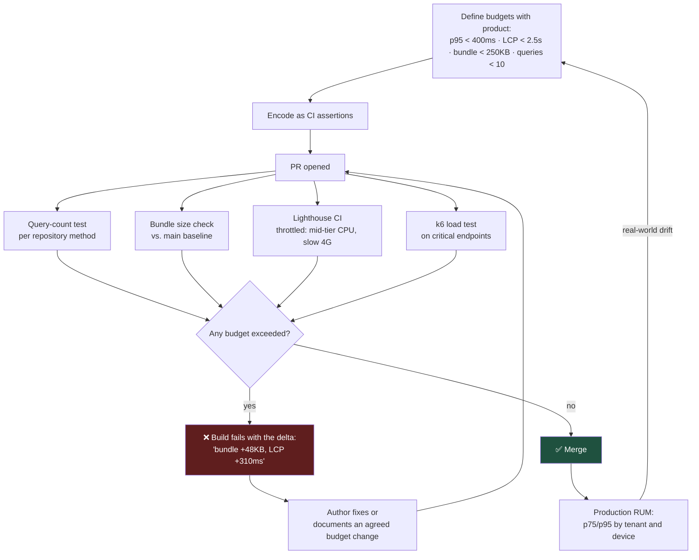

# A Performance Budget Turns Opinion Into a Failing Build

"It feels slow" is an argument nobody wins. A number with a threshold attached is a test, and a test can fail a build. That difference is the whole discipline.

## The Real-World Problem

An enterprise vendor's logistics dashboard loads in 1.1 seconds at launch. Nobody measures it again. Over nineteen months, each sprint adds something reasonable: a charting library, an analytics snippet, a date-picker, a feature flag SDK, three more table columns, an icon set imported in full.

No single change is objectionable — the largest adds 240ms. Cumulatively, first contentful paint reaches 6.8 seconds on the hardware their users actually have, which is a five-year-old Windows laptop on a warehouse VPN, not the developer's machine on office fibre.

The complaint that reaches engineering is not "the dashboard is slow". It is a renewal negotiation in which the client's operations director says her team has started keeping a spreadsheet open instead. By then the cause is nineteen months of untracked decisions, and no single one to revert.

## The Concept

### A budget is a number, an owner, and a gate

Three parts, all required:

1. **A metric that reflects user experience** — p95 API latency, Largest Contentful Paint, JavaScript bundle size, database query count per request.
2. **A threshold** — an explicit number, chosen deliberately.
3. **An automated gate** — CI fails when the threshold is exceeded.

Without the gate it is an aspiration, and aspirations lose to deadlines every time.

### Measure percentiles on real hardware

Averages hide the users who are suffering; a healthy mean can conceal a p99 of thirty seconds. And measure on representative devices and networks. Enterprise users are frequently on constrained corporate hardware behind a VPN — profiling on a developer laptop measures a population that does not exist.

### Budget the things that cause regressions

For enterprise applications, four budgets catch nearly everything:

| Budget | Typical threshold | Catches |
|---|---|---|
| **API p95 latency** | < 400ms per endpoint | N+1 queries, missing indexes, chatty service calls |
| **Queries per request** | < 10 | ORM lazy-loading in a loop — the single most common cause |
| **JS bundle size** | < 250KB gzipped initial route | Accidental full-library imports, unsplit routes |
| **Core Web Vitals** | LCP < 2.5s, INP < 200ms, CLS < 0.1 | Rendering and interaction regressions |

### The N+1 query is the default enterprise performance bug

It passes review, passes tests with ten fixture rows, and destroys production with ten thousand. Counting queries per request in tests is the highest-return performance control available, because it converts a load-dependent production problem into a deterministic test failure.

### Optimise after measuring, never before

Profile first. Intuition about where time goes is unreliable, and time spent optimising a path that accounts for 2% of latency is time not spent on the one that accounts for 60%.

## How It Works



The feedback loop from `L` back to `A` matters: lab budgets drift from reality, and real-user monitoring is what recalibrates them.

## Practical Example

**Catch the N+1 before it ships.** Count queries in an integration test and assert a ceiling:

```java
@DataJpaTest
class ShipmentQueryPerformanceTest {

    @Autowired ShipmentRepository repo;
    @Autowired EntityManagerFactory emf;

    @Test
    void listShipmentsWithCarrier_issuesConstantQueryCount_regardlessOfRowCount() {
        fixtures.shipmentsWithCarriers(200);
        var stats = emf.unwrap(SessionFactory.class).getStatistics();
        stats.setStatisticsEnabled(true);
        stats.clear();

        var page = repo.findActiveWithCarrier(TENANT_A, PageRequest.of(0, 50));
        page.forEach(s -> s.getCarrier().getName());   // touch the association

        // Without the fetch join this is 51 queries and grows with page size.
        assertThat(stats.getPrepareStatementCount())
            .as("query count must not scale with result size")
            .isLessThanOrEqualTo(2);
    }
}
```

```java
public interface ShipmentRepository extends Repository<Shipment, UUID> {

    @Query("""
        SELECT s FROM Shipment s
        JOIN FETCH s.carrier
        WHERE s.tenantId = :tenantId AND s.status = 'ACTIVE'
        """)
    Page<Shipment> findActiveWithCarrier(@Param("tenantId") UUID tenantId, Pageable pageable);
}
```

**Make an unbounded query impossible** — the other half of the same problem:

```java
// Every list endpoint takes a Pageable with an enforced maximum.
// An unpaginated query is a latent outage waiting for your largest tenant.
@GetMapping("/api/v1/shipments")
public Page<ShipmentResponse> list(
        @PageableDefault(size = 25)
        @Valid @Max(value = 100, message = "page size may not exceed 100") Pageable pageable,
        @AuthenticationPrincipal TenantPrincipal principal) {
    return service.activeFor(principal.tenantId(), pageable).map(ShipmentResponse::from);
}
```

**Bundle budget as a build failure**, not a chart somebody might look at:

```js
// next.config.mjs — fail the build on regression, don't just report it
export default {
  experimental: { webpackBuildWorker: true },
  webpack: (config, { isServer }) => {
    if (!isServer) {
      config.performance = {
        hints: 'error',                    // 'warning' would be ignored within a sprint
        maxEntrypointSize: 256_000,        // 250KB gzipped initial route
        maxAssetSize: 256_000,
      }
    }
    return config
  },
}
```

```yaml
# .github/workflows/perf.yml
- name: Lighthouse CI (throttled to real user hardware)
  uses: treosh/lighthouse-ci-action@v12
  with:
    urls: https://staging.logistics-suite.com/dashboard
    configPath: ./lighthouserc.json
```

```json
// lighthouserc.json
{
  "ci": {
    "collect": {
      "numberOfRuns": 3,
      "settings": {
        "preset": "desktop",
        "throttling": { "cpuSlowdownMultiplier": 4 },
        "throttlingMethod": "simulate"
      }
    },
    "assert": {
      "assertions": {
        "largest-contentful-paint": ["error", { "maxNumericValue": 2500 }],
        "interaction-to-next-paint": ["error", { "maxNumericValue": 200 }],
        "cumulative-layout-shift": ["error", { "maxNumericValue": 0.1 }],
        "total-byte-weight": ["error", { "maxNumericValue": 1600000 }]
      }
    }
  }
}
```

`cpuSlowdownMultiplier: 4` is the setting that makes the test represent the warehouse laptop rather than the developer's machine.

**Backend load budget on the critical path:**

```js
// k6/dashboard-load.js
import http from 'k6/http'
import { check } from 'k6'

export const options = {
  stages: [
    { duration: '30s', target: 50 },
    { duration: '2m', target: 50 },
  ],
  thresholds: {
    'http_req_duration{endpoint:shipments}': ['p(95)<400', 'p(99)<1000'],
    http_req_failed: ['rate<0.001'],
  },
}

export default function () {
  const res = http.get(`${__ENV.BASE_URL}/api/v1/shipments?page=0&size=25`, {
    headers: { Authorization: `Bearer ${__ENV.TOKEN}` },
    tags: { endpoint: 'shipments' },
  })
  check(res, { 'status 200': (r) => r.status === 200 })
}
```

**Import discipline — the leak that produces the scenario above:**

```ts
// ❌ pulls the entire library into the initial bundle
import _ from 'lodash'
import * as Icons from 'react-icons/md'
import { Chart } from 'chart.js/auto'

// ✅ import only what is used; defer what is not immediately visible
import groupBy from 'lodash/groupBy'
import { MdLocalShipping } from 'react-icons/md'

const ShipmentChart = dynamic(() => import('@/features/shipments/ShipmentChart'), {
  ssr: false,
  loading: () => <ChartSkeleton />,     // below the fold — never in the initial bundle
})
```

**Close the loop with real-user monitoring**, segmented the way complaints arrive:

```ts
// app/layout.tsx
import { useReportWebVitals } from 'next/web-vitals'

export function WebVitals() {
  useReportWebVitals((metric) => {
    navigator.sendBeacon('/api/rum', JSON.stringify({
      name: metric.name,
      value: metric.value,
      tenantId: getTenantId(),          // p95 per tenant — one bad client is invisible in aggregate
      deviceMemory: (navigator as any).deviceMemory,
      connection: (navigator as any).connection?.effectiveType,
      route: window.location.pathname,
    }))
  })
  return null
}
```

## Enterprise Trade-offs

| Approach | Pros | Cons | When to use (Banking / Insurance / Enterprise) |
|---|---|---|---|
| **Budgets enforced in CI** | Regressions caught before merge; no negotiation at review time | Initial threshold-setting effort; occasional false failures to triage | Default for any user-facing enterprise application |
| **Query-count assertions in tests** | Catches N+1 deterministically with no load testing infrastructure | Requires a test per critical query path | Highest return per hour of effort — do this first |
| **Load testing in CI on critical endpoints** | Finds latency under concurrency, not just single-request timing | Slower pipeline; needs a production-like environment to be meaningful | Payment, claims submission, authentication — anything with a contractual SLA |
| **Real-user monitoring only** | Measures reality, segmented by tenant and device | Detects regressions after users experience them | Necessary complement to CI budgets, never a replacement |
| **Periodic manual performance testing** | No tooling investment | Finds the accumulation of nineteen months at once; no attribution to a change | Only as a stopgap while automation is built |
| **No budget** | — | Death by a thousand reasonable increments; the scenario above | Never |

## Why This Still Matters Through 2030

Enterprise applications are becoming heavier for structural reasons that will not reverse: more embedded analytics, more real-time collaboration, richer client-side state, and more third-party SDKs for flags, telemetry, and support widgets. Every one of those arrives as a defensible individual decision, which is exactly why the cumulative drift needs a mechanical guard rather than a cultural one. The measurement side is also settling in a useful way — Core Web Vitals are now a stable, vendor-neutral vocabulary that product managers and engineers can share, so "LCP regressed 400ms" is a sentence both sides act on without translation. What tends to surprise teams is the hardware trajectory: the client machines in warehouses, branch offices, and claims-handling centres are refreshed on multi-year cycles and are consistently slower than anything on an engineer's desk, so the performance gap between where software is built and where it runs is widening rather than closing. A budget enforced against throttled hardware is the only reliable way to keep that gap visible.

→ Next: [07-observability-mindset.md](07-observability-mindset.md) · Related: [../06-database-strategies/01-indexing-strategies-that-actually-work.md](../06-database-strategies/01-indexing-strategies-that-actually-work.md) · [../07-frontend-best-practices/02-nextjs-app-router-and-rendering-strategies.md](../07-frontend-best-practices/02-nextjs-app-router-and-rendering-strategies.md)
