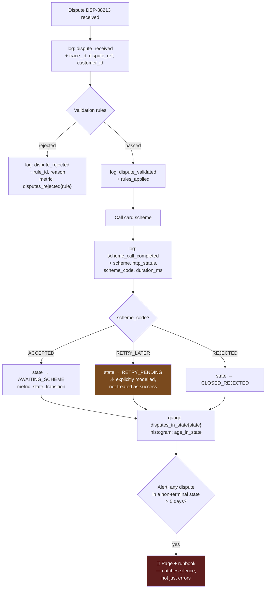

# Instrument for the Question You'll Be Asked at 3am

Observability tooling is a platform concern. The observability *mindset* is a coding habit: while writing a feature, you decide what someone will need to know when it misbehaves — because after it misbehaves, it is too late to decide.

## The Real-World Problem

A bank's card dispute service processes chargeback claims. A customer calls: she raised a dispute eleven days ago, the app says "under review", and nothing has happened.

The engineer on call has the dispute reference. What they need is the story of that one dispute: when it was received, which validation it passed, when it was sent to the card scheme, what the scheme replied, and why it is stuck. What they have is 40GB of daily logs saying things like `"Processing dispute"`, `"Sent to scheme"`, and `"Done"` — no dispute reference, no customer ID, no outcome, no duration.

Four engineers spend a day reconstructing the flow by correlating timestamps across three services. The cause: the scheme returned a `RETRY_LATER` response the code treated as success, so the dispute silently never advanced. It affected 340 disputes, all of which had been sitting in a false "under review" state for weeks — with regulatory response deadlines attached to each one.

The system was thoroughly logged and completely un-queryable. Those are different properties.

## The Concept

### Log events, not sentences

A log line is a structured record with a stable event name and typed fields, not prose. `"Processing dispute"` cannot be counted, filtered, grouped, or alerted on. `{"event":"dispute_submitted_to_scheme","dispute_ref":"DSP-88213","scheme":"visa","outcome":"RETRY_LATER","duration_ms":420}` answers questions you have not thought of yet.

### Every log line carries identity

At minimum: trace ID, tenant/customer ID, and the business entity ID. These are what turn a log store into something you can ask about one dispute. Without them you have text; with them you have data.

### Instrument the boundaries and the decisions

Two categories are worth logging:

- **Boundaries** — every inbound request and every outbound call: target, duration, outcome.
- **Decisions** — every branch where the system chose a path: which rule fired, which status was assigned, why something was rejected. This is the category teams systematically miss, and it is the one that answers "why is this stuck?"

### Name the states you can be stuck in, and measure them

A workflow with states needs a metric per state and an alert on *age within state*. The scenario above was invisible because nothing measured "disputes older than N days in state SUBMITTED". Absence of progress is a symptom that no error-rate alert will ever catch.

### Alert on the absence of expected things

Error-rate alerts catch failures. They do not catch silence: a batch job that stopped running, a queue that stopped draining, a state nothing exits. Alert on "fewer than X events in Y minutes" as well as "more than X errors".

### Redact at the logger, never at the call site

In a system handling PII and card data, redaction must be a property of the logging pipeline. One forgotten field at one call site is a compliance incident, and call sites number in the thousands.

## How It Works



The alert at `M` is the one that would have surfaced 340 stuck disputes on day one instead of day eleven.

## Practical Example

**Before — logged, unqueryable:**

```java
public void process(Dispute dispute) {
    log.info("Processing dispute");
    var result = schemeClient.submit(dispute);
    log.info("Sent to scheme");
    if (result.isOk()) {                       // RETRY_LATER also returns isOk() == true
        dispute.setStatus(UNDER_REVIEW);
    }
    log.info("Done");
}
```

Three log lines, zero identifiers, and a branch that silently swallows a non-terminal outcome.

**After — events, identity, decisions, and states:**

```java
@Service
public class DisputeProcessor {

    private static final Logger log = LoggerFactory.getLogger(DisputeProcessor.class);

    private final SchemeClient schemeClient;
    private final DisputeRepository repo;
    private final MeterRegistry meters;

    @Observed(name = "dispute.process")                  // span + timer, trace_id propagated
    public void process(Dispute dispute) {
        log.atInfo().setMessage("dispute_processing_started")
           .addKeyValue("dispute_ref", dispute.reference())
           .addKeyValue("customer_id", dispute.customerId())
           .addKeyValue("scheme", dispute.scheme().name())
           .addKeyValue("amount_minor", dispute.amount().minorUnits())
           .addKeyValue("days_since_transaction", dispute.daysSinceTransaction())
           .log();

        var started = System.nanoTime();
        var response = schemeClient.submit(dispute);
        var elapsedMs = (System.nanoTime() - started) / 1_000_000;

        // Boundary event: target, outcome, duration — always all three
        log.atInfo().setMessage("scheme_call_completed")
           .addKeyValue("dispute_ref", dispute.reference())
           .addKeyValue("scheme", dispute.scheme().name())
           .addKeyValue("http_status", response.httpStatus())
           .addKeyValue("scheme_code", response.code())          // the field that was missing
           .addKeyValue("duration_ms", elapsedMs)
           .log();

        // Decision event: every branch is named and counted. Exhaustive switch means a new
        // scheme code becomes a compile error, not a silent fall-through.
        var newState = switch (response.code()) {
            case ACCEPTED -> DisputeState.AWAITING_SCHEME;
            case RETRY_LATER -> DisputeState.RETRY_PENDING;      // modelled, not ignored
            case REJECTED -> DisputeState.CLOSED_REJECTED;
            case INVALID_REFERENCE -> DisputeState.CLOSED_ERROR;
        };

        transitionTo(dispute, newState, response.code().name());
    }

    private void transitionTo(Dispute dispute, DisputeState to, String reason) {
        var from = dispute.state();
        dispute.transitionTo(to);
        repo.save(dispute);

        log.atInfo().setMessage("dispute_state_changed")
           .addKeyValue("dispute_ref", dispute.reference())
           .addKeyValue("from_state", from.name())
           .addKeyValue("to_state", to.name())
           .addKeyValue("reason", reason)
           .log();

        meters.counter("dispute.state.transition",
                       "from", from.name(), "to", to.name(), "reason", reason).increment();
    }
}
```

**Measure state occupancy, so "stuck" is observable:**

```java
@Component
class DisputeStateGauges {

    DisputeStateGauges(DisputeRepository repo, MeterRegistry meters) {
        for (var state : DisputeState.values()) {
            Gauge.builder("disputes.in.state", () -> repo.countByState(state))
                 .tag("state", state.name())
                 .description("Disputes currently occupying each workflow state")
                 .register(meters);

            Gauge.builder("disputes.oldest.age.days",
                          () -> repo.oldestAgeInDays(state).orElse(0.0))
                 .tag("state", state.name())
                 .register(meters);
        }
    }
}
```

**The alert that catches silence rather than errors:**

```yaml
groups:
  - name: dispute-workflow
    rules:
      # A dispute stuck in a non-terminal state past the regulatory response window
      - alert: DisputeStuckInNonTerminalState
        expr: max by (state) (disputes_oldest_age_days{state=~"SUBMITTED|RETRY_PENDING|AWAITING_SCHEME"}) > 5
        for: 30m
        labels: { severity: page, owner: team-disputes }
        annotations:
          summary: "Dispute in {{ $labels.state }} for {{ $value }} days (SLA is 8)"
          runbook: "https://wiki.internal/runbooks/dispute-stuck"

      # Absence alert: the batch stopped producing work at all
      - alert: DisputeProcessingStalled
        expr: sum(rate(dispute_state_transition_total[15m])) == 0
        for: 20m
        labels: { severity: page, owner: team-disputes }
        annotations:
          summary: "No dispute state transitions in 15 minutes — pipeline may be stalled"
          runbook: "https://wiki.internal/runbooks/dispute-stalled"
```

**Redaction as pipeline configuration**, not developer discipline:

```xml
<!-- logback-spring.xml -->
<configuration>
  <appender name="JSON" class="ch.qos.logback.core.ConsoleAppender">
    <encoder class="net.logstash.logback.encoder.LogstashEncoder">
      <includeMdcKeyName>trace_id</includeMdcKeyName>
      <includeMdcKeyName>span_id</includeMdcKeyName>
      <!-- Card numbers and emails are masked for every logger, at every call site -->
      <jsonGeneratorDecorator class="net.logstash.logback.mask.MaskingJsonGeneratorDecorator">
        <valueMask>
          <pattern>\b(?:\d[ -]*?){13,19}\b</pattern>
          <mask>[pan-redacted]</mask>
        </valueMask>
        <path>customer_email</path>
        <path>card_number</path>
        <path>$..cvv</path>
      </jsonGeneratorDecorator>
    </encoder>
  </appender>
</configuration>
```

**Answering the customer's question, eleven days earlier**, now a single query:

```
event:"dispute_state_changed" AND dispute_ref:"DSP-88213"
| sort @timestamp asc
| fields @timestamp, from_state, to_state, reason
```

```
2026-07-29T09:14:02Z  NEW              SUBMITTED       VALIDATED
2026-07-29T09:14:03Z  SUBMITTED        RETRY_PENDING   RETRY_LATER   ← stuck here
```

Two lines, four seconds, complete answer.

## Enterprise Trade-offs

| Approach | Pros | Cons | When to use (Banking / Insurance / Enterprise) |
|---|---|---|---|
| **Structured events + entity IDs + state metrics** | Any question answerable after the fact; supports absence alerting | Requires deliberate instrumentation while writing the feature | Default for every stateful business workflow |
| **Traces only** | Excellent for latency and cross-service topology | Sampled, short-retention — poor for "what happened to this record 11 days ago" | Complement to business event logs, not a substitute |
| **Business events to a durable store** (append-only table or topic) | Long retention, replayable, doubles as audit evidence | Storage cost; schema versioning to manage | Regulated workflows with statutory response deadlines: disputes, claims, KYC |
| **Error-rate alerting only** | Simple, low noise | Blind to stalls, silence, and non-terminal states — the scenario above | Never sufficient alone for a workflow system |
| **Debug logging enabled in production** | Maximum detail when you need it | Cost, noise, and a PII exposure surface | Temporary, targeted, time-boxed — never a standing configuration |
| **Unstructured string logs** | Fastest to write | Unqueryable at volume; the day-long reconstruction above | Never |

## Why This Still Matters Through 2030

The instrumentation you write is the one artifact that cannot be added retroactively — you can refactor code, replace a framework, or migrate a database after the fact, but you cannot observe a request that already failed. That asymmetry makes the habit permanent regardless of tooling. Two forces raise the stakes. Regulated workflows increasingly carry statutory clocks — dispute resolution windows, claims acknowledgement deadlines, data-subject request timelines — and a record silently stuck in a non-terminal state is a compliance breach accumulating quietly rather than an error someone will notice. And as systems grow more asynchronous and event-driven, more failures manifest as *nothing happening* rather than as an exception, which the entire error-centric monitoring tradition is structurally unable to detect. Meanwhile OpenTelemetry has stabilised the mechanics enough that the vendor question is largely settled; what remains is the judgment the tooling cannot supply — deciding, while the feature is being written, which fields and which state transitions someone will need at 3am.

→ Next: [08-technical-debt-tracking.md](08-technical-debt-tracking.md) · Related: [../00-project-setup-roadmap/07-observability.md](../00-project-setup-roadmap/07-observability.md) · [03-failure-modes-and-resilience.md](03-failure-modes-and-resilience.md)
