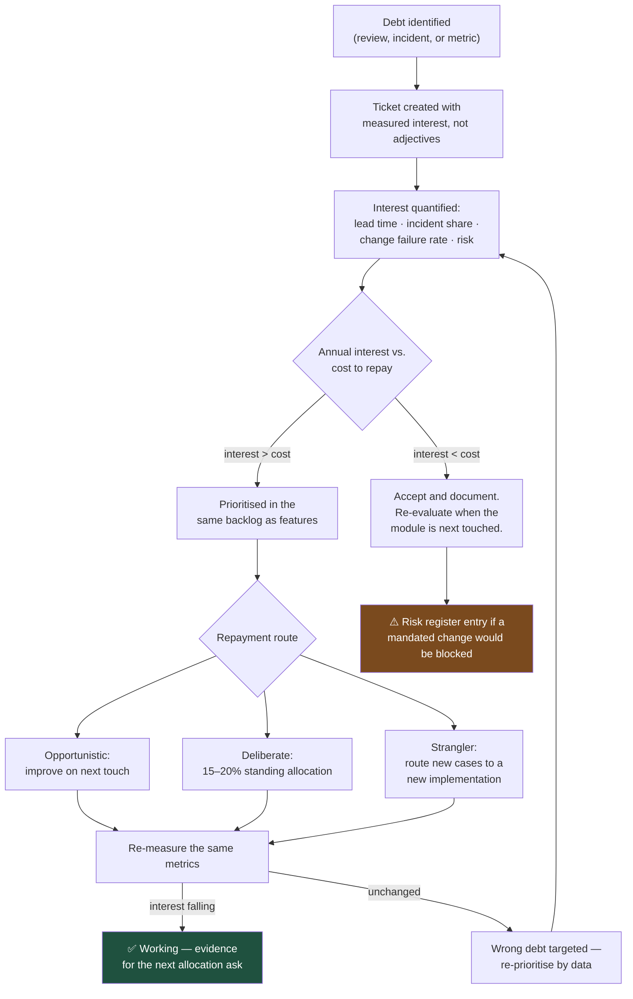

# Technical Debt Is a Number, Not a Feeling

"We need to refactor" loses every prioritisation meeting it enters, and it should — it names no cost, no risk, and no beneficiary. "This module causes 40% of our production incidents and adds three days to every change in it" wins, because it is an argument in the language the decision is actually made in.

## The Real-World Problem

An insurer's premium rating module is nine years old. Everyone knows it is bad. Every quarterly planning session, engineering asks for time to address it, and every session it loses to features with named clients attached.

Nobody has ever quantified it, so the discussion is engineering taste versus business revenue — an argument engineering cannot win. Meanwhile the module has no test coverage, so every change is verified manually; it takes an average of eleven days to deliver a rating change that should take two; and two of the last four production incidents originated there.

The reckoning arrives as a regulatory change to how a specific risk factor must be applied, with a nine-week statutory deadline. In a healthy module this is a two-week change. In this one it takes fourteen weeks. The insurer misses the deadline, self-reports, and accepts a supervisory finding.

The cost was always there — roughly nine engineer-days lost per rating change, over nine years. It was simply never written down anywhere a business decision could see it.

## The Concept

### Debt is deliberate; mess is not

Real technical debt is a conscious trade: *we ship the simpler version now and accept a known cost later.* That is often the right call — hitting a market window or a regulatory date can be worth more than the interest. What makes it debt rather than mess is that the decision was recorded, with its cost and its trigger for repayment.

Code nobody chose, produced by drift and haste, is not debt. It is unmanaged risk, and it has no repayment plan because no one ever took out the loan.

### The four quadrants

| | Deliberate | Inadvertent |
|---|---|---|
| **Prudent** | "Ship now, pay later — recorded, with a trigger" | "Now we understand the domain better" |
| **Reckless** | "No time for tests" (repeatedly) | "What's a transaction boundary?" |

Only the prudent-deliberate quadrant is legitimate financing. The others are symptoms — of schedule pressure, or of a capability gap.

### Quantify the interest, in business units

The argument becomes winnable the moment you can state:

- **Delivery drag** — average lead time for a change in this module versus elsewhere.
- **Incident share** — percentage of production incidents originating here.
- **Change failure rate** — percentage of changes here requiring a follow-up fix.
- **Risk exposure** — what happens if a mandated change lands with a fixed deadline.

These are measurable from data you already have: Jira cycle times, incident postmortems, git history, deployment records.

### Track it where work is tracked

Debt in a wiki page is invisible. Debt as tickets in the same backlog as features, with the same estimation and the same visibility, competes on equal terms. Every `TODO` in code carries a ticket ID or it does not merge.

### Repay opportunistically and deliberately

Two complementary strategies. **Opportunistic**: whenever you touch a file, leave it better — add the missing test, extract the confusing method. **Deliberate**: a standing allocation (commonly 15–20% of capacity) for debt items chosen by measured interest, not by irritation.

The one strategy that reliably fails is the "refactoring sprint" scheduled for after the next release, because there is always a next release.

## How It Works



## Practical Example

**The argument that loses:**

> The rating module is a mess. We need to refactor it. Can we have a sprint?

**The argument that wins**, made from data already in the tooling:

```markdown
# TECH-441: Rating module — add test harness and extract factor calculation

## Measured interest (last 12 months, from Jira + incident records + git)

| Metric | Rating module | Rest of codebase | Delta |
|---|---|---|---|
| Median lead time for a change | 11.2 days | 2.4 days | **+8.8 days** |
| Changes requiring a follow-up fix | 38% | 9% | **4.2×** |
| Share of P1/P2 incidents | 2 of 4 (50%) | — | — |
| Files changed per rating change (median) | 17 | 4 | **4.3×** |
| Automated test coverage | 4% | 71% | — |

## Annualised cost
14 rating changes/year × 8.8 days = **~123 engineer-days/year** of drag.
Plus 2 incidents/year, averaging 6 engineer-days of response each = **~12 days**.
**Total: ~135 engineer-days/year.**

## Cost to repay
Phase 1 (characterisation tests + extract factor calculation): **20 engineer-days.**
Expected reduction in drag: ~60%, i.e. ~80 days/year recovered.
Payback period: **under 3 months.**

## Risk if not repaid
Regulatory rating changes carry statutory deadlines (typically 8–12 weeks). At the
current 11-day-per-change baseline with a 38% rework rate, a mandated multi-factor
change is not deliverable inside a 9-week window. This is a delivery risk with a
supervisory consequence, not a code-quality preference.

## Trigger
Next scheduled rating change (Q4), or any regulatory notification — whichever is first.
```

That document is three tables and no adjectives, and it is the version a business stakeholder can act on.

**Make debt visible in the code, linked to the backlog:**

```java
/**
 * Legacy premium factor resolution.
 *
 * <p>TECH-441: this method resolves factors by string key against a mutable map
 * populated at startup from three sources with unspecified precedence. Any change
 * to factor logic requires manual regression testing because the map's contents
 * are not deterministic across environments.
 *
 * <p>Interest: ~8.8 additional days per rating change (see TECH-441 for measurement).
 * Do not extend this method. New factors go through {@link FactorCalculator}.
 */
@Deprecated(since = "2026.3", forRemoval = true)
BigDecimal resolveFactorLegacy(String factorKey, Map<String, Object> attributes) { … }
```

**Enforce that every `TODO` is tracked** — an untracked `TODO` is invisible debt:

```yaml
# .github/workflows/debt-hygiene.yml
- name: Every TODO must reference a ticket
  run: |
    UNTRACKED=$(git diff origin/${{ github.base_ref }}...HEAD -U0 \
      | grep '^+' \
      | grep -iE '(TODO|FIXME|HACK)' \
      | grep -viE '(TECH|POL|CLAIM)-[0-9]+' || true)
    if [ -n "$UNTRACKED" ]; then
      echo "::error::TODO/FIXME without a ticket reference:"
      echo "$UNTRACKED"
      exit 1
    fi
```

**Track the metrics that make the case, automatically:**

```sql
-- Delivery drag by module, derived from ticket + git data already collected.
-- Run monthly; this is the evidence for the next capacity conversation.
WITH module_changes AS (
    SELECT t.ticket_key,
           t.resolved_at - t.started_at AS lead_time,
           CASE WHEN c.file_path LIKE 'src/main/java/com/insurer/rating/%'
                THEN 'rating' ELSE 'other' END AS module,
           EXISTS (SELECT 1 FROM ticket f
                    WHERE f.parent_key = t.ticket_key AND f.type = 'BUG'
                      AND f.created_at < t.resolved_at + INTERVAL '30 days') AS needed_rework
      FROM ticket t
      JOIN commit_file c ON c.ticket_key = t.ticket_key
     WHERE t.resolved_at > now() - INTERVAL '12 months'
)
SELECT module,
       COUNT(DISTINCT ticket_key)                                    AS changes,
       ROUND(PERCENTILE_CONT(0.5) WITHIN GROUP (ORDER BY EXTRACT(EPOCH FROM lead_time)/86400)::numeric, 1)
                                                                     AS median_lead_days,
       ROUND(100.0 * AVG(CASE WHEN needed_rework THEN 1 ELSE 0 END), 1) AS rework_pct
  FROM module_changes
 GROUP BY module;
```

**Repay safely: characterisation tests first.** You cannot refactor untested legacy code — you must first pin its current behaviour, including behaviour that is arguably wrong:

```java
/**
 * Characterisation tests for the legacy rating path (TECH-441 phase 1).
 *
 * These assert what the system CURRENTLY does, from 5,000 production rating requests
 * and their actual outputs. They are not a specification — some of this behaviour is
 * probably wrong. Their job is to make refactoring safe by detecting any change at all.
 */
@ParameterizedTest
@CsvFileSource(resources = "/fixtures/production-rating-samples.csv", numLinesToSkip = 1)
void legacyRating_reproducesProductionOutput_exactly(
        String requestJson, String expectedPremiumMinor) {

    var request = json.readValue(requestJson, RatingRequest.class);
    var premium = legacyRatingEngine.rate(request);

    assertThat(premium.minorUnits())
        .as("legacy behaviour must be preserved bit-for-bit during extraction")
        .isEqualTo(Long.parseLong(expectedPremiumMinor));
}
```

With 5,000 pinned cases green, the extraction becomes a mechanical, verifiable operation rather than an act of faith.

**Then strangle rather than rewrite** — new factors go to the new implementation, existing ones migrate one at a time behind a flag:

```java
@Service
public class FactorResolver {

    BigDecimal resolve(FactorKey key, RatingContext context) {
        // Migrated factors use the new calculator; the rest still use the legacy path.
        // Each migration is one flag flip, independently reversible, with the
        // characterisation suite as the safety net.
        return flags.isEnabled("RATING_NEW_ENGINE_" + key.name())
            ? factorCalculator.calculate(key, context)
            : legacy.resolveFactorLegacy(key.legacyKey(), context.asLegacyMap());
    }
}
```

## Enterprise Trade-offs

| Approach | Pros | Cons | When to use (Banking / Insurance / Enterprise) |
|---|---|---|---|
| **Quantified debt tickets in the product backlog** | Competes with features on measured cost; survives leadership change | Requires measurement plumbing (cycle time, incident attribution) | Default. This is what makes the conversation winnable |
| **Standing 15–20% capacity allocation** | Continuous repayment; no negotiation per item | Gets cut first under deadline pressure unless protected by agreement | Effective where engineering leadership can hold the line; pair with measured evidence |
| **Opportunistic improvement on every touch** | Zero scheduling overhead; compounds; targets the code actually being read | Cannot address large structural debt | Always on, in addition to anything else |
| **Strangler pattern + characterisation tests** | Incremental, reversible, safe under regulatory pressure | Two implementations coexist for a period; flag inventory to manage | The right approach for high-risk legacy modules — rating, ledger, policy admin |
| **Big-bang rewrite** | Clean result if it lands | Historically poor success rate; the old system keeps changing underneath you | Only when the platform itself is end-of-life and vendor-unsupported |
| **Dedicated "refactoring sprint" later** | Easy to promise | Reliably deferred; there is always a next release | Avoid — it is a way of declining without saying no |
| **Untracked, unmeasured** | — | Nine years of invisible interest; the missed deadline above | Never |

→ Domain complete. Next: [../02-design-patterns/01-creational-patterns.md](../02-design-patterns/01-creational-patterns.md) · Related: [../11-stakeholder-communication/04-technical-to-business-translation-table.md](../11-stakeholder-communication/04-technical-to-business-translation-table.md) · [02-yagni-kiss-dry.md](02-yagni-kiss-dry.md)
