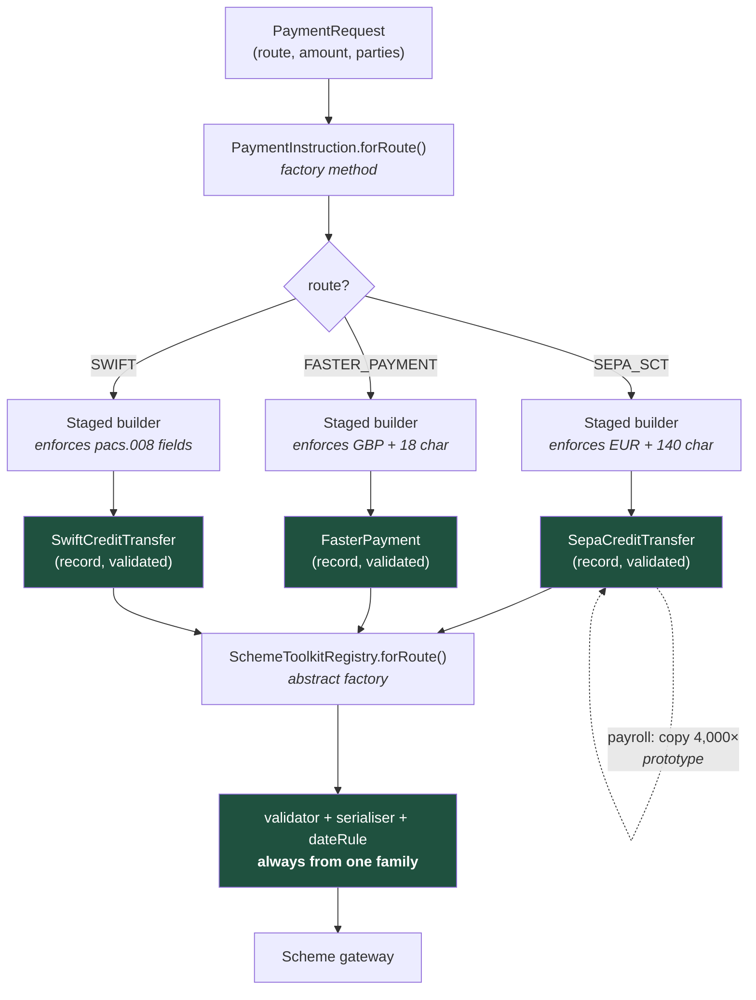

# Constructing the Right Object: Creational Patterns When One Payment Has Five Formats

Creational patterns exist for one reason: to stop the knowledge of *how to build a thing* from leaking into the code that merely *uses* the thing. In a payments platform that knowledge is scheme rules, mandatory fields and validation order — and it leaks fast.

## The Real-World Problem

A retail bank's payments platform routes outbound credit transfers over four schemes: SEPA SCT for euro, SEPA Instant for euro under €100k, Faster Payments for domestic GBP, and SWIFT `pacs.008` for everything else. Each scheme has a different mandatory field set, a different reference-length limit, a different date convention, and a different way of expressing the debtor agent.

The original implementation had a single `PaymentInstruction` class with 34 nullable fields and one 600-line `PaymentBuilderService` containing a chain of `if (scheme == ...)` blocks. Every scheme rule change touched that one file. Field validity was documented in a Confluence page, not in the type system, so a `remittanceInformation` of 180 characters — legal in SWIFT, illegal at 140 in SEPA — passed unit tests and reached the scheme gateway.

The result: 3,100 euro payments rejected by the clearing house over one afternoon with `FF01 — invalid file format`. Operations re-keyed them by hand over two days, the bank breached its own T+0 execution commitment, and the incident became a finding in the next internal audit because there was no automated control preventing an invalid instruction from being constructed at all.

The fix was not more validation at the edge. It was making the invalid instruction impossible to build.

## The Concept

Five patterns, each answering a different construction question.

| Pattern | The question it answers | Modern Java/TS idiom |
|---|---|---|
| **Factory Method** | Which subtype do I create for this input? | `static` factory on a sealed interface; `Map<Key, Function<..>>` |
| **Abstract Factory** | How do I create a *consistent family* of objects? | Interface per family, one implementation per scheme |
| **Builder** | How do I construct something with many optional parts, validly? | Staged builder, or `record` + `with*` copy methods |
| **Singleton** | How do I guarantee exactly one instance? | Enum constant, or a DI container singleton scope |
| **Prototype** | How do I copy an existing configured object? | `record` copy constructor / `structuredClone` |

### The rule that makes creational patterns worth it

A creational pattern earns its keep when construction has **rules** — not merely many arguments. Six parameters is not a reason for a builder; six parameters where three combinations are illegal is.

### Factory Method vs Abstract Factory in one line

Factory Method produces **one** object whose type varies. Abstract Factory produces **several related** objects that must all come from the same variant — a SEPA validator paired with a SEPA serialiser paired with SEPA date rules. Mixing families is the bug it prevents.

---

## Factory Method

**Problem it solves:** the caller knows *what* it wants (an instruction for scheme X) but must not know *which* concrete class implements it, or how to pick.

```java
public sealed interface PaymentInstruction
        permits SepaCreditTransfer, SepaInstantTransfer, FasterPayment, SwiftCreditTransfer {

    Money amount();
    Iban creditorAccount();

    /** The factory method: routing knowledge lives here, not in 40 call sites. */
    static PaymentInstruction forRoute(PaymentRequest request) {
        return switch (request.route()) {
            case SEPA_SCT      -> SepaCreditTransfer.of(request);
            case SEPA_INSTANT  -> SepaInstantTransfer.of(request);
            case FASTER_PAYMENT-> FasterPayment.of(request);
            case SWIFT         -> SwiftCreditTransfer.of(request);
        };
    }
}
```

Because the interface is `sealed`, the `switch` is exhaustive: adding a fifth scheme is a **compile error** in every place that must change. That is the property the 600-line `if` chain never had.

**When NOT to use it:** when there is exactly one implementation and no realistic second one. `OrderFactory.createOrder()` returning `new Order()` is ceremony. Also skip it when the caller genuinely must name the concrete type — a test constructing a specific `SwiftCreditTransfer` should just construct it.

---

## Abstract Factory

**Problem it solves:** several collaborating objects must all belong to the same scheme variant, and a mismatch is a silent data-corruption bug.

```java
public interface SchemeToolkit {
    InstructionValidator validator();
    InstructionSerialiser serialiser();          // ISO 20022 XML, or FPS JSON
    SettlementDateRule   settlementDateRule();
}

final class SepaToolkit implements SchemeToolkit {
    @Override public InstructionValidator validator()  { return new SepaValidator(140); }
    @Override public InstructionSerialiser serialiser(){ return new Pacs008Serialiser("SEPA.SCT.02"); }
    @Override public SettlementDateRule settlementDateRule() { return new TargetCalendarRule(); }
}

final class FasterPaymentsToolkit implements SchemeToolkit {
    @Override public InstructionValidator validator()  { return new FpsValidator(18); }
    @Override public InstructionSerialiser serialiser(){ return new FpsJsonSerialiser(); }
    @Override public SettlementDateRule settlementDateRule() { return new ImmediateSettlementRule(); }
}
```

Resolution is a lookup, registered once — in Spring, a `Map<Route, SchemeToolkit>` injected by bean name:

```java
@Service
public class SchemeToolkitRegistry {
    private final Map<Route, SchemeToolkit> byRoute;

    SchemeToolkitRegistry(List<RoutedToolkit> toolkits) {
        this.byRoute = toolkits.stream()
            .collect(toUnmodifiableMap(RoutedToolkit::route, RoutedToolkit::toolkit));
    }

    public SchemeToolkit forRoute(Route route) {
        return Optional.ofNullable(byRoute.get(route))
            .orElseThrow(() -> new UnsupportedRouteException(route));
    }
}
```

**When NOT to use it:** when the "family" has one member. If only the serialiser varies by scheme, you want a strategy, not a factory of factories. Abstract Factory is the most over-applied GoF pattern — it costs two extra layers of indirection and only pays when *three or more* objects must vary together.

---

## Builder

**Problem it solves:** an object with many optional fields where certain combinations are invalid, and you want the compiler — not a runtime check — to enforce order and completeness.

The wrong version, which is what the bank had:

```java
// 34 nullable fields, no invariants, "valid" is a Confluence page
var instruction = new PaymentInstruction();
instruction.setAmount(amount);
instruction.setRemittanceInformation(ref);   // 180 chars — rejected by the clearing house
// forgot setDebtorAgent(); nothing complains until the gateway does
```

The right version — a **staged builder**, where each stage returns only the interface exposing the next legal call:

```java
public record SepaCreditTransfer(
        Money amount, Iban debtorAccount, Bic debtorAgent,
        Iban creditorAccount, String creditorName,
        String remittanceInformation, LocalDate requestedExecutionDate)
        implements PaymentInstruction {

    private static final int SEPA_REMITTANCE_MAX = 140;

    public SepaCreditTransfer {
        requireNonNull(amount, "amount");
        if (!"EUR".equals(amount.currency())) throw new IllegalArgumentException("SEPA SCT is EUR-only");
        if (remittanceInformation != null && remittanceInformation.length() > SEPA_REMITTANCE_MAX)
            throw new IllegalArgumentException("remittanceInformation exceeds " + SEPA_REMITTANCE_MAX);
    }

    public static AmountStage builder() { return new Builder(); }

    public interface AmountStage    { DebtorStage    amount(Money amount); }
    public interface DebtorStage    { CreditorStage  debtor(Iban account, Bic agent); }
    public interface CreditorStage  { OptionalStage  creditor(Iban account, String name); }
    public interface OptionalStage  {
        OptionalStage remittanceInformation(String info);
        OptionalStage requestedExecutionDate(LocalDate date);
        SepaCreditTransfer build();
    }

    private static final class Builder
            implements AmountStage, DebtorStage, CreditorStage, OptionalStage {
        private Money amount; private Iban debtorAccount; private Bic debtorAgent;
        private Iban creditorAccount; private String creditorName;
        private String remittance; private LocalDate execDate = LocalDate.now();

        public DebtorStage amount(Money a)               { this.amount = a; return this; }
        public CreditorStage debtor(Iban acc, Bic agent) { this.debtorAccount = acc; this.debtorAgent = agent; return this; }
        public OptionalStage creditor(Iban acc, String n){ this.creditorAccount = acc; this.creditorName = n; return this; }
        public OptionalStage remittanceInformation(String i) { this.remittance = i; return this; }
        public OptionalStage requestedExecutionDate(LocalDate d) { this.execDate = d; return this; }

        public SepaCreditTransfer build() {
            return new SepaCreditTransfer(amount, debtorAccount, debtorAgent,
                    creditorAccount, creditorName, remittance, execDate);
        }
    }
}
```

Now the mandatory fields cannot be skipped — `build()` is not even visible until `creditor(...)` has been called — and the record's compact constructor enforces the scheme invariants on every path, including deserialisation and tests.

```java
var sct = SepaCreditTransfer.builder()
    .amount(Money.eur("1250.00"))
    .debtor(Iban.of("DE89370400440532013000"), Bic.of("COBADEFFXXX"))
    .creditor(Iban.of("FR7630006000011234567890189"), "ACME SARL")
    .remittanceInformation("INV-2026-0041")
    .build();
```

A test that proves the control exists, rather than trusting it:

```java
@Test
void remittanceInformationOver140Chars_isRejectedAtConstruction() {
    var tooLong = "X".repeat(141);

    assertThatThrownBy(() -> SepaCreditTransfer.builder()
            .amount(Money.eur("10.00"))
            .debtor(Iban.of("DE89370400440532013000"), Bic.of("COBADEFFXXX"))
            .creditor(Iban.of("FR7630006000011234567890189"), "ACME SARL")
            .remittanceInformation(tooLong)
            .build())
        .isInstanceOf(IllegalArgumentException.class)
        .hasMessageContaining("exceeds 140");
}
```

**When NOT to use it:** for records with three or four required fields — the canonical constructor is clearer and shorter. In TypeScript, a builder is almost always the wrong answer; an object literal typed against a discriminated union gives you the same compile-time guarantees with none of the machinery:

```ts
type Instruction =
  | { scheme: 'SEPA_SCT'; amount: EurAmount; remittance?: string & { length: 140 } }
  | { scheme: 'FASTER_PAYMENT'; amount: GbpAmount; reference?: string }

// A GBP amount on a SEPA instruction fails to compile. No builder required.
```

---

## Singleton

**Problem it solves:** exactly one instance must exist, because it owns a shared resource or a piece of global state.

In enterprise Java, **do not hand-roll this.** Your DI container already has singleton scope, and container-managed singletons are injectable and therefore testable. When you truly need a language-level guarantee, use an enum — it is serialisation-safe and reflection-safe for free:

```java
public enum SchemeClock {
    INSTANCE;
    private final Clock clock = Clock.system(ZoneId.of("Europe/Brussels"));   // TARGET2 timezone
    public LocalDate today() { return LocalDate.now(clock); }
}
```

**When NOT to use it:** almost always, and this is the single most abused pattern in enterprise codebases. A singleton holding mutable state is global mutable state with a design-pattern name on it: it defeats parallel test execution, hides dependencies from constructor signatures, and becomes a lock-contention hotspot. Every `XyzManager.getInstance()` in a payments codebase is a place where two tests cannot run concurrently. Inject a container-scoped bean instead — same instance count, none of the coupling.

---

## Prototype

**Problem it solves:** creating a new object by copying a fully configured existing one is cheaper or safer than re-deriving its configuration.

Records make this a one-liner, no `Cloneable` and no `clone()`:

```java
/** Bulk payroll run: 4,000 instructions sharing debtor, agent and execution date. */
public List<SepaCreditTransfer> payrollRun(SepaCreditTransfer template, List<Employee> employees) {
    return employees.stream()
        .map(e -> new SepaCreditTransfer(
                e.netPay(), template.debtorAccount(), template.debtorAgent(),
                e.iban(), e.legalName(),
                "SALARY " + template.requestedExecutionDate().format(ISO_LOCAL_DATE),
                template.requestedExecutionDate()))
        .toList();
}
```

**When NOT to use it:** when the object graph is mutable and deeply nested — you inherit the shallow-versus-deep copy problem, and a shared mutable sub-object copied by reference into 4,000 payment instructions is a defect that only shows under concurrency. Java's `Cloneable`/`clone()` is broken by design; never use it in new code. If the object is immutable, "prototype" is just a copy constructor and needs no pattern name.

## How It Works



The load-bearing detail is that no arrow reaches the gateway without passing through a validated record and a single-family toolkit — an invalid instruction has no path through this graph, which is exactly the control the audit finding demanded.

## Enterprise Trade-offs

| Approach | Pros | Cons | When to use (Banking / Insurance / Enterprise) |
|---|---|---|---|
| **Sealed interface + static factory method** | Exhaustive `switch`; new variant is a compile error, not a runtime gap | Requires Java 17+; all variants in one module | Default for scheme-, product- or jurisdiction-variant domain types |
| **Abstract factory (family per variant)** | Guarantees consistent validator/serialiser/rules pairing | Two extra layers; overkill for one varying object | Three or more collaborators must vary together — payment schemes, regulatory reporting per jurisdiction |
| **Staged builder** | Compiler enforces mandatory fields and order; invariants centralised | Verbose; ~60 lines per type | Objects with >8 fields and real illegal combinations: payment instructions, insurance quotes, KYC profiles |
| **Record canonical constructor only** | Shortest correct thing; validation in the compact constructor | Awkward past ~8 fields or many optionals | Most domain objects. Start here; escalate to a builder only when it hurts |
| **Container-scoped singleton (DI)** | One instance, still injectable and mockable | Needs a container | Any shared collaborator: registries, clients, caches |
| **Hand-rolled `getInstance()` with mutable state** | — | Hidden dependency, untestable, breaks parallel tests, lock hotspot | Never |

## Why This Still Matters Through 2030

Creational patterns are being quietly absorbed into languages rather than retired. Records, sealed hierarchies and exhaustive pattern matching in Java, and discriminated unions in TypeScript, already replace what Factory Method and Builder were invented to work around — which means the durable skill is not reciting GoF but knowing which construction rule you are trying to make unrepresentable. That skill is getting more valuable in regulated domains, not less: ISO 20022 migration has made scheme variants a permanent feature of payments, and supervisors increasingly ask to see the *automated control* that prevents a non-compliant instruction from existing, not the test that catches it later. AI-assisted development sharpens the point in both directions — a model will happily generate a 34-field mutable class with setters because that shape dominates its training data, so a reviewer who cannot tell a staged builder from ceremony will merge the shape that caused the outage. Meanwhile the same tooling makes the verbose-but-safe version nearly free to write. Construction is where invariants are established or lost; through 2030 the teams that put their rules in constructors will keep spending less time in incident reviews than the teams that put them in Confluence.

→ Next: [02-structural-patterns.md](02-structural-patterns.md) · Related: [../01-core-concepts/01-solid-and-separation-of-concerns.md](../01-core-concepts/01-solid-and-separation-of-concerns.md) · [04-when-not-to-use-a-pattern.md](04-when-not-to-use-a-pattern.md)
