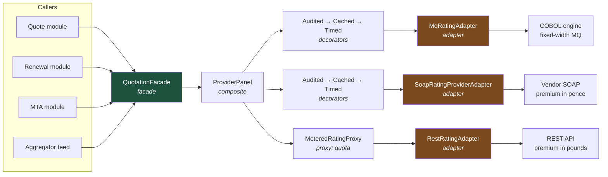

# Three Legacy Raters, One Interface: Structural Patterns as Legacy Containment

Structural patterns are how you stop other people's design decisions from becoming yours. In enterprise systems that usually means a SOAP service from 2009, a mainframe screen-scrape, and a vendor SDK you cannot change — all needing to look like one clean port.

## The Real-World Problem

A mid-size motor insurer rates policies through three providers, acquired over fifteen years. Provider A is an in-house COBOL rating engine reached over a fixed-width MQ message. Provider B is a vendor SOAP service that returns premium in **pence** and expresses vehicle age as a year of manufacture. Provider C is a modern REST API that returns premium in **pounds** as a decimal string, plus a `riskFactors` array nobody else has.

For years the quote service called all three directly. Twenty-six call sites in the quote, renewal, mid-term-adjustment and aggregator-feed modules each did their own unit conversion, their own timeout handling, and their own null checks. Provider B's occasional habit of returning `HTTP 200` with a SOAP fault body was handled in nine places and missed in four.

Then Provider C changed a field name in a minor release. The insurer shipped a fix to eleven files across three sprints. During that window a mid-term adjustment path silently read premium in pence as pounds and issued 812 endorsements at roughly 1/100th of the correct premium. Recovering it meant writing to customers, an FCA-reportable conduct issue, and a £340k premium shortfall the insurer largely could not claw back.

The technical root cause was not the field rename. It was that three providers' quirks had been allowed to exist in twenty-six places instead of three.

## The Concept

Structural patterns compose objects so that the shape a caller sees is decoupled from the shape a supplier offers.

| Pattern | The question it answers | The one-line test |
|---|---|---|
| **Adapter** | How do I make an incompatible interface fit mine? | Translation, no new behaviour |
| **Decorator** | How do I add behaviour without changing the type? | Same interface in, same interface out, more happens |
| **Facade** | How do I hide a subsystem's complexity behind one entry point? | Fewer calls for the caller, no new capability |
| **Proxy** | How do I control *access* to an object? | Same interface, intercepts the call |
| **Composite** | How do I treat one thing and many things identically? | Leaf and container share an interface |

### Adapter vs Facade — the distinction people get wrong

An **adapter** exists because the interface is *wrong* — you have a target interface and something that does not match it. A **facade** exists because the subsystem is *complicated* — the interface is fine, there is just too much of it. If you invented the target interface, you are writing an adapter. If you invented a simpler entry point over things that already agreed with each other, you are writing a facade.

### Decorator vs Proxy — also confused

Both wrap an object of the same interface. A **decorator** adds behaviour the caller wants (caching, metrics, retry). A **proxy** controls whether and how the call reaches the real object at all (authorisation, lazy loading, remoting). Structurally identical; the intent differs, and intent is what the next engineer reads.

### The anti-corruption layer

In practice these patterns combine into one idea from Domain-Driven Design: an **anti-corruption layer**. One port defined by your domain, one adapter per external system, and nothing external leaking past that boundary — not their DTOs, not their units, not their error semantics. This is the same boundary that [hexagonal architecture](../03-architecture/02-hexagonal-architecture.md) formalises.

---

## Adapter

**Problem it solves:** an external system's interface, units and error model do not match your domain's, and you refuse to let 26 call sites learn its quirks.

The port your domain owns — note it speaks in domain types, not provider types:

```java
public interface RatingProvider {
    ProviderId id();
    RatingQuote rate(RiskProfile risk);            // throws RatingUnavailableException
}

public record RatingQuote(ProviderId provider, Money annualPremium,
                          Set<RiskFactor> factors, Instant ratedAt) {}
```

The adapter for Provider B, where every quirk is contained:

```java
@Component
class SoapRatingProviderAdapter implements RatingProvider {

    private final LegacyRatingPort soap;                    // generated from the 2009 WSDL
    private final Clock clock;

    @Override public ProviderId id() { return ProviderId.PROVIDER_B; }

    @Override
    public RatingQuote rate(RiskProfile risk) {
        var request = new LegacyRateRequest();
        request.setYearOfManufacture(                        // quirk 1: year, not age
                LocalDate.now(clock).getYear() - risk.vehicleAgeYears());
        request.setPostcodeOutward(risk.postcode().outward());
        request.setDriverAgeBanded(band(risk.mainDriverAge())); // quirk 2: bands, not ages

        LegacyRateResponse response;
        try {
            response = soap.rate(request);
        } catch (WebServiceException e) {
            throw new RatingUnavailableException(id(), e);   // quirk 4: one error type out
        }

        // quirk 3: HTTP 200 with a fault body. Handled here, once, for all callers.
        if (response.getFaultCode() != null) {
            throw new RatingUnavailableException(id(), response.getFaultCode());
        }

        return new RatingQuote(
                id(),
                Money.gbp(BigDecimal.valueOf(response.getPremiumPence(), 2)), // pence → pounds, once
                Set.of(),                                    // Provider B has no risk factors
                clock.instant());
    }
}
```

Provider C's rename now touches exactly one file. The unit bug becomes structurally impossible, because `Money` cannot be constructed without stating its scale.

**When NOT to use it:** when you control both sides. Adapting your own service to your own consumer means one of the two interfaces is simply wrong — fix it instead of papering over it. Also avoid the *pass-through* adapter that copies field-for-field with no translation, no error mapping and no unit handling: that is a file whose only function is to be edited twice.

---

## Decorator

**Problem it solves:** cross-cutting behaviour — caching, timing, retry, audit — must apply to every provider without being written into every provider.

```java
/** Adds a rating audit trail. Same interface in, same interface out. */
class AuditedRatingProvider implements RatingProvider {

    private final RatingProvider delegate;
    private final RatingAuditStore audit;

    AuditedRatingProvider(RatingProvider delegate, RatingAuditStore audit) {
        this.delegate = delegate; this.audit = audit;
    }

    @Override public ProviderId id() { return delegate.id(); }

    @Override
    public RatingQuote rate(RiskProfile risk) {
        var started = Instant.now();
        try {
            var quote = delegate.rate(risk);
            audit.record(new RatingAttempt(delegate.id(), risk.hashForAudit(),
                    quote.annualPremium(), started, Outcome.QUOTED));
            return quote;
        } catch (RatingUnavailableException e) {
            audit.record(new RatingAttempt(delegate.id(), risk.hashForAudit(),
                    null, started, Outcome.UNAVAILABLE));
            throw e;
        }
    }
}
```

Composition is explicit and ordered, which matters — you want the timeout inside the audit, not outside it:

```java
RatingProvider providerB =
    new AuditedRatingProvider(
        new CachedRatingProvider(Duration.ofMinutes(15),
            new TimedRatingProvider(meterRegistry,
                new SoapRatingProviderAdapter(soapPort, clock))),
        auditStore);
```

In TypeScript the same pattern is a higher-order function, and reads better for it:

```ts
type RatingProvider = (risk: RiskProfile) => Promise<RatingQuote>

const withTimeout = (ms: number, next: RatingProvider): RatingProvider =>
  async (risk) => {
    const ac = new AbortController()
    const timer = setTimeout(() => ac.abort(), ms)
    try { return await next({ ...risk, signal: ac.signal }) } finally { clearTimeout(timer) }
  }

const withAudit = (store: AuditStore, next: RatingProvider): RatingProvider =>
  async (risk) => {
    const started = Date.now()
    try { const q = await next(risk); await store.record(q, started); return q }
    catch (e) { await store.recordFailure(risk, started); throw e }
  }

export const providerB = withAudit(auditStore, withTimeout(2_000, rawProviderB))
```

**When NOT to use it:** when your framework already does it declaratively. Hand-writing a caching decorator when `@Cacheable` exists, or a metrics decorator when Micrometer's `@Timed` and an OpenTelemetry agent cover it, is duplicated infrastructure. And beware depth: a five-deep decorator stack produces stack traces nobody can read and an ordering dependency nobody documented. Three is a practical ceiling.

---

## Facade

**Problem it solves:** the caller needs one answer — "what should we quote?" — and should not orchestrate three providers, a fan-out, a timeout budget and a selection rule.

```java
@Service
public class QuotationFacade {

    private final List<RatingProvider> providers;
    private final QuoteSelectionPolicy policy;
    private final Executor ratingPool;                       // bulkhead: rating cannot starve the API

    /** One call for the caller. Partial provider failure degrades, it does not fail. */
    public Quotation quote(RiskProfile risk) {
        var futures = providers.stream()
            .map(p -> CompletableFuture
                    .supplyAsync(() -> p.rate(risk), ratingPool)
                    .completeOnTimeout(null, 2, TimeUnit.SECONDS)
                    .exceptionally(e -> null))               // one dead provider ≠ no quote
            .toList();

        var quotes = futures.stream().map(CompletableFuture::join)
                .filter(Objects::nonNull).toList();

        if (quotes.isEmpty()) throw new NoQuoteAvailableException(risk.reference());
        return policy.select(quotes, risk);
    }
}
```

The quote, renewal, MTA and aggregator modules now share one entry point and one degradation policy — see [failure modes and resilience](../01-core-concepts/03-failure-modes-and-resilience.md) for why `completeOnTimeout` is doing the heavy lifting here.

**When NOT to use it:** when it becomes a god object. A facade that grows to 40 public methods covering every use case in the domain has stopped simplifying anything and has become the monolithic service class the pattern was meant to avoid. Split by use case. Also skip a facade over a subsystem with two methods — you have added a file and removed nothing.

---

## Proxy

**Problem it solves:** you need to intervene *before* the real call happens — enforce entitlement, defer an expensive load, or meter a paid API — without the caller knowing.

Provider C bills per rating call. Aggregator traffic must be rate-limited; direct customer traffic must not.

```java
class MeteredRatingProxy implements RatingProvider {

    private final RatingProvider real;
    private final RateLimiter limiter;                       // Resilience4j
    private final Channel channel;

    @Override public ProviderId id() { return real.id(); }

    @Override
    public RatingQuote rate(RiskProfile risk) {
        if (channel == Channel.AGGREGATOR && !limiter.acquirePermission()) {
            throw new RatingUnavailableException(id(), "aggregator quota exhausted");
        }
        return real.rate(risk);                              // access controlled, then delegated
    }
}
```

**When NOT to use it:** for authorisation. A security proxy buried in the object graph is a control that is easy to bypass by constructing the real object directly — enforce authorisation at an explicit, testable boundary instead (see [security by default](../01-core-concepts/05-security-by-default.md)). Also avoid the lazy-loading proxy in ORMs as a design choice: JPA's lazy proxies are the origin of most `LazyInitializationException` and N+1 incidents in enterprise Java. Fetch explicitly.

---

## Composite

**Problem it solves:** a client must treat a single item and a tree of items identically — here, one rater and a *panel* of raters.

```java
/** A panel of providers that is itself a provider. Nesting is free. */
public record ProviderPanel(ProviderId id, List<RatingProvider> members,
                            QuoteSelectionPolicy policy) implements RatingProvider {

    @Override
    public RatingQuote rate(RiskProfile risk) {
        var quotes = members.stream()
            .map(m -> attempt(m, risk)).flatMap(Optional::stream).toList();
        if (quotes.isEmpty()) throw new RatingUnavailableException(id, "no member quoted");
        return policy.select(quotes, risk).cheapest();
    }

    private Optional<RatingQuote> attempt(RatingProvider m, RiskProfile risk) {
        try { return Optional.of(m.rate(risk)); }
        catch (RatingUnavailableException e) { return Optional.empty(); }
    }
}

// Motor panel = two legacy raters; commercial panel = that panel plus a specialist.
var motor = new ProviderPanel(ProviderId.MOTOR_PANEL, List.of(providerA, providerB), cheapest);
var commercial = new ProviderPanel(ProviderId.COMMERCIAL_PANEL, List.of(motor, providerC), cheapest);
```

Coverage/benefit structures are the other natural composite in insurance: a policy contains sections, sections contain covers, and "total sum insured" is the same recursive fold at every level.

**When NOT to use it:** when the hierarchy is not genuinely uniform. Forcing a leaf to implement `add(child)` so it can throw `UnsupportedOperationException` is a Liskov violation with a pattern name — the pattern is telling you the abstraction is wrong. Also watch for unbounded recursion: a composite built from configuration can be given a cycle, and an insurer's rating panel that quietly recurses is an outage, so validate depth on construction.

## How It Works



Everything to the right of the adapters is somebody else's design; everything to the left speaks only `RatingProvider` and `Money`. The pence-versus-pounds defect lived in the orange boxes and can no longer escape them.

## Practical Example

The test that would have prevented the £340k incident — it asserts the *unit contract at the boundary*, which is the only place it can now be wrong:

```java
@Test
void soapAdapter_convertsPenceToPounds_andMapsFaultBodyToUnavailable() {
    var risk = RiskProfile.motor("SW1A", vehicleAgeYears(4), mainDriverAge(38));

    // 1. Happy path: 48250 pence must become £482.50, not £48,250.
    when(soapPort.rate(any())).thenReturn(legacyResponse(48_250));
    var quote = adapter.rate(risk);
    assertThat(quote.annualPremium()).isEqualTo(Money.gbp("482.50"));
    assertThat(quote.annualPremium().currency()).isEqualTo("GBP");

    // 2. HTTP 200 carrying a SOAP fault must not be read as a valid quote.
    when(soapPort.rate(any())).thenReturn(faultResponse("RTG-0091"));
    assertThatThrownBy(() -> adapter.rate(risk))
        .isInstanceOf(RatingUnavailableException.class)
        .hasMessageContaining("RTG-0091");
}

@Test
void panel_returnsCheapest_whenOneMemberIsDown() {
    var down = mock(RatingProvider.class);
    when(down.rate(any())).thenThrow(new RatingUnavailableException(ProviderId.PROVIDER_A, "MQ timeout"));
    var up = stubProvider(ProviderId.PROVIDER_C, Money.gbp("512.00"));

    var panel = new ProviderPanel(ProviderId.MOTOR_PANEL, List.of(down, up), cheapest);

    assertThat(panel.rate(anyRisk()).annualPremium()).isEqualTo(Money.gbp("512.00"));
}
```

## Enterprise Trade-offs

| Approach | Pros | Cons | When to use (Banking / Insurance / Enterprise) |
|---|---|---|---|
| **Adapter per external system (anti-corruption layer)** | Vendor changes touch one file; units and errors normalised once | One extra type per integration; mapping code to maintain | Every third-party or legacy integration: rating engines, KYC vendors, core banking, payment gateways |
| **Decorator for cross-cutting behaviour** | Composable, testable in isolation, explicit ordering | Deep stacks obscure stack traces and ordering intent | Audit trails and provider-specific caching where a framework annotation cannot express the rule |
| **Framework annotation instead of a decorator** | Near-zero code; consistent across the service | Magic; harder to unit-test in isolation | Standard caching, metrics and tracing — prefer this over hand-rolled decorators |
| **Facade over a subsystem** | One entry point, one degradation policy, fewer call sites | Becomes a god object if unbounded | Multi-provider orchestration, batch pipelines, anything four modules call the same way |
| **Composite for uniform hierarchies** | Panels, cover structures and sums nest for free | Wrong when the hierarchy isn't uniform; recursion risk | Rating panels, policy cover trees, org/approval hierarchies |
| **Direct calls to the vendor SDK from feature code** | Fastest to write the first time | Quirks replicate across call sites; this is the incident above | Never in a regulated system |

→ Next: [03-behavioral-patterns.md](03-behavioral-patterns.md) · Related: [../03-architecture/02-hexagonal-architecture.md](../03-architecture/02-hexagonal-architecture.md) · [../01-core-concepts/03-failure-modes-and-resilience.md](../01-core-concepts/03-failure-modes-and-resilience.md)
