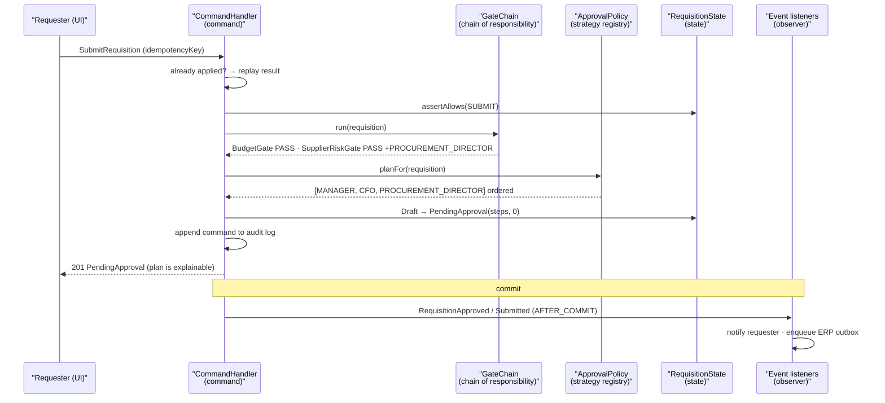

# The 4,000-Line If: Behavioral Patterns and the Approval Workflow That Nobody Could Change

Behavioral patterns decide *who* does the work, *when*, and in *what order*. Get them wrong and business rules end up smeared across a single method that every team is afraid to touch — which is how a two-line policy change becomes a six-week project.

## The Real-World Problem

An enterprise software vendor sells a procurement suite to large corporates. Its approval engine decides who must sign off a purchase requisition: by amount, by cost centre, by supplier risk tier, by whether the requester is also the budget holder, and by 31 customer-specific overrides accumulated over eight years.

All of it lived in `ApprovalService.determineApprovers()` — 4,100 lines, cyclomatic complexity over 600, no interface, and 140 booleans threaded through it. Adding a customer's rule meant inserting another branch and hoping. The test suite covered 38% of the branches and took 50 minutes.

Two things then happened in the same quarter. A new customer's requisitions above $250k skipped CFO approval because a nested condition short-circuited on a cost centre that happened to be null — $4.1M of spend was committed without the sign-off the customer's own SOX controls required, and the vendor's SOC 2 audit picked it up as an ineffective change-management and authorisation control. Separately, the vendor lost a $2M renewal because it quoted eleven weeks to implement an approval rule the competitor demonstrated as configuration.

The rewrite did not add features. It replaced one method with six behavioral patterns, and the next customer rule shipped in two days.

## The Concept

| Pattern | The question it answers | Kills this smell |
|---|---|---|
| **Strategy** | Which algorithm applies to this case? | `switch` on a type code, repeated |
| **Chain of Responsibility** | Which handler in a pipeline deals with this? | Deeply nested `if` cascades |
| **Command** | How do I make an action a first-class, replayable, auditable object? | Untraceable side effects |
| **State** | What is legal to do right now, given where we are? | Boolean flags: `isApproved && !isCancelled` |
| **Observer** | Who else needs to know this happened? | Callers calling five services after every change |
| **Template Method** | How do I fix the skeleton but vary the steps? | Copy-pasted procedures |

### The rule for choosing between them

Ask what varies. If the **algorithm** varies, use Strategy. If the **sequence of attempts** varies, use Chain of Responsibility. If the **legal set of actions** varies, use State. If the **audience** varies, use Observer. If only **two steps inside a fixed procedure** vary, use Template Method — and consider passing lambdas instead of subclassing.

### Strategy is the one that pays first

In enterprise code, Strategy plus a registry map eliminates more complexity than the other five combined, because most enterprise complexity is "the same shape of decision, made differently per product, customer, or jurisdiction."

---

## Strategy

**Problem it solves:** the same decision must be made by different rules depending on customer, product or jurisdiction, and those rules must be independently testable and independently deployable.

The wrong version — the shape that caused the incident:

```java
public List<Approver> determineApprovers(Requisition r) {
    if (r.amount().compareTo(new BigDecimal("250000")) > 0) {
        if (r.costCentre() != null && r.costCentre().startsWith("EU")) {   // null → skips CFO
            if (!r.requester().equals(r.budgetHolder())) { ... }
            else { ... }
        } else if (r.tenant().equals("ACME")) { ... }
        // ... 4,000 more lines
    }
}
```

The right version — one rule per class, discovered rather than branched to:

```java
public interface ApprovalRule {
    /** Rules are pure: same requisition in, same requirement out. Trivially unit-testable. */
    Optional<ApprovalRequirement> evaluate(Requisition requisition);
    int order();
}

@Component
class AmountThresholdRule implements ApprovalRule {

    private final ThresholdConfig config;                 // per-tenant, from configuration

    @Override
    public Optional<ApprovalRequirement> evaluate(Requisition r) {
        return config.forTenant(r.tenantId()).stream()
            .filter(t -> r.amount().compareTo(t.above()) > 0)
            .max(comparing(Threshold::above))
            .map(t -> new ApprovalRequirement(t.role(), Reason.AMOUNT_THRESHOLD, t.above()));
    }

    @Override public int order() { return 10; }
}

@Component
class SegregationOfDutiesRule implements ApprovalRule {
    @Override
    public Optional<ApprovalRequirement> evaluate(Requisition r) {
        if (!r.requesterId().equals(r.budgetHolderId())) return Optional.empty();
        return Optional.of(new ApprovalRequirement(
                Role.SKIP_LEVEL_MANAGER, Reason.SEGREGATION_OF_DUTIES, null));
    }
    @Override public int order() { return 20; }
}
```

Registry, resolved once at startup — the modern replacement for the `switch`:

```java
@Service
public class ApprovalPolicy {

    private final List<ApprovalRule> rules;

    ApprovalPolicy(List<ApprovalRule> rules) {            // Spring injects every @Component rule
        this.rules = rules.stream().sorted(comparingInt(ApprovalRule::order)).toList();
    }

    public ApprovalPlan planFor(Requisition r) {
        var requirements = rules.stream()
            .map(rule -> rule.evaluate(r))
            .flatMap(Optional::stream)
            .toList();
        return ApprovalPlan.of(requirements);             // deduplicated, ordered, explainable
    }
}
```

Adding a customer rule is now a new class plus its own test file. Nothing existing is edited, which is precisely what the change-management audit finding asked for.

**When NOT to use it:** when there are two branches that will never become three — `if (express) ... else ...` does not need two classes and an interface. And never split a strategy per *value* when the values are data: 31 customer thresholds belong in configuration read by **one** strategy, not in 31 classes. A strategy class that differs from its sibling only by a number is configuration wearing a costume.

---

## Chain of Responsibility

**Problem it solves:** a request must pass a sequence of checks where any one may reject or short-circuit, and the sequence itself changes per tenant.

```java
public interface RequisitionGate {
    /** Return REJECT to stop the chain; PASS to continue. */
    GateResult check(Requisition r, GateContext ctx);
}

@Component @Order(10)
class BudgetAvailabilityGate implements RequisitionGate {
    private final BudgetLedger ledger;
    @Override public GateResult check(Requisition r, GateContext ctx) {
        var remaining = ledger.remaining(r.costCentreId(), r.fiscalPeriod());
        return remaining.compareTo(r.amount()) >= 0
            ? GateResult.pass()
            : GateResult.reject("BUDGET_EXCEEDED",
                  "Requires %s, %s remaining".formatted(r.amount(), remaining));
    }
}

@Component @Order(20)
class SupplierRiskGate implements RequisitionGate {
    private final SupplierRiskService risk;
    @Override public GateResult check(Requisition r, GateContext ctx) {
        var tier = risk.tierOf(r.supplierId());
        if (tier == RiskTier.BLOCKED) return GateResult.reject("SUPPLIER_BLOCKED", tier.reason());
        if (tier == RiskTier.HIGH) ctx.addRequirement(Role.PROCUREMENT_DIRECTOR);  // escalate, don't reject
        return GateResult.pass();
    }
}

@Service
public class RequisitionGateChain {
    private final List<RequisitionGate> gates;            // @Order-sorted by Spring

    public GateOutcome run(Requisition r) {
        var ctx = new GateContext();
        for (var gate : gates) {
            var result = gate.check(r, ctx);
            if (result.isReject()) {
                return GateOutcome.rejected(gate.getClass().getSimpleName(), result);
            }
        }
        return GateOutcome.passed(ctx.requirements());
    }
}
```

Note the outcome names the gate that rejected. "Which check failed and why" is the single most requested piece of information in every approval-engine support ticket ever raised.

**When NOT to use it:** when all checks must always run and you need *all* the failures — a validation summary is a `flatMap` over validators, not a short-circuiting chain, because users hate fixing one field at a time. Also avoid it when the chain is fixed and three links long; a sequential method with three early returns is clearer than a framework. And never build a chain whose order is implicit — an unstated ordering dependency between gates is a defect waiting for someone to reorder a list.

---

## Command

**Problem it solves:** an action needs to be stored, queued, audited, authorised and replayed — which means it must be an object, not a method call.

```java
public sealed interface RequisitionCommand
        permits SubmitRequisition, ApproveStep, RejectStep, DelegateApproval, RecallRequisition {
    RequisitionId requisitionId();
    UserId actor();
    Instant issuedAt();
    String idempotencyKey();
}

public record ApproveStep(RequisitionId requisitionId, UserId actor, Instant issuedAt,
                          String idempotencyKey, StepId stepId, String comment)
        implements RequisitionCommand {}
```

The handler dispatches with exhaustive pattern matching — no visitor, no `instanceof` ladder:

```java
@Service
public class RequisitionCommandHandler {

    private final RequisitionRepository repo;
    private final CommandAuditLog auditLog;

    @Transactional
    public RequisitionState handle(RequisitionCommand command) {
        if (auditLog.alreadyApplied(command.idempotencyKey())) {   // safe retries
            return repo.load(command.requisitionId()).state();
        }

        var requisition = repo.loadForUpdate(command.requisitionId());

        var updated = switch (command) {
            case SubmitRequisition c   -> requisition.submit(c.actor());
            case ApproveStep c         -> requisition.approve(c.stepId(), c.actor(), c.comment());
            case RejectStep c          -> requisition.reject(c.stepId(), c.actor(), c.comment());
            case DelegateApproval c    -> requisition.delegate(c.stepId(), c.actor(), c.delegateTo());
            case RecallRequisition c   -> requisition.recall(c.actor());
        };

        repo.save(updated);
        auditLog.append(command, updated.state());          // the audit trail is the command log
        return updated.state();
    }
}
```

Because every state change arrives as a persisted command, "who approved what, when, and on whose delegated authority" is a query rather than a log-scraping exercise. That is the SOX evidence the customer needed.

**When NOT to use it:** for a plain synchronous method call with no audit, queue or undo requirement. Wrapping `updateAddress()` in an `UpdateAddressCommand` and a handler to satisfy a CQRS diagram adds two files and a level of indirection for nothing. Command earns its cost when at least one of *persist, queue, retry, authorise, replay, undo* is a real requirement.

---

## Template Method

**Problem it solves:** several workflows share a fixed skeleton — validate, gate, plan, notify, persist — but differ in two steps.

```java
public abstract class ApprovalWorkflow {

    /** The skeleton is final: no subclass may reorder or skip audit and persistence. */
    public final WorkflowResult execute(Requisition r) {
        validate(r);
        var gate = gateChain().run(r);
        if (gate.isRejected()) return WorkflowResult.rejected(gate);

        var plan = buildPlan(r, gate);                     // varies by subclass
        var routed = route(plan, r);                       // varies by subclass
        auditLog.append(r, plan, routed);                  // never varies
        return WorkflowResult.routed(routed);
    }

    protected abstract ApprovalPlan buildPlan(Requisition r, GateOutcome gate);
    protected abstract RoutingDecision route(ApprovalPlan plan, Requisition r);
    protected RequisitionGateChain gateChain() { return defaultChain; }   // overridable hook
}

public class CapitalExpenditureWorkflow extends ApprovalWorkflow {
    @Override protected ApprovalPlan buildPlan(Requisition r, GateOutcome g) {
        return policy.planFor(r).plus(Role.CAPEX_COMMITTEE);
    }
    @Override protected RoutingDecision route(ApprovalPlan p, Requisition r) {
        return RoutingDecision.parallel(p.requirements());   // capex approvers sign in parallel
    }
}
```

**When NOT to use it:** when the varying steps are one-liners — inheritance for two lambdas is a heavy price. Prefer composition:

```java
// Same guarantee, no subclass hierarchy: the skeleton takes the varying steps as functions.
var result = workflowRunner.execute(requisition,
        (r, gate) -> policy.planFor(r).plus(Role.CAPEX_COMMITTEE),
        (plan, r) -> RoutingDecision.parallel(plan.requirements()));
```

Also never use Template Method across a team boundary: a `protected` hook is a published API, and a base class that another team extends means you can no longer change the skeleton without breaking them. That is the fragile-base-class problem, and it does not get better with time.

---

## State

**Problem it solves:** which operations are legal depends on where the entity is in its lifecycle, and boolean flags cannot express that without permitting nonsense.

The wrong version:

```java
// Four booleans = 16 combinations, of which 6 are meaningless and all 16 are reachable.
if (req.isSubmitted() && !req.isApproved() && !req.isCancelled() && !req.isOnHold()) { ... }
```

The right version — a sealed state hierarchy where illegal transitions do not compile or throw immediately:

```java
public sealed interface RequisitionState
        permits Draft, PendingApproval, Approved, Rejected, Recalled {

    Set<CommandType> allowed();

    default void assertAllows(CommandType type) {
        if (!allowed().contains(type))
            throw new IllegalStateTransitionException(this, type);
    }
}

public record Draft() implements RequisitionState {
    public Set<CommandType> allowed() { return EnumSet.of(SUBMIT, DELETE); }
}

public record PendingApproval(List<ApprovalStep> steps, int currentIndex)
        implements RequisitionState {
    public Set<CommandType> allowed() { return EnumSet.of(APPROVE, REJECT, DELEGATE, RECALL); }

    /** The transition logic lives with the state that owns it. */
    public RequisitionState approve(StepId stepId, UserId actor) {
        var step = steps.get(currentIndex);
        if (!step.id().equals(stepId)) throw new OutOfOrderApprovalException(stepId);
        if (!step.isAuthorised(actor)) throw new NotAnApproverException(actor, stepId);

        var advanced = currentIndex + 1;
        return advanced == steps.size()
            ? new Approved(Instant.now(), steps)
            : new PendingApproval(steps, advanced);
    }
}
```

A test that makes the lifecycle explicit and cheap to verify:

```java
@Test
void approvedRequisition_cannotBeApprovedAgain() {
    RequisitionState state = new Approved(Instant.now(), List.of());

    assertThat(state.allowed()).doesNotContain(CommandType.APPROVE);
    assertThatThrownBy(() -> state.assertAllows(CommandType.APPROVE))
        .isInstanceOf(IllegalStateTransitionException.class);
}

@Test
void approvingOutOfOrder_isRejected() {
    var state = new PendingApproval(List.of(step("s1", MANAGER), step("s2", CFO)), 0);

    assertThatThrownBy(() -> state.approve(StepId.of("s2"), cfoUser()))
        .isInstanceOf(OutOfOrderApprovalException.class);
}
```

**When NOT to use it:** for a two-state flag. `active`/`inactive` is a boolean, not a sealed hierarchy. Also do not reach for a full workflow engine (BPMN, Temporal, Step Functions) for a five-state machine — you inherit an operational dependency, a deployment story and a debugging surface far larger than the problem. Escalate to an engine when you need durable timers, long-running human tasks measured in weeks, and compensation across services.

---

## Observer

**Problem it solves:** several unrelated subsystems must react to an approval event, and the workflow must not know or care who they are.

```java
public record RequisitionApproved(RequisitionId id, UserId approver, StepId stepId,
                                 Money amount, Instant occurredAt) {}

@Component
class RequisitionApprovedListeners {

    /** Runs after the transaction commits — never notify on an uncommitted change. */
    @TransactionalEventListener(phase = TransactionPhase.AFTER_COMMIT)
    public void notifyRequester(RequisitionApproved event) { notifications.send(event); }

    @TransactionalEventListener(phase = TransactionPhase.AFTER_COMMIT)
    @Async
    public void syncToErp(RequisitionApproved event) { erpOutbox.enqueue(event); }
}
```

Two rules make Observer safe in an enterprise system: publish **after commit**, and make anything that must not be lost go through an **outbox** rather than a fire-and-forget async listener. An in-memory event bus is not a delivery guarantee.

**When NOT to use it:** when the reaction is part of the operation's correctness. If posting to the ledger *must* succeed for the approval to be valid, that is a transactional step, not an observer — hiding a required step behind an event listener produces a system where the happy path is invisible and the failure path is silent. Also avoid observer chains: listener A publishing an event that triggers listener B which publishes another is an untraceable control flow that no stack trace will explain.

## How It Works



The critical ordering: gates and policy run *before* the state transition, the audit entry is written *inside* the transaction, and observers fire *after* commit. Reversing any of those three is a bug that only appears under rollback.

## Enterprise Trade-offs

| Approach | Pros | Cons | When to use (Banking / Insurance / Enterprise) |
|---|---|---|---|
| **Strategy + injected registry** | New rule = new class + test; nothing existing edited; per-tenant swap | More files; the registry becomes a place to look | Default for per-customer, per-product or per-jurisdiction rules: approval limits, pricing, eligibility |
| **Chain of Responsibility with named gates** | Short-circuits cheaply; the rejecting gate is reportable | Implicit ordering is a hidden dependency | Pre-checks where the first failure should stop work: budget, sanctions, supplier risk |
| **Command objects + persisted log** | Replay, idempotency and audit fall out for free | Extra type per action; more plumbing | Anything auditable or queued: approvals, payments, policy endorsements. Overkill for reads |
| **State as a sealed hierarchy** | Illegal actions rejected at the boundary; lifecycle is readable | Verbose for trivial lifecycles | Entities with 4+ states and real transition rules: requisitions, claims, loan applications |
| **External workflow engine (BPMN / Temporal)** | Durable timers, human tasks, visual process for business users | Operational dependency; debugging and versioning cost | Multi-week, cross-system processes with compensation — not a 5-state machine |
| **One method with nested `if`s on 140 booleans** | — | Untestable, unexplainable, the $4.1M incident above | Never |

## Why This Still Matters Through 2030

Business rules are the part of an enterprise system that changes most and is regulated most, and those two facts together are why behavioral patterns keep paying. The regulatory direction reinforces it: SOX-style authorisation controls, SOC 2 change management, and the EU AI Act's demands for explainable and contestable automated decisions all require a system to answer "which rule fired, on which input, under whose authority" — a question a strategy registry plus a command log answers as data, and a 4,000-line method cannot answer at all. Structurally, multi-tenant SaaS makes per-customer rule variation the norm rather than the exception, so the ability to add a rule without editing shared code is a commercial property, not just a tidiness one. AI-assisted development changes the calculus in a way worth naming: generating twenty small rule classes is now trivial, so the constraint moves from typing effort to comprehension, and the winning shape is the one where each rule is small, pure, and independently verifiable — which is exactly what these patterns produce. Expect the boilerplate to keep shrinking and the judgement about what varies to keep mattering.

→ Next: [04-when-not-to-use-a-pattern.md](04-when-not-to-use-a-pattern.md) · Related: [../01-core-concepts/01-solid-and-separation-of-concerns.md](../01-core-concepts/01-solid-and-separation-of-concerns.md) · [../03-architecture/05-event-driven-architecture.md](../03-architecture/05-event-driven-architecture.md)
