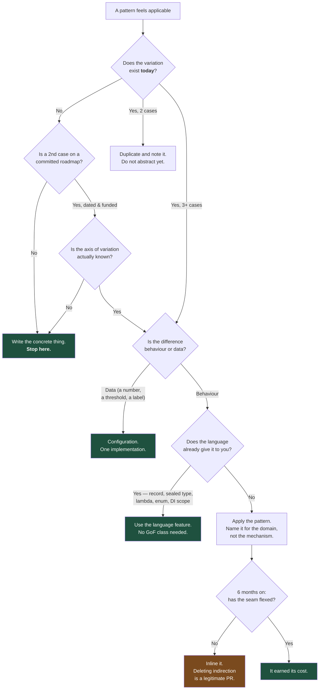

# Seventeen Files to Save a Claim: How to Recognise a Pattern Applied for Its Own Sake

Every pattern is a trade: you buy flexibility with indirection. The failure mode nobody warns juniors about is paying the indirection and never collecting the flexibility — and it is far more common in enterprise codebases than under-engineering.

## The Real-World Problem

A specialty insurer rebuilt its claims-intake service as a greenfield project, staffed by a team that had just finished a design-patterns study group. Eighteen months later, saving a first-notification-of-loss touched seventeen files.

The path for one HTTP `POST` ran: controller → `ClaimIntakeFacade` → `AbstractClaimCommandFactory` → `ClaimCommandBuilderDirector` → `ClaimCommandBuilder` → a five-deep decorator stack → `ClaimPersistenceStrategy` (one implementation) → `AbstractClaimRepositoryFactory` (one implementation) → `ClaimRepositoryProxy` (delegating, no added behaviour) → JPA. Along the way an `IClaimVisitor` walked a `ClaimComposite` that never contained more than one node, and a `ClaimEventObserverRegistry` published to two listeners that both lived in the same class.

There were 41 interfaces. Thirty-four had exactly one implementation, and eleven of those implementations were named `Default*`. The "pluggable" persistence strategy had never been plugged into anything else. The abstract factory had one concrete factory in production and one in tests — which is to say, it existed to enable a mock that a constructor parameter would have provided for free.

The costs were measurable. New joiners took nine to eleven weeks to make an unsupervised change to intake, against four weeks on the neighbouring policy service. A regulatory change adding two mandatory fields to the FNOL — a two-column, two-validation change — took nineteen days and touched twenty-three files, because each field had to be threaded through the builder, the command, the DTO, the visitor and three interfaces. A production incident took six hours to diagnose because the stack traces were 90 frames of framework and delegation, with the actual failing line buried at frame 71. And two of the five decorators had been silently disabled by a wiring change eight months earlier; nobody noticed, because the audit decorator's absence produced no error, only missing audit records — which the insurer discovered during a Lloyd's audit.

Nothing here was incompetence. Every individual pattern was implemented correctly. The system was worse anyway.

## The Concept

### Indirection has a price list

Patterns are usually discussed in terms of their benefits. Here is the invoice:

| Cost | What it looks like in practice |
|---|---|
| **Navigation cost** | "Where does this actually happen?" — n jumps through interfaces per question |
| **Comprehension cost** | Onboarding time; the number of files you must read to understand one behaviour |
| **Debugging cost** | Stack depth; frames of framework between the symptom and the cause |
| **Change cost** | Shotgun surgery: one requirement, twenty-three files |
| **Silent-failure cost** | Wiring is not type-checked, so a missing decorator fails by doing nothing |
| **Performance cost** | Usually the smallest one, and the only one people mention |

Flexibility is worth paying for when it is used. The test is empirical: **has this seam ever flexed?**

### Speculative generality: the dominant failure

Speculative generality is abstraction built for a requirement that has not arrived and may never. It is seductive because it is indistinguishable from good design *at the moment you write it* — the difference only becomes visible later, in whether the second implementation ever appears.

The rule that catches most of it: **an interface with exactly one implementation, where no second implementation is on a roadmap, is not an abstraction — it is a rename.** Test doubles do not count as a second implementation; modern mocking frameworks and constructor injection do not require an interface, and "for testability" has become the most common justification for permanent unused indirection.

### The Rule of Three

Do not abstract on the first case. On the second, note the duplication. On the third, abstract — because by then you can see which parts actually vary, and you will get the seam in the right place. Abstracting on the first case means guessing the axis of variation, and guessing wrong is worse than the duplication: a wrong seam is harder to remove than duplicated code, because code that duplicates is obvious and code that abstracts along the wrong axis looks intentional.

### Ten signals that a pattern was applied for its own sake

1. The pattern name is in the class name — `ClaimStrategyFactoryImpl` tells you the mechanism and nothing about the domain.
2. An interface with one implementation named `Default…` or `…Impl`.
3. A "strategy" whose implementations differ only by a constant. That is configuration.
4. A factory that only ever constructs one type.
5. A builder for an immutable record with four required fields.
6. A composite that never holds more than one child in production.
7. A decorator stack more than three deep, or one whose ordering is undocumented.
8. A proxy that delegates every method unchanged.
9. An observer whose listeners are all in the same module as the publisher.
10. The commit message that introduced it says "refactor to use X pattern" with no behaviour change and no requirement attached.

Signals four through nine each mean the pattern's premise — variation — is absent.

### Why "extensible" often reduces extensibility

This is the counter-intuitive part and worth stating plainly. Speculative abstraction constrains future change to the axis you guessed. A codebase with 34 single-implementation interfaces has 34 published internal contracts; changing the shape of a call now means changing an interface, its implementation, its mock, and everything that referenced the type. Concrete code with no seams is *easier* to reshape, because there is less of it and nothing has committed to a shape. Simple code is not merely simpler — it is more flexible than premature framework.

## How It Works



Four of the five terminal green states are "do less." The only path to a pattern requires variation that exists now, on a known axis, that the language cannot already express.

## Practical Example

**The over-patterned version** — the shape that took nineteen days to add two fields:

```java
public interface IClaimPersistenceStrategy {            // one implementation, ever
    void persist(ClaimCommand command);
}

@Component
class DefaultClaimPersistenceStrategy implements IClaimPersistenceStrategy {
    private final IClaimRepositoryFactory factory;      // one implementation, ever
    @Override public void persist(ClaimCommand c) {
        factory.create().save(c.toEntity());            // create() returns the same bean each time
    }
}

@Component
class ClaimRepositoryProxy implements ClaimRepository { // adds literally nothing
    private final ClaimRepository delegate;
    @Override public Claim save(Claim c) { return delegate.save(c); }
    @Override public Optional<Claim> findById(ClaimId id) { return delegate.findById(id); }
}

@Service
public class ClaimIntakeFacade {
    private final AbstractClaimCommandFactory commandFactory;
    private final ClaimCommandBuilderDirector director;
    private final IClaimPersistenceStrategy persistence;
    private final ClaimEventObserverRegistry observers;

    public ClaimId intake(FnolRequest request) {
        var builder = commandFactory.newBuilder(request.lineOfBusiness());
        director.construct(builder, request);
        var command = builder.build();
        persistence.persist(command);
        observers.publishAll(new ClaimIntakeEvent(command));
        return command.claimId();
    }
}
```

Count what the flexibility bought: nothing. Every seam has one implementation. Every indirection is a jump the reader must make and a place the wiring can silently break.

**The version that replaced it** — same behaviour, same testability, one file:

```java
@Service
public class ClaimIntakeService {

    private final ClaimRepository claims;               // Spring Data interface — the real seam
    private final ApplicationEventPublisher events;
    private final Clock clock;

    ClaimIntakeService(ClaimRepository claims, ApplicationEventPublisher events, Clock clock) {
        this.claims = claims; this.events = events; this.clock = clock;
    }

    @Transactional
    public ClaimId intake(FnolRequest request) {
        var claim = Claim.notified(
                ClaimReference.generate(request.lineOfBusiness()),
                request.policyNumber(),
                request.lossDate(),
                request.lossDescription(),
                request.reportedBy(),
                clock.instant());                       // invariants live in the factory method

        var saved = claims.save(claim);
        events.publishEvent(new ClaimNotified(saved.id(), saved.reference(), clock.instant()));
        return saved.id();
    }
}
```

Adding the two mandatory regulatory fields is now: two record components on `Claim`, two validations in `Claim.notified`, one Liquibase changeset, one test. Four files, one afternoon — against twenty-three files and nineteen days.

The test is *simpler*, not harder, without the interfaces — which disproves the "we need it for testability" claim directly:

```java
@Test
void intake_persistsClaimAndPublishesNotifiedEvent() {
    var clock = Clock.fixed(Instant.parse("2026-08-09T09:15:00Z"), ZoneOffset.UTC);
    var claims = new InMemoryClaimRepository();         // a fake, no interface invented for it
    var events = mock(ApplicationEventPublisher.class);
    var service = new ClaimIntakeService(claims, events, clock);

    var id = service.intake(new FnolRequest(
            LineOfBusiness.MARINE_CARGO, PolicyNumber.of("MC-2026-00418"),
            LocalDate.of(2026, 8, 2), "Container 4 water ingress", UserId.of("broker-771")));

    assertThat(claims.findById(id)).isPresent()
        .get().extracting(Claim::status).isEqualTo(ClaimStatus.NOTIFIED);
    verify(events).publishEvent(argThat((ClaimNotified e) ->
            e.claimId().equals(id) && e.occurredAt().equals(clock.instant())));
}
```

**Language features that make GoF classes obsolete** — check this list before writing a pattern:

```java
// Singleton      → enum constant, or a DI-scoped bean. Never a hand-rolled getInstance().
// Strategy       → a functional interface / lambda, or Map<Key, Function<In, Out>>.
// Factory Method → a static factory on a sealed interface + exhaustive switch.
// Visitor        → pattern matching over a sealed hierarchy:
String describe(ClaimEvent e) {
    return switch (e) {
        case Notified n  -> "notified " + n.at();
        case Reserved r  -> "reserved " + r.amount();
        case Settled s   -> "settled " + s.amount();
        case Reopened r  -> "reopened: " + r.reason();
    };                                                  // no accept(), no double dispatch
}
// Prototype      → record copy construction.
// Builder        → a record's canonical constructor, until it genuinely hurts.
// Decorator      → in TypeScript, a higher-order function.
```

**A concrete review heuristic you can run on any repository:**

```bash
# Interfaces with exactly one implementation are the highest-yield smell.
# Every hit is a candidate for inlining — review, don't delete blindly.
comm -23 \
  <(grep -rhoP '(?<=^public interface )\w+' src/main/java | sort -u) \
  <(grep -rhoP '(?<=implements )\w+' src/main/java | tr ',' '\n' | tr -d ' ' | sort -u)
```

Track the number of single-implementation interfaces as a debt metric alongside the ones in [technical debt tracking](../01-core-concepts/08-technical-debt-tracking.md). It should trend down, not up.

## Enterprise Trade-offs

| Approach | Pros | Cons | When to use (Banking / Insurance / Enterprise) |
|---|---|---|---|
| **Concrete first, abstract on the third case** | Lowest comprehension and change cost; the seam ends up on the real axis of variation | Two instances of duplication live in the codebase for a while | Default for all new enterprise code, including greenfield |
| **Abstract up front on a committed, dated requirement** | Avoids a costly retrofit when the second case is genuinely funded | Wrong if the requirement slips or changes shape | Known multi-scheme, multi-jurisdiction or multi-tenant work with a signed contract behind it |
| **Configuration instead of a strategy class** | One code path; business can change values without a release | Needs validation and an audit trail on config changes | Thresholds, limits, rates, per-tenant labels — most "variation" in insurance and banking is data |
| **Language feature instead of a GoF class** | Compiler-enforced, far less code, exhaustive by construction | Requires modern runtime and team fluency | Java 21+ / TypeScript 5.x codebases — should be the first thing checked |
| **Deleting indirection that never flexed** | Recovers onboarding and change velocity; shrinks the blast radius | Needs test coverage first and a reviewer who accepts "removal" PRs | Any codebase with 30+ single-implementation interfaces. Schedule it like any other debt |
| **A pattern added to satisfy a design review or a diagram** | — | Pure cost: indirection, silent-failure surface, onboarding tax, zero benefit | Never |

→ Next: [../03-architecture/01-layered-architecture.md](../03-architecture/01-layered-architecture.md) · Related: [../01-core-concepts/02-yagni-kiss-dry.md](../01-core-concepts/02-yagni-kiss-dry.md) · [../00-project-setup-roadmap/09-code-review-process.md](../00-project-setup-roadmap/09-code-review-process.md)
