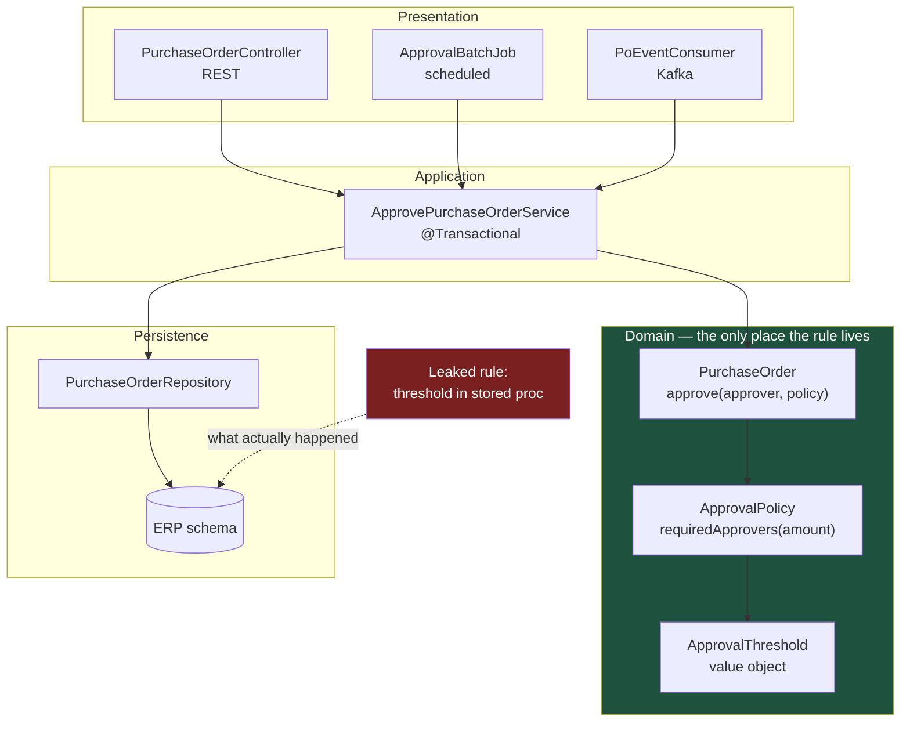

# Layered Architecture: The Default That Quietly Becomes a Pass-Through

Classic n-tier layering is still the right starting point for most enterprise modules, and it is also the architecture that fails most often — not by collapsing, but by degenerating into three files that forward the same object to each other. The difference between a healthy layered module and an anaemic one is whether the middle layer holds any decisions.

## The Real-World Problem

An Enterprise Solutions vendor ships a Procurement module inside its ERP suite: purchase requisitions, approvals, purchase orders, goods receipt. The module was built textbook-layered — `controller` → `service` → `repository` — and for the first two years it was fine.

By year four the module had 61 service classes and a rule that nobody could locate. Purchase orders above a configurable threshold were supposed to require two approvers. That rule existed in four places: a `@PreAuthorize` expression on the controller, an `if` inside `PurchaseOrderService.approve()`, a database `CHECK` constraint added during an incident, and a stored procedure used by the nightly batch job that auto-approved recurring orders.

A customer raised their threshold from 50,000 to 250,000 in the admin UI. Three of the four places picked up the change. The stored procedure did not — its threshold was hard-coded. Over eleven weeks, 340 recurring purchase orders between 50,000 and 250,000 were auto-approved by a single approver.

The finding landed in the customer's SOX audit. Remediation cost the vendor 900 engineer-hours of forensic reconciliation, a re-approval campaign across 340 orders, and a contractual credit. The architecture diagram in the vendor's own documentation still showed three clean layers. The layers existed; the domain logic had leaked out of all of them.

## The Concept

### The four layers and their one job each

| Layer | Owns | Must never |
|---|---|---|
| **Presentation** | HTTP/gRPC/UI concerns: routing, DTO mapping, status codes, auth annotations | Contain a business rule or reach the database |
| **Application (service)** | Use-case orchestration, transaction boundaries, authorization of *actions* | Know about `HttpServletRequest`, JSON, or SQL dialects |
| **Domain** | Entities, value objects, invariants, business rules | Depend on Spring, JPA annotations aside, or any I/O |
| **Persistence** | Mapping, queries, transactions at the technical level | Decide anything the business could argue about |

### The one non-negotiable rule: dependencies point downward

Presentation depends on application, application on domain, persistence on domain. Nothing points back up. The moment a repository imports a controller's DTO, the layering is decoration.

### Strict vs. relaxed layering

- **Strict** — each layer may only call the layer directly below it. Predictable, but produces pass-through methods when a layer has nothing to add.
- **Relaxed** — a layer may call anything below it. A read-only controller may query a repository-backed projection directly, skipping the service.

Pick relaxed for reads, strict for writes. Writes are where invariants live; reads rarely need protecting.

### The anaemic pass-through: how to spot it

You have an anaemic layered module when all of the following are true:

1. Entities are getter/setter bags with no methods that express a rule.
2. Every service method reads: load entity, mutate fields, save, return.
3. Service and repository method names are one-to-one (`getOrderById` → `findById`).
4. Reading the domain package tells you nothing about the business.

At that point the service layer is a transaction wrapper with a misleading name, and business rules migrate outward — into controllers, validators, database constraints, and batch jobs. That migration is exactly the Procurement failure: four copies of one rule, none authoritative.

### The fix is not "more layers", it is a real domain layer

Move the decision into the entity or a domain policy object, then let the service orchestrate. One place holds the rule; every caller — REST, batch, message consumer — goes through it. Layering only pays off when the middle is load-bearing. See [../01-core-concepts/01-solid-and-separation-of-concerns.md](../01-core-concepts/01-solid-and-separation-of-concerns.md) for why this is the same argument as the Single Responsibility Principle applied at module scale.

## How It Works



Three entry points, one rule. The dotted edge is the failure: a second path to the database that never traverses the domain layer, so no amount of layer discipline above it can help.

## Practical Example

### Module layout

```
procurement/
├── build.gradle.kts
└── src/main/java/com/vendor/erp/procurement/
    ├── ProcurementModule.java              # @Configuration — module's public wiring
    ├── api/                                # PRESENTATION
    │   ├── PurchaseOrderController.java
    │   ├── dto/
    │   │   ├── ApprovePurchaseOrderRequest.java
    │   │   └── PurchaseOrderResponse.java
    │   └── mapper/PurchaseOrderDtoMapper.java
    ├── application/                        # APPLICATION
    │   ├── ApprovePurchaseOrderService.java
    │   ├── ApprovalThresholdProvider.java  # interface, implemented in infrastructure
    │   └── batch/RecurringOrderApprovalJob.java
    ├── domain/                             # DOMAIN — no Spring, no HTTP
    │   ├── PurchaseOrder.java
    │   ├── Approval.java
    │   ├── ApprovalPolicy.java
    │   ├── ApprovalThreshold.java
    │   ├── Money.java
    │   └── error/InsufficientApproversException.java
    └── infrastructure/                     # PERSISTENCE + adapters
        ├── jpa/PurchaseOrderJpaRepository.java
        ├── jpa/PurchaseOrderEntityMapper.java
        └── config/TenantApprovalThresholdProvider.java
```

### The rule, in exactly one place

```java
// domain/ApprovalPolicy.java — no framework imports, unit-testable in microseconds
public record ApprovalPolicy(ApprovalThreshold dualApprovalAbove) {

    public int requiredApprovers(Money orderTotal) {
        return orderTotal.isGreaterThan(dualApprovalAbove.amount()) ? 2 : 1;
    }
}
```

```java
// domain/PurchaseOrder.java — the entity enforces its own invariant
public class PurchaseOrder {

    private final PurchaseOrderId id;
    private final Money total;
    private final List<Approval> approvals = new ArrayList<>();
    private PurchaseOrderStatus status = PurchaseOrderStatus.PENDING_APPROVAL;

    public void approve(ApproverId approver, ApprovalPolicy policy, Instant at) {
        if (status != PurchaseOrderStatus.PENDING_APPROVAL) {
            throw new IllegalStateException("PO " + id + " is " + status);
        }
        if (approvals.stream().anyMatch(a -> a.approver().equals(approver))) {
            throw new InsufficientApproversException("duplicate approver " + approver);
        }
        approvals.add(new Approval(approver, at));

        int required = policy.requiredApprovers(total);
        if (approvals.size() >= required) {
            status = PurchaseOrderStatus.APPROVED;
        }
    }

    public boolean isApproved() {
        return status == PurchaseOrderStatus.APPROVED;
    }
}
```

### Application layer: orchestration only

```java
// application/ApprovePurchaseOrderService.java
@Service
public class ApprovePurchaseOrderService {

    private final PurchaseOrderRepository orders;
    private final ApprovalThresholdProvider thresholds;
    private final AuditTrail audit;
    private final Clock clock;

    // Constructor injection. Never field @Autowired — it hides dependencies
    // and makes the class untestable without a Spring context.
    ApprovePurchaseOrderService(PurchaseOrderRepository orders,
                               ApprovalThresholdProvider thresholds,
                               AuditTrail audit,
                               Clock clock) {
        this.orders = orders;
        this.thresholds = thresholds;
        this.audit = audit;
        this.clock = clock;
    }

    @Transactional
    public PurchaseOrder approve(PurchaseOrderId id, ApproverId approver, TenantId tenant) {
        var order = orders.findById(id)
            .orElseThrow(() -> new PurchaseOrderNotFoundException(id));

        var policy = new ApprovalPolicy(thresholds.forTenant(tenant));  // config, not a rule
        order.approve(approver, policy, clock.instant());               // the decision

        orders.save(order);
        audit.record("PO_APPROVED", id.value(), approver.value());      // SOX evidence
        return order;
    }
}
```

### The anaemic version, for contrast

```java
// What the Procurement module actually shipped. Note: no domain behaviour anywhere.
@Service
public class PurchaseOrderService {

    @Autowired private PurchaseOrderRepository repo;   // field injection: also a smell

    @Transactional
    public PurchaseOrderEntity approve(Long id, Long approverId) {
        var po = repo.findById(id).orElseThrow();
        po.getApprovals().add(approverId);
        // The threshold lives in a @PreAuthorize on the controller, a CHECK constraint,
        // and a stored procedure. This method does not know it exists.
        if (po.getApprovals().size() >= 2) po.setStatus("APPROVED");
        repo.save(po);
        return po;
    }
}
```

The test tells you which one you have: the healthy version's rule is verified without a database, a Spring context, or an HTTP client.

```java
@Test
void order_above_tenant_threshold_needs_two_approvers() {
    var policy = new ApprovalPolicy(new ApprovalThreshold(Money.of("250000", "EUR")));
    var order = PurchaseOrder.pending(Money.of("300000", "EUR"));

    order.approve(new ApproverId("alice"), policy, Instant.now());
    assertThat(order.isApproved()).isFalse();

    order.approve(new ApproverId("bob"), policy, Instant.now());
    assertThat(order.isApproved()).isTrue();
}
```

## Enterprise Trade-offs

| Approach | Pros | Cons | When to use (Banking / Insurance / Enterprise) |
|---|---|---|---|
| **Strict layering, rich domain** | One authoritative place per rule; fast unit tests; survives new entry points | Requires discipline and mapping between entity and DTO | Default for any module carrying auditable rules: ERP approvals, insurance underwriting, banking limits |
| **Relaxed layering (reads bypass the service)** | Removes pointless pass-through; simpler read paths | Two access patterns in one module; needs a written convention | Reporting and list screens in ERP and insurance back-office UIs |
| **Anaemic layering (transaction-script services)** | Fast to write; trivially understood by new joiners | Rules leak into controllers, constraints, batch jobs — the scenario above | Short-lived internal tools and CRUD admin screens only. Never for regulated logic |
| **Layer-per-deployable module (Spring Modulith)** | Enforces boundaries at build time; verifiable in CI | Extra tooling; refactoring cost on existing code | Large ERP suites where several teams share one deployable |
| **Skip layers, put logic in the database** | Enforced for every caller including ad-hoc SQL | Untestable, un-versionable, invisible to application developers | Only for last-resort integrity constraints, never as the primary rule location |
| **Package-by-layer at the top level (`controllers/`, `services/`)** | Familiar from tutorials | Every feature change touches four distant packages; boundaries invisible | Avoid — package by feature first, layer inside the feature |

→ Next: [02-hexagonal-architecture.md](02-hexagonal-architecture.md) · Related: [../01-core-concepts/01-solid-and-separation-of-concerns.md](../01-core-concepts/01-solid-and-separation-of-concerns.md) · [../00-project-setup-roadmap/03-project-structure.md](../00-project-setup-roadmap/03-project-structure.md)
