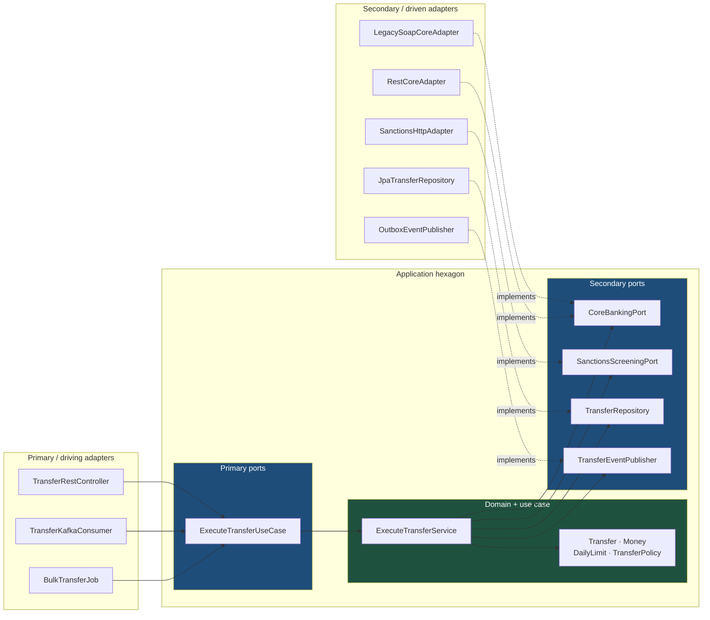

# Ports and Adapters: How a Bank Replaced Its Core Without Rewriting Its Rules

Hexagonal architecture makes one promise, and it is a big one: the technology you use to talk to the outside world becomes a detail you can swap without touching a single business rule. In a bank, where core-banking migrations and payment-scheme upgrades arrive whether you want them or not, that promise is worth the extra interfaces.

## The Real-World Problem

A European retail bank ran domestic credit transfers through a Spring service that called its core banking platform directly. `TransferService` imported the vendor's SOAP client, built the vendor's request objects, interpreted the vendor's numeric error codes, and mapped the vendor's account model into its own responses. Roughly 40% of the class was vendor coupling; the actual transfer rules — same-currency check, daily limit, sanctions screening, debit-before-credit ordering — were interleaved with it.

Then the bank bought a new core banking platform with a REST/JSON API and a different account identifier scheme. The migration plan required both cores to run in parallel for nine months, routed by customer segment.

The team could not isolate the change. Transfer rules could not be exercised without a running SOAP stub, so every rule test was a 4-second integration test against a WireMock recording of the old vendor. Adding the second core meant an `if (customer.onNewCore())` branch inside the rule logic, doubling every test path.

The programme slipped two quarters. The direct cost was 1.4 million EUR in extended dual-run licensing for the legacy core. The indirect cost was worse: during the dual-run, a limit rule was fixed on the legacy branch and missed on the new one, and 190 transfers exceeded the customer's daily limit before reconciliation caught it. A regulator-reportable control failure, caused entirely by business logic being welded to an integration protocol.

## The Concept

### The hexagon

The application sits inside a boundary. Everything outside — HTTP, Kafka, databases, the core banking platform, a scheduler, a CLI — reaches the application only through **ports**, and each port is implemented by an **adapter**.

The hexagon shape means nothing beyond "more than four sides", which is the point: there is no privileged direction, only inside and outside.

### The vocabulary, used precisely

| Term | Also called | Definition | Example |
|---|---|---|---|
| **Primary port** | Driving port, inbound port | An interface the application **offers**. Something outside calls it to make the application do work. | `ExecuteTransferUseCase` |
| **Primary adapter** | Driving adapter, inbound adapter | Code that calls a primary port in response to an external trigger. | `TransferRestController`, `TransferKafkaConsumer`, `BatchTransferJob` |
| **Secondary port** | Driven port, outbound port | An interface the application **requires**. The application calls it; something outside implements it. | `CoreBankingPort`, `SanctionsScreeningPort`, `TransferRepository` |
| **Secondary adapter** | Driven adapter, outbound adapter | An implementation of a secondary port using a concrete technology. | `LegacySoapCoreBankingAdapter`, `RestCoreBankingAdapter`, `JpaTransferRepository` |

Two rules follow, and they are the whole architecture:

1. **Ports are owned by the application, not by the technology.** `CoreBankingPort` is expressed in the bank's own language — `AccountId`, `Money`, `PostingResult` — never in the vendor's. If your port method signature mentions `SoapEnvelope` or `ResponseEntity`, you have published an adapter as a port.
2. **Dependencies point inward.** Adapters know ports; ports never know adapters. Spring wires the direction at startup; the compiler enforces it because the domain module has no dependency on the infrastructure module.

### Primary vs. secondary: the asymmetry that trips people up

For a **primary** port, the application supplies the implementation and the outside world calls it. For a **secondary** port, the application declares the interface and the outside world supplies the implementation — that is dependency inversion, and it is the only inversion hexagonal architecture requires. Miss it and you get layered architecture with extra files.

### What this buys you

| Benefit | Concrete form |
|---|---|
| **Swappable infrastructure** | Two `CoreBankingPort` adapters coexist behind a routing decorator; rules untouched |
| **Fast tests** | Rules tested against in-memory fakes in milliseconds; no WireMock, no Spring context |
| **Parallel work** | Domain and adapter teams work against an agreed interface |
| **Honest boundaries** | The set of secondary ports *is* the list of everything your application depends on |

### What it costs

More interfaces, more mapping code, and one indirection between a controller and the logic it triggers. For a CRUD screen over one table this is pure overhead — see [../02-design-patterns/04-when-not-to-use-a-pattern.md](../02-design-patterns/04-when-not-to-use-a-pattern.md). For a module that will outlive at least one of its integrations, it is the cheapest insurance available.

## How It Works



Every solid arrow points toward the hexagon. The dotted arrows are the inversion: adapters depend on ports, so adding the second core banking platform adds a box on the right and changes nothing in green.

## Practical Example

### Folder layout — three Gradle modules, boundaries enforced by the build

```
transfers/
├── settings.gradle.kts                 # includes the three modules below
├── transfers-domain/                   # ZERO framework dependencies
│   └── src/main/java/com/bank/transfers/domain/
│       ├── Transfer.java
│       ├── TransferId.java
│       ├── AccountId.java
│       ├── Money.java
│       ├── DailyLimit.java
│       ├── TransferPolicy.java
│       └── error/{LimitExceeded,SanctionsHit,SameAccount}.java
├── transfers-application/              # depends on: domain only
│   └── src/main/java/com/bank/transfers/application/
│       ├── port/in/                    # PRIMARY / DRIVING PORTS
│       │   ├── ExecuteTransferUseCase.java
│       │   ├── ExecuteTransferCommand.java
│       │   └── GetTransferQuery.java
│       ├── port/out/                   # SECONDARY / DRIVEN PORTS
│       │   ├── CoreBankingPort.java
│       │   ├── SanctionsScreeningPort.java
│       │   ├── TransferRepository.java
│       │   └── TransferEventPublisher.java
│       └── service/
│           └── ExecuteTransferService.java
└── transfers-infrastructure/           # depends on: application, Spring, vendors
    └── src/main/java/com/bank/transfers/infrastructure/
        ├── adapter/in/web/             # INBOUND ADAPTERS
        │   ├── TransferRestController.java
        │   └── dto/{TransferRequest,TransferResponse}.java
        ├── adapter/in/messaging/TransferKafkaConsumer.java
        ├── adapter/in/batch/BulkTransferJob.java
        ├── adapter/out/core/           # OUTBOUND ADAPTERS
        │   ├── LegacySoapCoreBankingAdapter.java
        │   ├── RestCoreBankingAdapter.java
        │   └── RoutingCoreBankingAdapter.java     # decorator: picks per customer
        ├── adapter/out/sanctions/SanctionsHttpAdapter.java
        ├── adapter/out/persistence/{JpaTransferRepository,TransferJpaEntity}.java
        ├── adapter/out/messaging/OutboxEventPublisher.java
        └── config/BeanConfiguration.java
```

`transfers-domain` cannot compile against Spring because Spring is not on its classpath. That is the enforcement mechanism — not a convention, a build failure.

### Primary (driving) port

```java
// application/port/in/ExecuteTransferUseCase.java
public interface ExecuteTransferUseCase {
    TransferResult execute(ExecuteTransferCommand command);
}

// application/port/in/ExecuteTransferCommand.java — validated at the boundary
public record ExecuteTransferCommand(
        AccountId debtor,
        AccountId creditor,
        Money amount,
        String idempotencyKey,
        String remittanceInfo) {

    public ExecuteTransferCommand {
        Objects.requireNonNull(debtor);
        Objects.requireNonNull(creditor);
        if (amount.isNotPositive()) throw new IllegalArgumentException("amount must be > 0");
        if (idempotencyKey == null || idempotencyKey.isBlank())
            throw new IllegalArgumentException("idempotencyKey required");
    }
}
```

### Secondary (driven) ports — in the bank's language, not the vendor's

```java
// application/port/out/CoreBankingPort.java
public interface CoreBankingPort {

    Balance availableBalance(AccountId account);

    /** Debit then credit as one core-side posting. Must be idempotent on postingRef. */
    PostingResult post(AccountId debtor, AccountId creditor, Money amount, String postingRef);
}

// application/port/out/SanctionsScreeningPort.java
public interface SanctionsScreeningPort {
    ScreeningOutcome screen(AccountId creditor, String remittanceInfo);
}
```

No `SoapEnvelope`, no `RestClient`, no vendor error codes. Both core banking platforms can satisfy this.

### The use case — pure orchestration over the domain

```java
// application/service/ExecuteTransferService.java
@Service
public class ExecuteTransferService implements ExecuteTransferUseCase {

    private final CoreBankingPort core;
    private final SanctionsScreeningPort sanctions;
    private final TransferRepository transfers;
    private final TransferEventPublisher events;
    private final TransferPolicy policy;
    private final Clock clock;

    // Constructor injection only — the class is instantiable in a plain unit test.
    ExecuteTransferService(CoreBankingPort core,
                           SanctionsScreeningPort sanctions,
                           TransferRepository transfers,
                           TransferEventPublisher events,
                           TransferPolicy policy,
                           Clock clock) {
        this.core = core;
        this.sanctions = sanctions;
        this.transfers = transfers;
        this.events = events;
        this.policy = policy;
        this.clock = clock;
    }

    @Override
    @Transactional
    public TransferResult execute(ExecuteTransferCommand cmd) {
        var replay = transfers.findByIdempotencyKey(cmd.idempotencyKey());
        if (replay.isPresent()) return TransferResult.replayOf(replay.get());

        var spentToday = transfers.totalSettledToday(cmd.debtor(), clock.instant());
        var transfer = Transfer.initiate(cmd.debtor(), cmd.creditor(), cmd.amount(),
                                         cmd.idempotencyKey(), clock.instant());

        policy.assertAllowed(transfer, spentToday);                     // domain rule

        var outcome = sanctions.screen(cmd.creditor(), cmd.remittanceInfo());
        if (outcome.isHit()) {
            transfer.block(outcome.reason());
            transfers.save(transfer);
            events.publish(new TransferBlocked(transfer.id(), outcome.reason()));
            return TransferResult.blocked(transfer);
        }

        var posting = core.post(cmd.debtor(), cmd.creditor(), cmd.amount(),
                                transfer.postingRef());
        transfer.settle(posting.reference(), posting.valueDate());

        transfers.save(transfer);
        events.publish(new TransferSettled(transfer.id(), cmd.amount(), posting.valueDate()));
        return TransferResult.settled(transfer);
    }
}
```

### The dual-run problem, solved by one outbound adapter

```java
// infrastructure/adapter/out/core/RoutingCoreBankingAdapter.java
@Primary
@Component
public class RoutingCoreBankingAdapter implements CoreBankingPort {

    private final CoreBankingPort legacy;
    private final CoreBankingPort target;
    private final MigrationCohorts cohorts;

    RoutingCoreBankingAdapter(@Qualifier("legacySoapCore") CoreBankingPort legacy,
                              @Qualifier("restCore") CoreBankingPort target,
                              MigrationCohorts cohorts) {
        this.legacy = legacy;
        this.target = target;
        this.cohorts = cohorts;
    }

    @Override
    public PostingResult post(AccountId debtor, AccountId creditor, Money amount, String ref) {
        return route(debtor).post(debtor, creditor, amount, ref);
    }

    @Override
    public Balance availableBalance(AccountId account) {
        return route(account).availableBalance(account);
    }

    private CoreBankingPort route(AccountId account) {
        return cohorts.isMigrated(account) ? target : legacy;
    }
}
```

Nine-month dual run, one new class, zero changes to `ExecuteTransferService`, `TransferPolicy`, or any rule test. That is the entire payoff.

### Tests that need no infrastructure

```java
class ExecuteTransferServiceTest {

    private final InMemoryTransferRepository transfers = new InMemoryTransferRepository();
    private final FakeCoreBanking core = new FakeCoreBanking();          // implements the port
    private final SanctionsScreeningPort clean = (a, r) -> ScreeningOutcome.clear();
    private final RecordingPublisher events = new RecordingPublisher();

    private final ExecuteTransferService service = new ExecuteTransferService(
            core, clean, transfers, events,
            new TransferPolicy(DailyLimit.of(Money.eur("10000"))),
            Clock.fixed(Instant.parse("2026-08-09T10:00:00Z"), ZoneOffset.UTC));

    @Test
    void rejects_transfer_breaching_daily_limit() {
        transfers.seedSettledToday(DEBTOR, Money.eur("9500"));

        assertThatThrownBy(() -> service.execute(command(Money.eur("600"))))
            .isInstanceOf(LimitExceeded.class);

        assertThat(core.postings()).isEmpty();       // nothing reached the core
        assertThat(events.published()).isEmpty();
    }

    @Test
    void replayed_idempotency_key_does_not_post_twice() {
        service.execute(command(Money.eur("100")));
        var second = service.execute(command(Money.eur("100")));

        assertThat(second.isReplay()).isTrue();
        assertThat(core.postings()).hasSize(1);
    }
}
```

Milliseconds, no Spring, no WireMock. In the original design these were 4-second integration tests, which is why nobody ran the full suite before a merge.

A full runnable project — Gradle modules, adapters, outbox, and test doubles — is in [../10-example-code/spring-boot/hexagonal-architecture-example.md](../10-example-code/spring-boot/hexagonal-architecture-example.md).

## Enterprise Trade-offs

| Approach | Pros | Cons | When to use (Banking / Insurance / Enterprise) |
|---|---|---|---|
| **Full hexagonal, separate build modules** | Boundaries compiler-enforced; infrastructure swappable; sub-second rule tests | Most ceremony; three modules to navigate; mapping at every edge | Banking payment/limit engines, insurance underwriting cores — anything outliving its integrations |
| **Hexagonal in one module, packages only** | 80% of the benefit, none of the build setup | Boundary depends on discipline; add ArchUnit or Spring Modulith to enforce | Mid-size enterprise services with one or two external systems |
| **Ports only for volatile dependencies** | Pragmatic; avoids interfaces over stable tech | Requires judgment about what is volatile; can drift into inconsistency | Services where the DB is a permanent commitment but the vendor API is not |
| **Layered with a rich domain (no ports)** | Simpler; fewer files; familiar to every Java developer | Swapping infrastructure means editing service code; rule tests need a DB | Internal ERP modules with a single, stable persistence story |
| **Direct vendor SDK calls in the service** | Fastest first delivery | The scenario above: vendor migration becomes a rewrite | Prototypes and spikes with a deletion date |
| **Ports around everything, including trivial CRUD** | Uniform | Interface-per-class with one implementation forever; pure overhead | Avoid — reference-data and admin CRUD do not earn a hexagon |

## Why This Still Matters Through 2030

Hexagonal architecture endures because the thing it protects against is accelerating. Banks are being pushed through core replacements, ISO 20022 migrations, instant-payment schemes, and open-banking mandates on regulatory timelines they do not control, and each one arrives as a new external protocol against the same unchanged rules. Meanwhile the set of inbound adapters keeps growing: a use case written for a REST controller in 2019 is now also driven by an event consumer, a partner API, and an LLM tool call — and that last one matters more than it sounds, because exposing a use case to an agent is safe exactly when the port validates its own command and the rules live inside the hexagon rather than in the controller. None of this requires new architecture; it requires that "the outside world" was always a plug-in point. The cost has also fallen: Java records make commands and value objects cheap, and build-level module separation plus ArchUnit turns the dependency rule into a CI check instead of a code-review argument. What you are buying is optionality on every integration you will be told to change, and enterprises get told that a lot.

→ Next: [03-clean-architecture.md](03-clean-architecture.md) · Related: [../10-example-code/spring-boot/hexagonal-architecture-example.md](../10-example-code/spring-boot/hexagonal-architecture-example.md) · [../01-core-concepts/01-solid-and-separation-of-concerns.md](../01-core-concepts/01-solid-and-separation-of-concerns.md) · [../05-apis-and-integration/01-rest-api-design-principles.md](../05-apis-and-integration/01-rest-api-design-principles.md)
