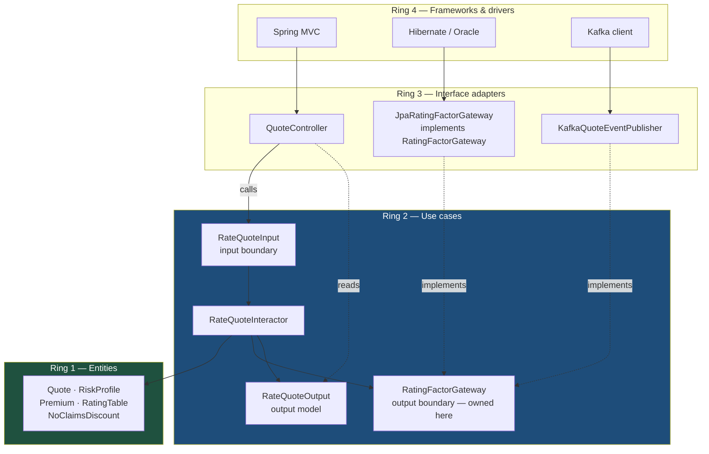

# Clean Architecture: The Dependency Rule, and Where It Stops Paying

Clean architecture is one rule plus four rings: source-code dependencies point only inward, toward policy. Applied to an insurance underwriting engine it is transformative. Applied to a claims-document upload endpoint it produces nine files where two would do — and being honest about which is which is the skill.

## The Real-World Problem

A mid-size motor and home insurer rebuilt its policy administration system. Underwriting — premium rating, eligibility, no-claims discount, regulatory referral thresholds — was implemented inside Hibernate entities annotated for their Oracle schema, with rating factors read via a `@PersistenceContext` `EntityManager` inside the pricing code.

Three things then happened in eighteen months.

First, the actuarial team wanted to replay two years of quotes through a candidate rating model. Because rating required a live Oracle session and lazily-loaded entity graphs, "replay a quote" meant standing up a full database with production-shaped data. The actuaries got a CSV extract instead and ran their model in Excel, so the model that went live had never been executed by the code that would run it.

Second, a regulator asked the insurer to demonstrate, for a specific declined application, exactly which rule declined it and which version of that rule was in force on that date. The answer required reading Hibernate-generated SQL out of application logs.

Third, the insurer acquired a broker whose product needed the same rating rules exposed as a stateless API with no database at all.

The rebuild that followed cost 11 months and roughly 2.3 million EUR, and produced no new customer-visible feature. Every one of the three demands is trivially satisfied when rating is a pure function of inputs. None of them is satisfiable when rating depends on an ORM session. The insurer did not have a technology problem; it had a dependency-direction problem.

## The Concept

### The four rings

| Ring | Contains | Knows about | Framework-aware? |
|---|---|---|---|
| **Entities** | Business objects and invariants true across the whole enterprise: `Policy`, `Premium`, `RiskProfile` | Nothing outside itself | No |
| **Use cases** | Application-specific workflows: `RateQuote`, `BindPolicy`, `RegisterClaim` | Entities | No |
| **Interface adapters** | Controllers, presenters, gateway implementations, ORM mappings | Use cases, entities | Yes |
| **Frameworks & drivers** | Spring Boot, Hibernate, Kafka, the web, the DB | Everything inward | Yes, entirely |

### The dependency rule

> Source code dependencies may point only inward. Nothing in an inner circle may know anything about anything in an outer circle.

Concretely, in a Java 21 codebase: `entity` and `usecase` packages contain no `import org.springframework.*`, no `import jakarta.persistence.*`, no `import com.fasterxml.jackson.*`. When a use case needs the database, it declares an interface it owns and an outer-ring class implements it. Same inversion as hexagonal's secondary ports — clean architecture just names more rings and adds an explicit input/output boundary.

### Boundary crossing: input and output ports, interactors, presenters

The canonical flow is deliberate about direction:

- A **controller** builds an **input model** (a request DTO owned by the use case) and calls an **input boundary** interface.
- An **interactor** implements it, coordinates entities, and pushes an **output model** to an **output boundary**.
- A **presenter** implements the output boundary and turns the output model into a view model.

In practice most enterprise Java teams collapse presenters and let the use case return its output model directly, mapping to a response DTO in the controller. That is a legitimate simplification and costs you almost nothing unless you genuinely have multiple presentation shapes for one use case.

### Entities are not JPA entities

The single most common failure. `@Entity class Policy` is a persistence mapping in the outer ring, not a business entity. If your domain object carries `@Table`, `@ManyToOne(fetch = LAZY)`, and a no-arg constructor demanded by Hibernate, it is a database row wearing a domain object's name — and the insurer above learned what that costs. Keep two types and map between them. Yes, it is mapping code. It is also the entire reason the actuaries can replay quotes without Oracle.

### Where clean architecture over-engineers

Be direct about this, because unqualified enthusiasm here has produced a lot of unmaintainable "clean" codebases:

| Situation | What clean architecture costs | Better choice |
|---|---|---|
| CRUD over one table with no rules (reference data, admin lookups) | 6–9 files per operation, all pass-through | Controller + Spring Data repository. Done |
| Read-only reporting and list screens | Entity → output model → view model mapping for data nobody mutates | Query straight to a projection DTO; skip the rings for reads (CQRS-lite) |
| A team of two shipping an internal tool | Onboarding cost and navigation friction exceed the benefit | Rich-domain layered architecture |
| Presenters where there is one presentation | An interface, an implementation, a view model — forever 1:1 | Return the output model; map in the controller |
| A use-case interface per interactor, always one implementation | Indirection with no substitution and no test benefit | Interface only where a second implementation or a test double is real |
| Wrapping a stable, permanently-chosen dependency | A gateway interface over Postgres you will never leave | Call it directly from the adapter ring; keep the domain clean instead |

The rule that holds: **apply the rings where the business logic is worth protecting, and let everything else be simple.** Mixed strictness inside one codebase is not inconsistency, it is proportion — the same argument as [../01-core-concepts/02-yagni-kiss-dry.md](../01-core-concepts/02-yagni-kiss-dry.md).

## How It Works



Every solid arrow runs inward. The two dotted "implements" arrows are the inversion that lets an outer ring satisfy an inner ring's requirement without the inner ring knowing it exists.

## Practical Example

### Module layout

```
underwriting/
├── underwriting-entities/              # Ring 1 — pure Java, zero dependencies
│   └── src/main/java/com/insurer/uw/entity/
│       ├── Quote.java
│       ├── RiskProfile.java
│       ├── Premium.java
│       ├── NoClaimsDiscount.java
│       ├── RatingTable.java            # immutable, version-stamped
│       └── RuleVersion.java            # what the regulator asked for
├── underwriting-usecase/               # Ring 2 — depends on entities only
│   └── src/main/java/com/insurer/uw/usecase/
│       ├── ratequote/
│       │   ├── RateQuoteInput.java     # input boundary (interface)
│       │   ├── RateQuoteRequest.java   # input model
│       │   ├── RateQuoteResponse.java  # output model
│       │   └── RateQuoteInteractor.java
│       ├── bindpolicy/…
│       └── gateway/                    # output boundaries, owned by ring 2
│           ├── RatingFactorGateway.java
│           ├── QuoteGateway.java
│           └── UnderwritingEventGateway.java
├── underwriting-adapter/               # Ring 3
│   └── src/main/java/com/insurer/uw/adapter/
│       ├── web/QuoteController.java
│       ├── web/dto/{QuoteHttpRequest,QuoteHttpResponse}.java
│       ├── persistence/JpaRatingFactorGateway.java
│       ├── persistence/entity/RatingFactorJpaRow.java   # @Entity lives HERE
│       ├── persistence/mapper/RatingTableMapper.java
│       └── messaging/KafkaUnderwritingEventGateway.java
└── underwriting-app/                   # Ring 4 — Spring Boot, wiring, config
    └── src/main/java/com/insurer/uw/UnderwritingApplication.java
```

### Ring 1 — an entity that holds a rule and nothing else

```java
// entity/RiskProfile.java
public record RiskProfile(int driverAge, int licenceYears, PostcodeBand band,
                          int claimsLast5Years, VehicleGroup vehicleGroup) {

    public boolean requiresManualReferral() {
        return driverAge < 21 || claimsLast5Years >= 3 || vehicleGroup.isHighPerformance();
    }
}
```

```java
// entity/Quote.java — rating is a pure function of (profile, table)
public final class Quote {

    private final QuoteId id;
    private final RiskProfile profile;
    private final RuleVersion ruleVersion;
    private Premium premium;
    private QuoteStatus status = QuoteStatus.NEW;
    private String declineReason;

    public Quote(QuoteId id, RiskProfile profile, RuleVersion ruleVersion) {
        this.id = id;
        this.profile = profile;
        this.ruleVersion = ruleVersion;
    }

    public void rate(RatingTable table, NoClaimsDiscount ncd) {
        if (profile.requiresManualReferral()) {
            status = QuoteStatus.REFERRED;
            declineReason = "manual_referral_threshold";
            return;
        }
        var base = table.baseRate(profile.vehicleGroup(), profile.band());
        var loaded = base.multiply(table.ageLoading(profile.driverAge()));
        this.premium = ncd.applyTo(loaded).roundedToMinorUnit();
        this.status = QuoteStatus.RATED;
    }

    public RuleVersion ruleVersion() { return ruleVersion; }   // audit answer, by construction
}
```

No Hibernate, no Spring, no clock, no I/O. The actuarial replay is now a loop over 700,000 `RiskProfile` records with a candidate `RatingTable` — in-process, no database.

### Ring 2 — the interactor and the gateway it owns

```java
// usecase/gateway/RatingFactorGateway.java — declared inward, implemented outward
public interface RatingFactorGateway {
    RatingTable tableInForceAt(ProductCode product, LocalDate effectiveDate);
    NoClaimsDiscount discountFor(CustomerId customer);
}
```

```java
// usecase/ratequote/RateQuoteInteractor.java
public class RateQuoteInteractor implements RateQuoteInput {

    private final RatingFactorGateway ratingFactors;
    private final QuoteGateway quotes;
    private final UnderwritingEventGateway events;
    private final Supplier<QuoteId> idGenerator;

    public RateQuoteInteractor(RatingFactorGateway ratingFactors,
                               QuoteGateway quotes,
                               UnderwritingEventGateway events,
                               Supplier<QuoteId> idGenerator) {
        this.ratingFactors = ratingFactors;
        this.quotes = quotes;
        this.events = events;
        this.idGenerator = idGenerator;
    }

    @Override
    public RateQuoteResponse rate(RateQuoteRequest request) {
        var table = ratingFactors.tableInForceAt(request.product(), request.effectiveDate());
        var ncd = ratingFactors.discountFor(request.customerId());

        var quote = new Quote(idGenerator.get(), request.toRiskProfile(), table.version());
        quote.rate(table, ncd);

        quotes.save(quote);
        events.quoteRated(quote.id(), quote.status(), table.version());

        return RateQuoteResponse.from(quote);
    }
}
```

Note what is absent: `@Service`, `@Transactional`, `@Autowired`. Ring 2 has no Spring on its classpath. Wiring happens in ring 4.

### Ring 3 and 4 — where the framework is allowed

```java
// adapter/web/QuoteController.java
@RestController
@RequestMapping("/api/v1/quotes")
class QuoteController {

    private final RateQuoteInput rateQuote;

    QuoteController(RateQuoteInput rateQuote) {   // constructor injection
        this.rateQuote = rateQuote;
    }

    @PostMapping
    ResponseEntity<QuoteHttpResponse> create(@Valid @RequestBody QuoteHttpRequest body) {
        var response = rateQuote.rate(body.toUseCaseRequest());
        return ResponseEntity.status(HttpStatus.CREATED)
                             .body(QuoteHttpResponse.from(response));
    }
}
```

```java
// app/config/UnderwritingWiring.java — ring 4 assembles the graph
@Configuration
class UnderwritingWiring {

    @Bean
    RateQuoteInput rateQuoteInput(RatingFactorGateway ratingFactors,
                                  QuoteGateway quotes,
                                  UnderwritingEventGateway events) {
        return new RateQuoteInteractor(ratingFactors, quotes, events,
                                       () -> QuoteId.of(UUID.randomUUID()));
    }
}
```

### The dependency rule as a CI check, not a code-review opinion

```java
@AnalyzeClasses(packages = "com.insurer.uw")
class DependencyRuleTest {

    @ArchTest
    static final ArchRule entities_depend_on_nothing =
        classes().that().resideInAPackage("..uw.entity..")
            .should().onlyDependOnClassesThat()
            .resideInAnyPackage("..uw.entity..", "java..", "javax.money..");

    @ArchTest
    static final ArchRule usecases_are_framework_free =
        noClasses().that().resideInAPackage("..uw.usecase..")
            .should().dependOnClassesThat()
            .resideInAnyPackage("org.springframework..", "jakarta.persistence..",
                                "com.fasterxml.jackson..");
}
```

### The TypeScript side gets the same treatment

The broker portal reuses the rating rules in the browser for an indicative quote, so the entity layer is ported once and shared — pure functions, no fetch client anywhere near them.

```ts
// packages/underwriting-entities/src/rateQuote.ts — no HTTP, no framework
export type RiskProfile = {
  driverAge: number
  licenceYears: number
  band: PostcodeBand
  claimsLast5Years: number
  vehicleGroup: VehicleGroup
}

export function requiresManualReferral(p: RiskProfile): boolean {
  return p.driverAge < 21 || p.claimsLast5Years >= 3 || isHighPerformance(p.vehicleGroup)
}

export function rate(p: RiskProfile, table: RatingTable, ncd: NoClaimsDiscount): RatingOutcome {
  if (requiresManualReferral(p)) return { status: 'REFERRED', reason: 'manual_referral_threshold' }
  const base = baseRate(table, p.vehicleGroup, p.band)
  return { status: 'RATED', premium: applyNcd(base * ageLoading(table, p.driverAge), ncd) }
}
```

## Enterprise Trade-offs

| Approach | Pros | Cons | When to use (Banking / Insurance / Enterprise) |
|---|---|---|---|
| **Full clean architecture, four rings as modules** | Rules replayable and auditable without infrastructure; dependency rule enforced by the compiler | Highest file count; mapping at three boundaries; steepest onboarding | Insurance rating and underwriting engines; banking limit and pricing engines |
| **Clean rings, presenters collapsed** | Nearly all the benefit at ~30% less code | Loses multi-presentation flexibility you probably never needed | The sensible default for enterprise Java in 2026 |
| **Clean for writes, direct projections for reads** | Removes mapping cost where nothing is mutated; fast list screens | Two idioms in one codebase; must be documented | Insurance back-office and ERP screens with heavy read traffic |
| **Hexagonal instead** | Same inversion, less taxonomy, fewer rings to argue about | Less explicit about entities vs. application policy | Services whose value is integration-swapping more than rule purity |
| **Rich-domain layered** | Cheapest to staff and read | Rules need a DB to test; infrastructure changes reach service code | Internal ERP modules, stable persistence, modest rule complexity |
| **JPA entities as domain entities** | No mapping code | The insurer's scenario: rules unrunnable without the database | Only for genuinely anaemic CRUD with no auditable logic |

→ Next: [04-microservices-vs-monolith.md](04-microservices-vs-monolith.md) · Related: [02-hexagonal-architecture.md](02-hexagonal-architecture.md) · [../01-core-concepts/02-yagni-kiss-dry.md](../01-core-concepts/02-yagni-kiss-dry.md) · [../06-database-strategies/03-normalization-vs-denormalization.md](../06-database-strategies/03-normalization-vs-denormalization.md)
