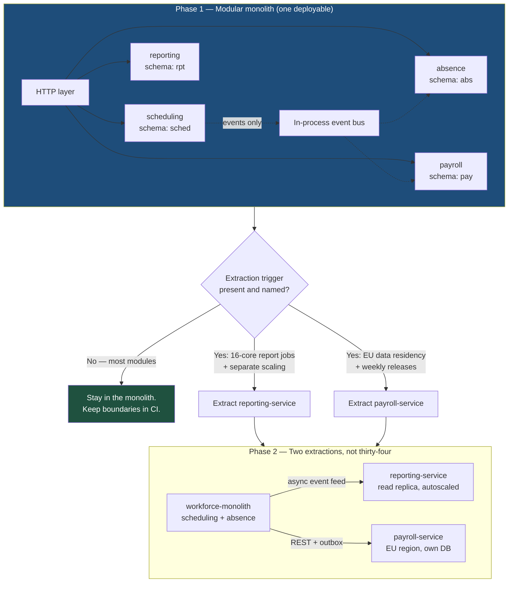

# Start With a Modular Monolith: Earn Your Microservices

The 2026 default for a new enterprise system is a modular monolith with enforced internal boundaries, extracted into services only where a specific, measurable pressure demands it. Microservices are not an architecture you adopt; they are a bill you pay for independent deployment and independent scaling. Pay it where you need those things and nowhere else.

## The Real-World Problem

An Enterprise Solutions vendor selling a workforce-management suite — scheduling, time capture, absence, payroll export, reporting — decided its Java monolith was the reason releases took three weeks. The programme split it into 34 microservices across two years, one per domain noun, run on Kubernetes with a service mesh.

What actually happened:

- **Latency.** Rendering one week of a store's schedule for 60 employees previously ran as three SQL joins in 40 ms. After the split it fanned out to `employee-service`, `shift-service`, `availability-service`, `absence-service`, and `skills-service`. Median went to 380 ms, p99 to 2.4 s. A single mid-tier retail chain's schedule view accounted for 900,000 internal calls per hour.
- **Consistency.** Approving a shift swap wrote to three services. There was no transaction. When `absence-service` rejected the write after `shift-service` had committed, the schedule showed two employees on one shift. Support logged 1,100 such tickets in a year and the fix was a nightly reconciliation job.
- **Operations.** 34 services meant 34 pipelines, 34 dashboards, 34 on-call runbooks, 34 dependency-upgrade streams. The platform team grew from 3 to 11 engineers and the CVE-patching backlog still grew.
- **Release speed — the original goal.** Still three weeks, because 12 of the 34 services had to be released together. The coupling had not been removed, only moved into the network and made invisible to the compiler.

Total programme spend was roughly 8 million EUR. The vendor later consolidated back to 6 services. The three-week release cycle was caused by a manual regression suite and a shared release train, not by the monolith — and neither of those is an architecture problem.

## The Concept

### A monolith is not the opposite of modular

Two independent axes, routinely confused:

| | **One deployable** | **Many deployables** |
|---|---|---|
| **Clear module boundaries** | **Modular monolith** — the 2026 default | **Microservices** — earned, not assumed |
| **No boundaries** | Big ball of mud | **Distributed monolith** — worst of both |

The vendor above moved from bottom-left to bottom-right. That is the most expensive move on the grid, and the most common.

### What a modular monolith requires

Not "put it all in one repo and hope". Specifically:

1. **Package by bounded context**, not by layer: `scheduling/`, `absence/`, `payroll/` — each with its own internal layering.
2. **A published API per module.** One public package; everything else package-private or explicitly internal.
3. **No cross-module database access.** `absence` may not join to `scheduling`'s tables. Separate schemas in one physical database is the strongest practical form.
4. **In-process events for cross-module reactions**, so modules don't call each other synchronously for side effects.
5. **Boundaries enforced in CI** — Spring Modulith or ArchUnit fails the build on a violating import.

You keep single-transaction consistency, one deployment, one debugger, and refactorable boundaries, while paying for none of the network.

### When to extract a service — the actual triggers

Extract when at least one of these is true and named in the ticket:

| Trigger | Concrete signal | Example |
|---|---|---|
| **Independent scaling** | One module's resource profile is order-of-magnitude different | Report generation pinning 16 cores while the rest of the app idles |
| **Independent deploy cadence** | A module needs daily releases while the rest is quarterly | A rules engine tuned weekly under a regulator's watch |
| **Team autonomy at scale** | Two-plus teams blocking each other in one deployable, measurably | 40+ engineers, contended release train |
| **Different runtime or SLA** | Needs a different language, GPU, or a hard isolation boundary | Document OCR/ML inference, PCI-scoped card handling |
| **Blast-radius isolation** | A crash or memory leak here must not take everything down | Third-party integration hub, tenant-specific plug-ins |
| **Data-residency or compliance** | Data must live in a specific jurisdiction or scope | EU-only payroll data; PCI cardholder data environment |

Not a trigger: "the module is big", "the team wants to try Kubernetes", "microservices are best practice", "so we can reuse it later".

### The distributed-system bill, itemised

| Cost | What you actually pay |
|---|---|
| **Network** | Every in-process call becomes a fallible, latency-bearing remote call. Availability multiplies down: five 99.9% dependencies in series ≈ 99.5% |
| **Data consistency** | No distributed transactions. Sagas, compensating actions, idempotency keys, and eventual consistency the UI must display |
| **Operational surface** | Per service: pipeline, image, secrets, dashboards, alerts, SLOs, runbook, on-call, dependency upgrades |
| **Debuggability** | A stack trace becomes a distributed trace. Correlation IDs, structured logs, and trace propagation stop being optional |
| **Contract management** | Versioning, backward compatibility, contract tests — the compiler no longer checks calls |
| **Local development** | You cannot run 34 services on a laptop. Someone owns Testcontainers or shared dev environments |

Every item is solvable and every item costs engineer-months forever. Read this alongside [../01-core-concepts/03-failure-modes-and-resilience.md](../01-core-concepts/03-failure-modes-and-resilience.md), because each extraction adds failure modes you must now design for explicitly.

### Extraction is mechanical if the module was clean

A well-bounded module extracts by replacing an in-process call with a remote adapter behind the same interface — which is exactly the hexagonal secondary-port trick from [02-hexagonal-architecture.md](02-hexagonal-architecture.md). If extraction feels hard, the boundary was wrong, and extracting it will make that permanent.

## How It Works



The decision gate is the architecture. Everything without a named trigger stays in the deployable that costs nothing extra to operate.

## Practical Example

### Modular monolith layout with enforced boundaries

```
workforce/
├── build.gradle.kts
└── src/main/java/com/vendor/workforce/
    ├── WorkforceApplication.java
    ├── scheduling/
    │   ├── ScheduleApi.java                 # PUBLIC — the module's only exported type
    │   ├── ScheduleEvents.java              # PUBLIC — published event records
    │   ├── internal/                        # package-private implementation
    │   │   ├── ShiftService.java
    │   │   ├── Shift.java
    │   │   └── ShiftJpaRepository.java
    │   └── package-info.java                # @ApplicationModule
    ├── absence/
    │   ├── AbsenceApi.java
    │   ├── internal/…
    │   └── package-info.java
    ├── payroll/
    │   ├── PayrollApi.java
    │   ├── internal/…
    │   └── package-info.java
    └── shared/                              # value types only: Money, EmployeeId, DateRange
        └── EmployeeId.java
```

```java
// scheduling/package-info.java — declares what this module is allowed to see
@org.springframework.modulith.ApplicationModule(
    allowedDependencies = { "shared" }        // NOT absence, NOT payroll
)
package com.vendor.workforce.scheduling;
```

```java
// The build fails if anyone imports com.vendor.workforce.absence.internal.*
class ModuleBoundaryTest {

    @Test
    void modules_respect_declared_dependencies() {
        ApplicationModules.of(WorkforceApplication.class).verify();
    }
}
```

### Cross-module reaction without a synchronous call

```java
// scheduling/internal/ShiftService.java
@Service
class ShiftService {

    private final ShiftJpaRepository shifts;
    private final ApplicationEventPublisher events;

    ShiftService(ShiftJpaRepository shifts, ApplicationEventPublisher events) {
        this.shifts = shifts;
        this.events = events;
    }

    @Transactional
    public ShiftId assign(EmployeeId employee, ShiftSlot slot) {
        var shift = shifts.save(Shift.assign(employee, slot));
        // One local transaction. The listener below commits in the SAME transaction —
        // no network, no saga, no reconciliation job.
        events.publishEvent(new ScheduleEvents.ShiftAssigned(shift.id(), employee, slot));
        return shift.id();
    }
}
```

```java
// absence/internal/ScheduleConflictListener.java
@Component
class ScheduleConflictListener {

    private final AbsenceRegistry registry;

    ScheduleConflictListener(AbsenceRegistry registry) {
        this.registry = registry;
    }

    @EventListener
    void on(ScheduleEvents.ShiftAssigned event) {
        registry.flagIfOnApprovedLeave(event.employee(), event.slot());
    }
}
```

### The extraction, when a trigger finally appears

`reporting` starts pinning 16 cores. Extract it — and note that the calling code does not change, because the dependency was already an interface.

```java
// Before: in-process. After: the SAME interface, a remote adapter.
public interface ReportingApi {
    ReportHandle requestWeeklyPayrollReport(TenantId tenant, YearWeek week);
}
```

```java
// scheduling-side adapter after extraction — resilience is now mandatory
@Component
class RemoteReportingAdapter implements ReportingApi {

    private final RestClient http;

    RemoteReportingAdapter(RestClient.Builder builder,
                           @Value("${reporting.base-url}") String baseUrl) {
        var factory = new SimpleClientHttpRequestFactory();
        factory.setConnectTimeout(Duration.ofMillis(300));
        factory.setReadTimeout(Duration.ofSeconds(2));      // never unbounded
        this.http = builder.baseUrl(baseUrl).requestFactory(factory).build();
    }

    @Override
    @CircuitBreaker(name = "reporting", fallbackMethod = "queued")
    public ReportHandle requestWeeklyPayrollReport(TenantId tenant, YearWeek week) {
        return http.post()
            .uri("/internal/v1/reports/weekly-payroll")
            .body(new ReportRequest(tenant.value(), week.toString()))
            .retrieve()
            .body(ReportHandle.class);
    }

    private ReportHandle queued(TenantId tenant, YearWeek week, Throwable cause) {
        return ReportHandle.deferred(tenant, week);          // defined degraded path
    }
}
```

### The N+1 fan-out that killed the schedule view — and the fix

```ts
// BEFORE (Node BFF): 1 + 4N remote calls to render one week
async function weekView(storeId: string, week: string) {
  const shifts = await shiftClient.byStore(storeId, week)        // 1 call
  return Promise.all(shifts.map(async (s) => ({                  // 4 calls × 60 shifts
    ...s,
    employee: await employeeClient.byId(s.employeeId),
    availability: await availabilityClient.byId(s.employeeId),
    absence: await absenceClient.byId(s.employeeId),
    skills: await skillsClient.byId(s.employeeId),
  })))
}

// AFTER: one call to a module that owns the join, because scheduling and employee
// data belong to the same bounded context and never should have been split.
async function weekView(storeId: string, week: string) {
  const res = await fetch(
    `${SCHEDULING_URL}/internal/v1/stores/${storeId}/weeks/${week}/view`,
    { signal: AbortSignal.timeout(2_000) },
  )
  if (!res.ok) throw new UpstreamError('scheduling', res.status)
  return weekViewSchema.parse(await res.json())
}
```

The lesson is not "batch your calls". It is that a boundary requiring a five-way join on every read is not a boundary.

## Enterprise Trade-offs

| Approach | Pros | Cons | When to use (Banking / Insurance / Enterprise) |
|---|---|---|---|
| **Modular monolith with CI-enforced boundaries** | ACID transactions; one pipeline; refactorable boundaries; cheapest to operate | Single scaling unit; one runtime; needs real discipline | Default for new enterprise systems and ERP suites; teams under ~40 engineers |
| **Modular monolith + 2–5 extracted services** | Independence exactly where a trigger exists; bounded operational cost | Two operating models; needs contract tests and tracing | The realistic 2026 enterprise target: ERP core plus reporting, document/ML, PCI-scoped services |
| **Microservices per bounded context (8–15)** | Genuine team and deploy autonomy; per-service scaling | Sagas; platform team required; distributed debugging | Banks with large, long-lived, independently-funded product teams |
| **Microservices per entity/noun (30+)** | — | The vendor's scenario: fan-out latency, broken invariants, unchanged release speed | Never. Entity-per-service is not a boundary |
| **Big-ball-of-mud monolith** | Fast on day one | Every change is global; no safe extraction path later | Only for spikes with a deletion date |
| **Distributed monolith (services that release together)** | — | Network cost of microservices, coupling of a monolith, no autonomy | Never — merge them back |

→ Next: [05-event-driven-architecture.md](05-event-driven-architecture.md) · Related: [../01-core-concepts/03-failure-modes-and-resilience.md](../01-core-concepts/03-failure-modes-and-resilience.md) · [../00-project-setup-roadmap/07-observability.md](../00-project-setup-roadmap/07-observability.md) · [../05-apis-and-integration/03-grpc-and-protobuf-for-internal-services.md](../05-apis-and-integration/03-grpc-and-protobuf-for-internal-services.md)
