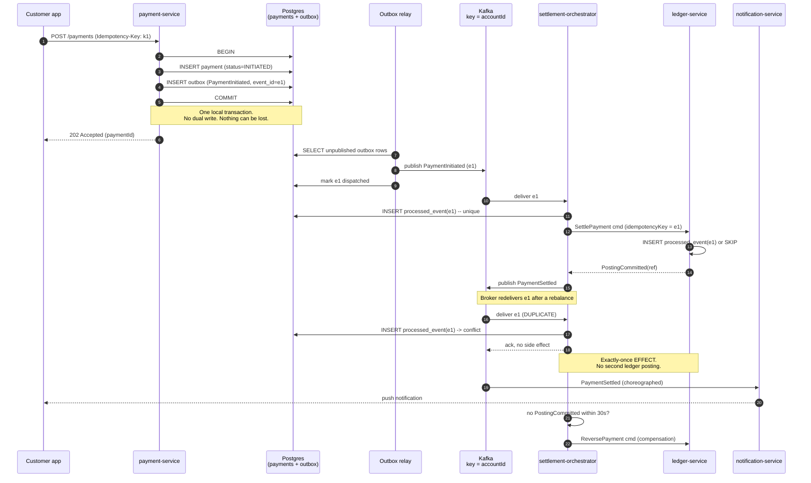

# Events, Exactly Once, and Other Lies: Event-Driven Architecture in Payments

Every practical message broker delivers at least once, which means your consumer will see the same payment event twice and must not move the money twice. Event-driven architecture is not about the broker; it is about the four disciplines — idempotency, the outbox, ordering, and a deliberate choice between choreography and orchestration — that make redelivery boring.

## The Real-World Problem

A bank ran instant domestic payments through Kafka. `payment-service` committed a debit to Postgres, then published `PaymentInitiated`. Downstream, `settlement-service` posted to the ledger, `notification-service` pushed the customer alert, and `fraud-service` scored the transaction.

Two defects lived in that description.

**The dual write.** The database commit and the Kafka publish were separate operations with no shared transaction. During a broker leader election one afternoon, 2,300 payments committed to Postgres and never published. Customers saw money leave their account; the ledger never received a posting. Reconciliation found the gap at 02:00 the following day. Repairing it required a hand-written replay script reviewed by two people under change control, and the bank filed a payment-incident report with its regulator.

**Non-idempotent consumers.** Separately, a consumer group rebalance during a deployment caused redelivery of an uncommitted offset range. `settlement-service` posted 412 ledger entries a second time. Because the ledger is append-only and immutable, the correction was 412 compensating entries, each individually explainable to an auditor. Four engineers spent nine days on it.

Neither incident was caused by Kafka misbehaving. Kafka did exactly what it promises: at-least-once delivery, and no knowledge of your database transaction. Combined cost was roughly 340 engineer-days plus two regulatory filings, and both are prevented by patterns that were well understood a decade earlier.

## The Concept

### Events vs. commands — the distinction that shapes your coupling

| | **Event** | **Command** |
|---|---|---|
| Meaning | A fact that already happened | A request for something to happen |
| Naming | Past tense: `PaymentSettled` | Imperative: `SettlePayment` |
| Recipients | Zero to many, unknown to the publisher | Exactly one, known |
| Can it be rejected? | No — it is history | Yes — the handler may refuse |
| Ownership of the payload | The publisher | The receiver defines the contract |
| Coupling | Publisher knows nothing about consumers | Sender knows the receiver exists |

Publish events to broadcast facts; send commands to request work. The failure to keep these apart produces "events" like `SendCustomerEmail` — a command in event clothing, with one required consumer and an implicit contract that breaks silently.

### Choreography vs. orchestration

**Choreography** — each service reacts to events and publishes its own. No central coordinator.
**Orchestration** — a coordinator (a saga orchestrator or a workflow engine) sends commands and tracks state.

| | Choreography | Orchestration |
|---|---|---|
| Coupling | Loosest | Coordinator knows every participant |
| Visibility of the whole flow | Nowhere in code — inferred from traces | One readable state machine |
| Adding a participant | Subscribe; no existing code changes | Edit the orchestrator |
| Compensation on failure | Each service must know how to undo, reactively | Coordinator drives compensating commands in order |
| Debugging "where is payment X?" | Hard | Query the saga state |
| Good for | 2–3 steps, notification-shaped reactions | 4+ steps, money movement, mandatory compensation |

For a regulated payment with mandatory compensation and an auditor who will ask where a specific payment is, orchestrate. Use choreography for the reactions hanging off the edges — notifications, analytics, reporting projections.

### At-least-once delivery, and why "exactly once" is a scope trick

Exactly-once *delivery* across a network and a database is not achievable. What is achievable is exactly-once *effect*: at-least-once delivery plus an idempotent consumer. Kafka's transactions give you exactly-once semantics for Kafka-to-Kafka processing only — the moment your side effect is a ledger posting or a REST call to a scheme gateway, you are back to designing idempotency yourself.

### Idempotent consumers: three implementations

| Technique | How | Use when |
|---|---|---|
| **Processed-message table** | Insert `event_id` with a unique constraint in the same transaction as the side effect; duplicate insert means skip | Default for anything touching a database |
| **Natural idempotency** | The operation is a set, not an increment: `status = SETTLED`, upsert by key | Projections, status updates |
| **Downstream idempotency key** | Send a deterministic key derived from `event_id` to the external API | Calls to schemes, PSPs, core banking |

`counter = counter + 1` on redelivery is the archetypal bug. Design the side effect so applying it twice is indistinguishable from applying it once.

### The transactional outbox

Never write to your database and publish to a broker as two operations. Instead:

1. In **one** local transaction, write business state **and** insert the event into an `outbox` table.
2. A separate relay reads the outbox and publishes to the broker, marking rows dispatched.
3. If the relay crashes mid-publish, it republishes — which is fine, because consumers are idempotent.

This converts an unsolvable distributed-transaction problem into one local transaction plus at-least-once redelivery. It is the fix for the 2,300 missing payments.

### Ordering

Brokers guarantee order only within a partition. Two rules:

- **Partition by the entity whose order matters.** Key by `accountId` (not `paymentId`) when postings against one account must be sequential.
- **Do not rely on cross-entity ordering.** Include a monotonic `sequence` or `occurredAt` in the payload and let consumers detect and reject stale updates.

Concurrency inside one partition is the other trap: parallel handlers within a partition destroy the ordering the partition gave you.

## How It Works



The two load-bearing details: the commit boundary in steps 2–5, and the duplicate delivery that produces an ack with no effect.

## Practical Example

### Outbox schema

```sql
CREATE TABLE outbox (
    id             BIGSERIAL    PRIMARY KEY,
    event_id       UUID         NOT NULL UNIQUE,
    aggregate_type VARCHAR(64)  NOT NULL,
    aggregate_id   VARCHAR(64)  NOT NULL,
    partition_key  VARCHAR(64)  NOT NULL,   -- accountId: preserves per-account order
    event_type     VARCHAR(128) NOT NULL,
    payload        JSONB        NOT NULL,
    occurred_at    TIMESTAMPTZ  NOT NULL DEFAULT now(),
    dispatched_at  TIMESTAMPTZ
);
CREATE INDEX idx_outbox_pending ON outbox (id) WHERE dispatched_at IS NULL;

CREATE TABLE processed_event (
    event_id    UUID        PRIMARY KEY,
    consumer    VARCHAR(64) NOT NULL,
    processed_at TIMESTAMPTZ NOT NULL DEFAULT now()
);
```

### Writing state and event in one transaction

```java
@Service
public class InitiatePaymentService {

    private final PaymentRepository payments;
    private final OutboxRepository outbox;
    private final ObjectMapper json;
    private final Clock clock;

    InitiatePaymentService(PaymentRepository payments, OutboxRepository outbox,
                           ObjectMapper json, Clock clock) {
        this.payments = payments;
        this.outbox = outbox;
        this.json = json;
        this.clock = clock;
    }

    @Transactional     // the ONLY transaction. No broker call inside it.
    public PaymentId initiate(InitiatePaymentCommand cmd) {
        var existing = payments.findByIdempotencyKey(cmd.idempotencyKey());
        if (existing.isPresent()) return existing.get().id();      // caller-side idempotency

        var payment = Payment.initiate(cmd.debtor(), cmd.creditor(), cmd.amount(),
                                       cmd.idempotencyKey(), clock.instant());
        payments.save(payment);

        var event = new PaymentInitiated(
                UUID.randomUUID(), payment.id().value(), cmd.debtor().value(),
                cmd.creditor().value(), cmd.amount(), clock.instant());

        outbox.save(OutboxRecord.of(
                event.eventId(), "Payment", payment.id().value(),
                cmd.debtor().value(),                              // partition key = account
                "payment.initiated.v1", json.valueToTree(event), clock.instant()));

        return payment.id();
    }
}
```

### The relay

```java
@Component
class OutboxRelay {

    private static final Logger log = LoggerFactory.getLogger(OutboxRelay.class);

    private final OutboxRepository outbox;
    private final KafkaTemplate<String, String> kafka;

    OutboxRelay(OutboxRepository outbox, KafkaTemplate<String, String> kafka) {
        this.outbox = outbox;
        this.kafka = kafka;
    }

    @Scheduled(fixedDelay = 200)
    @Transactional
    void dispatch() {
        // SKIP LOCKED lets several replicas run without publishing the same row twice.
        var batch = outbox.lockNextPendingBatch(200);
        for (var record : batch) {
            kafka.send(topicFor(record.eventType()), record.partitionKey(),
                       record.payload().toString())
                 .join();                                   // fail the tx if the send fails
            record.markDispatched(Instant.now());
        }
        if (!batch.isEmpty()) log.debug("outbox_dispatched count={}", batch.size());
    }
}
```

```sql
-- OutboxRepository.lockNextPendingBatch
SELECT * FROM outbox
WHERE dispatched_at IS NULL
ORDER BY id
LIMIT :limit
FOR UPDATE SKIP LOCKED;
```

### An idempotent consumer

```java
@Component
class SettlementConsumer {

    private static final String CONSUMER = "settlement-service";

    private final ProcessedEventRepository processed;
    private final LedgerPort ledger;
    private final PaymentStateRepository state;

    SettlementConsumer(ProcessedEventRepository processed, LedgerPort ledger,
                       PaymentStateRepository state) {
        this.processed = processed;
        this.ledger = ledger;
        this.state = state;
    }

    @KafkaListener(topics = "payment.initiated.v1", concurrency = "1")   // order per partition
    @Transactional
    public void on(PaymentInitiated event) {
        // Unique constraint on event_id is the idempotency barrier. Same transaction
        // as the side effect, so a rollback also un-marks the event.
        if (!processed.tryMark(event.eventId(), CONSUMER)) {
            return;                                                     // duplicate: ack, no-op
        }

        var posting = ledger.post(
                new LedgerPosting(event.debtorAccount(), event.creditorAccount(),
                                  event.amount(),
                                  event.eventId().toString()));          // downstream idem key

        state.recordSettled(event.paymentId(), posting.reference());
    }
}
```

```java
// ProcessedEventRepository — the barrier, expressed as a constraint, not a SELECT-then-INSERT
@Repository
class JdbcProcessedEventRepository implements ProcessedEventRepository {

    private final JdbcClient db;

    JdbcProcessedEventRepository(JdbcClient db) { this.db = db; }

    @Override
    public boolean tryMark(UUID eventId, String consumer) {
        return db.sql("""
                INSERT INTO processed_event (event_id, consumer)
                VALUES (:id, :consumer)
                ON CONFLICT (event_id) DO NOTHING
                """)
                 .param("id", eventId)
                 .param("consumer", consumer)
                 .update() == 1;
    }
}
```

A `SELECT` followed by an `INSERT` is not a barrier — two concurrent redeliveries both pass the check. The unique constraint is the barrier.

### Consumer configuration that matches the design

```yaml
spring:
  kafka:
    consumer:
      group-id: settlement-service
      enable-auto-commit: false          # commit after the transaction, never before
      isolation-level: read_committed
      max-poll-records: 50
      properties:
        max.poll.interval.ms: 300000
    listener:
      ack-mode: manual_immediate
    producer:
      acks: all                          # no acknowledged-but-unreplicated publishes
      enable-idempotence: true
      properties:
        max.in.flight.requests.per.connection: 5
```

### A Node consumer for the choreographed edge

Notifications are a genuine fire-and-forget reaction — choreographed, not orchestrated.

```ts
// notification-service: idempotent by natural key, no orchestration needed
consumer.run({
  eachMessage: async ({ message }) => {
    const event = paymentSettledSchema.parse(JSON.parse(message.value!.toString()))

    // Upsert on (eventId) — a redelivery updates the same row instead of sending twice.
    const inserted = await db.query(
      `INSERT INTO sent_notification (event_id, payment_id, sent_at)
       VALUES ($1, $2, now()) ON CONFLICT (event_id) DO NOTHING`,
      [event.eventId, event.paymentId],
    )
    if (inserted.rowCount === 0) return

    await push.send(event.customerId, formatSettlementAlert(event))
  },
})
```

## Enterprise Trade-offs

| Approach | Pros | Cons | When to use (Banking / Insurance / Enterprise) |
|---|---|---|---|
| **Outbox + idempotent consumers + orchestrated saga** | No lost or duplicated effects; flow state queryable for audit; compensation is explicit | Most moving parts; relay to operate; saga state to model | Payments, settlement, insurance claim payout — any money movement with an auditor |
| **Outbox + choreographed events** | Loose coupling; new subscribers cost nothing | No single view of the flow; compensation scattered | Notifications, analytics feeds, read-model projections, ERP audit trails |
| **Direct publish after commit (dual write)** | Trivial to write | The 2,300 lost payments. Silent, and found by reconciliation | Never for state that must exist downstream |
| **Change Data Capture (Debezium) instead of an outbox table** | No application code; captures everything | Events shaped like your schema, not your domain; schema changes leak to consumers | Legacy systems you cannot modify; analytics pipelines |
| **Synchronous REST across the whole flow** | Immediate consistency; simple mental model; easy to trace | Availability multiplies down; caller waits for the slowest hop | Short flows needing an immediate answer: balance check, fraud pre-authorisation |
| **Exactly-once via Kafka transactions only** | Genuine EOS for Kafka-to-Kafka | Does not extend to your DB, ledger, or external scheme calls | Stream processing and aggregation, never as a substitute for consumer idempotency |

→ Next: [06-choosing-the-right-architecture.md](06-choosing-the-right-architecture.md) · Related: [../01-core-concepts/03-failure-modes-and-resilience.md](../01-core-concepts/03-failure-modes-and-resilience.md) · [../01-core-concepts/04-data-integrity-and-migrations.md](../01-core-concepts/04-data-integrity-and-migrations.md) · [02-hexagonal-architecture.md](02-hexagonal-architecture.md)
