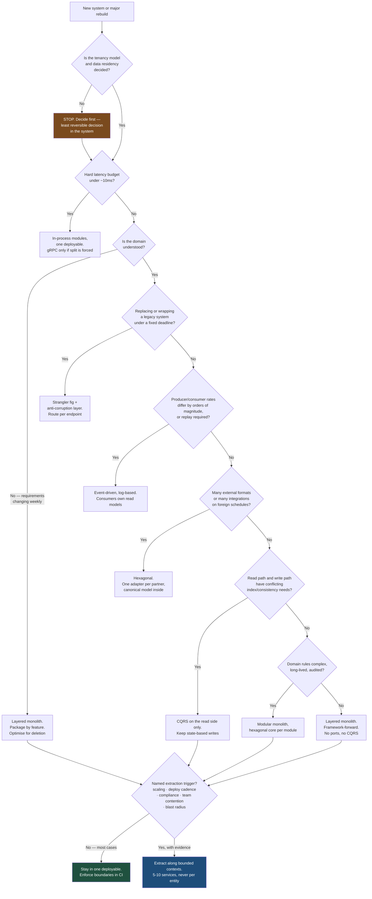

# Choosing the Right Architecture: A Decision Table, Not a Preference

There is no best architecture, only a defensible match between a situation and a structure. This article is the decision table the previous five build up to — plus the two things that decide whether a wrong choice is survivable: reversibility, and the costs teams reliably forget to count.

## The Real-World Problem

A regional bank ran an architecture review board that approved one target architecture for everything: microservices, event-sourced, CQRS on every read path, hexagonal in every service. It was a genuinely good architecture — for the payments core it had been designed for.

Over eighteen months that template was applied to four unrelated things.

The **branch appointment booker** — six tables, four screens, used by 200 staff — shipped as three services with an event store and separate read models. It took five months instead of five weeks, and a bug where the read model lagged the write model meant a slot could be double-booked. The team spent more time on projection rebuilds than on the booking domain.

The **regulatory reporting extract**, a nightly job producing four fixed files, was rebuilt as an event-driven pipeline of seven consumers. When one consumer fell behind, the extract missed the 06:00 submission window. There was no back-pressure design because the template did not have one.

The **treasury dealing desk** integration needed sub-5 ms round trips. Event sourcing put two hops and a projection between a quote request and a price. It was rewritten as an in-process module inside the pricing engine after four months.

And the **customer onboarding rebuild** — where the template genuinely fitted — succeeded, which is why nobody questioned the template.

The board's error was not choosing microservices. It was answering an architecture question with a standard rather than with a decision, and never asking what the situation actually demanded. Two of the four projects were later rewritten. Combined waste: roughly 14 engineer-years.

## The Concept

### Architecture answers a forced question

An architecture is not a set of good ideas; it is a set of constraints that trades some qualities for others. Before choosing, name the property you are buying:

| Property you need | What buys it |
|---|---|
| Testable business logic independent of frameworks | Hexagonal / clean |
| Independent deployment and scaling | Separate services |
| Temporal decoupling and replay | Events, log-based |
| Lowest possible latency | One process, fewest hops |
| Fastest time to first release | Layered monolith |
| Auditable history of every state change | Event sourcing |
| Domain clarity when the domain is unknown | Something cheap to delete |

If you cannot name which of these the project is buying, you are not ready to choose, and the safe answer is the cheapest structure that keeps options open.

### The reversibility principle

Rank decisions by the cost of undoing them, and spend your caution accordingly.

| Decision | Reversibility | Implication |
|---|---|---|
| Package structure, module boundaries | Hours to days | Just decide; refactor when you learn more |
| Layered → hexagonal inside one deployable | Days to weeks | Adopt incrementally, per module |
| Monolith → extract one service | Weeks | Fine to do later, if the boundary was clean |
| Sync REST → async events for one flow | Weeks | Add per flow, not estate-wide |
| Microservices → back to a monolith | Quarters | Expensive. Be sure before splitting |
| CRUD state → event sourcing | Quarters | Very hard to reverse; needs a real driver |
| Choice of primary database engine | Quarters to years | The stickiest technical decision you will make |
| Multi-tenancy model (shared vs. isolated) | Years | Effectively permanent. Decide it first, deliberately |

Two rules follow. **Prefer the decision you can undo**, when the reversible option is merely adequate and the irreversible one is only somewhat better. And **make irreversible decisions late**, when you know most — except multi-tenancy and data residency, which must be decided first because retrofitting them means rewriting every query.

### The costs teams systematically underestimate

| Cost | Underestimated by | Why it is missed |
|---|---|---|
| **Operating a service** | 3–5× | The build is quoted; the pipeline, dashboards, alerts, SLO, runbook, on-call rotation and dependency upgrades — forever — are not |
| **Eventual consistency in the UI** | Large | Every screen needs a pending state, every workflow a reconciliation story, and support needs an explanation for "I saved it but it's not there" |
| **Distributed debugging** | Large | A stack trace becomes a correlation exercise. Tracing must exist before the split, not after the first incident |
| **Contract evolution** | Moderate | The compiler stops checking calls. Versioning, deprecation windows and contract tests become permanent process |
| **Local development** | Moderate | Nobody runs 20 services on a laptop. Someone owns Testcontainers or shared environments as a real job |
| **Event schema management** | Large | Events are a published API with an unbounded retention period. A bad event schema is forever |
| **Cognitive load** | Very large | Onboarding, incident response and code review all slow down per boundary crossed |
| **Cross-cutting change** | Very large | "Add a field end-to-end" across seven services is a multi-team, multi-sprint coordination exercise |

Conversely, one cost is routinely *over*estimated: the difficulty of extracting a service later from a well-modularised monolith. If module boundaries are real and enforced in CI, extraction is mechanical.

### The decision table

Situation → recommended architecture → why. Find your row.

| # | Situation | Recommended architecture | Why |
|---|---|---|---|
| 1 | **Greenfield product, domain not yet understood** — a bank's new SME lending proposition, requirements changing weekly | **Layered monolith, one deployable, one schema.** Package by feature; no premature ports | Boundaries drawn before you understand the domain will be wrong, and wrong boundaries cost most when they are network boundaries. Optimise for cheap deletion and fast learning; extract nothing |
| 2 | **Regulated core replacement** — replacing a 30-year-old core banking ledger, with auditors watching | **Modular monolith with hexagonal cores per module**, plus strangler-fig routing at the edge. Extract only where a compliance or scaling trigger is named | Ledger invariants need single-transaction consistency; sagas across accounts invite balance drift you must then reconcile and explain. Hexagonal keeps ledger rules testable without the mainframe adapters. See [02-hexagonal-architecture.md](02-hexagonal-architecture.md) |
| 3 | **High-throughput event ingestion** — telematics from 400,000 insured vehicles, ~90k events/sec | **Event-driven, log-based (Kafka), with stream processing.** Ingest is append-only; consumers own their read models | Producer and consumer throughput differ by orders of magnitude and vary by time of day. A log gives buffering, replay after a consumer bug, and independent scaling per consumer. Request/response here means back-pressure reaching the vehicle. See [05-event-driven-architecture.md](05-event-driven-architecture.md) |
| 4 | **Internal CRUD admin tool** — reference-data maintenance for 30 back-office staff | **Layered monolith, framework-forward.** Use the ORM directly; skip ports, skip CQRS, skip events | There is no domain complexity to protect and no scale to accommodate. Every abstraction here is pure cost. This is the appointment-booker mistake from the scenario. See [../02-design-patterns/04-when-not-to-use-a-pattern.md](../02-design-patterns/04-when-not-to-use-a-pattern.md) |
| 5 | **Multi-tenant SaaS** — an insurance policy-admin platform for 60 insurers | **Modular monolith, tenant-aware from line one**: tenant in every key, row-level security or schema-per-tenant, with a documented path to dedicated instances for the largest tenants | The tenancy model is the least reversible decision in the system — it is embedded in every query, index and migration. The deployment topology is far easier to change later than the data model |
| 6 | **Legacy modernisation under a regulatory deadline** — 14 months to deliver new payment reporting from a system nobody wants to touch | **Strangler fig with an anti-corruption layer.** New capability in a new module behind a facade; legacy untouched; route per endpoint | A rewrite cannot be scheduled against a fixed external date because you cannot descope a regulator. Incremental routing gives a working system at every point and a rollback that is a routing change |
| 7 | **Latency-sensitive internal pipeline** — treasury pricing, sub-5 ms budget | **In-process modules in one deployable.** If it must be split, gRPC over a tuned connection, never a broker in the request path | Every hop spends the budget: serialisation, network, TLS, GC pauses, tail latency. Architecture here is measured in nanoseconds of overhead, and the correct move is to remove hops. See [../05-apis-and-integration/05-choosing-rest-vs-graphql-vs-grpc.md](../05-apis-and-integration/05-choosing-rest-vs-graphql-vs-grpc.md) |
| 8 | **Partner-facing integration platform** — 240 brokers on different formats, versions and schedules | **Hexagonal, one adapter per partner**, plus a published versioned contract and an internal canonical model | Partner formats change on the partner's schedule, not yours, and there will be more partners than you planned for. A port with N adapters absorbs that; branching inside domain logic does not. This is hexagonal's strongest case |
| 9 | **Read-heavy reporting and analytics over an OLTP core** — regulatory and management reporting over the ledger | **CQRS read models fed by change events** — separate read store, not event sourcing on the write side | Reporting queries and transactional writes have irreconcilable index and consistency needs. Split the read path only; keep writes as ordinary state-based transactions. See [03-clean-architecture.md](03-clean-architecture.md) |
| 10 | **Two-plus teams blocking each other measurably in one deployable** — 45 engineers, contended release train, evidence in the metrics | **Extract along team-owned bounded contexts (typically 5–10 services), not per entity** | This is the one legitimate organisational trigger for services. It requires evidence — blocked-PR counts, release-train contention — not a preference. See [04-microservices-vs-monolith.md](04-microservices-vs-monolith.md) |

### Choose the smallest structure that satisfies the constraint

The failure mode in enterprises is never choosing too little architecture. It is choosing the architecture that would be right for a system ten times larger, and paying for that size from day one while carrying the delivery speed of it too.

## How It Works



Note the shape: nearly every path lands in one deployable, and only a named, evidenced trigger moves you out of it. That asymmetry is deliberate — it matches where the costs actually are.

## Practical Example

Situation 5 from the table, applied. An insurance policy-admin SaaS for 60 insurers. The reversibility principle says: decide tenancy now, defer topology.

**Decide the irreversible thing first — tenancy in the data model:**

```sql
-- Tenant is part of every primary key and every index. This is the decision
-- that cannot be retrofitted; deployment topology can change any quarter.
CREATE TABLE policy (
    tenant_id       UUID        NOT NULL,
    policy_id       UUID        NOT NULL,
    policy_number   TEXT        NOT NULL,
    product_code    TEXT        NOT NULL,
    status          TEXT        NOT NULL,
    inception_date  DATE        NOT NULL,
    data_region     TEXT        NOT NULL DEFAULT 'eu-central-1',
    CONSTRAINT pk_policy PRIMARY KEY (tenant_id, policy_id),
    CONSTRAINT uq_policy_number UNIQUE (tenant_id, policy_number)
);

CREATE INDEX idx_policy_status ON policy (tenant_id, status, inception_date DESC);

-- Defence in depth: even a query that forgets the tenant predicate cannot cross tenants.
ALTER TABLE policy ENABLE ROW LEVEL SECURITY;
ALTER TABLE policy FORCE ROW LEVEL SECURITY;

CREATE POLICY policy_tenant_isolation ON policy
    USING (tenant_id = current_setting('app.tenant_id')::uuid);
```

```java
// The tenant comes from the verified token. Never from a header, never from a path
// parameter, never from a request body — those are caller-controlled.
@Component
class TenantContextFilter extends OncePerRequestFilter {

    private final DataSource dataSource;

    @Override
    protected void doFilterInternal(HttpServletRequest req, HttpServletResponse res,
                                    FilterChain chain) throws ServletException, IOException {
        var auth = SecurityContextHolder.getContext().getAuthentication();
        if (auth instanceof JwtAuthenticationToken jwt) {
            var tenantId = jwt.getToken().getClaimAsString("tenant_id");
            TenantContext.set(UUID.fromString(tenantId));   // applied as app.tenant_id per connection
        }
        try {
            chain.doFilter(req, res);
        } finally {
            TenantContext.clear();
        }
    }
}
```

**Defer the reversible thing — keep one deployable with real module boundaries:**

```
policyadmin/
├── build.gradle.kts
└── src/main/java/com/insurer/policyadmin/
    ├── PolicyAdminApplication.java
    ├── underwriting/          # complex domain rules → hexagonal core (situation 2 shape)
    │   ├── UnderwritingApi.java
    │   ├── domain/            # no framework imports at all
    │   ├── application/
    │   └── adapter/
    ├── policyadmin/           # CRUD-shaped → layered, framework-forward (situation 4 shape)
    │   ├── PolicyApi.java
    │   └── internal/
    ├── billing/
    ├── partnerfeeds/          # 60 insurers, N formats → hexagonal, adapter per partner (situation 8)
    │   ├── PartnerFeedPort.java
    │   └── adapter/{acme,northgate,meridian}/
    └── reporting/             # read-heavy → CQRS read models off change events (situation 9)
        └── internal/
```

Different modules deserve different internal architectures. Forcing one template across all four is exactly the bank's error from the scenario.

```java
// underwriting/package-info.java — the boundary is declared and machine-checked.
@org.springframework.modulith.ApplicationModule(
    allowedDependencies = { "shared" }
)
package com.insurer.policyadmin.underwriting;
```

```java
class ArchitectureDecisionTest {

    private static final JavaClasses CLASSES =
        new ClassFileImporter().importPackages("com.insurer.policyadmin");

    @Test
    void module_boundaries_hold() {
        ApplicationModules.of(PolicyAdminApplication.class).verify();
    }

    @Test
    void underwriting_domain_stays_framework_free() {
        // The hexagonal choice for THIS module, enforced. Elsewhere it is not required.
        noClasses().that().resideInAPackage("..underwriting.domain..")
            .should().dependOnClassesThat()
            .resideInAnyPackage("org.springframework..", "jakarta.persistence..")
            .because("underwriting rules outlive the framework and must be testable without it")
            .check(CLASSES);
    }

    @Test
    void no_query_bypasses_tenant_scoping() {
        methods().that().areAnnotatedWith(Query.class)
            .should(haveTenantPredicate())
            .because("cross-tenant data leakage is the one defect this product cannot survive")
            .check(CLASSES);
    }
}
```

**Record the decision so the next team inherits reasoning rather than a template.** One ADR per architectural choice, in the repository:

```markdown
# ADR-0007: Shared-schema multi-tenancy with row-level security

## Status
Accepted — 2026-03-11

## Context
60 insurer tenants. Largest tenant is ~40% of volume. Two tenants require
EU-only data residency. Team of 9. First release committed for Q4.

## Decision
Single deployable, shared schema, `tenant_id` in every primary key, Postgres RLS
as a second line of defence. Tenant identity read from the verified access token.
Dedicated database instances remain available per tenant without a data-model change.

## Consequences
+ Cheapest to operate; one migration path; one pipeline.
+ Largest tenant can move to a dedicated instance later — topology only.
− A missing tenant predicate is a cross-tenant leak; mitigated by RLS + an ArchUnit rule.
− Noisy-neighbour risk on shared connection pools; accepted, monitored via per-tenant SLOs.

## Reversibility
Tenancy model: effectively irreversible — hence decided now, deliberately.
Deployment topology: reversible in weeks — hence deferred.

## Rejected
Schema-per-tenant: 60 migration targets for a team of 9; rejected on operational cost.
Service-per-bounded-context: no team-contention or scaling trigger present. Revisit if
the release train becomes measurably contended.
```

That last section is what the bank's review board never wrote, and it is the cheapest artefact in this article. Keep the format consistent with [../00-project-setup-roadmap/08-documentation-baseline.md](../00-project-setup-roadmap/08-documentation-baseline.md).

## Enterprise Trade-offs

| Approach | Pros | Cons | When to use (Banking / Insurance / Enterprise) |
|---|---|---|---|
| **Choose per module, inside one deployable** | Complexity lands only where it earns its place; boundaries stay refactorable; one pipeline | Requires judgment per module and reviewers who can tell the difference | The 2026 default for enterprise systems: hexagonal underwriting core next to CRUD reference data |
| **One approved architecture template estate-wide** | Consistent; easy governance; predictable onboarding | Guarantees over-engineering somewhere and under-engineering elsewhere — the scenario above | Only for genuinely homogeneous workloads, e.g. a fleet of near-identical partner adapters |
| **Prefer reversible decisions; defer irreversible ones** | Preserves optionality while you learn; mistakes stay cheap | Some deferred decisions get deferred forever; needs explicit revisit triggers | Every project — with tenancy and data residency as the named exceptions, decided up front |
| **Architecture decided by an ADR per choice** | Reasoning survives staff turnover; auditors and new joiners get context; SOC 2 change evidence | Discipline to keep writing them; a stale ADR misleads | Any system with a life beyond two years or a regulator asking why |
| **Big design up front for the ten-times-larger system** | Feels safe; satisfies a review board | Pays scale costs from day one and slows the delivery that would have revealed the real requirements | Never at the start. Design for one order of magnitude of growth, with a named next step |
| **No architecture decision at all — whatever the first PR does** | Fastest possible start | The architecture is decided anyway, accidentally, by whoever wrote that PR | Only for spikes with a deletion date in the ticket |

→ Next: [../05-apis-and-integration/01-rest-api-design-principles.md](../05-apis-and-integration/01-rest-api-design-principles.md) · Related: [01-layered-architecture.md](01-layered-architecture.md) · [02-hexagonal-architecture.md](02-hexagonal-architecture.md) · [03-clean-architecture.md](03-clean-architecture.md) · [04-microservices-vs-monolith.md](04-microservices-vs-monolith.md) · [05-event-driven-architecture.md](05-event-driven-architecture.md) · [../01-core-concepts/02-yagni-kiss-dry.md](../01-core-concepts/02-yagni-kiss-dry.md) · [../01-core-concepts/08-technical-debt-tracking.md](../01-core-concepts/08-technical-debt-tracking.md) · [../00-project-setup-roadmap/03-project-structure.md](../00-project-setup-roadmap/03-project-structure.md)
