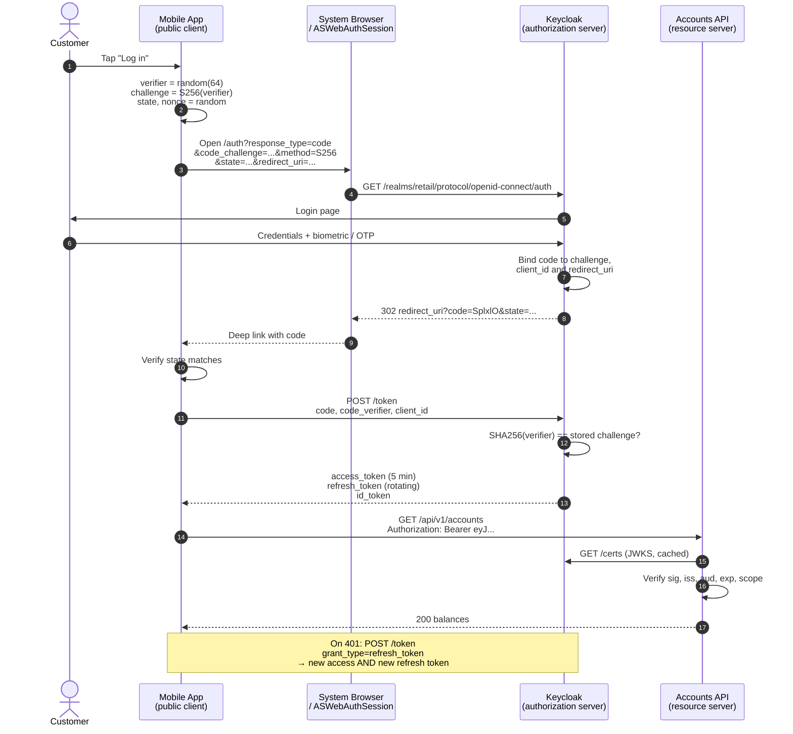

# OAuth 2.0 Without the Folklore: The Four Flows That Still Matter

OAuth 2.0 is a delegation framework, not a login system, and almost every serious OAuth incident traces back to a team that did not know the difference. Learn four flows and five validation rules and you have covered ninety-five percent of enterprise work.

## The Real-World Problem

A retail bank rebuilds its mobile banking app. The old native app used the resource owner password credentials grant: the app collected the customer's internet-banking username and password, POSTed them to the token endpoint, and got back an access token valid for 12 hours with no refresh token.

Three consequences arrived together.

The app had to hold the customer's actual banking password in memory to re-authenticate on token expiry, and one build shipped with it cached in an unencrypted `SharedPreferences` entry so users would not have to retype it. The bank could not introduce SMS OTP or biometric step-up authentication, because the grant has no mechanism to interrupt the flow and ask for a second factor — a six-month regulatory deadline for strong customer authentication became an app rewrite instead of an identity-provider configuration change. And because the token was self-contained, long-lived, and never rotated, a token lifted from a rooted device gave an attacker twelve hours of full account access with nothing to revoke.

The rebuild moved to authorization code with PKCE, using the system browser. The password never touches the app, step-up authentication became a realm setting, access tokens live five minutes, and refresh tokens rotate on every use with reuse detection. The security posture changed more than the codebase did.

## The Concept

### The four roles, precisely

| Role | Who it is in the banking scenario |
|---|---|
| **Resource owner** | The customer |
| **Client** | The mobile app (or the web SPA, or the batch job) |
| **Authorization server** | Keycloak — issues tokens, owns the login UI |
| **Resource server** | The accounts API, payments API — validates tokens, serves data |

The client never sees credentials. The resource server never sees credentials. That separation is the entire point.

### The flows that survive into 2030

| Flow | Use it for | Client secret? | Notes |
|---|---|---|---|
| **Authorization code + PKCE** | Every flow with a human: SPA, mobile, server-rendered web | Confidential clients yes, public clients no | The default. PKCE is mandatory for all clients under OAuth 2.1 |
| **Client credentials** | Machine-to-machine: batch jobs, service-to-service, partner APIs | Yes, always | No user. The token's subject is the service |
| **Refresh token** | Extending a session without re-login | Depends on client type | Must rotate for public clients |
| **Device authorization** | Input-constrained devices: ATMs, branch kiosks, smart TVs, CLI tools | No | User authenticates on their phone; the device polls |
| **Implicit** | Nothing | — | Removed in OAuth 2.1. See article 02 |
| **Resource owner password** | Nothing | — | Removed in OAuth 2.1. The scenario above |

### PKCE, in one paragraph

The client generates a high-entropy random `code_verifier`, sends `code_challenge = BASE64URL(SHA256(verifier))` on the authorization request, and sends the raw verifier when redeeming the code. An attacker who intercepts the authorization code — through a malicious app registering the same custom URI scheme, a leaked referrer, or browser history — cannot redeem it, because they do not have the verifier. PKCE turns the code from a bearer credential into a proof-of-possession one.

### Access tokens vs. refresh tokens

An **access token** is presented to resource servers, short-lived (60 seconds to 15 minutes), and should be treated as unrevocable within its lifetime — that is why it must be short. A **refresh token** is presented only to the authorization server, long-lived, revocable, and never sent to an API. Confusing the two produces long-lived credentials scattered across services.

### JWT vs. opaque tokens

| | JWT (self-contained) | Opaque (reference) |
|---|---|---|
| **Validation** | Local signature check against JWKS | Network call to `/introspect` |
| **Latency** | Microseconds | A round trip per request, unless cached |
| **Revocation** | Not until expiry | Immediate |
| **Leaked token risk** | Readable by anyone who has it | Meaningless without introspection |
| **Fit** | Internal microservices at scale | Public/partner-facing tokens, high-value operations |

The practical enterprise answer is a hybrid: opaque tokens at the public edge, exchanged by the gateway for short-lived internal JWTs. See article 07.

### The five validations a resource server must perform

Any one of these missing is a real vulnerability, not a nitpick:

1. **Signature** — verified against the issuer's JWKS, with the key selected by `kid`. Never trust the `alg` header to pick an algorithm; pin it.
2. **`iss`** — exactly matches your expected issuer URL. A token from a different realm or a different tenant is not your token.
3. **`aud`** — contains *this* resource server. Without this check, a token minted for a low-trust third-party API is accepted by your payments API. This is the most commonly skipped check.
4. **`exp` / `nbf`** — with minimal clock skew allowance (60 seconds, not 5 minutes).
5. **`typ` and token class** — an ID token is not an access token. Rejecting `typ: ID` at the API boundary prevents a whole family of confusion attacks.

## How It Works



Two things carry the security of this diagram: the code is bound to the challenge at issuance, and the token never travels through a redirect — only the single-use code does.

## Practical Example

**Starting the flow (Kotlin, AppAuth — the same shape applies to `oauth4webapi` in a SPA):**

```kotlin
val verifier = CodeVerifierUtil.generateRandomCodeVerifier()   // 43–128 chars, CSPRNG

val request = AuthorizationRequest.Builder(
        serviceConfig,                       // fetched from the discovery document
        "retail-mobile",                     // public client, no secret
        ResponseTypeValues.CODE,
        Uri.parse("com.bank.retail:/oauth2redirect")
    )
    .setScope("openid profile accounts:read payments:initiate")
    .setCodeVerifier(verifier)               // AppAuth derives the S256 challenge
    .setState(SecureRandomString.generate())
    .setNonce(SecureRandomString.generate()) // ID token replay protection — see article 03
    .build()

// System browser, never an embedded WebView: a WebView is controlled by the app,
// so it can read the password and defeats the entire point of the redirect.
authService.performAuthorizationRequest(request, pendingIntent)
```

**What comes back from the token endpoint:**

```bash
curl -s -X POST https://id.bank.example/realms/retail/protocol/openid-connect/token \
  -H 'Content-Type: application/x-www-form-urlencoded' \
  -d grant_type=authorization_code \
  -d client_id=retail-mobile \
  -d code=SplxlOBeZQQYbYS6WxSbIA \
  -d code_verifier=dBjftJeZ4CVP-mB92K27uhbUJU1p1r_wW1gFWFOEjXk \
  -d redirect_uri=com.bank.retail:/oauth2redirect
```

```json
{
  "access_token": "eyJhbGciOiJSUzI1NiIsInR5cCI6ImF0K2p3dCIsImtpZCI6IkFiQzEyMyJ9...",
  "expires_in": 300,
  "refresh_token": "eyJhbGciOiJIUzUxMiIsInR5cCI6IkpXVCJ9...",
  "refresh_expires_in": 1800,
  "token_type": "Bearer",
  "id_token": "eyJhbGciOiJSUzI1NiIsInR5cCI6IkpXVCJ9...",
  "scope": "openid profile accounts:read payments:initiate"
}
```

**The decoded access token payload — note `aud`, `azp`, and the absence of anything resembling a password:**

```json
{
  "iss": "https://id.bank.example/realms/retail",
  "aud": ["accounts-api", "payments-api"],
  "azp": "retail-mobile",
  "sub": "f7c3a1e2-9b44-4c8e-8a21-5d6e7f8a9b01",
  "exp": 1786312800,
  "iat": 1786312500,
  "jti": "3f2b1c4d-5e6f-4708-9a1b-2c3d4e5f6071",
  "typ": "Bearer",
  "acr": "2",
  "scope": "openid profile accounts:read payments:initiate",
  "realm_access": { "roles": ["retail-customer"] },
  "customer_number": "GB-8842190"
}
```

**Validating it — Spring Boot 3.x resource server, Spring Security 6. No `WebSecurityConfigurerAdapter`, and audience validation added explicitly, because Spring does not validate `aud` for you:**

```java
@Configuration
@EnableWebSecurity
@EnableMethodSecurity
class ResourceServerConfig {

    @Bean
    SecurityFilterChain api(HttpSecurity http) throws Exception {
        http
            .securityMatcher("/api/**")
            .authorizeHttpRequests(auth -> auth
                .requestMatchers(HttpMethod.GET, "/api/v1/accounts/**")
                    .hasAuthority("SCOPE_accounts:read")
                .requestMatchers(HttpMethod.POST, "/api/v1/payments/**")
                    .hasAuthority("SCOPE_payments:initiate")
                .anyRequest().authenticated())          // deny by default
            .oauth2ResourceServer(o -> o.jwt(Customizer.withDefaults()))
            .sessionManagement(s -> s.sessionCreationPolicy(SessionCreationPolicy.STATELESS))
            .csrf(CsrfConfigurer::disable);
        return http.build();
    }

    @Bean
    JwtDecoder jwtDecoder(OAuth2ResourceServerProperties props) {
        var issuer = props.getJwt().getIssuerUri();
        var decoder = NimbusJwtDecoder
            .withIssuerLocation(issuer)                  // discovery + JWKS, keys cached & rotated
            .jwsAlgorithms(algs -> algs.add(SignatureAlgorithm.RS256))   // pin the algorithm
            .build();

        decoder.setJwtValidator(new DelegatingOAuth2TokenValidator<>(
            JwtValidatorFactory.createDefault(),                        // exp, nbf
            new JwtIssuerValidator(issuer),
            new JwtClaimValidator<List<String>>("aud",
                aud -> aud != null && aud.contains("accounts-api")),    // the check teams skip
            new JwtClaimValidator<String>("typ",
                typ -> "Bearer".equals(typ))                            // reject ID tokens
        ));
        return decoder;
    }
}
```

```yaml
spring:
  security:
    oauth2:
      resourceserver:
        jwt:
          issuer-uri: https://id.bank.example/realms/retail
          # JWKS is discovered; Spring caches keys and refetches on unknown kid,
          # which is what makes zero-downtime key rotation work.
```

**Client credentials, for the overnight settlement job — no user, no browser, no refresh token:**

```bash
curl -s -X POST https://id.bank.example/realms/retail/protocol/openid-connect/token \
  -u 'settlement-batch:$(cat /var/run/secrets/settlement-client-secret)' \
  -d grant_type=client_credentials \
  -d scope='ledger:post reconciliation:read'
```

Refresh tokens are meaningless here: the job can re-authenticate at will with its own credentials. Requesting `offline_access` on a client-credentials client is a smell.

**Refresh token rotation, handled correctly on the client:**

```kotlin
suspend fun accessToken(): String = mutex.withLock {          // one refresh, not N concurrent
    store.access?.takeIf { it.expiresAt > now().plusSeconds(30) }?.let { return it.value }

    val response = tokenEndpoint.refresh(store.refresh!!.value)
    // The response contains a NEW refresh token. Persist it atomically and discard the old one.
    // Replaying a rotated token tells Keycloak the family is compromised; it revokes all of them.
    store.replace(response.accessToken, response.refreshToken)
    response.accessToken
}
```

## Enterprise Trade-offs

| Approach | Pros | Cons | When to use (Banking / Insurance / Enterprise) |
|---|---|---|---|
| **Authorization code + PKCE, system browser** | Credentials never reach the client; step-up auth and MFA are IdP config; SSO across apps for free | Redirect plumbing; requires a browser | Default for every human-facing client: retail app, broker portal, back-office console |
| **Authorization code + confidential client (BFF)** | Tokens held server-side, never in browser storage; opaque session cookie to the SPA | Requires a backend per frontend; server-side session state | Highest-assurance web channels: internet banking, payment initiation |
| **Client credentials** | Simple; no user context to manage; scopes constrain the service | Secret rotation is on you; no user identity in the audit trail | Batch jobs, ETL, service-to-service where no user initiated the work |
| **Device authorization grant** | Works with no keyboard or browser; user authenticates on a trusted device | Polling; longer UX; needs a short-lived user code | Branch kiosks, ATM servicing tools, CLI admin tooling |
| **Long-lived access tokens (hours)** | Fewer token requests; simpler clients | Unrevocable window; a stolen token is a stolen session | Avoid. If introspection is impossible and lifetimes must stretch, cap at 15 minutes |
| **Resource owner password / implicit** | — | Blocks MFA, leaks credentials to the client, exposes tokens in URLs | Never. Removed in OAuth 2.1 — see article 02 |

## Why This Still Matters Through 2030

OAuth 2.0 is now the substrate under open banking, PSD2/PSD3 payment initiation, insurance broker federation, SaaS enterprise SSO, and every agentic system that needs to act on a user's behalf with a scoped, revocable, auditable grant. That last category is the growth area and it does not change the mechanics: an AI agent calling a payments API is a client that needs a narrowly scoped short-lived token and a revocation path, which is exactly what these flows provide and exactly why token exchange and fine-grained scopes matter more each year. The framework's stability is its main asset — the specifications from 2012 still validate, and the 2.1 consolidation removed options rather than adding them. What continues to break in production is not the protocol but the five validations: teams check the signature, skip the audience, and discover years later that any token from the estate opens any API. Learn the flows once, encode the validations in a shared library, and this knowledge keeps paying out for the rest of the decade.

→ Next: [02-oauth21-whats-new-and-why-it-matters.md](02-oauth21-whats-new-and-why-it-matters.md) · Related: [../01-core-concepts/05-security-by-default.md](../01-core-concepts/05-security-by-default.md) · [../10-example-code/spring-boot/keycloak-oauth2-resource-server-example.md](../10-example-code/spring-boot/keycloak-oauth2-resource-server-example.md)
