# OAuth 2.1: The Version That Deletes Things

OAuth 2.1 adds almost no new capability. It removes options — and every removal corresponds to a real attack that a real team shipped. That makes it the most useful specification revision in the identity space in a decade.

## The Real-World Problem

A mid-size insurer runs a customer portal where policyholders view documents, update contact details, and submit motor claims. The single-page app was built in 2018 using the implicit grant, because that was the recommended pattern for browser apps at the time: `response_type=token`, tokens delivered in the URL fragment, one-hour lifetimes, no refresh tokens, silent renewal via a hidden iframe.

The portal also had a "return to your broker's site" feature that took a `returnTo` query parameter, and the OAuth client was registered with the redirect URI `https://portal.insurer.example/callback*` — a wildcard, added years earlier so that a staging path would work without a second client registration.

A researcher chained the two. They registered the redirect `https://portal.insurer.example/callback/../redirect?returnTo=https://attacker.example`, which matched the wildcard prefix. The authorization server issued an access token straight into the URL fragment of a page that then performed a client-side redirect. Because the fragment survives a client-side redirect in several browser and framework combinations, the token arrived at the attacker's host. No user interaction beyond clicking a link, no credential theft, no malware.

The blast radius: full API access as the victim policyholder — claims history, medical questionnaires attached to life policies, bank details for premium refunds. Two hundred thousand policyholders were in scope. The tokens were unrevocable for their full hour because they were self-contained JWTs and the portal had no introspection path.

Every removal in OAuth 2.1 closes one link in that chain. The migration to authorization code + PKCE with exact redirect matching took one sprint, most of it spent on the hidden-iframe silent-renewal code that no longer had a reason to exist.

## The Concept

OAuth 2.1 is a consolidation: RFC 6749 and 6750 plus the Security Best Current Practice, PKCE, and the native-apps and browser-apps BCPs, merged into a single document with the dangerous options struck out. If you follow the BCPs you are already compliant. If you are not, here is the delta.

### The five removals and what each one prevented

| Removed / changed | The attack it enabled | The replacement |
|---|---|---|
| **Implicit grant** (`response_type=token`) | Token in the URL fragment: leaks via redirects, referrers, browser history, logs, and `window.name`. Unrevocable and no sender binding | Authorization code + PKCE |
| **Resource owner password credentials** | The client handles the user's real password; blocks MFA, step-up, and federation; credentials get cached | Authorization code + PKCE in the system browser |
| **Optional PKCE** | Authorization code interception — a malicious app claiming the same custom URI scheme, or a leaked code in a referrer, redeems the code | PKCE `S256` mandatory for **all** clients, public and confidential |
| **Prefix / wildcard redirect matching** | Open redirect chained into token or code exfiltration — the scenario above | Exact string comparison of the full redirect URI |
| **Bearer tokens in query strings** (`?access_token=`) | Tokens in access logs, proxy logs, APM traces, browser history, and `Referer` headers | `Authorization: Bearer` header only |

### PKCE is now mandatory even for confidential clients

The common objection is that a confidential client authenticates with a secret, so PKCE is redundant. It is not. PKCE binds the code to the *authorization request*, not to the client. Without it, a code injected into a confidential client's callback — via a compromised browser extension, a mix-up between two authorization servers, or an XSS on the redirect page — is redeemed by that legitimate client using its own valid secret. PKCE makes injected codes worthless because the verifier never left the client that started the flow.

### Exact redirect URI matching, stated as a rule

```
Registered: https://portal.insurer.example/callback
Request:    https://portal.insurer.example/callback          ✅  byte-identical
Request:    https://portal.insurer.example/callback/         ❌  trailing slash
Request:    https://portal.insurer.example/callback?x=1      ❌  extra query
Request:    https://portal.insurer.example/callback/../x     ❌  nothing to match
```

Register one URI per environment. Multiple environments mean multiple registered URIs, not one pattern. This is annoying exactly once, during setup.

### Refresh tokens: rotate or sender-constrain

OAuth 2.1 requires that refresh tokens issued to public clients are either **sender-constrained** or **one-time-use with rotation**. Rotation is what most estates implement:

1. Client presents refresh token `RT1`.
2. Server issues a new access token plus `RT2`, and invalidates `RT1`.
3. If `RT1` is ever presented again, the whole token family is treated as compromised and revoked.

That final step is the security control. Rotation without reuse detection just adds churn; reuse detection is what turns a stolen refresh token into a detected, contained incident instead of a silent persistent foothold.

### Sender-constraining: DPoP and mTLS

Bearer tokens are, by definition, usable by whoever holds them. Sender-constrained tokens are bound to a key the client proves possession of on every call.

| Mechanism | Binding | Fit |
|---|---|---|
| **DPoP** (RFC 9449) | Token bound to a client-held public key; each request carries a signed proof JWT | Public clients: SPAs, mobile apps |
| **mTLS / certificate-bound tokens** (RFC 8705) | Token bound to the client's TLS certificate thumbprint | Confidential clients, partner integrations, PSD2/FAPI |

OAuth 2.1 does not mandate either, but regulated profiles increasingly do — FAPI 2.0 requires sender-constraining, and open banking and open insurance regimes are converging on it. Building new work on bare bearer tokens outside a controlled network is a decision with a shelf life.

### What OAuth 2.1 does *not* change

Scopes, the token endpoint, client credentials, discovery, JWKS, introspection, and revocation all behave as before. Nothing about the happy path you already run needs relearning.

## How It Works

```mermaid
sequenceDiagram
    autonumber
    actor P as Policyholder
    participant SPA as Portal SPA<br/>(public client)
    participant AS as Authorization Server
    participant API as Claims API

    rect rgb(122, 74, 30)
    Note over SPA,AS: OAuth 2.0 implicit — REMOVED in 2.1
    SPA->>AS: /auth?response_type=token<br/>redirect_uri=/callback* (wildcard)
    AS-->>SPA: 302 /callback#access_token=eyJ...
    Note over SPA: Token sits in the URL.<br/>One open redirect and it is<br/>in the attacker's access log.
    end

    rect rgb(31, 81, 63)
    Note over SPA,API: OAuth 2.1 — authorization code + PKCE
    P->>SPA: Log in
    SPA->>SPA: verifier = random(64)<br/>challenge = S256(verifier)
    SPA->>AS: /auth?response_type=code<br/>&code_challenge=...&method=S256<br/>&redirect_uri=/callback (exact)
    AS->>AS: Exact-match redirect_uri<br/>bind code to challenge
    AS-->>SPA: 302 /callback?code=SplxlO
    Note over SPA: Code alone is useless:<br/>no verifier, no token.
    SPA->>AS: POST /token (code + code_verifier)
    AS->>AS: S256(verifier) == challenge?
    AS-->>SPA: access_token + rotating refresh_token
    SPA->>API: GET /claims<br/>Authorization: Bearer ...
    API-->>SPA: 200
    end

    Note over SPA,AS: Refresh: RT1 in → RT2 out, RT1 dead.<br/>RT1 replayed → whole family revoked.
```



The structural difference: in 2.1 nothing that grants access ever appears in a URL. Only a single-use, challenge-bound code does.

## Practical Example

**Keycloak 26 client configuration — the 2.1-compliant registration for the portal SPA:**

```json
{
  "clientId": "policyholder-portal",
  "protocol": "openid-connect",
  "publicClient": true,
  "standardFlowEnabled": true,
  "implicitFlowEnabled": false,
  "directAccessGrantsEnabled": false,
  "serviceAccountsEnabled": false,
  "redirectUris": [
    "https://portal.insurer.example/callback"
  ],
  "webOrigins": [
    "https://portal.insurer.example"
  ],
  "attributes": {
    "pkce.code.challenge.method": "S256",
    "post.logout.redirect.uris": "https://portal.insurer.example/signed-out",
    "access.token.lifespan": "300",
    "client.session.idle.timeout": "900",
    "client.session.max.lifespan": "28800",
    "dpop.bound.access.tokens": "true"
  }
}
```

The three lines that matter for compliance: `implicitFlowEnabled: false`, `directAccessGrantsEnabled: false`, and `pkce.code.challenge.method: S256`. Keycloak rejects an authorization request without a valid `code_challenge` once that attribute is set — the enforcement is server-side, not a client convention.

**Realm-level refresh token rotation with reuse detection:**

```json
{
  "realm": "policyholders",
  "revokeRefreshToken": true,
  "refreshTokenMaxReuse": 0,
  "ssoSessionIdleTimeout": 1800,
  "ssoSessionMaxLifespan": 36000,
  "accessTokenLifespan": 300,
  "browserSecurityHeaders": {
    "strictTransportSecurity": "max-age=31536000; includeSubDomains",
    "contentSecurityPolicy": "frame-src 'self'; frame-ancestors 'none'; object-src 'none'"
  }
}
```

`refreshTokenMaxReuse: 0` with `revokeRefreshToken: true` is the reuse-detection setting. Presenting a rotated token revokes the session.

**Client-side migration — deleting the implicit grant, in `oauth4webapi`:**

```ts
// BEFORE (implicit): token arrives in location.hash, hidden-iframe silent renew, no refresh token.
//   const token = new URLSearchParams(location.hash.slice(1)).get('access_token')   ❌ delete this

// AFTER: authorization code + PKCE. ~30 lines, no iframe, real refresh tokens.
import * as oauth from 'oauth4webapi'

const issuer = new URL('https://id.insurer.example/realms/policyholders')
const as = await oauth.discoveryRequest(issuer).then(r => oauth.processDiscoveryResponse(issuer, r))
const client: oauth.Client = { client_id: 'policyholder-portal', token_endpoint_auth_method: 'none' }

export async function beginLogin() {
  const verifier = oauth.generateRandomCodeVerifier()
  const challenge = await oauth.calculatePKCECodeChallenge(verifier)
  const state = oauth.generateRandomState()

  // sessionStorage, not localStorage: scoped to the tab, cleared on close.
  sessionStorage.setItem('pkce_verifier', verifier)
  sessionStorage.setItem('oauth_state', state)

  const url = new URL(as.authorization_endpoint!)
  url.searchParams.set('client_id', client.client_id)
  url.searchParams.set('response_type', 'code')          // never 'token'
  url.searchParams.set('redirect_uri', 'https://portal.insurer.example/callback')
  url.searchParams.set('scope', 'openid profile policies:read claims:submit')
  url.searchParams.set('code_challenge', challenge)
  url.searchParams.set('code_challenge_method', 'S256')
  url.searchParams.set('state', state)
  location.assign(url.href)
}

export async function completeLogin() {
  const params = oauth.validateAuthResponse(
    as, client, new URL(location.href), sessionStorage.getItem('oauth_state')!,
  )
  const response = await oauth.authorizationCodeGrantRequest(
    as, client, oauth.None(), params,
    'https://portal.insurer.example/callback',
    sessionStorage.getItem('pkce_verifier')!,
  )
  const result = await oauth.processAuthorizationCodeResponse(as, client, response)

  sessionStorage.removeItem('pkce_verifier')
  history.replaceState(null, '', '/')      // strip the code from the address bar
  return result                            // { access_token, refresh_token, id_token }
}
```

**Reject query-string tokens at the resource server, so a lingering old client fails loudly instead of quietly working** (Spring Security 6):

```java
@Bean
SecurityFilterChain api(HttpSecurity http) throws Exception {
    var resolver = new DefaultBearerTokenResolver();
    resolver.setAllowUriQueryParameter(false);   // Spring's default, but assert it explicitly
    resolver.setAllowFormEncodedBodyParameter(false);

    http
        .securityMatcher("/api/**")
        .authorizeHttpRequests(a -> a
            .requestMatchers(HttpMethod.GET, "/api/v1/policies/**").hasAuthority("SCOPE_policies:read")
            .requestMatchers(HttpMethod.POST, "/api/v1/claims/**").hasAuthority("SCOPE_claims:submit")
            .anyRequest().authenticated())
        .oauth2ResourceServer(o -> o
            .bearerTokenResolver(resolver)
            .jwt(Customizer.withDefaults()))
        .sessionManagement(s -> s.sessionCreationPolicy(SessionCreationPolicy.STATELESS));
    return http.build();
}
```

**Prove the removals hold, in CI. A test is the only durable way to stop a helpful config change from re-enabling a grant:**

```bash
#!/usr/bin/env bash
set -euo pipefail
ISS=https://id.insurer.example/realms/policyholders

# 1. Password grant must be rejected outright.
code=$(curl -s -o /dev/null -w '%{http_code}' -X POST "$ISS/protocol/openid-connect/token" \
  -d grant_type=password -d client_id=policyholder-portal \
  -d username=test.user -d password=irrelevant)
[[ "$code" == "400" || "$code" == "401" ]] || { echo "FAIL: password grant enabled"; exit 1; }

# 2. Authorization request without PKCE must be rejected.
code=$(curl -s -o /dev/null -w '%{http_code}' \
  "$ISS/protocol/openid-connect/auth?response_type=code&client_id=policyholder-portal&redirect_uri=https%3A%2F%2Fportal.insurer.example%2Fcallback&scope=openid")
[[ "$code" == "400" ]] || { echo "FAIL: PKCE not enforced"; exit 1; }

# 3. A near-miss redirect URI must be rejected.
code=$(curl -s -o /dev/null -w '%{http_code}' \
  "$ISS/protocol/openid-connect/auth?response_type=code&client_id=policyholder-portal&redirect_uri=https%3A%2F%2Fportal.insurer.example%2Fcallback%2F&code_challenge=abc&code_challenge_method=S256&scope=openid")
[[ "$code" == "400" ]] || { echo "FAIL: redirect URI matching is not exact"; exit 1; }

echo "OAuth 2.1 posture verified"
```

## Enterprise Trade-offs

| Approach | Pros | Cons | When to use (Banking / Insurance / Enterprise) |
|---|---|---|---|
| **Authorization code + PKCE, tokens in memory** | 2.1-compliant; no token in URL or persistent storage; simplest correct SPA | Tokens lost on refresh; needs silent re-auth via the IdP session | Standard for internal enterprise SPAs and customer portals |
| **BFF pattern — confidential client, opaque cookie to the browser** | Tokens never reach JavaScript; XSS cannot exfiltrate them; revocation is immediate | A server component per frontend; session state to run and scale | High-assurance channels: internet banking, payment initiation, claims with medical data |
| **DPoP sender-constrained tokens** | A stolen token is unusable without the private key; aligns with FAPI 2.0 | Library support still uneven; proof JWT per request; key management in the client | New public-client builds in banking and payments; anything on a FAPI roadmap |
| **mTLS certificate-bound tokens** | Strongest binding; well-supported in gateways; auditors understand it | Certificate lifecycle for every client; awkward for browsers | Partner and B2B integrations, PSD2 endpoints, regulated data exchange |
| **Keeping implicit "until the rewrite"** | No work today | The scenario above; fails any modern penetration test or FAPI assessment | Never. Migration is one sprint; the incident is not |
| **Resource owner password grant for a legacy client** | Works without a browser | Blocks MFA and step-up; credentials cached in clients; no path to compliance | Never. Use client credentials for machines, device grant for headless human flows |

## Why This Still Matters Through 2030

OAuth 2.1 is the baseline every downstream profile now assumes. FAPI 2.0, the open banking and open insurance regimes built on it, and the emerging identity-wallet and agent-authorization specifications all start from "authorization code, PKCE, exact redirects, sender-constrained where it counts" and add requirements on top. Building on 2.1 today means those profiles are configuration changes rather than rewrites; building on 2.0's removed options means every future compliance obligation lands as a project. The deeper reason it endures is that the removals are not fashion. Tokens in URLs leak because URLs are logged, cached, and shared — that will be true in 2035. Wildcard redirect matching will always be one open redirect away from exfiltration. Clients that hold user passwords will always be a dead end for step-up authentication. A specification that deletes footguns ages far better than one that adds features, and the maintenance burden of following it is close to zero once the client registrations are correct.

→ Next: [03-openid-connect-vs-oauth2.md](03-openid-connect-vs-oauth2.md) · Related: [01-oauth2-fundamentals.md](01-oauth2-fundamentals.md) · [../00-project-setup-roadmap/05-ci-pipeline.md](../00-project-setup-roadmap/05-ci-pipeline.md)
