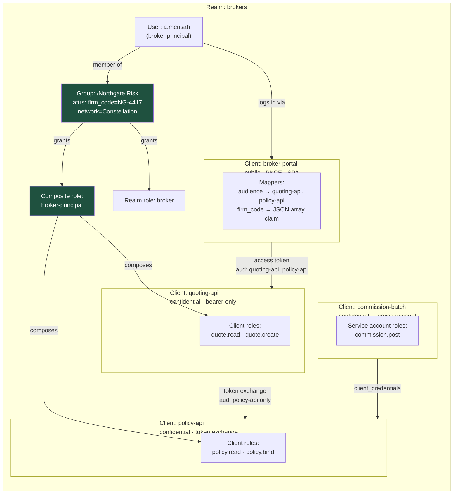

# Keycloak by Design: Realms, Clients and the Role Model You Won't Regret

Keycloak gives you every primitive you need and no opinion about how to use them. The teams that suffer with it are not the ones who misconfigured a client — they are the ones who picked the wrong role model in week two and discovered it in year two.

## The Real-World Problem

An insurer runs a broker portal. Eleven hundred independent brokerages quote and bind commercial motor and property policies through it. Each brokerage has principals, agents, and back-office staff; some are part of networks that need consolidated visibility across member firms; a handful are appointed representatives whose authority is delegated and time-limited.

The first implementation used one realm, one client, and realm roles named after job titles: `broker-admin`, `broker-agent`, `broker-viewer`. Brokerage membership was carried in a custom user attribute called `firm_code`, read out of the access token by every service.

By the second year the model had failed in four directions at once.

Network brokerages needed access to several firms, and a single `firm_code` string could not express that, so someone added `firm_code_2` and then a comma-separated list, which two services parsed differently. The quoting API and the document API both needed a role called `viewer`, but the realm had only one `broker-viewer` role, so granting document access granted quoting access. Onboarding a brokerage meant a support engineer clicking through eight role assignments per user, and the resulting drift meant an access review could not be completed within the audit window. And when the insurer acquired a second brand with its own broker base and its own password policy, there was nowhere to put them — the realm's policies, login theme, and identity providers were global.

The rebuild used two realms, one client per resource server, client roles for per-API permissions, groups for brokerage membership with composite roles attached, and a protocol mapper that emitted firm membership as a proper JSON array claim. Onboarding became one group assignment. The access review became a group-membership report.

## The Concept

### The object model, in the order you should decide it

| Object | What it is | Decision rule |
|---|---|---|
| **Realm** | A fully isolated security domain: its own users, clients, roles, keys, policies, themes, identity providers | One per user population that needs different policy or must never see the other. Not one per environment, not one per application |
| **Client** | An application or API known to the realm | One per resource server, plus one per frontend. Never one shared client for everything |
| **Client role** | A permission scoped to a single client | Default for anything that means "may do X in API Y" |
| **Realm role** | An organisation-wide role, visible to all clients | Only for genuinely cross-cutting identity: `employee`, `broker`, `platform-admin` |
| **Group** | A container of users with roles and attributes attached | Model organisational structure: brokerage, department, network |
| **Composite role** | A role that grants other roles | Business-level bundles: `broker-principal` → six client roles |
| **Client scope** | A reusable bundle of scopes, claims and role mappings | Control what goes into which token |
| **Protocol mapper** | Puts a claim into a token | Shape the token deliberately; keep it small |

### Realms: isolate populations, not environments

A realm is a hard boundary — separate keys, separate users, separate sessions, no cross-realm role visibility. Use it for the broker population versus internal staff, or two acquired brands with incompatible policies. Do **not** use realms as environments; dev, UAT and production are separate Keycloak deployments, because a shared instance means a UAT misconfiguration is a production incident.

### Public vs. confidential clients

| | Public | Confidential |
|---|---|---|
| **Holds a secret** | No — it cannot keep one | Yes: secret, signed JWT, or mTLS |
| **Examples** | SPA, mobile app, desktop app | BFF, backend service, batch job |
| **Flows** | Authorization code + PKCE only | Authorization code + PKCE, client credentials, token exchange |
| **Service accounts** | Not available | Available |

A resource server is registered as a **bearer-only** style client: it validates tokens and never starts a login. In Keycloak 26 you express that by disabling `standardFlowEnabled` and `directAccessGrantsEnabled` and leaving `publicClient: false`.

### Realm roles vs. client roles — the rule

Ask: *would this role name mean something different in another API?* If yes, it is a client role.

```
realm role   broker                     → "this person is an external broker"        ✅
realm role   viewer                     → viewer of what? collides across APIs       ❌
client role  quoting-api:quote.read     → unambiguous, scoped, auditable             ✅
client role  policy-api:policy.bind     → unambiguous, scoped, auditable             ✅
```

Client roles also keep tokens small, because `resource_access` is filtered to the audiences of the token being issued.

### Groups carry membership; composite roles carry job functions

Groups are for *who someone belongs to* — a brokerage, a network, a branch. Attributes on the group (like `firm_code`) are inherited by members, so onboarding is one assignment and offboarding is one removal. Composite roles are for *what a job function can do* — `broker-principal` bundles the six client roles a principal needs, so adding a seventh permission to that job function is one change in Keycloak rather than 1,100 user edits.

Combine them: user → group (brokerage) → composite role (job function) → client roles (permissions). Every level has exactly one reason to change.

### Client scopes and protocol mappers

Client scopes are reusable groups of claims and role mappings, attached to a client as **default** (always present) or **optional** (only when the client requests that scope). Use optional scopes to keep sensitive claims out of tokens that do not need them.

Two mapper settings matter more than the rest:

- **Audience mapper** — puts the correct `aud` into the access token. Without it, your resource server's audience check fails, and the temptation is to remove the check rather than add the mapper. Add the mapper.
- **`add.to.access.token` / `add.to.id.token`** — decide per claim which token carries it. PII belongs in the ID token or UserInfo, not in an access token that traverses every service.

### Service accounts and token exchange

A **service account** is the identity a confidential client gets for the client credentials grant. It is a real service-account user in the realm, so you can grant it client roles and audit it like any other principal. Give each batch job its own client, not a shared one.

**Token exchange** (RFC 8693) lets a service swap an incoming user token for a narrower token addressed to a downstream service, preserving the user identity while reducing scope. This is how you avoid the two bad alternatives: forwarding the original wide token everywhere, or dropping the user identity by falling back to client credentials and losing the audit trail. Keycloak 26 supports standard token exchange; enable it per client and grant the exchanging client permission on the target.

## How It Works



The single arrow that removes the operational pain is `U → G`. Onboarding, offboarding, and access review all happen at that edge; nothing below it is touched per user.

## Practical Example

**Realm skeleton — policy that a single shared realm could not have expressed:**

```json
{
  "realm": "brokers",
  "enabled": true,
  "sslRequired": "all",
  "registrationAllowed": false,
  "loginWithEmailAllowed": false,
  "duplicateEmailsAllowed": false,
  "bruteForceProtected": true,
  "permanentLockout": false,
  "failureFactor": 5,
  "waitIncrementSeconds": 60,
  "passwordPolicy": "length(14) and upperCase(1) and lowerCase(1) and digits(1) and specialChars(1) and notUsername() and passwordHistory(12) and forceExpiredPasswordChange(90) and hashAlgorithm(argon2)",
  "otpPolicyType": "totp",
  "otpPolicyAlgorithm": "HmacSHA256",
  "accessTokenLifespan": 300,
  "ssoSessionIdleTimeout": 1800,
  "ssoSessionMaxLifespan": 32400,
  "revokeRefreshToken": true,
  "refreshTokenMaxReuse": 0,
  "adminEventsEnabled": true,
  "adminEventsDetailsEnabled": true,
  "eventsEnabled": true,
  "eventsExpiration": 7776000,
  "enabledEventTypes": ["LOGIN", "LOGIN_ERROR", "LOGOUT", "TOKEN_EXCHANGE",
                        "CLIENT_LOGIN", "CLIENT_LOGIN_ERROR", "REFRESH_TOKEN",
                        "UPDATE_PASSWORD", "GRANT_CONSENT", "REVOKE_GRANT"]
}
```

**The public frontend client, with the audience and firm-membership mappers that make everything downstream work:**

```json
{
  "clientId": "broker-portal",
  "protocol": "openid-connect",
  "publicClient": true,
  "standardFlowEnabled": true,
  "implicitFlowEnabled": false,
  "directAccessGrantsEnabled": false,
  "redirectUris": ["https://brokers.insurer.example/callback"],
  "webOrigins": ["https://brokers.insurer.example"],
  "attributes": {
    "pkce.code.challenge.method": "S256",
    "post.logout.redirect.uris": "https://brokers.insurer.example/signed-out",
    "backchannel.logout.session.required": "true",
    "backchannel.logout.url": "https://brokers.insurer.example/backchannel-logout"
  },
  "defaultClientScopes": ["openid", "profile", "roles", "broker-context"],
  "optionalClientScopes": ["policy-write"],
  "protocolMappers": [
    {
      "name": "quoting-api-audience",
      "protocolMapper": "oidc-audience-mapper",
      "config": {
        "included.client.audience": "quoting-api",
        "access.token.claim": "true",
        "id.token.claim": "false"
      }
    },
    {
      "name": "firm-codes",
      "protocolMapper": "oidc-usermodel-attribute-mapper",
      "config": {
        "user.attribute": "firm_code",
        "claim.name": "firm_codes",
        "jsonType.label": "String",
        "multivalued": "true",
        "aggregate.attrs": "true",
        "access.token.claim": "true",
        "id.token.claim": "true"
      }
    }
  ]
}
```

`multivalued` plus `aggregate.attrs` is the fix for the comma-separated-string defect: a broker in a network inherits `firm_code` from several groups and the claim arrives as a proper JSON array.

**A resource server client — no login flow, only token validation:**

```json
{
  "clientId": "policy-api",
  "protocol": "openid-connect",
  "publicClient": false,
  "standardFlowEnabled": false,
  "directAccessGrantsEnabled": false,
  "serviceAccountsEnabled": true,
  "authorizationServicesEnabled": false,
  "attributes": {
    "standard.token.exchange.enabled": "true",
    "client.credentials.use.jwt.assertion": "true",
    "use.refresh.tokens": "false"
  },
  "defaultClientScopes": ["roles"]
}
```

Client authentication by signed JWT assertion (`client.credentials.use.jwt.assertion`) beats a shared secret: there is no long-lived string to leak into a config map, and rotation is a key rotation rather than a coordinated secret change.

**Groups, attributes and composite roles, created with `kcadm` so the model lives in version control:**

```bash
KC=/opt/keycloak/bin/kcadm.sh
$KC config credentials --server https://id.insurer.example --realm master \
  --client admin-cli --user "$KC_ADMIN" --password "$KC_ADMIN_PASSWORD"

# --- Client roles: permissions, scoped per API ---
for role in quote.read quote.create quote.withdraw; do
  $KC create clients/$QUOTING_ID/roles -r brokers -s name=$role
done
for role in policy.read policy.bind policy.cancel; do
  $KC create clients/$POLICY_ID/roles -r brokers -s name=$role
done

# --- Composite roles: job functions, defined once ---
$KC create roles -r brokers -s name=broker-principal \
  -s 'description=Principal of an appointed brokerage: full quote and bind authority'
$KC add-roles -r brokers --rname broker-principal \
  --cclientid quoting-api --rolename quote.read --rolename quote.create --rolename quote.withdraw
$KC add-roles -r brokers --rname broker-principal \
  --cclientid policy-api --rolename policy.read --rolename policy.bind

$KC create roles -r brokers -s name=broker-agent
$KC add-roles -r brokers --rname broker-agent \
  --cclientid quoting-api --rolename quote.read --rolename quote.create
$KC add-roles -r brokers --rname broker-agent \
  --cclientid policy-api --rolename policy.read      # agents quote but never bind

# --- Groups: organisational structure, carrying the firm attribute ---
NETWORK=$($KC create groups -r brokers -s name=Constellation -i)
FIRM=$($KC create groups/$NETWORK/children -r brokers -s name='Northgate Risk' -i)
$KC update groups/$FIRM -r brokers \
  -s 'attributes.firm_code=["NG-4417"]' \
  -s 'attributes.regulatory_ref=["FRN-770412"]'

# Job function attached to a sub-group. Onboarding is now ONE assignment.
PRINCIPALS=$($KC create groups/$FIRM/children -r brokers -s name=Principals -i)
$KC add-roles -r brokers --gid $PRINCIPALS --rolename broker-principal --rolename broker

$KC update users/$USER_ID/groups/$PRINCIPALS -r brokers -s realm=brokers -s userId=$USER_ID \
  -s groupId=$PRINCIPALS -n
```

**The resulting access token — small, audience-correct, and expressing network membership properly:**

```json
{
  "iss": "https://id.insurer.example/realms/brokers",
  "aud": ["quoting-api", "policy-api"],
  "azp": "broker-portal",
  "sub": "5d8c1f30-6b92-4a17-8e44-c1f902ab3d76",
  "exp": 1786320300,
  "typ": "Bearer",
  "scope": "openid profile broker-context",
  "acr": "2",
  "realm_access": { "roles": ["broker"] },
  "resource_access": {
    "quoting-api": { "roles": ["quote.read", "quote.create", "quote.withdraw"] },
    "policy-api":  { "roles": ["policy.read", "policy.bind"] }
  },
  "firm_codes": ["NG-4417", "NG-4418"],
  "preferred_username": "a.mensah"
}
```

**Consuming client roles in Spring Security 6 — Keycloak nests them, so the default converter will not find them:**

```java
@Component
class KeycloakClientRoleConverter implements Converter<Jwt, AbstractAuthenticationToken> {

    private static final String CLIENT_ID = "policy-api";
    private final JwtGrantedAuthoritiesConverter scopes = new JwtGrantedAuthoritiesConverter();

    @Override
    public AbstractAuthenticationToken convert(Jwt jwt) {
        var authorities = new HashSet<GrantedAuthority>(scopes.convert(jwt));   // SCOPE_*

        // resource_access.policy-api.roles → ROLE_policy.bind
        Optional.ofNullable(jwt.getClaimAsMap("resource_access"))
            .map(ra -> (Map<String, Object>) ra.get(CLIENT_ID))
            .map(client -> (List<String>) client.get("roles"))
            .orElse(List.of())
            .forEach(r -> authorities.add(new SimpleGrantedAuthority("ROLE_" + r)));

        return new JwtAuthenticationToken(jwt, authorities, jwt.getSubject());
    }
}

@Configuration
@EnableWebSecurity
@EnableMethodSecurity
class PolicyApiSecurity {

    @Bean
    SecurityFilterChain api(HttpSecurity http, KeycloakClientRoleConverter converter) throws Exception {
        http
            .authorizeHttpRequests(a -> a
                .requestMatchers(HttpMethod.GET,  "/api/v1/policies/**").hasRole("policy.read")
                .requestMatchers(HttpMethod.POST, "/api/v1/policies/*/bind").hasRole("policy.bind")
                .anyRequest().authenticated())
            .oauth2ResourceServer(o -> o.jwt(j -> j.jwtAuthenticationConverter(converter)))
            .sessionManagement(s -> s.sessionCreationPolicy(SessionCreationPolicy.STATELESS));
        return http.build();
    }
}
```

**Firm scoping is still application-level work.** The role says *may bind policies*; only the query says *for this brokerage*:

```java
@PostMapping("/api/v1/policies/{id}/bind")
@PreAuthorize("hasRole('policy.bind')")
public BindReceipt bind(@PathVariable UUID id, @AuthenticationPrincipal Jwt jwt) {
    List<String> firms = jwt.getClaimAsStringList("firm_codes");
    // Scoped query: a valid token for another brokerage cannot bind this quote.
    var quote = quotes.findByIdAndFirmCodeIn(id, firms)
        .orElseThrow(() -> new QuoteNotFoundException(id));     // 404, not 403
    return binding.bind(quote, jwt.getSubject());
}
```

**Token exchange for a downstream call — narrower audience, same user:**

```bash
curl -s -X POST https://id.insurer.example/realms/brokers/protocol/openid-connect/token \
  -d grant_type=urn:ietf:params:oauth:grant-type:token-exchange \
  -d client_id=policy-api \
  -d client_assertion_type=urn:ietf:params:oauth:client-assertion-type:jwt-bearer \
  -d client_assertion="${SIGNED_CLIENT_JWT}" \
  -d subject_token="${INCOMING_USER_TOKEN}" \
  -d subject_token_type=urn:ietf:params:oauth:token-type:access_token \
  -d audience=document-api \
  -d scope='document.generate'
```

The returned token has `aud: ["document-api"]` and a single scope. If the document service is compromised, the token it holds cannot bind policies.

## Enterprise Trade-offs

| Approach | Pros | Cons | When to use (Banking / Insurance / Enterprise) |
|---|---|---|---|
| **One realm per user population** | Hard isolation of policy, keys, sessions, themes, IdPs | Cross-realm reporting needs work; more realms to operate | Brokers vs. internal staff; acquired brands with different policy; customer vs. employee |
| **Client roles for permissions** | No cross-API collisions; tokens stay small; auditable per API | More objects to create; needs a naming convention up front | Default for every permission that means "may do X in API Y" |
| **Realm roles for everything** | Fewest objects; quick to start | Name collisions across APIs; role explosion; token bloat — the scenario above | Only for genuinely cross-cutting identity: `employee`, `broker`, `platform-admin` |
| **Groups + composite roles for job functions** | Onboarding and offboarding are one assignment; access review is a group report | Indirection: "why does this user have this role?" takes two hops to answer | Any population above ~50 users, and anything subject to periodic access review |
| **Token exchange for downstream calls** | Preserves user identity in the audit trail while narrowing scope per hop | An IdP round trip per hop; permissions to configure and maintain | Multi-hop flows where the downstream service must not receive the full-scope token |
| **One shared client for all applications** | Simplest possible setup | No audience separation, so any token opens any API; no per-app lifetimes or logout | Never |

## Why This Still Matters Through 2030

Keycloak's position is unusually secure for an open-source component: it is the identity layer in Red Hat's supported platform, it implements the specifications the regulated profiles reference, and it runs on-premise, which matters in jurisdictions and sectors where a hosted IdP is not an option. Its recent direction — dropping the legacy adapters, standardising token exchange, hardening the admin API, moving to Quarkus and a proper operator — points at a product being consolidated rather than reinvented, so the concepts here are stable investments. The realm and role model is also the part you cannot outsource: migrating from Keycloak to a hosted IdP is mostly a mechanical mapping exercise *if* your model is clean, and a redesign if roles were named after job titles and membership lived in a comma-separated attribute. Access review is becoming a harder engineering requirement across SOC 2, DORA and sector rules, and the difference between a review you can generate from group membership and one that requires exporting per-user role assignments to a spreadsheet is entirely a modelling decision. Make it once, deliberately, in week two.

→ Next: [05-keycloak-in-a-banking-sso-architecture.md](05-keycloak-in-a-banking-sso-architecture.md) · Related: [../10-example-code/spring-boot/keycloak-oauth2-resource-server-example.md](../10-example-code/spring-boot/keycloak-oauth2-resource-server-example.md) · [../01-core-concepts/05-security-by-default.md](../01-core-concepts/05-security-by-default.md)
