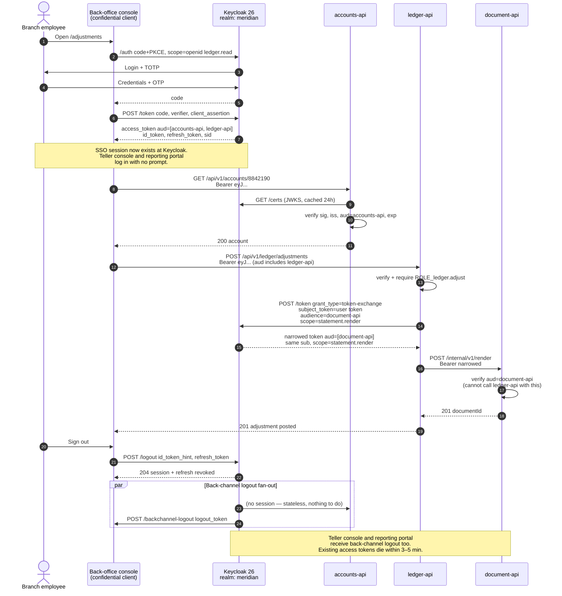

# One Login, Nine Applications: Keycloak as a Bank's Tier-0 Dependency

Single sign-on is the easy half. The hard half is what a token means three hops downstream, what happens when a customer signs out of one tab, and what the bank does at 09:40 on a Monday when the identity provider is the thing that is down.

## The Real-World Problem

Meridian Retail Bank runs nine customer- and staff-facing applications: an internet banking SPA, a mobile app, a branch teller console, an operations back-office console, a collections workbench, a partner portal for mortgage brokers, an internal admin tool, a reporting portal, and a batch settlement job. Each one grew its own login.

The consequences were cumulative rather than dramatic. A branch employee held four passwords and reused one of them. Offboarding required a ticket to four teams and took, on average, eleven days — a fact discovered during an access review when a contractor who had left in March was found still able to open the collections workbench in September. The teller console and the back-office console both accepted a token minted by the *other*, because neither validated `aud`, so a low-trust internal tool's token opened the ledger-adjustment API. And when a customer clicked "sign out" in internet banking, their session in the mobile web view stayed alive for another eight hours.

The consolidation onto one Keycloak realm fixed the identity sprawl in four months. Then the real lesson arrived: in the eleventh week after go-live, a Keycloak database failover took 6 minutes, and during those 6 minutes nothing new could authenticate anywhere in the bank. Existing access tokens kept working — the resource servers validated them locally against a cached JWKS — but every login, every refresh, and every token exchange failed. Branch staff could not start their day. That incident is what promoted the IdP from "a component we run" to a tier-0 dependency with its own HA design, its own runbook, and its own quarterly failover test.

## The Concept

### One realm, many clients — and the audience is what separates them

SSO across nine applications does not mean nine applications share a token. It means they share a **session** at the authorization server. Each application gets its own client, its own audience, its own lifetimes, and its own logout endpoint.

| Application | Client type | Flow | Access token lifetime |
|---|---|---|---|
| Internet banking SPA | Confidential (BFF) | Auth code + PKCE | 5 min |
| Mobile app | Public | Auth code + PKCE | 5 min |
| Teller console | Confidential | Auth code + PKCE, `acr=2` required | 3 min |
| Back-office console | Confidential | Auth code + PKCE, step-up for adjustments | 3 min |
| Partner (broker) portal | Confidential | Auth code + PKCE + mTLS client auth | 5 min |
| Settlement batch | Confidential | Client credentials | 10 min |
| accounts-api / payments-api / ledger-api | Bearer-only | — | validate only |

The rule that prevents the cross-application token acceptance defect: **every resource server validates `aud` against its own client ID, and the token issued to an application carries only the audiences that application legitimately calls.**

### Token propagation between internal services: three options, one default

| Option | What travels | User identity preserved | Scope narrowing | Verdict |
|---|---|---|---|---|
| **Forward the original token** | The caller's access token, unchanged | Yes | None — every hop holds full scope | Acceptable for one hop inside a trust zone |
| **Client credentials for the hop** | A service-account token | **No** — audit trail loses the user | Yes | Only for genuinely user-less work (batch, reconciliation) |
| **Token exchange (RFC 8693)** | A new token: same `sub`, narrower `aud` and `scope` | Yes | Yes | Default for any hop crossing a trust boundary |

Forwarding is the path of least resistance and it is how a compromised document-rendering service ends up holding a token that can post to the ledger. Token exchange costs one round trip to Keycloak and buys you a token that is useless outside its narrow purpose.

### Audience narrowing is the security property, not a nicety

An exchanged token addressed to `document-api` with scope `statement.render` cannot call `payments-api`, because `payments-api` rejects it on `aud`. This is only true if `payments-api` actually checks. Audience narrowing and audience validation are one control implemented in two places; either half alone is decoration.

### Logout: front-channel and back-channel do different jobs

| | Front-channel | Back-channel |
|---|---|---|
| **Mechanism** | Keycloak renders hidden iframes to each client's logout URL in the user's browser | Keycloak POSTs a signed logout token to each client's registered endpoint, server-to-server |
| **Depends on** | The browser staying open, third-party cookies | Network reachability between Keycloak and each client |
| **Fails silently when** | The tab closes mid-logout; the browser blocks third-party cookies (now the default everywhere) | A client endpoint is down — Keycloak retries, but delivery is not guaranteed |
| **Use for** | Nothing you rely on in 2026 | The primary mechanism |

Back-channel logout is what you build. The client receives a `logout_token`, validates its signature and `sid`/`sub`, and destroys the corresponding local session. For stateless APIs there is no local session to destroy — which is exactly why **access token lifetimes must be short**. Logout revokes the refresh token and the SSO session immediately; the access token dies on expiry. A 5-minute access token means logout is effective within 5 minutes worst case. A 1-hour token means logout is a suggestion.

### Why the IdP is tier-0, and what breaks when it is down

| Capability | Keycloak down |
|---|---|
| New logins, anywhere | **Fail** |
| Refresh token exchange | **Fail** (so sessions expire one by one) |
| Token exchange for downstream calls | **Fail** |
| Client credentials for batch jobs | **Fail** |
| Validating an existing access token | **Works** — if JWKS is cached |
| Admin operations, user management | Fail |

The one thing you control is that last-but-one row. A resource server that fetches JWKS on every request has made the IdP a hard dependency of every API call. Cache the key set, refresh it on an unknown `kid`, and keep serving. Spring Security does this by default — do not defeat it with a zero cache TTL.

## How It Works



Two properties carry this design: the token that reaches `document-api` cannot touch the ledger, and signing out is a server-side event that fans out rather than a cookie deletion in one tab.

## Practical Example

**The back-office client — confidential, JWT client authentication, back-channel logout registered:**

```json
{
  "clientId": "backoffice-console",
  "protocol": "openid-connect",
  "publicClient": false,
  "standardFlowEnabled": true,
  "implicitFlowEnabled": false,
  "directAccessGrantsEnabled": false,
  "serviceAccountsEnabled": false,
  "clientAuthenticatorType": "client-jwt",
  "redirectUris": ["https://backoffice.meridian.example/oauth2/callback"],
  "webOrigins": ["https://backoffice.meridian.example"],
  "frontchannelLogout": false,
  "attributes": {
    "pkce.code.challenge.method": "S256",
    "post.logout.redirect.uris": "https://backoffice.meridian.example/signed-out",
    "backchannel.logout.url": "https://backoffice.meridian.example/backchannel-logout",
    "backchannel.logout.session.required": "true",
    "backchannel.logout.revoke.offline.tokens": "true",
    "access.token.lifespan": "180",
    "client.session.idle.timeout": "900",
    "acr.loa.map": "{\"password\":1,\"password-otp\":2}",
    "minimum.acr.value": "2",
    "use.refresh.tokens": "true"
  },
  "defaultClientScopes": ["openid", "profile", "roles", "acr"],
  "protocolMappers": [
    {
      "name": "accounts-api-audience",
      "protocolMapper": "oidc-audience-mapper",
      "config": {
        "included.client.audience": "accounts-api",
        "access.token.claim": "true",
        "id.token.claim": "false"
      }
    },
    {
      "name": "ledger-api-audience",
      "protocolMapper": "oidc-audience-mapper",
      "config": {
        "included.client.audience": "ledger-api",
        "access.token.claim": "true",
        "id.token.claim": "false"
      }
    },
    {
      "name": "branch-code",
      "protocolMapper": "oidc-usermodel-attribute-mapper",
      "config": {
        "user.attribute": "branch_code",
        "claim.name": "branch_code",
        "jsonType.label": "String",
        "multivalued": "true",
        "aggregate.attrs": "true",
        "access.token.claim": "true",
        "id.token.claim": "true"
      }
    }
  ]
}
```

**The exchanging resource server — token exchange enabled, and permitted to target `document-api` only:**

```json
{
  "clientId": "ledger-api",
  "protocol": "openid-connect",
  "publicClient": false,
  "standardFlowEnabled": false,
  "directAccessGrantsEnabled": false,
  "serviceAccountsEnabled": true,
  "clientAuthenticatorType": "client-jwt",
  "attributes": {
    "standard.token.exchange.enabled": "true",
    "standard.token.exchange.enableRefreshRequestedTokenType": "false",
    "use.refresh.tokens": "false"
  }
}
```

```bash
# Grant ledger-api permission to exchange FOR document-api, and nothing else.
KC=/opt/keycloak/bin/kcadm.sh
$KC update clients/$DOC_API_ID -r meridian \
  -s 'attributes."token.exchange.grant.enabled"=true'
$KC create clients/$DOC_API_ID/authz/resource-server/permission/scope -r meridian \
  -s name=ledger-may-exchange-for-documents \
  -s 'scopes=["token-exchange"]' \
  -s 'policies=["ledger-api-client-policy"]'
```

**The decoded user token as issued to the back-office console** — note the two audiences it legitimately calls, and nothing else:

```json
{
  "iss": "https://id.meridian.example/realms/meridian",
  "aud": ["accounts-api", "ledger-api"],
  "azp": "backoffice-console",
  "sub": "9c1e77b4-2f83-4a06-b7d1-6e02f45ac913",
  "sid": "b41f0e6d-77ac-4d31-9c88-3ab5e0e9d112",
  "iat": 1786377420,
  "exp": 1786377600,
  "jti": "0a7f2c19-4d5b-42e8-9f31-c8b6a04e7712",
  "typ": "Bearer",
  "acr": "2",
  "scope": "openid profile acr ledger.read",
  "realm_access": { "roles": ["employee"] },
  "resource_access": {
    "accounts-api": { "roles": ["account.read"] },
    "ledger-api":   { "roles": ["ledger.read", "ledger.adjust"] }
  },
  "branch_code": ["BR-0417"],
  "preferred_username": "t.okoye",
  "email_verified": true
}
```

**The exchanged token that reaches `document-api`** — same subject, one audience, one scope, no ledger roles:

```json
{
  "iss": "https://id.meridian.example/realms/meridian",
  "aud": ["document-api"],
  "azp": "ledger-api",
  "sub": "9c1e77b4-2f83-4a06-b7d1-6e02f45ac913",
  "sid": "b41f0e6d-77ac-4d31-9c88-3ab5e0e9d112",
  "exp": 1786377540,
  "typ": "Bearer",
  "acr": "2",
  "scope": "statement.render",
  "resource_access": { "document-api": { "roles": ["statement.render"] } },
  "may_act": { "client_id": "ledger-api" }
}
```

`may_act` records the delegation: the audit trail shows *the user acted, via ledger-api*, which neither raw forwarding nor client credentials gives you.

**Performing the exchange from Spring Boot 3.x.** Spring Security 6.5+ ships a token-exchange grant client, so you configure rather than hand-roll:

```java
@Configuration
class TokenExchangeConfig {

    @Bean
    OAuth2AuthorizedClientManager authorizedClientManager(
            ClientRegistrationRepository registrations,
            OAuth2AuthorizedClientRepository authorizedClients) {

        var provider = OAuth2AuthorizedClientProviderBuilder.builder()
                .clientCredentials()
                .provider(new TokenExchangeOAuth2AuthorizedClientProvider())
                .build();

        var manager = new DefaultOAuth2AuthorizedClientManager(registrations, authorizedClients);
        manager.setAuthorizedClientProvider(provider);
        return manager;
    }

    @Bean
    RestClient documentApiClient(RestClient.Builder builder,
                                 OAuth2AuthorizedClientManager manager,
                                 @Value("${document-api.base-url}") String baseUrl) {
        var interceptor = new OAuth2ClientHttpRequestInterceptor(manager);
        interceptor.setClientRegistrationIdResolver(
                new RequestAttributeClientRegistrationIdResolver());

        var factory = new SimpleClientHttpRequestFactory();
        factory.setConnectTimeout(Duration.ofMillis(300));
        factory.setReadTimeout(Duration.ofSeconds(2));   // the IdP hop is not free — bound it

        return builder.baseUrl(baseUrl).requestFactory(factory)
                      .requestInterceptor(interceptor).build();
    }
}
```

```yaml
spring:
  security:
    oauth2:
      client:
        registration:
          document-api-exchange:
            provider: keycloak
            client-id: ledger-api
            client-authentication-method: private_key_jwt
            authorization-grant-type: urn:ietf:params:oauth:grant-type:token-exchange
            scope: statement.render
        provider:
          keycloak:
            issuer-uri: https://id.meridian.example/realms/meridian
      resourceserver:
        jwt:
          issuer-uri: https://id.meridian.example/realms/meridian
          # JWKS cached in-memory; refetched on an unknown kid. This is the property
          # that keeps every API serving while Keycloak is unavailable.
```

```java
@Service
class AdjustmentService {

    private final RestClient documentApi;

    AdjustmentService(RestClient documentApi) { this.documentApi = documentApi; }

    @PreAuthorize("hasRole('ledger.adjust') and authentication.token.claims['acr'] == '2'")
    public AdjustmentReceipt post(AdjustmentCommand cmd, Jwt userToken) {
        var receipt = ledger.apply(cmd, userToken.getSubject());

        // The interceptor exchanges the incoming user token for a document-api token.
        var doc = documentApi.post()
            .uri("/internal/v1/render/adjustment-advice")
            .attributes(clientRegistrationId("document-api-exchange"))
            .body(new RenderRequest(receipt.id(), cmd.accountNumber()))
            .retrieve()
            .body(RenderedDocument.class);

        return receipt.withAdvice(doc.documentId());
    }
}
```

Full resource-server setup, including the audience validator and the Keycloak client-role converter, is in [../10-example-code/spring-boot/keycloak-oauth2-resource-server-example.md](../10-example-code/spring-boot/keycloak-oauth2-resource-server-example.md).

**Back-channel logout receiver — validate the logout token, then kill the local session:**

```java
@RestController
class BackchannelLogoutController {

    private final JwtDecoder logoutTokenDecoder;   // same issuer, same JWKS
    private final SessionRegistry sessions;        // sid → HttpSession

    @PostMapping(path = "/backchannel-logout",
                 consumes = MediaType.APPLICATION_FORM_URLENCODED_VALUE)
    ResponseEntity<Void> logout(@RequestParam("logout_token") String logoutToken) {
        Jwt jwt = logoutTokenDecoder.decode(logoutToken);      // signature + iss + exp

        // Spec requirements: events claim must contain the OIDC logout event,
        // and a logout token must NOT contain a nonce.
        var events = jwt.getClaimAsMap("events");
        if (events == null || !events.containsKey("http://schemas.openid.net/event/backchannel-logout")
                || jwt.hasClaim("nonce")) {
            return ResponseEntity.badRequest().build();
        }

        String sid = jwt.getClaimAsString("sid");
        if (sid != null) sessions.invalidateBySid(sid);
        else sessions.invalidateBySubject(jwt.getSubject());   // "log out everywhere"

        return ResponseEntity.noContent().build();             // 200/204, no body
    }
}
```

**HA deployment — Keycloak 26 on Kubernetes, clustered, with the DB as the real single point of failure:**

```yaml
apiVersion: k8s.keycloak.org/v2alpha1
kind: Keycloak
metadata:
  name: meridian-id
spec:
  instances: 3                                    # min 3: survives one pod and one AZ
  image: quay.io/keycloak/keycloak:26.1
  db:
    vendor: postgres
    host: id-pg-primary.meridian.internal         # HA Postgres: sync standby + auto failover
    database: keycloak
    poolMinSize: 20
    poolMaxSize: 60
  hostname:
    hostname: https://id.meridian.example
  http:
    tlsSecret: id-meridian-tls
  features:
    enabled:
      - token-exchange:v2
      - multi-site                                # active/passive across two DCs
  additionalOptions:
    - name: cache
      value: ispn
    - name: cache-stack
      value: kubernetes                           # JGroups DNS_PING discovery
    - name: spi-sticky-session-encoder-infinispan-should-attach-route
      value: "false"                              # route affinity handled by the LB
    - name: log-level
      value: "INFO,org.keycloak.events:DEBUG"
  unsupported:
    podTemplate:
      spec:
        topologySpreadConstraints:
          - maxSkew: 1
            topologyKey: topology.kubernetes.io/zone
            whenUnsatisfiable: DoNotSchedule
            labelSelector:
              matchLabels: { app: keycloak }
```

Three facts that fall out of this manifest and belong in the runbook:

1. **Keycloak is stateless only for token validation.** Sessions live in the Infinispan cache and, in a persistent-sessions configuration, in Postgres. The database is the tier-0 component behind the tier-0 component.
2. **The pods can be rolled; the schema cannot.** Keycloak applies DB migrations on start-up, so a minor upgrade with three instances is a rolling upgrade only within a compatible schema window. Plan upgrades as maintenance windows.
3. **Quarterly failover test, or you do not have HA.** The Meridian incident was a database failover that worked exactly as designed and still caused a 6-minute total authentication outage, because nobody had measured how long a failover takes or told the branch network what to do during one.

**Graceful degradation at the edge — surface an IdP outage as a bounded, honest error, not a hang:**

```yaml
# Gateway route: bound the token endpoint, and never queue behind it.
resilience4j:
  circuitbreaker:
    instances:
      idp-token:
        slidingWindowSize: 20
        failureRateThreshold: 50
        waitDurationInOpenState: 15s
  timelimiter:
    instances:
      idp-token:
        timeoutDuration: 2s          # a login that will fail should fail in 2s, not 60
```

## Enterprise Trade-offs

| Approach | Pros | Cons | When to use (Banking / Insurance / Enterprise) |
|---|---|---|---|
| **One realm, one client per app, audience mappers** | True SSO; per-app lifetimes and logout; offboarding is one action | Every resource server must validate `aud` or the isolation is fictional | Default for a bank's staff and customer estates (one realm each) |
| **Token exchange per downstream hop** | User identity survives in the audit trail; a compromised service holds a useless token; `may_act` records delegation | One IdP round trip per hop; exchange permissions to maintain; raises IdP load and coupling | Any hop crossing a trust boundary: ledger → document, core → third-party integration |
| **Forward the original token internally** | Zero latency cost; trivial | Every hop holds full scope; lateral movement after one compromise | Single hop inside one trust zone, with short lifetimes and mTLS between services |
| **Client credentials for downstream calls** | Simple; survives an expired user token; works for batch | Loses the user from the audit trail — unacceptable for a regulator asking "who authorised this adjustment?" | Genuinely user-less work only: settlement, reconciliation, scheduled reporting |
| **Back-channel logout + short access tokens** | Deterministic, server-to-server; bounded revocation window | Every client needs a reachable endpoint; delivery is retried, not guaranteed | Every application in the estate |
| **Front-channel logout as the primary mechanism** | Nothing to implement server-side | Depends on third-party cookies and an open tab — both unreliable in 2026 browsers | Never as the primary mechanism; keep it only as a cosmetic supplement |
| **Single Keycloak instance, JWKS fetched per request** | Cheapest to run | The IdP becomes a hard dependency of every API call; one restart is a full outage | Never outside a local development environment |

→ Next: [06-compliance-standards-pci-dss-gdpr-soc2.md](06-compliance-standards-pci-dss-gdpr-soc2.md) · Related: [04-keycloak-realms-clients-and-roles.md](04-keycloak-realms-clients-and-roles.md) · [07-securing-internal-vs-external-apis.md](07-securing-internal-vs-external-apis.md) · [../10-example-code/spring-boot/keycloak-oauth2-resource-server-example.md](../10-example-code/spring-boot/keycloak-oauth2-resource-server-example.md) · [../01-core-concepts/03-failure-modes-and-resilience.md](../01-core-concepts/03-failure-modes-and-resilience.md) · [../00-project-setup-roadmap/07-observability.md](../00-project-setup-roadmap/07-observability.md)
