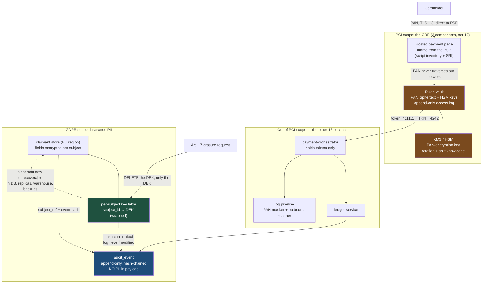

# PCI-DSS, GDPR and SOC 2 as Backlog Items: What Each One Forces You to Build

Compliance frameworks are usually delivered to engineers as PDFs and delivered by engineers as spreadsheets. That is the failure. Every clause that matters translates into a schema decision, a network boundary, a log field, or a piece of key management — and if you build those, the evidence produces itself.

## The Real-World Problem

Halvard Pay, the payments arm of a mid-size European bank, ran card acquiring for around 4,000 merchants. Its architecture had one flaw that generated three separate compliance failures.

The flaw: the full card number — the PAN — flowed into the main transaction service and was written to a `card_number` column on the `payment_attempt` table, encrypted at rest by the database's transparent encryption. Because the PAN passed through it, that service, its database, the message broker it published to, the log aggregator that received its output, and the two internal tools that read the table were all inside the cardholder data environment. Nineteen services and four teams were in PCI scope. Every one of them needed segmentation evidence, quarterly scanning, and change-management records.

Then a developer added a debug log line during an incident: `log.debug("declined attempt: {}", attempt)`, where `attempt`'s generated `toString()` included the PAN. Eleven days of logs in the central aggregator now contained 2.3 million card numbers in plaintext, replicated to a search cluster and a cold-storage bucket in a region the bank had not mapped. Remediation cost more than the annual PCI assessment.

Separately, the group's insurance arm received a deletion request from a former customer. Their PII was in the claims database, three read models, an analytics warehouse, and — critically — in the immutable, hash-chained audit log that the bank's own SOC 2 controls forbade anyone from modifying. Legal asked engineering to delete the data. Engineering pointed at the control that said the log could not be altered. That argument lasted five weeks and produced no code.

The rebuild solved all three with the same shape of answer: **shrink what holds sensitive data, and separate the evidence of an event from the payload of an event.**

## The Concept

### The one idea that covers all three frameworks

Compliance obligations attach to **data**, and they propagate to every component that touches it. So the highest-leverage engineering move is always the same: reduce the number of components that touch it.

| Framework | The core engineering demand | The cheapest way to satisfy it |
|---|---|---|
| **PCI-DSS 4.x** | Protect the PAN wherever it exists | Never let it exist in your systems — tokenize at the edge |
| **GDPR** | Be able to justify, minimise, locate and erase personal data | Store less, store it in one place, encrypt per subject |
| **SOC 2** | Prove your controls operated over a period | Make the control a pipeline gate that emits a record |

### PCI-DSS 4.x — what it forces you to build

| Requirement area | What you must actually build |
|---|---|
| **Scope reduction** (Req 1, 3) | A tokenization boundary. Everything behind it is out of scope |
| **Tokenization / vaulting** | A token that is format-preserving, non-reversible without the vault, and useless if leaked |
| **Network segmentation** (Req 1) | The CDE in its own network zone with default-deny both ways, and evidence it is segmented |
| **No PAN in logs** (Req 3.3, 3.4) | Masking at the serialization layer, plus an outbound scanner as a second line |
| **Key management** (Req 3.6, 3.7) | Keys in an HSM/KMS, split knowledge, documented rotation, keys never in the same store as ciphertext |
| **Audit logging** (Req 10) | Append-only logs of all access to cardholder data, time-synced, retained 12 months with 3 months hot |
| **Authenticated access** (Req 7, 8) | Least privilege per role, MFA for all CDE access including internal |

Note what PCI-DSS 4.x sharpened over 3.2.1: targeted risk analyses replace fixed intervals in several places, and Requirement 6.4.3 / 11.6.1 add real obligations around payment-page scripts and change detection. Both are engineering work — a script inventory with integrity checks, not a policy paragraph.

**The "never log a PAN" rule, stated properly:** it is not "be careful in log statements". A PAN must be structurally incapable of reaching a log, because the code that leaks it will be written at 02:00 during an incident by someone who did not read this article. Make the type refuse to print itself.

### GDPR — what it forces you to build

| Principle | Engineering obligation |
|---|---|
| **Lawful basis** (Art. 6) | Record *why* you hold each category of data, per record, machine-readable. Consent needs a timestamp, version, and withdrawal path |
| **Data minimisation** (Art. 5.1.c) | Justify every PII column. "The frontend might need it" is not a basis |
| **Storage limitation** (Art. 5.1.e) | A retention period per data category, enforced by a job, not a policy document |
| **Right to erasure** (Art. 17) | A deletion path that reaches every copy — including read models, warehouses, backups, and caches |
| **Right of access / DSAR** (Art. 15) | Assemble everything you hold about a subject within one month. This requires knowing where it is |
| **Data residency** (Ch. V) | Region-pinned storage and a documented transfer basis for anything crossing a border |
| **Security of processing** (Art. 32) | Encryption, pseudonymisation, access control — assessed against risk |

### The real tension: erasure vs. immutable audit logs

This is the conflict that stalls projects, so name it precisely. GDPR Article 17 requires erasure of personal data. SOC 2 change-management and PCI Requirement 10 require audit logs that cannot be altered or deleted. Both are legitimate. Both apply to the same log line.

They are only in conflict if **personal data is in the log payload.** The resolution has two parts:

1. **Separate evidence from payload.** The audit record proves *that an actor did a thing to a subject at a time*. It needs a subject reference, not a name, an address, or a policy document. Keep the immutable chain over identifiers and hashes; keep the personal data in an erasable store.
2. **Crypto-shredding for what must stay in the payload.** Encrypt the personal fields with a per-subject data key. The immutable record keeps the ciphertext untouched — the hash chain stays valid, the log was never modified. Destroy the subject's key and the ciphertext is unrecoverable, which regulators accept as erasure. One key deletion erases the subject across every copy, including backups you cannot rewrite.

Crypto-shredding is the single most useful technique in this article. It makes erasure an O(1) operation over an unbounded number of replicas.

### SOC 2 — what it forces you to build

SOC 2 audits whether your stated controls operated over a period, so the deliverable is **evidence with timestamps**, and the only sustainable source of that is your pipeline.

| Control area | Evidence the auditor wants | Where it should come from |
|---|---|---|
| **Change management** | Every production change was reviewed, tested, approved, and traceable to a ticket | Branch protection + required reviews + a deployment record emitted by CD |
| **Logical access** | Who had access to what, and quarterly proof it was reviewed | Group-membership export from the IdP, not spreadsheets |
| **Monitoring** | Alerts existed, fired, and were actioned | Alert rules in git; incident records linked to alerts |
| **Change detection / integrity** | Deployed artefacts match what was reviewed | Signed images, digest-pinned deployments, admission policy |

If an auditor's request takes an engineer a week to answer, the control is manual and will eventually fail. Design each control so the evidence is a query.

## How It Works



The two load-bearing edges: the PAN reaches only the vault, and erasure is a key deletion rather than a cascade of `DELETE` statements across systems you do not fully control.

## Practical Example

### 1. PCI — a PAN type that cannot be logged (Requirement 3.3/3.4 in code)

```java
package com.halvardpay.cde;

import java.util.Arrays;

/**
 * A PAN that refuses to serialise itself. Requirement 3.3: PAN must be masked
 * when displayed; the first six and last four are the maximum permitted.
 * Every accidental log statement, toString(), JSON serialisation and exception
 * message therefore emits a mask, not a card number.
 */
public final class Pan implements CharSequence, AutoCloseable {

    private final char[] digits;      // char[], not String: not interned, and zeroable

    private Pan(char[] digits) { this.digits = digits; }

    public static Pan of(char[] raw) {
        if (!Luhn.isValid(raw)) throw new InvalidPanException();
        return new Pan(Arrays.copyOf(raw, raw.length));
    }

    /** The ONLY representation that leaves this object. */
    @Override
    public String toString() {
        return new String(digits, 0, 6) + "*".repeat(digits.length - 10)
             + new String(digits, digits.length - 4, 4);
    }

    /** Deliberately unavailable to application code — only the vault may see the clear PAN. */
    char[] reveal(VaultCredential proof) {
        proof.assertHeldByVault();
        return Arrays.copyOf(digits, digits.length);
    }

    @Override public void close() { Arrays.fill(digits, '\0'); }   // wipe on scope exit

    @Override public int length() { return digits.length; }
    @Override public char charAt(int i) { throw new UnsupportedOperationException(); }
    @Override public CharSequence subSequence(int s, int e) { throw new UnsupportedOperationException(); }
}
```

```java
// Jackson: fail closed. A DTO carrying a Pan cannot be serialised into an HTTP
// response or a Kafka message unless someone explicitly registers a serialiser.
@JsonComponent
class PanSerializer extends JsonSerializer<Pan> {
    @Override
    public void serialize(Pan pan, JsonGenerator gen, SerializerProvider p) throws IOException {
        gen.writeString(pan.toString());        // always masked
    }
}
```

Second line of defence, because types only protect code you wrote — the log pipeline scans outbound records:

```yaml
# Vector transform on the log shipper: quarantine anything PAN-shaped before it
# reaches the aggregator. Catches PANs from third-party libraries and stack traces.
transforms:
  pan_guard:
    type: remap
    inputs: [app_logs]
    source: |
      pan_like = r'\b(?:4[0-9]{12}(?:[0-9]{3})?|5[1-5][0-9]{14}|3[47][0-9]{13})\b'
      if match(string!(.message), pan_like) {
        .pan_leak_suspected = true
        .message = replace(string!(.message), pan_like, "[REDACTED-PAN]")
      }
  route_leaks:
    type: route
    inputs: [pan_guard]
    route:
      quarantine: '.pan_leak_suspected == true'
sinks:
  quarantine_and_page:
    type: aws_s3
    inputs: [route_leaks.quarantine]
    bucket: cde-log-quarantine          # inside the CDE, restricted, alerts on write
```

### 2. PCI — network segmentation as code, default-deny both directions

```yaml
apiVersion: cilium.io/v2
kind: CiliumNetworkPolicy
metadata:
  name: token-vault-isolation
  namespace: cde
spec:
  endpointSelector:
    matchLabels: { app: token-vault }
  ingress:
    # Exactly two callers, mTLS-authenticated. Nothing else can reach the vault.
    - fromEndpoints:
        - matchLabels:
            io.kubernetes.pod.namespace: payments
            app: payment-orchestrator
      toPorts:
        - ports: [{ port: "8443", protocol: TCP }]
          rules:
            http:
              - method: POST
                path: "/v1/tokens"
              - method: POST
                path: "/v1/authorizations"     # detokenise-and-forward only
  egress:
    # The vault may reach the KMS and the acquirer. It may not reach the internet,
    # the log aggregator, or any internal service.
    - toFQDNs:
        - matchName: "kms.eu-central-1.amazonaws.com"
        - matchName: "gateway.acquirer.example"
      toPorts:
        - ports: [{ port: "443", protocol: TCP }]
    - toEndpoints:
        - matchLabels: { app: cde-audit-sink }
      toPorts:
        - ports: [{ port: "9443", protocol: TCP }]
```

The detokenise-and-forward endpoint matters architecturally: the orchestrator asks the vault to *authorise using* a token, so the clear PAN moves from vault to acquirer and never back into application memory.

### 3. GDPR — crypto-shredding, and the audit log that survives erasure

```sql
-- Per-subject data encryption keys, wrapped by a KMS master key.
-- Deleting one row is the erasure event. Nothing else needs rewriting.
CREATE TABLE subject_key (
    subject_id      UUID        PRIMARY KEY,
    wrapped_dek     BYTEA       NOT NULL,
    kms_key_id      TEXT        NOT NULL,
    created_at      TIMESTAMPTZ NOT NULL DEFAULT now(),
    erased_at       TIMESTAMPTZ,
    erasure_ref     TEXT                                   -- DSAR ticket reference
);

CREATE TABLE claimant (
    claimant_id     UUID        PRIMARY KEY,
    subject_id      UUID        NOT NULL REFERENCES subject_key(subject_id),
    policy_number   TEXT        NOT NULL,                  -- not personal data
    -- Personal data: ciphertext only. Unreadable once the DEK is destroyed.
    full_name_enc   BYTEA       NOT NULL,
    address_enc     BYTEA       NOT NULL,
    dob_enc         BYTEA       NOT NULL,
    iban_enc        BYTEA,
    -- Lawful basis, recorded per record, machine-readable (Art. 6 + Art. 30)
    lawful_basis    TEXT        NOT NULL
        CHECK (lawful_basis IN ('CONTRACT','LEGAL_OBLIGATION','CONSENT','LEGITIMATE_INTEREST')),
    consent_version TEXT,
    consent_at      TIMESTAMPTZ,
    -- Storage limitation (Art. 5.1.e), enforced by a job that reads this column
    retain_until    DATE        NOT NULL,
    data_region     TEXT        NOT NULL DEFAULT 'eu-central-1'
);

-- Append-only, hash-chained. Contains a subject REFERENCE and hashes, never PII.
CREATE TABLE audit_event (
    seq             BIGSERIAL   PRIMARY KEY,
    occurred_at     TIMESTAMPTZ NOT NULL DEFAULT now(),
    actor_sub       UUID        NOT NULL,                  -- Keycloak subject of the actor
    actor_client    TEXT        NOT NULL,
    action          TEXT        NOT NULL,                  -- 'CLAIM_APPROVED'
    subject_ref     UUID        NOT NULL,                  -- pseudonymous, survives erasure
    resource_ref    TEXT        NOT NULL,                  -- 'claim:8842190'
    payload_hash    BYTEA       NOT NULL,                  -- SHA-256 of the request body
    prev_hash       BYTEA       NOT NULL,
    entry_hash      BYTEA       NOT NULL
);

REVOKE UPDATE, DELETE ON audit_event FROM app_rw;          -- INSERT only, enforced by grant
CREATE RULE audit_no_update AS ON UPDATE TO audit_event DO INSTEAD NOTHING;
CREATE RULE audit_no_delete AS ON DELETE TO audit_event DO INSTEAD NOTHING;
```

```java
@Service
class ErasureService {

    private final SubjectKeyRepository keys;
    private final KmsClient kms;
    private final AuditWriter audit;

    /**
     * Article 17 erasure. Destroys the subject's data key.
     * Every copy of the ciphertext — read models, warehouse, replicas, snapshots,
     * cold backups — becomes permanently unreadable in one operation.
     * The audit chain is untouched, so SOC 2 and PCI Req 10 remain satisfied.
     */
    @Transactional
    public ErasureReceipt erase(UUID subjectId, String dsarRef) {
        var key = keys.findById(subjectId).orElseThrow(() -> new SubjectNotFoundException(subjectId));

        if (retentionHoldApplies(subjectId)) {
            // Art. 17(3)(b): legal obligation overrides erasure. Record the refusal
            // with its basis — an unexplained refusal is itself a finding.
            return ErasureReceipt.refused(subjectId, "AML_RETENTION_5Y", dsarRef);
        }

        kms.scheduleKeyDeletion(key.kmsKeyId(), Duration.ofDays(7));   // reversal window
        keys.markErased(subjectId, dsarRef, Instant.now());
        keys.destroyWrappedDek(subjectId);

        audit.record("SUBJECT_ERASED", subjectId, Map.of("dsar_ref", dsarRef));
        return ErasureReceipt.completed(subjectId, dsarRef);
    }
}
```

```java
// Storage limitation as a scheduled job, not a paragraph in a policy document.
@Scheduled(cron = "0 30 2 * * *", zone = "Europe/Berlin")
@SchedulerLock(name = "retention-sweep")
void sweepExpiredRecords() {
    for (var subjectId : claimants.subjectsPastRetention(LocalDate.now())) {
        erasureService.erase(subjectId, "RETENTION_SWEEP");
    }
}
```

### 4. DSAR mechanics — Article 15 is a query problem

You have one month. That is only achievable if every store that holds personal data registers itself.

```java
public interface PersonalDataSource {
    String name();                                  // 'claims-db', 'crm', 'warehouse'
    String lawfulBasisSummary();
    Map<String, Object> exportFor(UUID subjectId);  // decrypted, for this subject only
}

@Service
class DsarService {

    private final List<PersonalDataSource> sources;   // Spring injects every registered source
    private final AuditWriter audit;

    public DsarPackage assemble(UUID subjectId, String requestRef) {
        var payload = new LinkedHashMap<String, Object>();
        for (var source : sources) {
            payload.put(source.name(), Map.of(
                "lawful_basis", source.lawfulBasisSummary(),
                "data", source.exportFor(subjectId)));
        }
        audit.record("DSAR_EXPORTED", subjectId, Map.of("request_ref", requestRef,
                                                        "sources", sources.size()));
        return DsarPackage.of(subjectId, payload);   // delivered over an authenticated channel
    }
}
```

The architectural consequence: a new service that stores personal data must implement `PersonalDataSource`, and an ArchUnit rule fails the build if a `@Table` class has a field annotated `@PersonalData` in a module that does not. That is how data mapping stays accurate instead of becoming a stale wiki page.

### 5. SOC 2 — change-management evidence emitted by the pipeline

```yaml
# .github/workflows/deploy.yml — the control and its evidence are the same artefact.
name: deploy-production
on:
  push:
    branches: [main]

jobs:
  deploy:
    runs-on: ubuntu-latest
    environment:
      name: production          # required reviewers configured here = approval evidence
    permissions:
      contents: read
      id-token: write
      attestations: write
    steps:
      - uses: actions/checkout@v4

      - name: Assert change is traceable to an approved ticket
        run: |
          TICKET=$(git log -1 --pretty=%s | grep -oE '[A-Z]+-[0-9]+' | head -1)
          test -n "$TICKET" || { echo "No ticket reference in commit subject"; exit 1; }
          gh api "repos/${{ github.repository }}/commits/${{ github.sha }}/pulls" \
            --jq '.[0].reviews_url' | xargs gh api --jq \
            'map(select(.state=="APPROVED")) | length' | \
            awk '$1 < 1 { print "No approving review"; exit 1 }'
          echo "ticket=$TICKET" >> "$GITHUB_OUTPUT"

      - name: Build and sign
        run: |
          docker build -t "$IMAGE:${{ github.sha }}" .
          docker push "$IMAGE:${{ github.sha }}"
          cosign sign --yes "$IMAGE:${{ github.sha }}"

      - uses: actions/attest-build-provenance@v1
        with:
          subject-name: ${{ env.IMAGE }}
          subject-digest: ${{ steps.build.outputs.digest }}

      - name: Emit the deployment record
        run: |
          jq -n --arg sha "${{ github.sha }}" --arg ticket "${{ steps.ticket.outputs.ticket }}" \
                --arg actor "${{ github.actor }}" --arg digest "${{ steps.build.outputs.digest }}" \
                '{event:"production_deployment", commit:$sha, ticket:$ticket,
                  deployed_by:$actor, image_digest:$digest,
                  approvals:"github_environment_production", at:now|todate}' \
            | curl -sS -X POST "$EVIDENCE_SINK" -H 'content-type: application/json' --data @-
```

The auditor's question — "show me that every production change in Q3 was reviewed and traceable" — becomes a query against the evidence sink. Access review becomes a group-membership export from Keycloak, as described in [04-keycloak-realms-clients-and-roles.md](04-keycloak-realms-clients-and-roles.md).

## Enterprise Trade-offs

| Approach | Pros | Cons | When to use (Banking / Insurance / Enterprise) |
|---|---|---|---|
| **Tokenize at the edge; PAN never enters your estate** | Cuts PCI scope from 19 services to 3; the log-leak class of incident becomes impossible | PSP dependency and fees; a token vault to operate or buy; refunds and recurring billing must be token-based | Default for any merchant or acquirer that is not in the business of storing cards |
| **Store encrypted PANs in the main application database** | No PSP dependency; full control of the flow | Pulls every connected service, broker, log sink and backup into PCI scope; assessment cost scales with that | Only where a documented business requirement genuinely needs the PAN, in a service isolated for that purpose |
| **Crypto-shredding for erasure** | O(1) erasure across replicas, warehouses and backups; immutable audit chain stays valid; accepted as erasure | Key-management discipline is mandatory; a lost key is an unplanned deletion; encrypted columns cannot be indexed or joined on | Any system holding personal data with a genuine erasure obligation — insurance claimants, retail customers |
| **Row deletion cascaded across every store** | Conceptually simple; data is genuinely gone from live systems | Cannot reach immutable logs or archived backups; breaks referential integrity; one missed replica is a breach | Small, single-database systems with no analytics copies and no immutable log |
| **PII inside audit log payloads** | Rich, self-contained forensic records | Creates the direct Article 17 vs. Requirement 10 deadlock — five weeks of argument and no code | Never. Log a subject reference and a payload hash |
| **Pipeline-emitted compliance evidence** | Evidence is a query; the control cannot silently stop operating; audit prep drops from weeks to hours | Up-front pipeline work; the evidence sink itself needs retention and access control | Every regulated environment, and the only sustainable answer for SOC 2 Type II |
| **Manual evidence collection each audit cycle** | No engineering effort until the audit | Consumes engineer-weeks annually; drift goes undetected between cycles; findings are discovered by the auditor | Never past the first audit |

→ Next: [07-securing-internal-vs-external-apis.md](07-securing-internal-vs-external-apis.md) · Related: [../01-core-concepts/05-security-by-default.md](../01-core-concepts/05-security-by-default.md) · [../01-core-concepts/04-data-integrity-and-migrations.md](../01-core-concepts/04-data-integrity-and-migrations.md) · [../06-database-strategies/04-ddl-vs-dml-roles-and-ownership.md](../06-database-strategies/04-ddl-vs-dml-roles-and-ownership.md) · [../08-testing-strategies/05-testing-in-regulated-enterprise-systems.md](../08-testing-strategies/05-testing-in-regulated-enterprise-systems.md) · [../00-project-setup-roadmap/02-environment-and-secrets.md](../00-project-setup-roadmap/02-environment-and-secrets.md) · [../00-project-setup-roadmap/09-code-review-process.md](../00-project-setup-roadmap/09-code-review-process.md)
