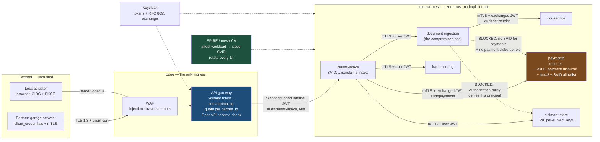

# The Network Is Not an Authentication Mechanism

"It's internal" is the most expensive sentence in enterprise security. An IP address is not an identity, a VPC is not a trust boundary, and a caller that cannot prove who it is should not be served — regardless of which side of the firewall it arrived from.

## The Real-World Problem

Aurelia Insurance runs claims on a mesh of fourteen internal services: intake, document ingestion, OCR, fraud scoring, reserving, adjudication, payments, notification, and the rest. Externally it exposes a partner API used by 240 garages, loss adjusters and repair networks to submit and track motor claims.

The external edge was defended properly: a gateway, OAuth scopes, rate limits per partner, a WAF, mTLS for the larger partners. The internal mesh was defended by being internal. Services called each other over plain HTTP inside the cluster with no authentication at all, on the reasoning that nothing outside the VPC could reach them.

The compromise did not come through the partner API. It came through a vulnerable image-processing library in the document-ingestion service — reachable, by design, from a partner upload. The attacker got remote code execution in one pod. From there, everything was open:

- `POST /internal/payments/disburse` accepted the call. It had no notion of a caller identity, so it could not refuse one.
- `GET /internal/claimants/{id}` returned full claimant PII, unauthenticated, at any rate the attacker liked.
- The fraud-scoring service accepted a `POST /internal/scores/override`, which existed for an internal admin tool and had no authorisation check because "only the admin tool calls it".

Eleven days of lateral movement. 2,900 claimant records read. Four fraudulent disbursements totalling 340,000 EUR, each one accepted by the payments service and each one recorded in the audit log with no actor, because there was no actor to record.

The remediation was not a bigger firewall. It was giving every workload a cryptographic identity, requiring it on every call, and rewriting the audit log to record who — which is what should have existed on day one.

## The Concept

### The central argument

A perimeter answers *where a request came from*. Authentication answers *who is making it*. These are different questions, and only the second one is useful:

- Network location is forgeable within the network and is inherited by anything that gets a foothold.
- Perimeters have holes by design — every service reachable from the edge is a potential pivot.
- An unauthenticated caller cannot be authorised, rate-limited per identity, or recorded in an audit trail. You lose all three controls at once.

Zero trust in one sentence: **every call carries a verifiable identity, and every callee verifies it, every time.** "Internal" changes which credential you use, never whether you need one.

### Two edges, two threat models

| | Public / partner edge | Service-to-service |
|---|---|---|
| **Caller** | Untrusted, unknown, potentially hostile | A known workload you deployed |
| **Identity** | End user (OIDC) or partner org (client credentials + mTLS) | Workload identity (SPIFFE/SVID, mTLS cert) |
| **Token format** | Opaque or short JWT; audience = the gateway | Short-lived internal JWT + mTLS peer cert |
| **Primary controls** | Gateway, WAF, per-partner quotas, scopes, schema validation | mTLS, workload identity, per-route authorisation, mesh policy |
| **Failure to defend costs** | Data exfiltration, abuse, fraud, reputational damage | Total lateral movement after one compromise — the scenario above |
| **Latency budget** | Tens of ms acceptable | Sub-millisecond overhead expected |

### The external edge: what actually goes there

| Control | What it does | What it does not do |
|---|---|---|
| **Gateway** | Terminates TLS, validates tokens, enforces quotas, normalises requests | Authorise business operations |
| **WAF** | Blocks known-bad shapes: injection, traversal, scanners | Stop a valid-looking abusive request |
| **OAuth scopes** | Coarse capability grants: `claims:submit`, `claims:read` | Row-level authorisation — "this partner's claims only" |
| **Rate limiting per identity** | Contains abuse and runaway integrations | Anything, if keyed on IP — partners sit behind NAT |
| **mTLS for partners** | Proves the calling organisation holds a private key; kills stolen-secret replay | Identify the end user |
| **Schema validation at the edge** | Rejects malformed input before it reaches business logic | Replace validation in the service |

**API keys vs. tokens** — the distinction partners always argue about:

| | API key | OAuth access token |
|---|---|---|
| **Lifetime** | Months or years | Minutes |
| **Revocation** | Delete the key; the partner breaks immediately | Expiry, plus refresh revocation |
| **Rotation** | Manual, coordinated, usually skipped | Automatic every few minutes |
| **Carries scopes** | Only what your gateway maps to it | Yes, cryptographically bound |
| **Leak impact** | Full access until someone notices | Bounded to the token lifetime |
| **Verdict** | Acceptable as a *routing/quota identifier*, never as the sole credential | The credential |

The workable enterprise pattern: partner authenticates with client credentials over mTLS to get a short-lived token; the API key, if it exists at all, identifies the integration for quota and support purposes and grants nothing on its own.

### Service-to-service: workload identity, not shared secrets

The credential problem inside the mesh is bootstrapping — how does a pod prove it is `payments-service` before it has any credential? SPIFFE answers this by deriving identity from the platform: the node's attestor verifies the workload against the orchestrator, and issues a short-lived X.509 SVID.

```
spiffe://aurelia.example/ns/claims/sa/payments-service
```

That URI is the identity. It appears in the certificate SAN, rotates every hour or less, is never written to a config map, and cannot be copied to another workload because the private key never leaves the pod.

| Mechanism | Bootstraps from | Rotation | Verdict |
|---|---|---|---|
| **SPIFFE/SVID (SPIRE, or a mesh's built-in CA)** | Platform attestation | Automatic, ≤1h | The standard for workload identity |
| **Mesh mTLS (Istio/Linkerd defaults)** | Kubernetes service account | Automatic | Excellent, and nearly free to adopt |
| **Static client secret per service** | A secret store | Manual, rarely done | Acceptable only if secrets are short-lived and per-service |
| **Shared secret across services** | — | Never | Never. One leak is every service |
| **Nothing — trust the network** | — | — | Never. The scenario above |

### Token propagation vs. service-account tokens

This is the decision engineers get wrong most often inside a mesh. Both are legitimate; they answer different questions.

| | Propagate the user token (or exchange it) | Service-account token (client credentials) |
|---|---|---|
| **Answers** | "On whose behalf is this happening?" | "Which system is doing this?" |
| **Audit trail** | Records the human | Records the service only |
| **Right for** | Anything a user initiated: submit claim, approve payment, read claimant data | Scheduled and system-initiated work: nightly reserving run, reconciliation, index rebuild |
| **Authorisation** | User's roles + row scoping by their organisation | Service's own narrow roles |
| **Failure mode when misused** | Wide token forwarded to a low-trust service (fix: token exchange, see [05-keycloak-in-a-banking-sso-architecture.md](05-keycloak-in-a-banking-sso-architecture.md)) | Regulator asks who approved a payment; the log says `payments-service` |

The rule: **if a human caused it, their identity must survive every hop.** Use token exchange to narrow the audience per hop rather than dropping to a service account for convenience. And note that mTLS and the token are complementary, not alternatives — mTLS proves *which workload* is calling, the token proves *on whose behalf*. You need both.

## How It Works



The two dotted red paths are the entire point: the compromised pod is still inside the network, and it still cannot reach payments or claimant PII, because both callees ask who is calling and it cannot answer acceptably.

## Practical Example

### 1. The partner edge — token exchange at the gateway, quota per partner

```yaml
# Spring Cloud Gateway (or equivalent) — the edge does identity and quota,
# then hands the mesh a narrow, short-lived internal token.
spring:
  cloud:
    gateway:
      routes:
        - id: partner-claims-submit
          uri: http://claims-intake.claims.svc.cluster.local:8443
          predicates:
            - Path=/partner/v1/claims/**
            - Method=POST
          filters:
            - name: TokenRelay                 # exchanged, not forwarded verbatim
            - name: RequestRateLimiter
              args:
                # Keyed on partner identity from the token — NEVER on IP.
                key-resolver: "#{@partnerKeyResolver}"
                redis-rate-limiter.replenishRate: 20
                redis-rate-limiter.burstCapacity: 60
            - name: CircuitBreaker
              args: { name: claims-intake, fallbackUri: forward:/degraded/claims }
            - RemoveRequestHeader=X-Internal-Actor    # strip client-supplied trust headers
      httpclient:
        ssl:
          key-store: /etc/gateway/mesh-client.p12    # gateway→mesh is mTLS too
        connect-timeout: 300
        response-timeout: 3s
```

```java
@Bean
KeyResolver partnerKeyResolver() {
    // Quota per partner organisation. An IP-keyed limiter is worthless: a garage
    // network of 40 sites NATs to one address, and a hostile caller rotates addresses.
    return exchange -> ReactiveSecurityContextHolder.getContext()
        .map(ctx -> (JwtAuthenticationToken) ctx.getAuthentication())
        .map(auth -> auth.getToken().getClaimAsString("partner_id"))
        .switchIfEmpty(Mono.error(new AccessDeniedException("no partner_id claim")));
}
```

```java
@Configuration
@EnableWebFluxSecurity
class EdgeSecurity {

    @Bean
    SecurityWebFilterChain edge(ServerHttpSecurity http) {
        http
            .authorizeExchange(ex -> ex
                .pathMatchers("/actuator/health/**").permitAll()
                .pathMatchers(HttpMethod.POST, "/partner/v1/claims/**")
                    .hasAuthority("SCOPE_claims:submit")
                .pathMatchers(HttpMethod.GET, "/partner/v1/claims/**")
                    .hasAuthority("SCOPE_claims:read")
                .anyExchange().denyAll())              // deny by default at the edge
            .oauth2ResourceServer(o -> o.jwt(Customizer.withDefaults()))
            .csrf(ServerHttpSecurity.CsrfSpec::disable)
            .headers(h -> h.hsts(hsts -> hsts.maxAge(Duration.ofDays(730))));
        return http.build();
    }
}
```

Partner client, registered for mTLS client authentication so a leaked secret is not enough:

```json
{
  "clientId": "partner-northgate-motors",
  "publicClient": false,
  "standardFlowEnabled": false,
  "serviceAccountsEnabled": true,
  "clientAuthenticatorType": "client-x509",
  "attributes": {
    "x509.subjectdn": "CN=api\\.northgatemotors\\.example,O=Northgate Motors Ltd.*",
    "x509.allow.regex.pattern.comparison": "true",
    "tls-client-certificate-bound-access-tokens": "true",
    "access.token.lifespan": "300"
  },
  "defaultClientScopes": ["claims:submit", "claims:read"]
}
```

`tls-client-certificate-bound-access-tokens` is the control that matters: the issued token carries a `cnf.x5t#S256` confirmation claim, so a stolen token cannot be replayed without the partner's private key. Bearer becomes proof-of-possession.

### 2. The mesh — mTLS required, and authorisation per caller identity

```yaml
apiVersion: security.istio.io/v1
kind: PeerAuthentication
metadata:
  name: default
  namespace: claims
spec:
  mtls:
    mode: STRICT          # plaintext is refused. This alone would have contained the breach.
---
apiVersion: security.istio.io/v1
kind: AuthorizationPolicy
metadata:
  name: payments-callers
  namespace: claims
spec:
  selector:
    matchLabels: { app: payments }
  action: ALLOW
  rules:
    # Only claims-intake and the reserving job may talk to payments, on named routes.
    - from:
        - source:
            principals:
              - "cluster.local/ns/claims/sa/claims-intake"
              - "cluster.local/ns/claims/sa/reserving-batch"
      to:
        - operation:
            methods: ["POST"]
            paths: ["/internal/v1/disbursements"]
      when:
        # A valid mesh identity is necessary but not sufficient: the request must
        # also carry a token from our issuer, addressed to this service.
        - key: request.auth.claims[iss]
          values: ["https://id.aurelia.example/realms/claims"]
        - key: request.auth.audiences
          values: ["payments"]
---
apiVersion: security.istio.io/v1
kind: AuthorizationPolicy
metadata:
  name: deny-all-by-default
  namespace: claims
spec:
  {}                      # empty spec with no rules = deny everything not explicitly allowed
```

The `deny-all-by-default` policy is the one that turns a mesh from an observability tool into a security boundary. Add it first; the allowlist follows.

### 3. Defence in depth — the service authorises too, because the mesh can be misconfigured

```java
@RestController
@RequestMapping("/internal/v1/disbursements")
class DisbursementController {

    private final Disbursements disbursements;

    /**
     * Three independent checks, deliberately redundant:
     *   1. mTLS peer identity (mesh) — which workload is calling
     *   2. Token audience + role (here) — on whose behalf, and may they
     *   3. Row scoping (below)          — for which claim
     * Any single layer failing does not open the endpoint.
     */
    @PostMapping
    @PreAuthorize("hasRole('payment.disburse') and authentication.token.claims['acr'] == '2'")
    ResponseEntity<DisbursementReceipt> disburse(
            @RequestHeader("Idempotency-Key") @NotBlank String idempotencyKey,
            @Valid @RequestBody DisburseRequest request,
            @AuthenticationPrincipal Jwt caller) {

        // The workload identity from the mTLS peer certificate, surfaced by the sidecar.
        String peer = SpiffeId.current().orElseThrow(() -> new AccessDeniedException("no SVID"));
        if (!ALLOWED_CALLERS.contains(peer)) {
            throw new AccessDeniedException("workload not permitted: " + peer);
        }

        // Row scoping: a valid token for another partner cannot disburse this claim.
        var claim = claims.findByIdAndPartnerId(request.claimId(),
                                                caller.getClaimAsString("partner_id"))
                          .orElseThrow(() -> new ClaimNotFoundException(request.claimId()));

        var receipt = disbursements.execute(claim, request.amount(), idempotencyKey,
                                            caller.getSubject(), peer);   // actor recorded
        return ResponseEntity.status(HttpStatus.CREATED).body(receipt);
    }

    private static final Set<String> ALLOWED_CALLERS = Set.of(
        "spiffe://aurelia.example/ns/claims/sa/claims-intake",
        "spiffe://aurelia.example/ns/claims/sa/reserving-batch");
}
```

```java
@Configuration
@EnableWebSecurity
@EnableMethodSecurity
class InternalApiSecurity {

    @Bean
    SecurityFilterChain internal(HttpSecurity http, KeycloakClientRoleConverter roles) throws Exception {
        http
            .securityMatcher("/internal/**")
            .authorizeHttpRequests(a -> a.anyRequest().authenticated())   // no anonymous internal route
            .oauth2ResourceServer(o -> o.jwt(j -> j.jwtAuthenticationConverter(roles)))
            .sessionManagement(s -> s.sessionCreationPolicy(SessionCreationPolicy.STATELESS))
            .csrf(CsrfConfigurer::disable);
        return http.build();
    }

    @Bean
    JwtDecoder internalDecoder(@Value("${auth.issuer}") String issuer) {
        var decoder = NimbusJwtDecoder.withIssuerLocation(issuer)
            .jwsAlgorithms(a -> a.add(SignatureAlgorithm.RS256))
            .build();
        decoder.setJwtValidator(new DelegatingOAuth2TokenValidator<>(
            JwtValidatorFactory.createDefault(),
            new JwtIssuerValidator(issuer),
            new JwtClaimValidator<List<String>>("aud",
                aud -> aud != null && aud.contains("payments"))));    // audience, always
        return decoder;
    }
}
```

### 4. The test that proves "internal" is not a credential

```java
@SpringBootTest(webEnvironment = RANDOM_PORT)
class InternalEndpointAuthTest {

    @Test
    void disburse_withoutToken_is401_evenFromInsideTheCluster() {
        var response = rest.postForEntity("/internal/v1/disbursements",
                                          new DisburseRequest(CLAIM_ID, Money.of("500.00")),
                                          ProblemDetail.class);
        assertThat(response.getStatusCode()).isEqualTo(HttpStatus.UNAUTHORIZED);
    }

    @Test
    void disburse_withValidTokenButWrongAudience_is401() {
        var token = tokens.forUser("adjuster").withAudience("ocr-service").build();
        assertThat(call(token).getStatusCode()).isEqualTo(HttpStatus.UNAUTHORIZED);
    }

    @Test
    void disburse_withCorrectAudienceButNoRole_is403() {
        var token = tokens.forUser("adjuster").withAudience("payments").build();
        assertThat(call(token).getStatusCode()).isEqualTo(HttpStatus.FORBIDDEN);
    }

    @Test
    void disburse_forAnotherPartnersClaim_is404_notLeakingExistence() {
        var token = tokens.forUser("adjuster").withAudience("payments")
                          .withRole("payment.disburse").withPartner("OTHER-PARTNER").build();
        assertThat(call(token).getStatusCode()).isEqualTo(HttpStatus.NOT_FOUND);
    }
}
```

Add an architecture test so a new internal controller cannot ship unauthenticated:

```java
@Test
void every_internal_controller_method_is_authorized() {
    ArchRuleDefinition.methods()
        .that().areDeclaredInClassesThat().areAnnotatedWith(RestController.class)
        .and().areAnnotatedWith(PostMapping.class)
        .should().beAnnotatedWith(PreAuthorize.class)
        .because("an internal endpoint without an authorization check is a lateral-movement path")
        .check(new ClassFileImporter().importPackages("com.aurelia.claims"));
}
```

## Enterprise Trade-offs

| Approach | Pros | Cons | When to use (Banking / Insurance / Enterprise) |
|---|---|---|---|
| **Gateway + OAuth scopes + per-identity quota + WAF (external)** | One controlled ingress; abuse containment; consistent token validation and schema checks | A tier-0 component of its own; edge team becomes a bottleneck if it owns business rules | Every public and partner-facing API, without exception |
| **mTLS with certificate-bound tokens for partners** | Kills stolen-secret and stolen-token replay; proves the organisation | Certificate lifecycle with 240 external parties is real operational work | Larger partners, payment initiation, anything with a fraud or settlement impact |
| **API key as sole credential** | Trivial for partners to adopt; works from a shell script | Long-lived, rarely rotated, leaks into repos and CI logs, no scopes, no expiry | Never as the sole credential. Acceptable only as a quota and support identifier alongside a token |
| **Mesh mTLS STRICT + default-deny AuthorizationPolicy** | Workload identity with near-zero application change; contains the blast radius of one compromised pod | Mesh to operate and upgrade; policy drift needs its own review; sidecar latency and resource cost | Default for any internal estate above roughly five services, and mandatory where PII or money moves |
| **SPIFFE/SPIRE workload identity** | Platform-attested, no bootstrap secret, sub-hour rotation, portable across Kubernetes and VMs | Another control plane; attestation policy must be understood, not copied | Multi-platform or multi-cluster estates; regulated environments needing provable workload identity |
| **Token exchange to narrow audience per hop** | Preserves the human in the audit trail while a compromised hop holds a useless token | An IdP round trip per hop; raises coupling to the IdP | Any hop crossing a trust boundary, especially into third-party or lower-trust services |
| **Service-account token for user-initiated work** | Simple; unaffected by user token expiry | Audit log cannot answer "who authorised this?" — a finding in any regulated review | Only for genuinely system-initiated work: nightly reserving, reconciliation, reindexing |
| **Trust the network — no internal authentication** | Nothing to build; lowest latency | One RCE becomes total lateral movement, unauthenticated PII access, and an audit trail with no actor | Never. This is the scenario above |

→ Next: [../05-apis-and-integration/01-rest-api-design-principles.md](../05-apis-and-integration/01-rest-api-design-principles.md) · Related: [05-keycloak-in-a-banking-sso-architecture.md](05-keycloak-in-a-banking-sso-architecture.md) · [06-compliance-standards-pci-dss-gdpr-soc2.md](06-compliance-standards-pci-dss-gdpr-soc2.md) · [../01-core-concepts/05-security-by-default.md](../01-core-concepts/05-security-by-default.md) · [../03-architecture/04-microservices-vs-monolith.md](../03-architecture/04-microservices-vs-monolith.md) · [../05-apis-and-integration/03-grpc-and-protobuf-for-internal-services.md](../05-apis-and-integration/03-grpc-and-protobuf-for-internal-services.md) · [../00-project-setup-roadmap/07-observability.md](../00-project-setup-roadmap/07-observability.md)
