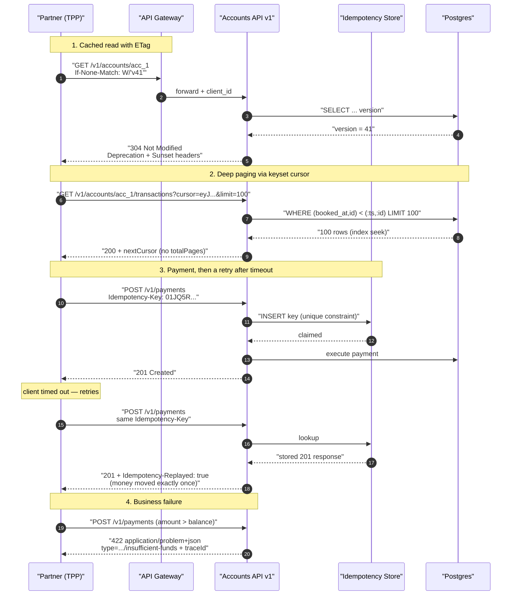

# REST at Enterprise Scale: The Parts That Break When You Can't Force an Upgrade

Designing a REST API for your own frontend is easy — you control both ends and can change them in the same pull request. Designing one for forty partner banks who each have their own release calendar is a different discipline entirely: every decision you make on day one becomes a permanent liability.

## The Real-World Problem

A retail bank ships an Open Banking–style partner API: `/accounts`, `/accounts/{id}/transactions`, `/payments`. Forty-three registered third-party providers (TPPs) integrate — budgeting apps, accounting platforms, two challenger banks doing account aggregation. None of them can be compelled to upgrade; several are regulated entities whose own change process takes a quarter.

Three things break in the first eighteen months.

**Pagination collapses.** Transaction history is paged with `?page=482&size=100`. On a corporate account with 4.1 million rows, `OFFSET 48200` forces Postgres to walk and discard every preceding row, and the aggregators sweep the whole history nightly. A single TPP's nightly sync drives the transaction table's p99 from 40 ms to 9 seconds, and it degrades the mobile app on the same replica.

**A retried payment charges twice.** A TPP's HTTP client times out at 10 seconds on `POST /payments`. The payment had actually succeeded at second 11. Their retry created a second payment. 312 duplicate transactions in one afternoon, all of them manually reversed, all of them reportable.

**A "non-breaking" change breaks nine consumers.** The team changes the error body from `{"error": "..."}` to `{"message": "...", "code": "..."}` — additive on the happy path, catastrophic for the nine TPPs parsing `error` to decide whether to retry. There was no version to shelter behind and no deprecation channel to warn through, because errors were never considered part of the contract.

Cost: a regulatory incident report, six weeks of engineering on a v2 nobody wanted, and a bilateral migration negotiation with each of forty-three partners.

## The Concept

### Resource modelling: nouns that survive reorganisations

Model resources around **stable business entities**, not around screens or internal services. `/accounts/{id}/transactions` survives a backend rewrite; `/dashboard-summary` dies the moment the dashboard changes. Two rules:

- **Plural collections, opaque identifiers.** `/accounts/{accountId}` — and `accountId` is an opaque string, never a sequential database key. Sequential IDs leak volume and invite enumeration.
- **Nest exactly one level.** `/accounts/{id}/transactions` is fine. `/customers/{id}/accounts/{id}/transactions/{id}/disputes` is a cry for help — expose `/disputes/{id}` at the root and link to it.

Actions that aren't CRUD get modelled as resources too. A payment cancellation is not `POST /payments/{id}/cancel` in the purist reading, but it is honest, discoverable, and testable — and purism has never once helped a partner integrate. Prefer a sub-resource for anything with its own lifecycle: `POST /payments/{id}/cancellations` returns a cancellation with its own status.

### URI design rules

| Rule | Do | Don't |
|---|---|---|
| Casing | `/direct-debits` | `/directDebits`, `/direct_debits` |
| Verbs | `GET /accounts` | `GET /getAccounts` |
| Filtering | `?status=SETTLED&from=2026-01-01` | `/accounts/settled-since-january` |
| Field names in bodies | `camelCase`, consistent everywhere | mixed `snake_case`/`camelCase` |
| Trailing slash | never | `/accounts/` |
| Money | `{"amount": "104.55", "currency": "EUR"}` as string | float `104.55` |

Money as a decimal string is not pedantry. IEEE-754 doubles cannot represent `0.1`, and a JSON parser that reads amounts into a double will eventually produce a reconciliation break that takes two days to find.

### Versioning: pick URI versioning, and here is the defence

Three options are on the table, and the internet will tell you the wrong one is best.

| Strategy | Example | Reality |
|---|---|---|
| **URI path** | `/v1/accounts` | Visible in logs, gateways, curl, Postman collections, and partner runbooks. Trivially routable at the edge. Impure. |
| **Custom header** | `X-API-Version: 2` | Invisible in access logs and browser address bars. Caches ignore it unless you get `Vary` exactly right. Partners forget to send it, so you need a default — and now the default is a hidden breaking change. |
| **Media type** | `Accept: application/vnd.bank.account.v2+json` | Theoretically correct, genuinely expressive per-resource. Also the single most common source of partner integration tickets: hand-written clients get the string wrong, proxies strip or rewrite `Accept`, and CDNs cache across versions. |

**Choose URI path versioning for any API with external consumers.** The deciding argument is operational, not architectural: when a partner opens a ticket saying "your API is returning the wrong shape", you need to know within one log line which contract they were served. URI versioning puts the answer in the request line — in your gateway metrics, your WAF rules, your rate-limit buckets, and their own logs. Header and media-type versioning push that information into a place where it gets lost, defaulted, or stripped by an intermediary you don't control.

The corollary is the actual discipline: **version rarely.** A new major version is a migration project for every consumer, so treat it as a last resort and absorb change additively instead.

| Change | Breaking? |
|---|---|
| Add an optional response field | No — consumers must tolerate unknown fields (say so in the docs) |
| Add an optional request field | No |
| Add a new enum value | **Yes, in practice** — clients with exhaustive switches break. Document reserved/unknown handling from v1 |
| Make an optional request field required | Yes |
| Remove or rename any response field | Yes |
| Tighten validation | Yes |
| Change error codes or error body shape | Yes — errors are part of the contract |
| Change default page size | Yes, for anyone paging by count |

### Idempotency keys on every mutating endpoint

Any `POST` that moves money, opens an account, or files a claim must accept an `Idempotency-Key` header. The contract:

1. Client generates a UUIDv7 per logical operation and **reuses it across retries**.
2. Server stores `(key, client_id) → response` with a unique constraint, plus a hash of the request body.
3. Replay with the same key and same body → the original response, same status code, plus `Idempotency-Replayed: true`.
4. Same key, **different** body → `422` with a Problem Details type of `idempotency-key-reuse`. This catches the client bug where a key is reused for a different payment.
5. Key still in flight → `409`. Do not process concurrently.
6. Keys expire after 24 hours; document the window.

The unique constraint is doing the real work. An application-level "check then insert" loses the race between two concurrent retries.

### Cursor pagination, and why offset fails

`OFFSET n` is not an index seek. The database must produce and discard `n` rows before returning anything, so cost grows linearly with page depth — page 1 is instant, page 500 is a table scan with extra steps. It is also **incorrect** under concurrent writes: insert a row while a client pages forward and every subsequent page shifts, so rows are silently skipped or duplicated. On an append-heavy transaction table with a nightly aggregator, both happen constantly.

Cursor (keyset) pagination encodes the sort key of the last row seen:

```sql
-- offset: reads 48,300 rows to return 100
SELECT * FROM transaction WHERE account_id = $1
ORDER BY booked_at DESC, id DESC OFFSET 48200 LIMIT 100;

-- keyset: index seek, reads 100 rows, constant cost at any depth
SELECT * FROM transaction
WHERE account_id = $1 AND (booked_at, id) < ($2, $3)
ORDER BY booked_at DESC, id DESC LIMIT 100;
```

Rules: the cursor is **opaque** (base64 of the tuple plus a signature — partners will otherwise parse and forge it), the sort key must be **unique** (append a tiebreaker like `id`; `booked_at` alone will drop rows that share a timestamp), and you return `nextCursor` rather than `totalPages`. If a consumer genuinely needs a total, give them a separate, cached, approximate count endpoint — an exact count on a large table is a scan and it does not belong in the hot path.

### RFC 9457 Problem Details: one error shape, forever

Stop inventing error envelopes. RFC 9457 (which obsoletes RFC 7807) defines `application/problem+json`:

```json
{
  "type": "https://api.examplebank.com/problems/insufficient-funds",
  "title": "Insufficient funds",
  "status": 422,
  "detail": "Available balance 42.10 EUR is below the requested 500.00 EUR.",
  "instance": "/v1/payments/pay_01JQ5R8K",
  "traceId": "00-4bf92f3577b34da6a3ce929d0e0e4736-00f067aa0ba902b7-01",
  "errors": [
    { "pointer": "#/amount", "detail": "must not exceed available balance" }
  ]
}
```

`type` is the machine-readable discriminator and it is a **stable URI** — consumers switch on it, so it can never change. `detail` is human prose and may change freely. Include the W3C trace ID in every problem response: when a partner reports a failure, that one field turns a two-day investigation into a trace lookup. Never put PII, account numbers, or stack traces in `detail`.

### Conditional requests and ETags

Return a strong `ETag` on every single-resource `GET`, and require `If-Match` on `PUT`/`PATCH`. This gives you two things for one header:

- **Bandwidth and latency**: `If-None-Match` → `304 Not Modified` with an empty body. Aggregators polling account details get near-free responses.
- **Optimistic concurrency**: `If-Match` mismatch → `412 Precondition Failed`, which prevents the lost-update problem where two TPPs overwrite each other's standing-order edit. For mutating endpoints, make `If-Match` mandatory — a missing header gets `428 Precondition Required`, not a silent last-write-wins.

Derive the ETag from a row version column, not from hashing the serialised body: hashing means a serialisation change invalidates every client's cache.

### Partial response, bulk operations, deprecation

**Partial response.** `?fields=id,balance,currency` lets a mobile client skip a 40-field payload. Keep it to a flat allow-list of top-level fields; the moment you accept nested projection syntax you have built a query language, and you should have built GraphQL instead (see the next article).

**Bulk operations.** Forty-three partners polling per-account endpoints will melt your API. Give them a real batch endpoint that returns per-item status and **never fails as a unit**:

```http
POST /v1/accounts/balances:batch
{ "accountIds": ["acc_1", "acc_2", "acc_3"] }

207 Multi-Status
{ "results": [
    { "accountId": "acc_1", "status": 200, "balance": {...} },
    { "accountId": "acc_2", "status": 404, "problem": { "type": ".../account-not-found" } }
] }
```

Cap the batch size (100 is a reasonable default) and reject oversized batches with `413`. For long-running bulk work, don't batch synchronously at all — accept the job, return `202 Accepted` with a `Location` pointing at a job resource, and let them poll it.

**Deprecation and sunset.** You cannot force an upgrade, so you must make ignoring you expensive and being unaware of you impossible. Every response from a deprecated endpoint carries:

```http
Deprecation: @1767225600
Sunset: Sat, 30 Jan 2027 23:59:59 GMT
Link: <https://developer.examplebank.com/migrations/v1-to-v2>; rel="deprecation"; type="text/html"
Warning: 299 - "GET /v1/accounts is deprecated; migrate to /v2/accounts before 2027-01-30"
```

Then instrument it: a per-consumer dashboard of deprecated-endpoint call volume, an automated monthly email to each `client_id` still calling it, and a hard rule that sunset does not happen until that number is zero or the remaining partners have signed off. Twelve months minimum for a regulated partner API. The header is the mechanism; the per-consumer metric is what actually gets you to zero.

## How It Works



Each control maps to one failure from the scenario: ETags kill redundant polling, keyset cursors make deep paging constant-cost, the idempotency store makes retries safe, and Problem Details makes errors a versioned part of the contract rather than an accident.

## Practical Example

The OpenAPI 3.1 spec is the contract. It is reviewed like code, published to partners, used to generate their clients (and yours — see the [Orval article](04-orval-generating-typed-clients-from-openapi.md)), and diffed in CI so a breaking change fails the build.

```yaml
openapi: 3.1.0
info:
  title: Partner Accounts API
  version: 1.4.0
  description: |
    Open Banking-style partner API. Consumers MUST ignore unknown response
    fields and MUST NOT assume the set of enum values is closed.
  contact: { name: API Platform, email: api-platform@examplebank.com }
servers:
  - url: https://api.examplebank.com/v1
    description: Production

security: [{ partnerOAuth: [accounts:read] }]

paths:
  /accounts/{accountId}:
    get:
      operationId: getAccount
      summary: Fetch a single account
      deprecated: false
      parameters:
        - $ref: '#/components/parameters/AccountId'
        - name: If-None-Match
          in: header
          description: Return 304 when the representation is unchanged.
          schema: { type: string }
        - name: fields
          in: query
          description: Partial response. Flat allow-list of top-level fields.
          schema:
            type: array
            items: { type: string, enum: [accountId, iban, currency, balance, status, openedAt] }
          style: form
          explode: false
      responses:
        '200':
          description: The account.
          headers:
            ETag:
              description: Strong validator derived from the row version.
              schema: { type: string }
            Cache-Control:
              schema: { type: string, examples: ['private, max-age=30'] }
          content:
            application/json:
              schema: { $ref: '#/components/schemas/Account' }
        '304': { description: Not modified. Body is empty. }
        '404':
          description: Not found.
          content:
            application/problem+json:
              schema: { $ref: '#/components/schemas/Problem' }

  /accounts/{accountId}/transactions:
    get:
      operationId: listTransactions
      summary: List transactions, newest first, via an opaque cursor
      parameters:
        - $ref: '#/components/parameters/AccountId'
        - name: cursor
          in: query
          description: |
            Opaque, signed cursor from `nextCursor`. Do not construct or parse it.
            Absent means "start at the newest transaction".
          schema: { type: string, maxLength: 512 }
        - name: limit
          in: query
          schema: { type: integer, minimum: 1, maximum: 500, default: 100 }
        - name: bookedFrom
          in: query
          schema: { type: string, format: date }
      responses:
        '200':
          description: A page of transactions.
          content:
            application/json:
              schema: { $ref: '#/components/schemas/TransactionPage' }
        '400':
          description: Malformed or expired cursor.
          content:
            application/problem+json:
              schema: { $ref: '#/components/schemas/Problem' }

  /payments:
    post:
      operationId: initiatePayment
      summary: Initiate a payment (idempotent)
      parameters:
        - name: Idempotency-Key
          in: header
          required: true
          description: |
            Client-generated UUIDv7, stable across retries of the same logical
            payment. Replays return the original response with
            `Idempotency-Replayed: true`. Keys are retained for 24 hours.
          schema: { type: string, format: uuid }
      requestBody:
        required: true
        content:
          application/json:
            schema: { $ref: '#/components/schemas/PaymentRequest' }
      responses:
        '201':
          description: Payment accepted.
          headers:
            Location: { schema: { type: string, format: uri-reference } }
            Idempotency-Replayed: { schema: { type: boolean } }
          content:
            application/json:
              schema: { $ref: '#/components/schemas/Payment' }
        '409':
          description: A request with this Idempotency-Key is still in flight.
          content:
            application/problem+json:
              schema: { $ref: '#/components/schemas/Problem' }
        '422':
          description: |
            Business rule violation. Discriminate on `type`:
            `insufficient-funds`, `payee-not-permitted`, `idempotency-key-reuse`.
          content:
            application/problem+json:
              schema: { $ref: '#/components/schemas/Problem' }

  /accounts/balances:batch:
    post:
      operationId: batchGetBalances
      summary: Fetch up to 100 balances in one round trip
      requestBody:
        required: true
        content:
          application/json:
            schema:
              type: object
              required: [accountIds]
              properties:
                accountIds:
                  type: array
                  minItems: 1
                  maxItems: 100
                  items: { type: string }
      responses:
        '207':
          description: Per-item results. The call never fails as a unit.
          content:
            application/json:
              schema: { $ref: '#/components/schemas/BatchBalanceResult' }
        '413': { description: Batch exceeds 100 items. }

components:
  parameters:
    AccountId:
      name: accountId
      in: path
      required: true
      schema: { type: string, pattern: '^acc_[0-9A-HJKMNP-TV-Z]{20}$' }

  schemas:
    Money:
      type: object
      required: [amount, currency]
      properties:
        amount:
          type: string
          pattern: '^-?\d{1,18}(\.\d{1,4})?$'
          description: Decimal string. Never a JSON number — floats lose cents.
          examples: ['104.55']
        currency: { type: string, pattern: '^[A-Z]{3}$' }

    Account:
      type: object
      required: [accountId, iban, currency, status]
      properties:
        accountId: { type: string }
        iban: { type: string }
        currency: { type: string }
        balance: { $ref: '#/components/schemas/Money' }
        status:
          type: string
          description: |
            Open enumeration. New values MAY be added without a major version.
            Treat unrecognised values as UNKNOWN.
          enum: [ACTIVE, DORMANT, BLOCKED, CLOSED]
        openedAt: { type: string, format: date }

    TransactionPage:
      type: object
      required: [items, nextCursor]
      properties:
        items:
          type: array
          items: { $ref: '#/components/schemas/Transaction' }
        nextCursor:
          type: [string, 'null']
          description: Pass back as `cursor`. Null means the end of the collection.
        # Deliberately absent: totalCount / totalPages. Exact counts on a large
        # table are a sequential scan and do not belong on a hot path.

    Transaction:
      type: object
      required: [transactionId, bookedAt, amount]
      properties:
        transactionId: { type: string }
        bookedAt: { type: string, format: date-time }
        amount: { $ref: '#/components/schemas/Money' }
        counterparty: { type: [string, 'null'] }

    PaymentRequest:
      type: object
      required: [debtorAccountId, creditorIban, amount]
      properties:
        debtorAccountId: { type: string }
        creditorIban: { type: string }
        amount: { $ref: '#/components/schemas/Money' }
        reference: { type: string, maxLength: 140 }

    Payment:
      type: object
      required: [paymentId, status]
      properties:
        paymentId: { type: string }
        status: { type: string, enum: [ACCEPTED, PENDING, SETTLED, REJECTED] }

    BatchBalanceResult:
      type: object
      required: [results]
      properties:
        results:
          type: array
          items:
            type: object
            required: [accountId, status]
            properties:
              accountId: { type: string }
              status: { type: integer }
              balance: { $ref: '#/components/schemas/Money' }
              problem: { $ref: '#/components/schemas/Problem' }

    Problem:
      description: RFC 9457 Problem Details.
      type: object
      required: [type, title, status]
      properties:
        type:
          type: string
          format: uri
          description: Stable machine-readable identifier. Switch on this, not on `detail`.
        title: { type: string }
        status: { type: integer }
        detail: { type: string, description: Human prose. May change. Never contains PII. }
        instance: { type: string, format: uri-reference }
        traceId: { type: string, description: W3C traceparent. Quote this in support tickets. }
        errors:
          type: array
          items:
            type: object
            properties:
              pointer: { type: string, description: JSON Pointer to the offending field. }
              detail: { type: string }

  securitySchemes:
    partnerOAuth:
      type: oauth2
      description: mTLS-bound client credentials. See 04-security-and-authentication.
      flows:
        clientCredentials:
          tokenUrl: https://auth.examplebank.com/oauth2/token
          scopes:
            accounts:read: Read account details and transactions
            payments:write: Initiate payments
```

The Spring Boot side, showing the two controls that actually prevent incidents:

```java
@RestController
@RequestMapping("/v1")
class AccountsController {

    private final Accounts accounts;
    private final Transactions transactions;
    private final CursorCodec cursors;   // signs + base64s the keyset tuple

    @GetMapping("/accounts/{accountId}")
    ResponseEntity<AccountResponse> get(@PathVariable String accountId,
                                        @RequestHeader(value = "If-None-Match", required = false) String ifNoneMatch) {
        var account = accounts.require(accountId);
        var etag = "\"v" + account.version() + "\"";       // row version, not a body hash

        if (etag.equals(ifNoneMatch)) {
            return ResponseEntity.status(HttpStatus.NOT_MODIFIED).eTag(etag).build();
        }
        return ResponseEntity.ok()
            .eTag(etag)
            .cacheControl(CacheControl.maxAge(Duration.ofSeconds(30)).cachePrivate())
            .body(AccountResponse.from(account));
    }

    @GetMapping("/accounts/{accountId}/transactions")
    TransactionPage list(@PathVariable String accountId,
                         @RequestParam(required = false) String cursor,
                         @RequestParam(defaultValue = "100") @Max(500) int limit) {
        var keyset = cursors.decode(cursor);               // 400 + Problem on tamper/expiry
        var page = transactions.after(accountId, keyset, limit + 1);   // +1 probes for more

        boolean hasMore = page.size() > limit;
        var items = hasMore ? page.subList(0, limit) : page;
        var next = hasMore ? cursors.encode(items.getLast()) : null;
        return new TransactionPage(items.stream().map(TransactionResponse::from).toList(), next);
    }
}
```

Problem Details centralised, so no handler ever invents its own error shape:

```java
@RestControllerAdvice
class ProblemHandler {

    private static final URI BASE = URI.create("https://api.examplebank.com/problems/");

    @ExceptionHandler(InsufficientFundsException.class)
    ProblemDetail insufficientFunds(InsufficientFundsException e) {
        var problem = ProblemDetail.forStatus(HttpStatus.UNPROCESSABLE_ENTITY);
        problem.setType(BASE.resolve("insufficient-funds"));
        problem.setTitle("Insufficient funds");
        problem.setDetail("Available balance is below the requested amount.");  // no amounts: PII
        problem.setProperty("traceId", Span.current().getSpanContext().getTraceId());
        return problem;
    }
}
```

And deprecation applied as a filter, so it cannot be forgotten on a single endpoint:

```java
@Component
class SunsetHeaderFilter extends OncePerRequestFilter {

    private static final Map<String, Sunset> SUNSETS = Map.of(
        "GET /v1/accounts", new Sunset(
            Instant.parse("2026-01-01T00:00:00Z"),          // Deprecation
            Instant.parse("2027-01-30T23:59:59Z"),          // Sunset
            "https://developer.examplebank.com/migrations/v1-to-v2"));

    @Override
    protected void doFilterInternal(HttpServletRequest req, HttpServletResponse res, FilterChain chain)
            throws ServletException, IOException {
        var sunset = SUNSETS.get(req.getMethod() + " " + req.getRequestURI());
        if (sunset != null) {
            res.setHeader("Deprecation", "@" + sunset.deprecatedAt().getEpochSecond());
            res.setHeader("Sunset", RFC_1123_DATE_TIME.format(sunset.sunsetAt().atOffset(UTC)));
            res.addHeader("Link", "<" + sunset.guide() + ">; rel=\"deprecation\"; type=\"text/html\"");
            // The header informs. This metric is what actually drives migration to zero.
            deprecatedCalls.increment(req.getMethod() + " " + req.getRequestURI(),
                                      (String) req.getAttribute("client_id"));
        }
        chain.doFilter(req, res);
    }
}
```

## Enterprise Trade-offs

| Approach | Pros | Cons | When to use (Banking / Insurance / Enterprise) |
|---|---|---|---|
| **URI path versioning** (`/v1/...`) | Visible in logs, gateways, WAF rules and partner runbooks; trivially routable; one log line identifies the contract | Not "pure" REST; duplicates paths across versions | Default for any API with external consumers — Open Banking, partner and broker integrations |
| **Media-type versioning** | Per-resource granularity; theoretically correct | Partners get the `Accept` string wrong; proxies strip or rewrite it; CDN cache poisoning across versions | Only for internal APIs where you own every client and can fix them in one release |
| **Cursor (keyset) pagination** | Constant cost at any depth; stable under concurrent inserts | No random page access; no cheap total count; cursor must be signed | Any collection that can exceed ~10k rows: transactions, claims, audit logs, policy events |
| **Offset pagination** | Random access; trivial to implement; UI can show "page 12 of 40" | Linear cost with depth; silently skips or duplicates rows under writes | Small bounded admin lists only — reference data, user lists, branch directories |
| **Idempotency keys on all mutations** | Retries become safe; kills duplicate payments and duplicate claims; auditable | Storage plus a unique constraint; 24h retention; partners must be taught to reuse the key | Mandatory for anything that moves money, binds cover, or files a claim |
| **RFC 9457 Problem Details** | One error contract; machine-readable `type`; trace ID for support | Requires discipline to never leak PII into `detail`; consumers must switch on `type`, not text | Every API. Retrofit it behind a version boundary if you currently ship bespoke error bodies |
| **Deprecation + Sunset headers with per-consumer metrics** | Legally defensible notice; drives migration measurably | Sunset dates slip; you still need bilateral conversations with regulated partners | Required whenever consumers cannot be forced to upgrade — which is every partner API |

## Why This Still Matters Through 2030

REST is not going anywhere, and the reason is unglamorous: it is the only API style where any consumer, in any language, on any stack, can integrate with a text editor and an HTTP client. Regulatory API mandates — PSD2 and its successors, insurance data-portability rules, open finance schemes across Asia and Latin America — are all specified as REST over HTTP with OpenAPI descriptions, and those specifications have decade-long lifecycles. What is changing is the surrounding rigour rather than the style: OpenAPI 3.1 aligned with JSON Schema so one document now drives server validation, client generation, mock servers, and contract tests from a single source of truth; RFC 9457 finally standardised the error shape; and the `Deprecation` and `Sunset` headers gave the industry a machine-readable way to signal a breaking change ahead of time. The newest pressure is automated consumers — agentic clients and AI integrations reading your OpenAPI document and calling endpoints unattended — and they are far less forgiving than human developers: they retry aggressively, page deeply, and parse errors literally. An API with idempotency keys, keyset cursors, stable problem types, and honest sunset headers handles that traffic without an incident. One without them will meet all four of the failures above at once.

→ Next: [02-graphql-core-concepts-and-tradeoffs.md](02-graphql-core-concepts-and-tradeoffs.md) · Related: [../04-security-and-authentication/07-securing-internal-vs-external-apis.md](../04-security-and-authentication/07-securing-internal-vs-external-apis.md) · [../08-testing-strategies/04-contract-testing-for-apis.md](../08-testing-strategies/04-contract-testing-for-apis.md) · [../10-example-code/spring-boot/rest-api-crud-example.md](../10-example-code/spring-boot/rest-api-crud-example.md)
