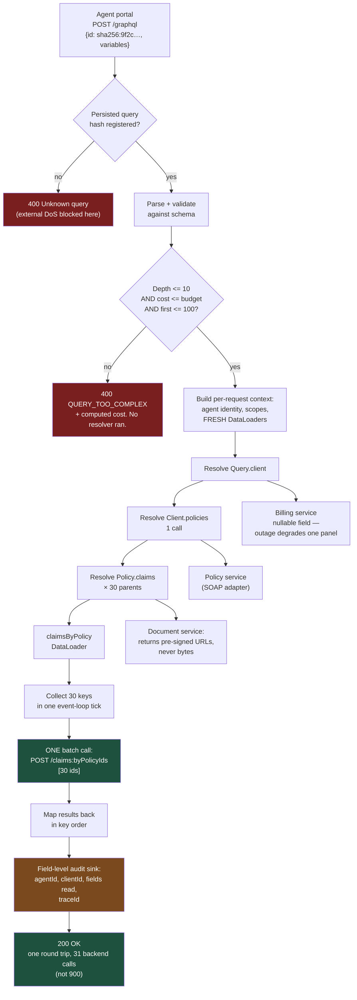

# GraphQL Without the Regret: Schemas, N+1, and the Queries That Take You Down

GraphQL solves exactly one problem extremely well: a client that needs data from many places in one round trip and cannot predict, at build time, exactly which fields it will want. Adopt it for that reason and it pays for itself. Adopt it because it is modern and you will discover you have shipped a public query engine over your production database.

## The Real-World Problem

An insurance broker runs a portal for 2,400 independent agents. One screen — the client overview — needs data from four backends: the **policy administration system** (SOAP, on a mainframe adapter), the **claims service** (REST), the **document service** (REST, returns pre-signed URLs), and the **billing service** (REST). Rendering one client meant eleven HTTP calls from the browser, waterfall-chained because claims needed policy IDs first. Median load time on an agent's office DSL line: 6.4 seconds.

They put a GraphQL gateway in front. Load time drops to 900 ms. Everyone is delighted, for about five weeks.

Then three things happen.

**N+1 detonates.** The overview lists a client's 30 policies, and each policy resolves `claims`. The claims resolver calls the claims REST API once per policy. Thirty policies became 30 sequential calls; a broker with 300 policies became 300. The claims service — sized for the old, chattier-but-bounded traffic — starts shedding load, and a p99 that used to be 120 ms becomes 4 seconds during the 9 a.m. login surge.

**A query takes the gateway down.** An agent, exploring in GraphiQL, writes a nested query: policies → claims → policy → claims → documents, five levels deep. There is no depth limit and no complexity limit. One request fans out to roughly 90,000 backend calls and holds the Node process at 100% CPU for two minutes. All 2,400 agents see timeouts. It was not an attack — it was curiosity — but the same query posted from a script would have been an unauthenticated denial of service.

**Compliance rejects the audit trail.** The regulator requires an access log showing which agent viewed which client's medical claim details. The access log records `POST /graphql 200` for every single request. There is no endpoint, no resource ID, and no field-level record of what was actually read. The audit finding takes two engineers three months to remediate.

None of the three are GraphQL's fault. All three are what happens when GraphQL is adopted without DataLoader, without a complexity budget, and without field-level audit instrumentation.

## The Concept

### Schema design is API design, and it is permanent

There is no `/v2` in GraphQL. The schema evolves in place: you add fields, you `@deprecated` old ones, and you remove them only once no client requests them (which you know, because you log field usage). That makes the initial shape matter more than in REST, not less.

**Nullability is your error-handling strategy.** In GraphQL, a `null` on a non-null field propagates upward — it nulls the parent, and if the parent is also non-null, it keeps climbing until it reaches a nullable field or nulls the whole `data`. So `Query.client: Client!` means that any failure anywhere under `client` wipes the entire response.

The rule: **make fields non-null only when the value is a structural invariant** — an ID, a type discriminator, a created timestamp. Make anything backed by a remote call **nullable**, so a claims-service outage degrades one panel rather than blanking the page. This is the same reasoning as [failure modes and resilience](../01-core-concepts/03-failure-modes-and-resilience.md), expressed in a type system.

```graphql
type Client {
  id: ID!                        # invariant — non-null
  displayName: String!           # from the same row as id — non-null
  policies: [Policy!]!           # list itself is non-null, items are non-null; empty list on none
  claims: ClaimConnection        # NULLABLE: separate service. Its outage must not blank the page.
  outstandingBalance: Money      # NULLABLE: billing service can be down
}
```

Also note the list convention: `[Policy!]!` means "a list is always returned, and it never contains nulls." Use `[Policy!]` (nullable list) only when "we could not determine the list" is meaningfully different from "the list is empty."

**Connections, not arrays, for anything that can grow.** The Relay connection spec looks verbose but it buys you cursor pagination, per-edge metadata, and a place to hang `totalCount` without changing the field's type later. This is the same keyset-pagination argument from the [REST article](01-rest-api-design-principles.md) — an unbounded `claims: [Claim!]!` on a corporate client with 40,000 claims is a production incident waiting for a slow week.

**Mutations return payload types, always.** Never `updatePolicy(...): Policy`. A mutation has domain-level failure modes — a policy that is lapsed, an agent without binding authority — and those are not exceptions, they are outcomes. Model them as a union or as a payload with an errors array:

```graphql
type Mutation {
  submitClaim(input: SubmitClaimInput!): SubmitClaimPayload!
}

type SubmitClaimPayload {
  claim: Claim                        # null when the mutation failed
  userErrors: [UserError!]!           # empty on success; never null
}

type UserError {
  code: UserErrorCode!                # stable machine-readable enum
  message: String!                    # human prose, may change
  field: [String!]                    # path into the input, for form binding
}
```

The payload pattern keeps the HTTP status at 200 and the transport errors array free for genuine transport failures. Client code then has exactly one branch: `if (payload.userErrors.length) showFieldErrors(...)`. Mutation inputs take a single `input:` argument so you can add fields without changing the signature, and mutations should accept a `clientMutationId` or idempotency token for the same reasons `POST` endpoints do.

### Resolvers: the execution model that causes N+1

A resolver returns one field. GraphQL executes the tree breadth-first per level, calling the resolver **once per parent object**. So `Client.policies` resolves once and returns 30 policies; `Policy.claims` then resolves **thirty times**. Each of those thirty invocations knows nothing about the other twenty-nine.

That is the N+1 problem, and it is structural, not a bug in your code. The fix is batching.

### DataLoader: batch and cache within a request

DataLoader sits between the resolver and the data source. It collects every key requested during a single tick of the event loop, then calls one batch function with all of them:

- **Batching**: 30 calls to `claimsLoader.load(policyId)` become one `claimsByPolicyIds([...30 ids])`.
- **Per-request caching**: the same key requested twice in one query hits the loader's cache, so a query touching the same policy from three branches fetches it once.
- **Ordering contract**: the batch function *must* return an array the same length as the keys array, in the same order, with `null`/`Error` in the slots that had no result. Getting this wrong silently returns the wrong client's claims — which in insurance is a data-breach-grade bug, so test it.

**Create loaders per request, never per process.** A process-wide loader would leak one agent's authorised data into another agent's query cache. This is the single most dangerous GraphQL misconfiguration in a regulated system.

The batch function must hit something that can batch. `WHERE policy_id = ANY($1)` batches. Thirty `Promise.all` calls to a REST endpoint that only accepts one ID do not — they compress latency but the downstream service still takes 30 requests. If a backend has no batch endpoint, that is a conversation to have with its owners before you put GraphQL in front of it.

### Depth and complexity limiting: this is a real DoS vector

A REST endpoint has a bounded cost. A GraphQL endpoint's cost is chosen by the caller. Three controls, applied in order, all of them before execution:

| Control | What it stops | Typical setting |
|---|---|---|
| **Query depth limit** | Recursive nesting through cyclic types (`policy → claims → policy → …`) | 8–12 levels |
| **Query complexity / cost analysis** | Wide fan-out that is shallow but enormous (`first: 1000` on three nested connections) | Static cost budget per token/role |
| **Pagination bounds** | `first: 100000` | `max first: 100`, enforced in the schema and validated |
| **Query cost timeout + max tokens** | Pathological parse cost, alias-bombs (`a: me b: me c: me …`) | 5s execution deadline, 15k token limit |
| **Introspection disabled in production** | Handing an attacker the full attack surface map | Off in prod; schema published to devs via a registry instead |

Cost analysis is the one that matters. Assign each field a cost, multiply nested connections by their `first` argument, and reject anything over budget **during validation, before a single resolver runs** — returning a 400 with the computed cost so a legitimate developer can fix their query. Alias-based duplication also needs to be counted, or `a: policies b: policies c: policies` slips through a naive depth check.

### Persisted queries: the control that solves several problems at once

Instead of accepting arbitrary query strings, the build pipeline extracts every query the frontend contains, hashes it, and registers the hashes with the server. At runtime the client sends only `{"id": "sha256:9f2c…", "variables": {...}}`.

This gives you, in one move:

- **An allow-list.** Unregistered queries are rejected outright. The DoS vector above becomes structurally impossible for external traffic, because an attacker cannot submit a new query at all.
- **Smaller requests** — a hash instead of a 4 KB document.
- **GET-ability.** Persisted queries can be sent as `GET`, which means CDN and browser caching become possible again (see below).
- **Cost known ahead of time.** You can compute and review the complexity of every query at registration time, in CI.

Run persisted queries in **strict mode** (server-side registry populated at build time) for external clients. Automatic persisted queries — where the client registers unknown hashes on the fly — are convenient for internal tooling but they reopen the allow-list.

### Caching is genuinely harder than REST, and you must plan for it

This is the honest trade-off and it is not small.

| Layer | REST | GraphQL |
|---|---|---|
| **HTTP / CDN** | Free. URL is the cache key; `ETag`, `Cache-Control`, `304` all work | Broken by default: `POST` to one URL. Recoverable only via persisted queries over `GET` |
| **Browser cache** | Free | Not applicable; you use a client-side normalised store instead |
| **Client store** | Manual (or TanStack Query keyed by URL) | Strong — Apollo/urql normalise by `id` and share entities across queries |
| **Per-resolver server cache** | N/A | Necessary, and you own it: DataLoader per request, Redis across requests |
| **Invalidation** | Path-based purge | Entity-based; you must know which queries touched which entities |

The practical position: GraphQL trades **free HTTP caching** for **excellent client-side normalised caching**. If your workload is read-heavy public content that a CDN could have served for free, that trade is bad. If your workload is per-user authenticated data that was never cacheable at the edge anyway — a broker portal, an internal dashboard — you gave up nothing.

### Federation, briefly

Federation lets several teams each own a subgraph and compose one schema at the gateway. `Policy` is defined in the policy subgraph as an entity with `@key(fields: "id")`; the claims subgraph extends it with a `claims` field. The gateway builds a query plan and fans out.

It is the right answer when **multiple teams with independent release cycles** must present one graph. It is the wrong answer when one team owns everything — a single schema-stitched gateway is far less operational machinery. Also budget honestly for the gateway: it becomes a shared, critical, latency-adding component that needs its own SLO, its own on-call, and its own resilience story.

### When GraphQL beats REST

- Many data sources, one screen, deep interdependency between them (the broker portal).
- Diverse clients wanting different field sets from the same graph — web, iOS, Android, a partner integration.
- Rapid frontend iteration where a new screen must not require a backend release.
- Highly relational data where the client legitimately needs to traverse.

### When GraphQL does not

- **Simple CRUD over one database.** You will write more code, ship more infrastructure, and get a worse audit log than eight REST endpoints. This is the most common bad adoption.
- **Anything that relies on HTTP caching.** Public product catalogues, rate tables, reference data — the CDN was doing that for free.
- **File upload and download.** `multipart/form-data` in GraphQL is a non-standard specification bolted on. Use a REST endpoint returning a pre-signed URL and put the *URL* in the graph, not the bytes.
- **Strict field-level audit of access.** Achievable — but it requires deliberate instrumentation (below), and if that is your dominant requirement, REST gives it to you for free with one line per resource access.
- **Machine-to-machine internal calls in a latency-sensitive path.** That is gRPC's job — see [the next article](03-grpc-and-protobuf-for-internal-services.md).

## How It Works



Two things carry the design: the cost check happens **before any resolver executes**, and the thirty `Policy.claims` resolutions collapse into one batched backend call.

## Practical Example

**The schema** (`schema.graphql`) — note nullability choices, connections, and the mutation payload:

```graphql
scalar DateTime
scalar Decimal

directive @auditField(category: AuditCategory!) on FIELD_DEFINITION

enum AuditCategory { STANDARD, SENSITIVE_MEDICAL, SENSITIVE_FINANCIAL }

type Query {
  """Null when not found or not visible to this agent — not an error."""
  client(id: ID!): Client
  policy(id: ID!): Policy
}

type Client {
  id: ID!
  displayName: String!
  policies(first: Int = 20, after: String): PolicyConnection!
  "Nullable: claims service is a separate deployment. Its outage degrades one panel."
  claims(first: Int = 20, after: String, status: ClaimStatus): ClaimConnection
  "Nullable: billing service."
  outstandingBalance: Money
}

type Policy {
  id: ID!
  policyNumber: String!
  product: String!
  status: PolicyStatus!
  premium: Money!
  inceptionDate: DateTime!
  "Nullable + paginated. An unbounded [Claim!]! here is an incident on a corporate client."
  claims(first: Int = 20, after: String): ClaimConnection
  documents: [Document!]!
}

type Claim {
  id: ID!
  claimNumber: String!
  status: ClaimStatus!
  reportedAt: DateTime!
  reserveAmount: Money
  "Field-level audit required. Reading this writes an access record."
  medicalSummary: String @auditField(category: SENSITIVE_MEDICAL)
}

type Document {
  id: ID!
  filename: String!
  contentType: String!
  """
  Short-lived pre-signed URL. Bytes are NEVER served through GraphQL —
  the graph carries the pointer, HTTP carries the payload.
  """
  downloadUrl: String!
  expiresAt: DateTime!
}

type Money {
  "Decimal string. Never a float."
  amount: Decimal!
  currency: String!
}

type PolicyConnection {
  edges: [PolicyEdge!]!
  pageInfo: PageInfo!
  totalCount: Int!
}
type PolicyEdge { cursor: String!, node: Policy! }

type ClaimConnection {
  edges: [ClaimEdge!]!
  pageInfo: PageInfo!
  totalCount: Int!
}
type ClaimEdge { cursor: String!, node: Claim! }

type PageInfo { hasNextPage: Boolean!, endCursor: String }

enum PolicyStatus { ACTIVE, LAPSED, CANCELLED, PENDING_RENEWAL }
enum ClaimStatus { REPORTED, INVESTIGATING, RESERVED, SETTLED, DECLINED }

type Mutation {
  submitClaim(input: SubmitClaimInput!): SubmitClaimPayload!
}

input SubmitClaimInput {
  policyId: ID!
  incidentDate: DateTime!
  description: String!
  estimatedLoss: MoneyInput!
  "Idempotency token. Replays return the original claim."
  clientMutationId: String!
}

input MoneyInput { amount: Decimal!, currency: String! }

type SubmitClaimPayload {
  claim: Claim
  userErrors: [UserError!]!
  clientMutationId: String
}

type UserError {
  code: UserErrorCode!
  message: String!
  field: [String!]
}

enum UserErrorCode {
  POLICY_LAPSED
  INCIDENT_BEFORE_INCEPTION
  AGENT_NOT_AUTHORISED
  DUPLICATE_SUBMISSION
  VALIDATION_FAILED
}
```

**Per-request DataLoaders.** This is the file that prevents the N+1 outage:

```ts
// src/graphql/loaders.ts
import DataLoader from 'dataloader'
import type { AgentIdentity } from './auth'

export interface Loaders {
  policyById: DataLoader<string, Policy | null>
  claimsByPolicyId: DataLoader<string, Claim[]>
  documentsByPolicyId: DataLoader<string, Document[]>
}

/**
 * Called ONCE PER REQUEST. Never hoist these to module scope:
 * a shared loader cache would leak one agent's authorised data into
 * another agent's query. In insurance that is a reportable breach.
 */
export function createLoaders(agent: AgentIdentity, traceId: string): Loaders {
  const claimsByPolicyId = new DataLoader<string, Claim[]>(
    async (policyIds) => {
      // ONE call for all 30 policies instead of 30 sequential calls.
      const res = await claimsClient.batchByPolicyIds({
        policyIds: [...policyIds],
        agentId: agent.id,          // authorisation travels with the batch
        traceId,
      })

      // CONTRACT: same length, same order as `policyIds`. Getting this wrong
      // returns another client's claims. It is covered by a test below.
      const byPolicy = new Map<string, Claim[]>()
      for (const claim of res.claims) {
        const bucket = byPolicy.get(claim.policyId) ?? []
        bucket.push(claim)
        byPolicy.set(claim.policyId, bucket)
      }
      return policyIds.map((id) => byPolicy.get(id) ?? [])
    },
    {
      maxBatchSize: 100,            // downstream batch endpoint's documented cap
      cacheKeyFn: (id) => id,
    },
  )

  const policyById = new DataLoader<string, Policy | null>(async (ids) => {
    const { policies } = await policyClient.batchGet({ ids: [...ids], agentId: agent.id })
    const byId = new Map(policies.map((p) => [p.id, p]))
    return ids.map((id) => byId.get(id) ?? null)
  })

  const documentsByPolicyId = new DataLoader<string, Document[]>(async (ids) => {
    const { groups } = await documentClient.batchListByPolicy({ policyIds: [...ids] })
    const byId = new Map(groups.map((g) => [g.policyId, g.documents]))
    return ids.map((id) => byId.get(id) ?? [])
  })

  return { policyById, claimsByPolicyId, documentsByPolicyId }
}
```

**Resolvers stay boring — which is the point:**

```ts
// src/graphql/resolvers.ts
export const resolvers = {
  Query: {
    client: (_p, { id }, ctx) => ctx.clients.findVisibleTo(ctx.agent, id),
    policy: (_p, { id }, ctx) => ctx.loaders.policyById.load(id),
  },

  Policy: {
    // Called once per policy in the list. DataLoader collapses them into one call.
    claims: async (policy, { first, after }, ctx) => {
      try {
        const claims = await ctx.loaders.claimsByPolicyId.load(policy.id)
        return toConnection(claims, { first, after })
      } catch (err) {
        // Field is nullable: a claims outage nulls this panel, not the page.
        ctx.log.warn({ err, policyId: policy.id }, 'claims_unavailable')
        return null
      }
    },
    documents: (policy, _a, ctx) => ctx.loaders.documentsByPolicyId.load(policy.id),
  },

  Claim: {
    // Field-level audit: the resolver is the only place that knows a
    // sensitive field was actually READ, not merely requested.
    medicalSummary: async (claim, _a, ctx) => {
      if (!ctx.agent.scopes.includes('claims:medical:read')) return null
      await ctx.audit.record({
        actor: ctx.agent.id,
        action: 'READ_FIELD',
        resource: `claim/${claim.id}`,
        field: 'medicalSummary',
        category: 'SENSITIVE_MEDICAL',
        traceId: ctx.traceId,
      })
      return claim.medicalSummary
    },
  },

  Mutation: {
    submitClaim: async (_p, { input }, ctx) => {
      const result = await ctx.claims.submit(input, ctx.agent)
      if (result.kind === 'rejected') {
        // Domain failure is an outcome, not a transport error. HTTP stays 200.
        return {
          claim: null,
          userErrors: result.reasons.map((r) => ({
            code: r.code, message: r.message, field: r.path,
          })),
          clientMutationId: input.clientMutationId,
        }
      }
      return { claim: result.claim, userErrors: [], clientMutationId: input.clientMutationId }
    },
  },
}
```

**Server wiring: the guardrails.** These four plugins are not optional in production:

```ts
// src/graphql/server.ts
import { ApolloServer } from '@apollo/server'
import depthLimit from 'graphql-depth-limit'
import { createComplexityRule, simpleEstimator, fieldExtensionsEstimator } from 'graphql-query-complexity'

const server = new ApolloServer({
  schema,
  introspection: process.env.NODE_ENV !== 'production',   // off in prod
  validationRules: [
    depthLimit(10),                                        // kills policy→claims→policy cycles
    createComplexityRule({
      maximumComplexity: 1_000,
      estimators: [
        fieldExtensionsEstimator(),                        // per-field cost from schema extensions
        simpleEstimator({ defaultComplexity: 1 }),
      ],
      // Rejected during VALIDATION — before any resolver runs.
      onComplete: (cost) => metrics.queryCost.record(cost),
      createError: (max, actual) =>
        new GraphQLError(`Query cost ${actual} exceeds limit ${max}`, {
          extensions: { code: 'QUERY_TOO_COMPLEX', maximumComplexity: max, actualComplexity: actual },
        }),
    }),
  ],
  plugins: [
    persistedQueriesPlugin({ registry, mode: 'strict' }),  // allow-list only
    fieldUsagePlugin({ sink: schemaRegistry }),            // tells you when @deprecated is safe to remove
  ],
})

// Per-request context. Loaders are constructed here and nowhere else.
const { url } = await startStandaloneServer(server, {
  context: async ({ req }) => {
    const agent = await authenticateAgent(req)             // OAuth2 access token → agent identity
    const traceId = activeSpan().spanContext().traceId
    return { agent, traceId, loaders: createLoaders(agent, traceId), audit, log }
  },
})
```

**The test that matters most** — DataLoader's ordering contract:

```ts
it('returns claims in the exact order of requested policy ids, with empty arrays for gaps', async () => {
  claimsClient.batchByPolicyIds.mockResolvedValue({
    claims: [                                  // deliberately out of order, and pol_2 has none
      { id: 'clm_9', policyId: 'pol_3' },
      { id: 'clm_1', policyId: 'pol_1' },
      { id: 'clm_2', policyId: 'pol_1' },
    ],
  })
  const { claimsByPolicyId } = createLoaders(agent, 'trace-1')

  const [p1, p2, p3] = await Promise.all([
    claimsByPolicyId.load('pol_1'),
    claimsByPolicyId.load('pol_2'),
    claimsByPolicyId.load('pol_3'),
  ])

  expect(claimsClient.batchByPolicyIds).toHaveBeenCalledTimes(1)   // batched, not 3 calls
  expect(p1.map((c) => c.id)).toEqual(['clm_1', 'clm_2'])
  expect(p2).toEqual([])                                           // gap, not pol_3's claims
  expect(p3.map((c) => c.id)).toEqual(['clm_9'])
})
```

## Enterprise Trade-offs

| Approach | Pros | Cons | When to use (Banking / Insurance / Enterprise) |
|---|---|---|---|
| **GraphQL aggregation gateway** over several backends | One round trip; clients pick fields; new screens need no backend release | Gateway is a new critical component; N+1 must be engineered away; caching is your problem | Broker/agent portals, wealth dashboards, any screen stitching 3+ systems for authenticated users |
| **REST BFF** (one endpoint per screen) | Trivial to cache, log, audit and rate-limit; obvious per-endpoint cost | A backend release per screen change; endpoint count grows with UI surface | Few, stable screens; teams where frontend and backend ship together; strict audit-first contexts |
| **DataLoader batching** | Turns N+1 into one call; per-request cache | Requires batch-capable backends; ordering bug leaks other tenants' data | Mandatory. There is no defensible GraphQL deployment without it |
| **Persisted queries, strict mode** | Query allow-list; smaller payloads; `GET` restores CDN caching; cost reviewed in CI | Build-pipeline coupling; ad-hoc client queries impossible | Any externally reachable graph — agent portals, partner-facing graphs |
| **Apollo Federation** | Team-owned subgraphs compose into one graph; independent releases | Gateway complexity, query-plan latency, cross-subgraph debugging | 3+ teams that must present a single graph; overkill for one team |
| **Plain REST + client-side composition** | No new infrastructure; free HTTP caching; per-resource audit for free | Request waterfalls on slow connections; over-fetching | Public catalogues, reference/rate data, mobile-first apps on poor networks |

→ Next: [03-grpc-and-protobuf-for-internal-services.md](03-grpc-and-protobuf-for-internal-services.md) · Related: [01-rest-api-design-principles.md](01-rest-api-design-principles.md) · [../03-architecture/04-microservices-vs-monolith.md](../03-architecture/04-microservices-vs-monolith.md) · [../01-core-concepts/06-performance-budget.md](../01-core-concepts/06-performance-budget.md)
