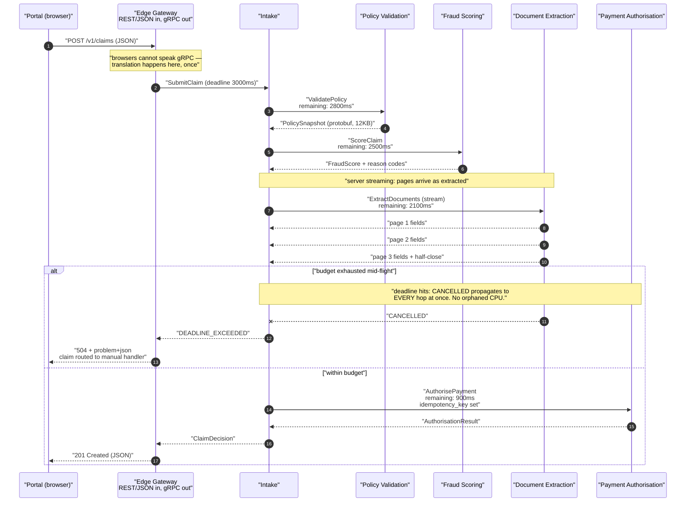

# gRPC Inside the Estate: Protobuf Contracts That Survive Ten Years of Changes

Inside a service mesh, JSON over HTTP/1.1 is a tax you pay on every hop: parse, allocate, validate, hope the field names still match. gRPC replaces the hope with a compiled contract, and it replaces the tax with a binary frame roughly a third the size — but it hands you one rule you can never break.

## The Real-World Problem

A national insurer rebuilds claims processing as a pipeline. A First Notification of Loss (FNOL) arrives from the portal or a call centre and passes through six services: **intake** → **policy validation** → **fraud scoring** → **reserving** → **document extraction** (OCR on photos and repair estimates) → **payment authorisation**. The SLA is a decision in under 3 seconds for straight-through motor claims, because straight-through processing is what makes the unit economics work — a claim that falls out to a human handler costs roughly forty times more.

The first build used REST/JSON between all six services. Two problems dominated.

**Serialisation was a measurable share of the budget.** A claim payload with 30 photo metadata records and a nested policy snapshot serialised to about 180 KB of JSON. Across five internal hops, JSON encode/decode plus HTTP/1.1 connection churn consumed 340 ms of the 3-second budget — 11% of the SLA spent converting objects into text and back.

**Then a field rename caused a silent financial error.** The reserving service renamed `estimated_loss` to `estimated_loss_amount` in its response. Fraud scoring deserialised into a Jackson DTO with `FAIL_ON_UNKNOWN_PROPERTIES` disabled, so the field it wanted was simply absent — and its `BigDecimal` defaulted to zero. Every claim for nine hours scored as low-value and low-risk, bypassing fraud review. 1,847 claims auto-approved without a fraud check. Recovering that cost a manual re-review of every one, a self-report to the regulator, and a control finding that took two quarters to close.

Both failures share a root cause: the contract lived in prose and in two independently maintained DTO classes. Nothing broke at build time because nothing knew the contract existed.

## The Concept

### The `.proto` file is the contract, and it is compiled

A `.proto` is checked into a repository both sides depend on, and `protoc` generates types for every language in the estate. A field rename is now a compile error in the consumer, not a zero in a `BigDecimal`. That is the entire pitch, and it is enough on its own.

### Wire compatibility: field numbers are permanent

Protobuf does not serialise field names. It serialises **field numbers** and wire types. `estimated_loss = 7` is on the wire as tag 7. This is why the rename that broke JSON is harmless in protobuf — and why the following rules are absolute:

| Rule | Why |
|---|---|
| **Never change a field's number** | Old peers will read the new field's bytes as the old field. Type-compatible renumbering is a silent data-corruption bug, not an error |
| **Never reuse a retired number** | Same failure, delayed. A message serialised by an old service will populate the new field with the old meaning |
| **Always `reserved` a removed number and name** | `protoc` then fails the build if anyone tries to reuse it. This is the only mechanical enforcement you get |
| **Renaming a field is free** | Names are not on the wire. It breaks source compilation (a good, visible break); it does not break the wire |
| **Adding a field is free** | Unknown fields are preserved on round-trip by modern protobuf runtimes, so a proxy service does not silently strip data it doesn't know about |
| **Never change a field's type** | Except within documented compatible sets (`int32`/`int64`/`uint32`/`bool` share varint encoding — still, don't) |
| **Never change `repeated` ↔ singular** | Or `optional` ↔ `repeated`. Different wire behaviour, silent truncation |
| **Adding an enum value is *nearly* free** | Old peers see the number as unknown. Always define a `_UNSPECIFIED = 0` and have consumers handle unknown explicitly |
| **`required` does not exist** | It was removed in proto3 for exactly this reason: a required field can never be removed without breaking every peer |

Field 0 is illegal; 1–15 use a single byte for the tag, so give them to your hottest fields; 19000–19999 are reserved by protobuf itself.

Enforce all of this with a linter in CI. `buf breaking --against '.git#branch=main'` fails the pull request on any wire-incompatible change, which turns the rules above from tribal knowledge into a build gate. That is the single highest-value thing you will do with protobuf.

### The four call types

| Type | Signature shape | Use it for |
|---|---|---|
| **Unary** | `rpc Validate(Req) returns (Res)` | 90% of internal calls. Request/response, one of each |
| **Server streaming** | `returns (stream Res)` | Large result sets consumed incrementally; progress events; long-running job updates |
| **Client streaming** | `(stream Req) returns (Res)` | Uploading many items with one aggregate result — bulk claim ingest, chunked document upload |
| **Bidirectional streaming** | `(stream Req) returns (stream Res)` | Continuous exchange over one connection — a live scoring feed, an interactive extraction session |

Streaming is not a performance trick for unary work; it is for genuinely open-ended data. Its real value is **memory**: server streaming lets a caller process 400,000 claim events without materialising them all, and client streaming lets an uploader push a 200 MB estimate document in 64 KB chunks without buffering it. Note that a stream is bound to one HTTP/2 connection, so a stream held open across a deployment dies — long-lived streams need reconnect-with-resume logic, which is real work. If you find yourself building durable, replayable streams, you want a log (Kafka/Pulsar) and [event-driven architecture](../03-architecture/05-event-driven-architecture.md), not gRPC streaming.

### Deadlines, not timeouts — and they propagate

This is gRPC's best feature and the one most teams ignore. A gRPC **deadline** is an absolute point in time transmitted on the wire (`grpc-timeout` header). Every downstream hop receives the *remaining* budget, not a fresh one.

Concretely: intake sets a 3-second deadline. It spends 200 ms and calls policy validation, which sees 2.8 s remaining. Validation spends 300 ms and calls fraud scoring, which sees 2.5 s. When the budget is exhausted, **every service in the chain gets `CANCELLED` simultaneously** and stops working. No orphaned computation continuing to burn CPU on a result nobody will read — which is precisely what happens with independently configured per-service HTTP timeouts, where the caller has given up but three downstreams keep grinding.

Rules: **always set a deadline** (a call without one waits forever, and that is how you exhaust a thread pool); derive downstream deadlines from the remaining budget rather than hardcoding them; check `Context.current().isCancelled()` before starting expensive work; and pass the `Context` into every downstream call so cancellation propagates.

### Why it fits latency-sensitive internal calls

| Property | Effect in the claims pipeline |
|---|---|
| **Binary protobuf** | ~180 KB JSON → ~55 KB protobuf; encode/decode roughly an order of magnitude cheaper than JSON |
| **HTTP/2 multiplexing** | Many concurrent calls on one connection; no per-request connection setup, no head-of-line blocking at the HTTP layer |
| **Generated stubs** | Contract drift becomes a compile error. This is what would have prevented the 1,847-claim incident |
| **Deadline propagation** | One budget for the whole chain; no orphaned work after the caller gives up |
| **Native streaming** | OCR results stream back page by page instead of blocking on the full document |
| **Rich status codes** | `DEADLINE_EXCEEDED`, `RESOURCE_EXHAUSTED`, `FAILED_PRECONDITION` — retryability is explicit, unlike an ambiguous HTTP 500 |
| **Built-in retry config** | Declarative service config with backoff and retryable-status lists, no client code |

### gRPC vs. REST inside a mesh

Inside a mesh both work, so the decision is about failure modes and ergonomics, not throughput.

Prefer **gRPC** when: hops are numerous and latency-sensitive; payloads are large or deeply nested; you need streaming; you want deadline propagation for free; or you have polyglot services (Java, Go, Python) that must share one contract.

Prefer **REST/JSON** when: the service is also consumed by browsers or partners; debuggability by `curl` matters more than 40 ms; the team is small and the operational cost of protobuf tooling is real; or the traffic is low enough that none of gRPC's advantages are measurable.

A note on service meshes: Istio/Linkerd handle gRPC well, and gRPC actually *needs* the mesh more than REST does — because HTTP/2 multiplexes over a long-lived connection, naive L4 load balancing pins a client to one backend pod forever. You need either client-side load balancing with a resolver, or an L7 proxy that balances per-request. Getting this wrong produces the classic symptom: you scale to ten replicas and one of them takes all the traffic.

### gRPC-web: what browsers actually can't do

Browsers cannot speak gRPC. The `fetch` and XHR APIs give no control over HTTP/2 frames, so:

- **gRPC-web needs a proxy** (Envoy, or an in-process filter) to translate between the browser-friendly framing and real gRPC.
- **Client streaming and bidirectional streaming are not supported.** Unary and server streaming only.
- **Payloads are base64-encoded** in the text mode, which erases much of the size advantage.
- **Trailers are moved into the body**, so error metadata handling differs from native gRPC.
- **Debugging is worse**: the browser network tab shows opaque binary instead of readable JSON.

The practical rule that has held for years: **gRPC for service-to-service, REST/JSON (or GraphQL) at the edge.** Put a thin gateway at the boundary that speaks REST outward and gRPC inward. You keep browser debuggability and partner accessibility where they matter, and binary efficiency plus compiled contracts where they matter. gRPC-web is worth the proxy only when you already own a large `.proto` estate and want to reuse those exact types in an internal admin UI.

## How It Works



The absolute deadline set once at the gateway governs all five hops. No service picks its own timeout, so no service keeps working after the answer has stopped mattering.

## Practical Example

**The contract** — `claims/v1/claims.proto`. Note the field numbering discipline and the `reserved` entry left behind by a real removal:

```protobuf
syntax = "proto3";

package insurer.claims.v1;

import "google/protobuf/timestamp.proto";
import "google/type/money.proto";

option java_package = "com.insurer.claims.v1";
option java_multiple_files = true;
option java_outer_classname = "ClaimsProto";

// ---------------------------------------------------------------------------
// Claims intake and decisioning. Internal only — never exposed to browsers.
// Wire rules: field numbers are permanent, removed numbers are reserved,
// enums always carry an _UNSPECIFIED = 0. Enforced by `buf breaking` in CI.
// ---------------------------------------------------------------------------

service ClaimsIntake {
  // Unary: the common case.
  rpc SubmitClaim(SubmitClaimRequest) returns (ClaimDecision);

  // Server streaming: decision events as the pipeline progresses, so the
  // handler UI updates live instead of polling.
  rpc WatchClaimProgress(WatchClaimProgressRequest) returns (stream ClaimProgressEvent);

  // Client streaming: bulk overnight ingest from broker files. One aggregate
  // result; the client never buffers 200k claims in memory.
  rpc BulkIngest(stream SubmitClaimRequest) returns (BulkIngestSummary);

  // Bidirectional: interactive adjuster session — send evidence, get revised
  // reserve suggestions, over a single connection.
  rpc AdjusterSession(stream AdjusterInput) returns (stream ReserveSuggestion);
}

service FraudScoring {
  rpc ScoreClaim(ScoreClaimRequest) returns (FraudScore);
}

message SubmitClaimRequest {
  string policy_number = 1;                          // 1-15: single-byte tags, hot fields
  string claimant_reference = 2;
  google.protobuf.Timestamp incident_at = 3;
  IncidentType incident_type = 4;
  google.type.Money estimated_loss = 5;
  string description = 6;
  repeated Attachment attachments = 7;
  Channel channel = 8;

  // Idempotency: the pipeline retries, and a retried FNOL must not create a
  // second claim. Same discipline as an HTTP Idempotency-Key header.
  string idempotency_key = 9;

  // Field 10 held `free_text_notes`, removed in 2025 after a PII review.
  // Both the number AND the name are reserved so protoc rejects any reuse.
  reserved 10;
  reserved "free_text_notes";

  google.protobuf.Timestamp reported_at = 11;
}

message Attachment {
  string attachment_id = 1;
  string content_type = 2;
  int64 size_bytes = 3;
  // A pointer to object storage. Bytes never travel through the RPC —
  // gRPC's default 4MB message cap exists for a reason, and raising it to
  // ship photos is how you turn a message limit into a heap problem.
  string storage_uri = 4;
}

message ClaimDecision {
  string claim_id = 1;
  Outcome outcome = 2;
  google.type.Money approved_amount = 3;
  google.type.Money reserve_amount = 4;
  repeated string reason_codes = 5;
  FraudScore fraud_score = 6;
  PolicySnapshot policy = 7;
  google.protobuf.Timestamp decided_at = 8;

  enum Outcome {
    OUTCOME_UNSPECIFIED = 0;                        // always define zero
    AUTO_APPROVED = 1;
    REFERRED_TO_HANDLER = 2;
    DECLINED = 3;
    AWAITING_DOCUMENTS = 4;
    // Adding OUTCOME_FAST_TRACK = 5 later is wire-safe: old peers see an
    // unknown number and must fall through to REFERRED_TO_HANDLER.
  }
}

message ScoreClaimRequest {
  string policy_number = 1;
  google.type.Money estimated_loss = 2;
  IncidentType incident_type = 3;
  repeated PriorClaim prior_claims = 4;
}

message FraudScore {
  int32 score = 1;                                   // 0-1000
  RiskBand band = 2;
  repeated string triggered_rules = 3;
  string model_version = 4;                          // audit: which model decided

  enum RiskBand {
    RISK_BAND_UNSPECIFIED = 0;
    LOW = 1;
    MEDIUM = 2;
    HIGH = 3;
  }
}

message PolicySnapshot {
  string policy_number = 1;
  bool in_force_at_incident = 2;
  google.type.Money excess = 3;
  google.type.Money cover_limit = 4;
  repeated string exclusions = 5;
}

message PriorClaim {
  string claim_id = 1;
  google.protobuf.Timestamp reported_at = 2;
  google.type.Money settled_amount = 3;
}

message WatchClaimProgressRequest { string claim_id = 1; }

message ClaimProgressEvent {
  string claim_id = 1;
  string stage = 2;
  google.protobuf.Timestamp at = 3;
  string detail = 4;
}

message BulkIngestSummary {
  int32 accepted = 1;
  int32 rejected = 2;
  repeated RejectedItem rejections = 3;
}

message RejectedItem {
  string claimant_reference = 1;
  string reason_code = 2;
}

message AdjusterInput {
  string claim_id = 1;
  oneof input {
    string note = 2;
    Attachment evidence = 3;
    google.type.Money manual_reserve = 4;
  }
}

message ReserveSuggestion {
  google.type.Money suggested_reserve = 1;
  string rationale = 2;
  double confidence = 3;
}

enum IncidentType {
  INCIDENT_TYPE_UNSPECIFIED = 0;
  MOTOR_COLLISION = 1;
  MOTOR_THEFT = 2;
  PROPERTY_ESCAPE_OF_WATER = 3;
  PROPERTY_FIRE = 4;
  LIABILITY = 5;
}

enum Channel {
  CHANNEL_UNSPECIFIED = 0;
  SELF_SERVICE_PORTAL = 1;
  CALL_CENTRE = 2;
  BROKER_FILE = 3;
  TELEMATICS = 4;
}
```

**The CI gate that makes the rules real** (`buf.yaml` plus a pipeline step):

```yaml
# buf.yaml
version: v2
modules:
  - path: proto
lint:
  use: [STANDARD]
  except: [PACKAGE_VERSION_SUFFIX]
breaking:
  use: [WIRE_JSON]          # catches renumbering, type changes, removed fields
```

```yaml
# .github/workflows/proto.yml — a wire-incompatible change fails the PR
- name: Detect breaking protobuf changes
  run: buf breaking --against 'https://github.com/insurer/contracts.git#branch=main'
```

**The Java server** (gRPC-Java on Spring Boot 3.x), showing cancellation checks and deadline propagation:

```java
package com.insurer.claims.intake;

import io.grpc.Context;
import io.grpc.Status;
import io.grpc.stub.StreamObserver;
import org.springframework.grpc.server.service.GrpcService;

@GrpcService
public class ClaimsIntakeService extends ClaimsIntakeGrpc.ClaimsIntakeImplBase {

    private static final Logger log = LoggerFactory.getLogger(ClaimsIntakeService.class);

    private final PolicyValidationClient policies;
    private final FraudScoringClient fraud;
    private final DocumentExtractionClient documents;
    private final ClaimRepository claims;

    @Override
    public void submitClaim(SubmitClaimRequest request, StreamObserver<ClaimDecision> observer) {
        // Idempotency: a retried FNOL must not create a second claim.
        var existing = claims.findByIdempotencyKey(request.getIdempotencyKey());
        if (existing.isPresent()) {
            observer.onNext(existing.get().decision());
            observer.onCompleted();
            return;
        }

        try {
            // The Context carries the caller's ABSOLUTE deadline. Every
            // downstream stub built from it inherits the REMAINING budget.
            var policy = policies.validate(request.getPolicyNumber(), request.getIncidentAt());

            if (!policy.getInForceAtIncident()) {
                observer.onNext(decline(request, "POLICY_NOT_IN_FORCE"));
                observer.onCompleted();
                return;
            }

            // Cheap guard before expensive work: if the caller has already
            // given up, do not spend CPU on a result nobody will read.
            if (Context.current().isCancelled()) {
                observer.onError(Status.CANCELLED
                    .withDescription("caller cancelled before fraud scoring")
                    .asRuntimeException());
                return;
            }

            var score = fraud.score(ScoreClaimRequest.newBuilder()
                .setPolicyNumber(request.getPolicyNumber())
                .setEstimatedLoss(request.getEstimatedLoss())
                .setIncidentType(request.getIncidentType())
                .addAllPriorClaims(claims.priorClaimsFor(request.getPolicyNumber()))
                .build());

            var extracted = documents.extractAll(request.getAttachmentsList());

            var decision = decide(request, policy, score, extracted);
            claims.save(request.getIdempotencyKey(), decision);

            observer.onNext(decision);
            observer.onCompleted();

        } catch (StatusRuntimeException e) {
            // Map downstream status honestly. DEADLINE_EXCEEDED must NOT be
            // reported as INTERNAL — the caller's retry policy depends on it.
            log.atWarn().setMessage("claim_submission_failed")
               .addKeyValue("code", e.getStatus().getCode())
               .addKeyValue("policy", request.getPolicyNumber())
               .log();
            observer.onError(e);
        }
    }

    /** Server streaming: emit progress as it happens; stop the moment the client goes away. */
    @Override
    public void watchClaimProgress(WatchClaimProgressRequest request,
                                   StreamObserver<ClaimProgressEvent> observer) {
        var subscription = claims.subscribeToProgress(request.getClaimId(), event -> {
            if (Context.current().isCancelled()) return;   // client closed the tab
            observer.onNext(event);
        });
        Context.current().addListener(ctx -> subscription.close(), Runnable::run);
    }

    /** Client streaming: accept an unbounded broker file, return one summary. */
    @Override
    public StreamObserver<SubmitClaimRequest> bulkIngest(StreamObserver<BulkIngestSummary> observer) {
        var summary = BulkIngestSummary.newBuilder();
        return new StreamObserver<>() {
            @Override public void onNext(SubmitClaimRequest item) {
                try {
                    claims.ingest(item);
                    summary.setAccepted(summary.getAccepted() + 1);
                } catch (ValidationException e) {
                    summary.setRejected(summary.getRejected() + 1);
                    summary.addRejections(RejectedItem.newBuilder()
                        .setClaimantReference(item.getClaimantReference())
                        .setReasonCode(e.code()).build());
                }
            }
            @Override public void onError(Throwable t) {
                log.warn("bulk_ingest_client_error", t);   // no response: peer is gone
            }
            @Override public void onCompleted() {
                observer.onNext(summary.build());
                observer.onCompleted();
            }
        };
    }
}
```

**The Java client**, showing the deadline that governs everything:

```java
@Component
public class FraudScoringClient {

    private final FraudScoringGrpc.FraudScoringBlockingStub stub;

    public FraudScoringClient(@GrpcClient("fraud-scoring") FraudScoringGrpc.FraudScoringBlockingStub stub) {
        this.stub = stub;
    }

    public FraudScore score(ScoreClaimRequest request) {
        return stub
            // Absolute, and derived from what is LEFT of the caller's budget —
            // not a fresh hardcoded 800ms per hop.
            .withDeadline(remainingBudget(Duration.ofMillis(800)))
            .scoreClaim(request);
    }

    /** Never grant a downstream more time than we ourselves have left. */
    private static Deadline remainingBudget(Duration preferred) {
        var inherited = Context.current().getDeadline();
        var proposed = Deadline.after(preferred.toMillis(), TimeUnit.MILLISECONDS);
        return inherited == null ? proposed : Deadline.minimum(inherited, proposed);
    }
}
```

**Retry policy declaratively, not in code** — gRPC service config, applied by the channel:

```java
@Bean
ManagedChannel fraudScoringChannel(@Value("${grpc.fraud.target}") String target) {
    return ManagedChannelBuilder.forTarget(target)     // dns:///fraud-scoring:9090
        .defaultLoadBalancingPolicy("round_robin")     // per-call LB over HTTP/2 connections
        .enableRetry()
        .maxRetryAttempts(3)
        .defaultServiceConfig(Map.of(
            "methodConfig", List.of(Map.of(
                "name", List.of(Map.of("service", "insurer.claims.v1.FraudScoring")),
                "retryPolicy", Map.of(
                    "maxAttempts", 3.0,
                    "initialBackoff", "0.1s",
                    "maxBackoff", "1s",
                    "backoffMultiplier", 2.0,
                    // UNAVAILABLE is retryable. DEADLINE_EXCEEDED is NOT:
                    // the budget is gone, retrying only burns what's left.
                    "retryableStatusCodes", List.of("UNAVAILABLE", "RESOURCE_EXHAUSTED"))))))
        .useTransportSecurity()                        // mTLS between services
        .build();
}
```

**The test that would have prevented the incident** — a wire-compatibility test, not just a unit test:

```java
@Test
void oldServiceCanStillReadNewMessages_andUnknownFieldsSurvive() throws Exception {
    // Serialise with the CURRENT schema, including a field the old peer lacks.
    var current = SubmitClaimRequest.newBuilder()
        .setPolicyNumber("MOT-4471902")
        .setEstimatedLoss(Money.newBuilder().setCurrencyCode("EUR").setUnits(4_250).build())
        .setReportedAt(Timestamps.fromSeconds(1_800_000_000L))   // field 11: new
        .build();

    // Parse with the previous generation's descriptor, then re-serialise.
    var asOldPeerSaw = LegacySubmitClaimRequest.parseFrom(current.toByteArray());
    var roundTripped = SubmitClaimRequest.parseFrom(asOldPeerSaw.toByteArray());

    assertThat(asOldPeerSaw.getPolicyNumber()).isEqualTo("MOT-4471902");
    assertThat(asOldPeerSaw.getEstimatedLoss().getUnits()).isEqualTo(4_250);
    // Unknown field preserved through an old intermediary — no silent data loss.
    assertThat(roundTripped.getReportedAt().getSeconds()).isEqualTo(1_800_000_000L);
}
```

## Enterprise Trade-offs

| Approach | Pros | Cons | When to use (Banking / Insurance / Enterprise) |
|---|---|---|---|
| **gRPC + protobuf, service-to-service** | Compiled contract kills drift; ~3× smaller payloads; deadline and cancellation propagation; native streaming; polyglot from one `.proto` | Not browser-native; opaque on the wire without tooling; needs L7-aware load balancing; protobuf toolchain to run | Latency-sensitive internal pipelines — claims decisioning, fraud scoring, payment authorisation, pricing engines |
| **REST/JSON internally** | `curl`-debuggable; zero toolchain; every engineer already knows it; browser-reachable | Contract lives in prose; drift fails silently at runtime; serialisation cost per hop; no deadline propagation | Low-traffic internal services, admin/back-office APIs, anything also consumed by a browser or partner |
| **gRPC internally + REST gateway at the edge** | Best of both: binary and typed inside, debuggable and partner-friendly outside | One more component to run and secure; two contract artefacts to keep aligned | The default for a mesh with external consumers — and the pattern in the diagram above |
| **gRPC-web direct to browser** | Reuse existing `.proto` types in the UI; no hand-written DTOs | Needs an Envoy-class proxy; no client or bidi streaming; base64 overhead; poor network-tab debugging | Internal admin tooling over an existing large `.proto` estate. Not for customer-facing web |
| **Server/client streaming** | Bounded memory on huge result sets; incremental progress; one connection | Stream dies with the connection (deploys kill it); resume logic is on you; harder to load-balance | Bulk broker ingest, OCR page-by-page results, live handler dashboards |
| **Event streaming on a log (Kafka/Pulsar)** | Durable, replayable, fan-out to many consumers, decoupled in time | Eventual consistency; no request/response ergonomics; new operational surface | When the pipeline must survive consumer downtime or replay history for audit — not a substitute for synchronous decisioning |

→ Next: [04-orval-generating-typed-clients-from-openapi.md](04-orval-generating-typed-clients-from-openapi.md) · Related: [05-choosing-rest-vs-graphql-vs-grpc.md](05-choosing-rest-vs-graphql-vs-grpc.md) · [../03-architecture/05-event-driven-architecture.md](../03-architecture/05-event-driven-architecture.md) · [../04-security-and-authentication/07-securing-internal-vs-external-apis.md](../04-security-and-authentication/07-securing-internal-vs-external-apis.md)
