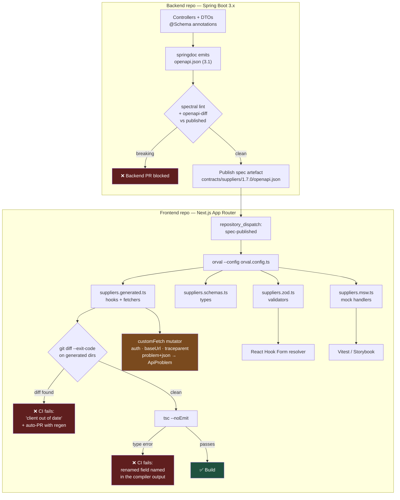

# Stop Hand-Writing API Clients: Orval, OpenAPI, and a CI Gate That Catches Drift

Every hand-written `fetch` wrapper is a second copy of the API contract, maintained by people who do not own it, and it is wrong the moment the backend merges. Orval deletes that copy: the OpenAPI document becomes the only definition of the contract, and TypeScript types, TanStack Query hooks, Zod schemas, and MSW mocks all fall out of it mechanically.

## The Real-World Problem

A software house builds a supplier-onboarding portal for a manufacturing group: vendor registration, bank-detail verification, sanctions screening, approval workflow. The backend is Spring Boot 3.x, owned by a four-person platform team. The frontend is Next.js App Router, owned by a separate three-person team, and both merge to trunk multiple times a week.

The frontend has a `src/lib/api/` folder with 61 hand-written axios functions and a `types.ts` of 900 lines transcribed by hand from Confluence pages and Slack screenshots.

Three drifts land inside one quarter.

**A rename ships silently.** The backend renames `supplier.contactEmail` to `supplier.primaryContactEmail`. The frontend's interface still declares `contactEmail: string`, so TypeScript is perfectly happy — the field is simply `undefined` at runtime. The supplier detail screen renders "Contact: undefined" for eleven days before anyone notices, and the onboarding emails the portal triggers go nowhere.

**An enum value arrives with no home.** The backend adds `SANCTIONS_REVIEW` to the onboarding status enum. The frontend has a `switch` mapping status to a badge colour with no default branch, so the status column renders blank, and the approvals queue filter silently excludes every supplier in that state. Twenty-three suppliers sit invisible for a week. Two of them are the ones compliance was actively chasing.

**A required field becomes required later.** `bankAccount.iban` moves from optional to required on `POST /suppliers/{id}/bank-details`. The frontend keeps sending payloads without it. Users get a 400 with a validation body the frontend was never taught to parse, so the form shows a generic "Something went wrong" and the supplier gives up. Support handles 140 tickets.

Total: roughly six engineer-weeks of investigation and rework, plus a fortnight of relationship damage with the client's compliance team. None of the three changes were unreasonable, and all three were invisible to the frontend's compiler because **the contract was not code**.

## The Concept

### Orval's job in one sentence

Orval reads an OpenAPI 3.1 document and emits TypeScript: request/response types, a function per operation, a TanStack Query hook per operation, optionally Zod schemas mirroring the spec's validation, and optionally MSW handlers seeded with faked data. Generated files are committed, so a review diff shows exactly how the contract moved.

### The four outputs, and why each one earns its place

| Output | `client` / mode | What it removes | Where it lands |
|---|---|---|---|
| **Types** | always | Hand-transcribed interfaces | `*.schemas.ts` |
| **TanStack Query hooks** | `client: 'react-query'` | Hand-written `useQuery`/`useMutation` with hand-invented query keys | `*.ts` per tag |
| **Zod schemas** | `client: 'zod'` | Divergence between server validation and form validation | `*.zod.ts` |
| **MSW handlers** | `mock: { type: 'msw' }` | Hand-maintained fixtures that rot silently | `*.msw.ts` |

The Zod output matters more than it looks. React Hook Form validates against a schema; if that schema is hand-written it will drift from the spec exactly the way the types did. Generating it from the same document means a field going from optional to required is a **type error in the form component**, which is precisely the failure that produced 140 support tickets. See [forms with React Hook Form and Zod](../07-frontend-best-practices/08-forms-with-react-hook-form-and-zod.md) for how the schema is then shared with the server action.

The MSW output matters for the same reason at the test boundary: generated mocks are regenerated from the spec, so a test that stubs a shape the backend no longer returns fails on regeneration rather than passing forever against a fossilised fixture.

### Generate into the feature folder, not into a `lib/api` dumping ground

Orval's `tags-split` mode emits one file per OpenAPI tag. Point each tag at the feature that owns it:

```
src/features/suppliers/api/
├── suppliers.generated.ts        # hooks + fetchers   (DO NOT EDIT)
├── suppliers.schemas.ts          # types              (DO NOT EDIT)
├── suppliers.zod.ts              # zod validators     (DO NOT EDIT)
├── suppliers.msw.ts              # msw handlers       (DO NOT EDIT)
└── suppliers.queries.ts          # hand-written: select/enabled/derived, wraps the generated hooks
```

Two rules make this survivable:

1. **Generated files are never edited.** The generator overwrites them; any manual fix is lost on the next run and, worse, hides drift in the meantime. Enforce it in `CODEOWNERS` and in an ESLint override.
2. **Hand-written code sits beside, never inside.** Derived state, `select` transforms, `enabled` guards, and cache-invalidation policy live in `*.queries.ts`. That file is reviewed; the generated ones are diffed.

### The custom mutator is where your cross-cutting concerns live

Orval delegates the actual HTTP call to a function you own — the *mutator*. This is the single seam where you attach every concern that must apply to every request, without touching a generated line:

- **Auth.** Read the access token (from the Next.js session, not from `localStorage`) and set `Authorization`.
- **Base URL and credentials.** One place, environment-driven.
- **Error normalisation.** Turn an RFC 9457 `application/problem+json` body into a typed `ApiProblem` that components can branch on by `type`, never by parsing `detail` prose.
- **Correlation.** Propagate `traceparent` so a frontend error and a backend log line can be joined — see [observability](../00-project-setup-roadmap/07-observability.md).
- **Idempotency.** Attach an `Idempotency-Key` on mutating calls, matching the [REST contract](01-rest-api-design-principles.md).

Because the mutator is one file, adding token refresh or a new header is a one-line change across 61 operations.

### The part everyone skips: a CI check for drift

Committing generated output creates a new failure mode — the spec moves and nobody reruns the generator. The fix is three lines of pipeline:

1. Fetch the spec from the backend's published artefact (a versioned URL or a git submodule, **not** a running dev server).
2. Run `orval` in the CI workspace.
3. `git diff --exit-code` on the generated directories.

A non-empty diff fails the build with "generated client is out of date". Combine that with `tsc --noEmit`, and a backend rename now produces a **red frontend pipeline within minutes of the backend merge**, on a branch, with the exact field named in the diff. That is the whole value proposition: the failure moves from production to CI.

Run the same check on a schedule (or trigger it from the backend repository on spec publish) so drift is detected even when the frontend has no commits that week. Then add a repository-dispatch job that opens a PR with the regenerated client — the diff is the migration ticket.

### What Orval does not solve

| Not solved | Why | What to do instead |
|---|---|---|
| A bad spec | Generation is faithful, including to `type: object` with no properties | Lint the spec (`spectral`), and generate the spec *from the code* so it cannot lie |
| Runtime shape violations | Types are erased at build time | Parse responses with the generated Zod schema at the boundary in critical flows |
| Semantic breaks | `amount` changing from minor units to decimal keeps the same type | Contract tests — see [contract testing](../08-testing-strategies/04-contract-testing-for-apis.md) |
| Enum exhaustiveness | A new value is a type change; a missing `default` branch is your bug | `switch` on a discriminated union with a `never` exhaustiveness check |

The enum failure in the scenario is worth dwelling on: after regeneration, the new `SANCTIONS_REVIEW` member makes the badge-colour map a type error **only if** the map is typed as `Record<OnboardingStatus, Badge>`. Type it that way deliberately.

## How It Works



The two red frontend gates are the point. A contract change cannot reach a user without first failing either the drift check or the type check.

## Practical Example

**`orval.config.ts`** — one target for the client, one for Zod, both reading the same published spec.

```ts
// orval.config.ts
import { defineConfig } from 'orval'

const SPEC = process.env.OPENAPI_SPEC ?? './contracts/suppliers/openapi.json'

export default defineConfig({
  suppliersApi: {
    input: {
      target: SPEC,
      // Fail loudly on a spec that does not validate, rather than emitting `any`.
      validation: true,
      filters: { tags: ['suppliers', 'bank-details', 'onboarding'] },
    },
    output: {
      // One file per OpenAPI tag, written into the owning feature folder.
      mode: 'tags-split',
      target: './src/features/suppliers/api/suppliers.generated.ts',
      schemas: './src/features/suppliers/api/model',
      client: 'react-query',
      httpClient: 'fetch',          // no axios: works in RSC and route handlers unchanged
      clean: true,                  // delete stale files for operations that no longer exist
      prettier: true,
      mock: {
        type: 'msw',
        useExamples: true,          // prefer spec `examples` over faker noise
        delay: 0,
      },
      override: {
        mutator: {
          path: './src/lib/api/custom-fetch.ts',
          name: 'customFetch',
        },
        query: {
          useQuery: true,
          useMutation: true,
          useInfinite: true,
          useInfiniteQueryParam: 'cursor',      // matches the REST cursor contract
          signal: true,                          // wire AbortSignal into every fetcher
          options: {
            staleTime: 30_000,
            retry: 2,
          },
        },
        // Generated hooks read `useSuppliersControllerList`; rename to something humane.
        operationName: (operation, route, verb) =>
          operation.operationId ?? `${verb}${route.replace(/\W+/g, '_')}`,
      },
    },
    hooks: {
      afterAllFilesWrite: 'eslint --fix --no-ignore',
    },
  },

  suppliersZod: {
    input: { target: SPEC },
    output: {
      mode: 'tags-split',
      target: './src/features/suppliers/api/suppliers.zod.ts',
      client: 'zod',
      fileExtension: '.zod.ts',
      override: {
        zod: {
          generate: { param: true, body: true, response: true, query: true },
          // Reject unknown keys on request bodies; tolerate them on responses,
          // because additive server fields must not break a deployed client.
          strict: { body: true, response: false },
          coerce: { query: true },
        },
      },
    },
  },
})
```

**The custom mutator** — auth, tracing, and error normalisation, in one file for all 61 operations.

```ts
// src/lib/api/custom-fetch.ts
import { auth } from '@/lib/auth'          // NextAuth v5 / Keycloak session
import { randomUUID } from 'node:crypto'

export class ApiProblem extends Error {
  constructor(
    readonly type: string,              // stable RFC 9457 discriminator
    readonly status: number,
    readonly title: string,
    readonly detail?: string,
    readonly traceId?: string,
    readonly fieldErrors: Record<string, string> = {},
  ) {
    super(`${status} ${type}`)
    this.name = 'ApiProblem'
  }

  /** Branch on this, never on `detail` — prose is not a contract. */
  is(type: string) {
    return this.type.endsWith(type)
  }
}

const MUTATING = new Set(['POST', 'PUT', 'PATCH', 'DELETE'])

/**
 * Orval calls this for every generated operation. Signature must return the
 * response body typed as T; throwing is how the generated hooks surface errors.
 */
export async function customFetch<T>(
  url: string,
  init: RequestInit & { method?: string } = {},
): Promise<T> {
  const session = await auth()
  const method = (init.method ?? 'GET').toUpperCase()

  const headers = new Headers(init.headers)
  headers.set('Accept', 'application/json, application/problem+json')
  if (session?.accessToken) headers.set('Authorization', `Bearer ${session.accessToken}`)
  if (init.body && !headers.has('Content-Type')) headers.set('Content-Type', 'application/json')
  // Idempotency on every mutation — the backend stores (key, client) → response.
  if (MUTATING.has(method) && !headers.has('Idempotency-Key')) {
    headers.set('Idempotency-Key', randomUUID())
  }

  const res = await fetch(`${process.env.API_BASE_URL}${url}`, {
    ...init,
    headers,
    cache: 'no-store',
    // The generated fetcher passes TanStack Query's signal; combine with a hard cap.
    signal: init.signal
      ? AbortSignal.any([init.signal, AbortSignal.timeout(10_000)])
      : AbortSignal.timeout(10_000),
  })

  if (res.status === 204) return undefined as T

  if (!res.ok) {
    throw await toProblem(res)
  }
  return (await res.json()) as T
}

async function toProblem(res: Response): Promise<ApiProblem> {
  const traceId = res.headers.get('traceresponse') ?? undefined
  if (!res.headers.get('content-type')?.includes('problem+json')) {
    return new ApiProblem('about:blank', res.status, res.statusText, undefined, traceId)
  }
  const body = await res.json()
  const fieldErrors = Object.fromEntries(
    (body.errors ?? []).map((e: { pointer: string; detail: string }) => [
      e.pointer.replace(/^#\//, ''),          // '#/bankAccount/iban' → 'bankAccount/iban'
      e.detail,
    ]),
  )
  return new ApiProblem(body.type, body.status ?? res.status, body.title, body.detail,
                        body.traceId ?? traceId, fieldErrors)
}
```

**Using the generated hooks** — the hand-written file that sits beside them.

```ts
// src/features/suppliers/api/suppliers.queries.ts
import { useQueryClient } from '@tanstack/react-query'
import {
  useListSuppliers,
  useSubmitBankDetails,
  getListSuppliersQueryKey,
} from './suppliers.generated'
import type { OnboardingStatus, SupplierSummary } from './model'
import { ApiProblem } from '@/lib/api/custom-fetch'

/** Typed as Record<OnboardingStatus, …> so a NEW enum value is a compile error. */
export const STATUS_BADGE: Record<OnboardingStatus, 'neutral' | 'warning' | 'success' | 'danger'> = {
  DRAFT: 'neutral',
  AWAITING_DOCUMENTS: 'warning',
  SANCTIONS_REVIEW: 'warning',      // added by regeneration; tsc demanded this line
  APPROVED: 'success',
  REJECTED: 'danger',
}

export function useApprovalQueue(status: OnboardingStatus) {
  return useListSuppliers(
    { status, limit: 50 },
    { query: { select: (page) => page.items.filter(needsAction), staleTime: 15_000 } },
  )
}

function needsAction(s: SupplierSummary) {
  return s.outstandingActions > 0
}

export function useSubmitBankDetailsWithInvalidation(supplierId: string) {
  const qc = useQueryClient()
  return useSubmitBankDetails({
    mutation: {
      onSuccess: () => qc.invalidateQueries({ queryKey: getListSuppliersQueryKey() }),
      onError: (error) => {
        if (error instanceof ApiProblem && error.is('/iban-not-verifiable')) {
          // A modelled outcome, not a crash. Field errors are already parsed.
        }
      },
    },
  })
}
```

**The form, validated by the generated Zod schema** — this is what turns a required-field change into a type error.

```tsx
// src/features/suppliers/components/BankDetailsForm.tsx
'use client'
import { useForm } from 'react-hook-form'
import { zodResolver } from '@hookform/resolvers/zod'
import type { z } from 'zod'
import { submitBankDetailsBody } from '../api/suppliers.zod'   // GENERATED from the spec
import { useSubmitBankDetailsWithInvalidation } from '../api/suppliers.queries'

type BankDetails = z.infer<typeof submitBankDetailsBody>

export function BankDetailsForm({ supplierId }: { supplierId: string }) {
  const form = useForm<BankDetails>({ resolver: zodResolver(submitBankDetailsBody) })
  const submit = useSubmitBankDetailsWithInvalidation(supplierId)

  return (
    <form
      onSubmit={form.handleSubmit(async (data) => {
        try {
          await submit.mutateAsync({ supplierId, data })
        } catch (e) {
          // Server-side field errors bind straight back onto the form.
          if (e instanceof ApiProblem) {
            for (const [path, message] of Object.entries(e.fieldErrors)) {
              form.setError(path.replaceAll('/', '.') as never, { message })
            }
          }
        }
      })}
    >
      <input {...form.register('iban')} aria-invalid={!!form.formState.errors.iban} />
      <p role="alert">{form.formState.errors.iban?.message}</p>
      <button disabled={submit.isPending}>Submit</button>
    </form>
  )
}
```

**The npm scripts:**

```json
{
  "scripts": {
    "api:fetch": "node scripts/fetch-spec.mjs",
    "api:gen": "orval --config orval.config.ts",
    "api:check": "npm run api:fetch && npm run api:gen && git diff --exit-code -- src/features/**/api",
    "typecheck": "tsc --noEmit"
  }
}
```

**The CI gate** — the whole reason this article exists.

```yaml
# .github/workflows/api-contract.yml
name: API contract
on:
  pull_request:
  schedule: [{ cron: '0 6 * * 1-5' }]     # catches drift on weeks with no frontend commits
  repository_dispatch:
    types: [spec-published]               # fired by the backend repo on publish

jobs:
  no-drift:
    runs-on: ubuntu-latest
    steps:
      - uses: actions/checkout@v4
      - uses: actions/setup-node@v4
        with: { node-version: 22, cache: npm }
      - run: npm ci

      # Pull the PUBLISHED, versioned spec. Never a running dev server.
      - name: Fetch published OpenAPI spec
        run: npm run api:fetch
        env:
          SPEC_URL: ${{ vars.SUPPLIERS_SPEC_URL }}
          SPEC_TOKEN: ${{ secrets.CONTRACTS_READ_TOKEN }}

      - name: Regenerate client
        run: npm run api:gen

      - name: Fail if generated client drifts from the spec
        run: |
          if ! git diff --exit-code -- src/features; then
            echo "::error::Generated API client is out of date."
            echo "The backend contract changed. Run 'npm run api:gen' and commit the result."
            git diff --stat -- src/features
            exit 1
          fi

      # A rename surfaces here, naming the exact field.
      - name: Typecheck against the regenerated client
        run: npm run typecheck

      # Drift found on a schedule/dispatch run becomes a PR, not a Slack message.
      - name: Open regeneration PR
        if: failure() && github.event_name != 'pull_request'
        uses: peter-evans/create-pull-request@v6
        with:
          branch: chore/regenerate-api-client
          title: 'chore: regenerate API client from suppliers spec'
          body: |
            The published OpenAPI spec changed. This PR contains the regenerated
            client. Review the diff — it is the contract change. Fix any type
            errors before merging.
          labels: api-contract
```

Add one ESLint rule so nobody edits a generated file by hand:

```js
// eslint.config.js (excerpt)
export default [
  {
    files: ['src/features/*/api/*.generated.ts', 'src/features/*/api/*.zod.ts',
            'src/features/*/api/*.msw.ts', 'src/features/*/api/model/**'],
    rules: { 'no-restricted-syntax': 'off' },
    linterOptions: { reportUnusedDisableDirectives: false },
    // Paired with CODEOWNERS: these paths require an API-platform reviewer,
    // which makes a hand edit socially impossible as well as pointless.
  },
]
```

A fuller end-to-end walkthrough, including the generated file contents and the Next.js server-side usage, is in [orval-generated-client-example.md](../10-example-code/nextjs/orval-generated-client-example.md).

## Enterprise Trade-offs

| Approach | Pros | Cons | When to use (Banking / Insurance / Enterprise) |
|---|---|---|---|
| **Orval, generated + committed, with a CI drift gate** | Contract change becomes a red build on a branch; zero client boilerplate; Zod and MSW from the same source | Generated diffs are noisy in review; requires a published, versioned spec | **Default** for any Next.js/React frontend against an OpenAPI backend owned by another team |
| **Orval, generated at build time (not committed)** | No generated files in git; nothing to drift | No reviewable diff of the contract change; a backend edit can silently change the build | Only where the spec is versioned immutably and the build pins an exact version |
| **Hand-written fetch/axios layer** | Full control; no toolchain; small diffs | A second copy of the contract that no compiler checks — the three failures above | Legacy screens against an API with no spec, being strangled out |
| **Zod schemas hand-written from the spec** | Expressive refinements the spec cannot express | Drifts exactly like the types did; forms accept payloads the server rejects | Only as a thin `.refine()` layer *composed on top of* the generated schema |
| **openapi-typescript (types only) + your own fetcher** | Tiny output, no hooks opinion, very stable | You still hand-write query keys, invalidation, and mutations — the part that breaks | Teams not using TanStack Query, or a shared package consumed by several apps |
| **Spec written by hand, backend implements it** | Design-first; partners can review before code exists | Spec and implementation drift *inside* the backend, so the frontend inherits a lie | Partner-facing APIs — pair with provider contract tests that verify the spec |
| **No spec at all (GraphQL/gRPC instead)** | Contract is compiled by construction | Wrong tool at a browser boundary with partner consumers | See [choosing REST vs GraphQL vs gRPC](05-choosing-rest-vs-graphql-vs-grpc.md) |

## Why This Still Matters Through 2030

The durable idea is not Orval — it is that a contract expressed once, machine-readably, and enforced by a build gate beats a contract expressed twice by two teams. That direction is only strengthening. OpenAPI 3.1's alignment with JSON Schema is what makes one document capable of driving server validation, client types, form validators, mock servers, and contract tests simultaneously; before 3.1 those were four incompatible dialects and teams reasonably gave up. Meanwhile the organisational fact that creates the problem — frontend and backend owned by separate teams on separate release cadences, often across a vendor boundary — is a structural feature of enterprise delivery, not a phase. The newest pressure comes from generated code: an AI assistant will happily write a plausible `SupplierDto` interface that matches nothing, and it will do so faster than a human can transcribe one. Generation from the authoritative spec, plus `git diff --exit-code` in CI, is the check that does not share the generator's assumptions. Expect the specific tool to be replaced at some point; expect the gate to outlive it.

→ Next: [05-choosing-rest-vs-graphql-vs-grpc.md](05-choosing-rest-vs-graphql-vs-grpc.md) · Related: [01-rest-api-design-principles.md](01-rest-api-design-principles.md) · [../07-frontend-best-practices/06-data-fetching-and-caching-with-tanstack-query.md](../07-frontend-best-practices/06-data-fetching-and-caching-with-tanstack-query.md) · [../07-frontend-best-practices/08-forms-with-react-hook-form-and-zod.md](../07-frontend-best-practices/08-forms-with-react-hook-form-and-zod.md) · [../08-testing-strategies/04-contract-testing-for-apis.md](../08-testing-strategies/04-contract-testing-for-apis.md) · [../10-example-code/nextjs/orval-generated-client-example.md](../10-example-code/nextjs/orval-generated-client-example.md)
