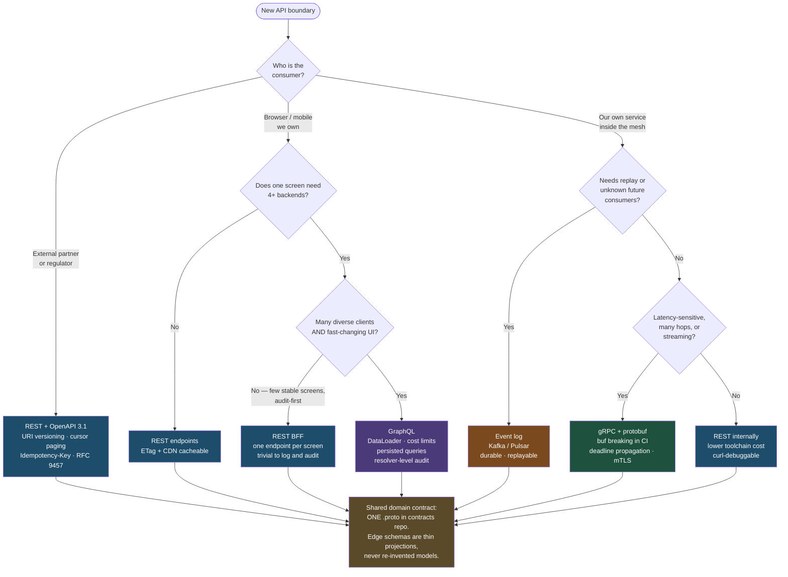

# REST, GraphQL, or gRPC: Stop Choosing One and Start Drawing Boundaries

The question "which API style should we standardise on?" has no correct answer, because the three styles solve three different problems and every enterprise has all three problems at once. The useful question is where each boundary sits and what crosses it.

## The Real-World Problem

A wealth-management division of a European bank runs an API governance board. In 2024 the board issues a standard: **all new APIs will be GraphQL.** The reasoning was sound in isolation — the flagship client-portal rebuild genuinely did need to stitch six backends into one screen, and GraphQL made that screen fast.

Eighteen months later the standard has produced four separate messes.

**The partner edge.** Nine custodian banks and two tax-reporting vendors must consume portfolio data. Every one of them asks for REST. Two of them are contractually required to integrate using an OpenAPI document because their own change-control process demands a machine-readable contract artefact. The bank builds a "GraphQL-to-REST façade" — a hand-written translation layer with 40 endpoints, its own bugs, and no generated types. It is the thing the standard was supposed to prevent.

**The internal pricing path.** The portfolio-valuation service calls the pricing engine 40 times per portfolio refresh. Over GraphQL-over-HTTP/1.1 with JSON, the round trips plus parsing cost 600 ms of an 800 ms budget. Nobody needed field selection: the caller is a service that wants all the fields, every time.

**The audit finding.** The regulator asks for an access log proving which adviser viewed which client's tax-residency data. The gateway access log says `POST /graphql 200`, 14 million times. Remediation takes two engineers a quarter of instrumenting resolvers.

**The mobile app.** The adviser mobile app on a train connection re-fetches a 90 KB GraphQL response on every screen return, because the CDN cannot cache a `POST` and nobody set up persisted queries. The old REST endpoint it replaced had been served from the edge with an `ETag` for free.

The board's mistake was not picking GraphQL. It was believing that "API style" is one decision rather than four, and that consistency across boundaries is worth more than fitness at each boundary. The eventual fix was not a migration — it was a boundary map.

## The Concept

### The three styles, on the axes that actually decide

| Dimension | REST + OpenAPI 3.1 | GraphQL | gRPC + protobuf |
|---|---|---|---|
| **Caching (HTTP/CDN)** | Free and excellent. URL is the key; `ETag`, `304`, `Cache-Control` all work | Broken by default (`POST` to one URL). Recoverable only via persisted queries over `GET` | None at the HTTP layer. Caching is application-level |
| **Client-side caching** | Manual, or TanStack Query keyed by URL | Strongest — normalised store shares entities across queries | Manual |
| **Tooling maturity** | Highest. Every language, every gateway, `curl`, Postman, WAFs, API portals | Mature but ecosystem-specific (Apollo/urql, federation) | Mature for backend languages; thin in browsers |
| **Contract evolution** | Additive changes free; breaking changes need a version and a sunset campaign | No versions — add fields, `@deprecated`, remove once field usage is zero | Field numbers permanent; `buf breaking` mechanically enforces it in CI |
| **Contract enforcement** | Spec can lie about the implementation unless generated from code and contract-tested | Schema is executable, so it cannot lie about shape | Compiled — drift is a build error |
| **Browser support** | Native | Native | **No.** Needs gRPC-web plus an Envoy-class proxy; no client/bidi streaming |
| **Streaming** | SSE or WebSockets, bolted on | Subscriptions (WebSocket/SSE), real but operationally heavy | First class: server, client, and bidirectional |
| **Observability** | Excellent by default: method + path + status are the natural dimensions of every metric | Poor by default: one route, one status. Needs operation-name tagging and per-resolver tracing | Good: method names are structured; rich status codes distinguish retryable from not |
| **Auditability (field-level)** | Per-resource for free from access logs; field-level needs work | Field-level is *possible and precise* via resolver instrumentation — but nothing is free | Per-method for free; field-level needs interceptors |
| **Payload efficiency** | JSON, verbose | JSON, but only requested fields — often a net win over the wire | Binary, ~⅓ the size, order-of-magnitude cheaper to parse |
| **Team learning cost** | Near zero | Real: schema design, nullability propagation, DataLoader, cost limiting | Real: toolchain, codegen, L7 load balancing, deadline discipline |
| **DoS surface** | Bounded per endpoint | Caller chooses cost — needs depth/complexity limits and persisted queries | Bounded per method; message size caps |
| **Partner acceptability** | Universal | Occasional friction; many partners will refuse | Effectively never |

### Keyed to the scenarios that actually come up

This is the table to bring to the governance board.

| Enterprise scenario | Pick | Why, in one line | Do not pick |
|---|---|---|---|
| **Public / partner API** (custodians, brokers, TPPs, tax vendors) | **REST + OpenAPI 3.1** | Partners demand a machine-readable contract, `curl`-debuggability, and versioning they can plan around; regulated schemes are specified this way | GraphQL — partners refuse it; gRPC — they cannot reach it |
| **Internal service mesh** (pricing, valuation, fraud, decisioning) | **gRPC** | Compiled contracts kill silent drift; deadline propagation cancels the whole chain; binary payloads matter at 40 hops per request | GraphQL — field selection is worthless service-to-service; REST — contract drift fails at runtime |
| **Frontend-facing aggregation** (adviser portal stitching 6 backends) | **GraphQL, or a REST BFF** | GraphQL when clients are diverse and screens change weekly; a BFF when screens are few, stable, and audit-first | Raw REST fan-out from the browser — waterfalls on slow links |
| **Event streaming** (payment events, policy lifecycle, audit trail) | **Neither — a log (Kafka/Pulsar)** | Durability, replay, and fan-out to unknown future consumers are log properties, not RPC properties | gRPC streaming as a substitute — a stream dies with the connection and cannot be replayed |
| **Mobile client on poor connectivity** | **REST + cursor paging + `ETag`**, or GraphQL with **persisted queries over `GET`** | Edge caching and conditional requests are the whole game on a 3G train line | Ad-hoc `POST /graphql` — uncacheable at every layer |
| **Regulated audit requirement** (field-level access logging) | **REST** for the cheap win; **GraphQL only with resolver-level audit built in from day one** | REST gives per-resource access records from the access log; GraphQL gives finer records but only if you instrument for them | GraphQL retrofitted after go-live — that is the quarter-long remediation above |
| **Bulk / batch integration** (nightly custodian files, broker feeds) | **REST `202` + job resource**, or **gRPC client streaming** | Synchronous request/response is the wrong shape for 200k records either way | A single giant synchronous call in any style |
| **Internal admin tooling over an existing `.proto` estate** | **gRPC-web** | Reuses the types you already own; the proxy cost is amortised | Hand-written DTOs re-transcribing protobuf messages |

### The correct enterprise answer is a mix, and here is the shape

Three boundaries, three styles:

- **Partner edge → REST + OpenAPI.** Versioned, `curl`-able, cursor-paged, idempotent, Problem Details errors, `Deprecation`/`Sunset` headers. Consumers generate their clients from the document; so do you.
- **Frontend edge → GraphQL or a BFF.** One round trip per screen. If several teams own the underlying domains and the UI iterates fast, GraphQL (federated if genuinely necessary). If one team owns the screens and audit rigour dominates, a REST BFF is less machinery and a better access log.
- **Inside the mesh → gRPC.** Compiled contracts, `buf breaking` in CI, deadline propagation, mTLS.

### How they coexist without becoming three copies of the domain

The failure mode of a mixed estate is three hand-maintained translations of the same model. Four rules prevent it:

1. **One source of truth per domain, and it is the protobuf.** The `.proto` in a shared `contracts` repository defines the domain messages. It is the innermost contract, and the one with mechanical enforcement.
2. **Edge contracts are generated or thinly mapped, never re-invented.** The REST DTOs and the GraphQL schema are *projections* of the domain, produced by a thin adapter whose only job is naming, shaping, and redaction. A field that exists in three places should be added in one commit touching one mapper each.
3. **Adapters live at the edge, in one layer.** Translation is a hexagonal adapter concern — see [hexagonal architecture](../03-architecture/02-hexagonal-architecture.md). No business rule lives in a mapper. If a mapper contains an `if`, it is probably a domain rule in the wrong place.
4. **Every boundary is contract-tested.** `buf breaking` guards the proto; `openapi-diff` plus provider verification guards REST; schema checks plus field-usage tracking guard GraphQL. See [contract testing for APIs](../08-testing-strategies/04-contract-testing-for-apis.md).

The corollary nobody enjoys: **each boundary you add costs a gateway, an SLO, an on-call rotation, and a set of contract tests.** Three styles is defensible when you genuinely have three boundaries. Three styles inside one team's five services is architecture as a hobby.

### The decision, compressed into rules

- Is the consumer a **browser or a partner**? It cannot be gRPC.
- Is the consumer a **partner**? It is REST, and the argument is over.
- Is the consumer **your own service**, latency-sensitive, on a hop you own both ends of? gRPC.
- Does **one screen need 4+ backends** and do the screens change faster than the backends? GraphQL or a BFF — and pick BFF unless client diversity is real.
- Does the data need to be **replayed, or consumed by systems that do not exist yet**? A log, not an API.
- Is **field-level access audit** a hard requirement? Whatever you pick, instrument it on day one; REST makes this cheapest.
- Would **a CDN have served this for free**? Do not put it behind `POST`.

## How It Works



Every leaf converges on the same rule: the style is a property of the boundary, and the domain model behind all of them is defined once.

## Practical Example

The wealth-management estate, rebuilt as a boundary map. Same domain, three projections, one source of truth.

**1. The domain contract — `portfolio/v1/portfolio.proto`, shared, compiled, CI-gated.**

```protobuf
syntax = "proto3";
package bank.portfolio.v1;

import "google/protobuf/timestamp.proto";
import "google/type/money.proto";

option java_package = "com.bank.portfolio.v1";
option java_multiple_files = true;

// The innermost contract. REST and GraphQL edges are PROJECTIONS of these
// messages, produced by thin adapters. `buf breaking` gates every change.
service PortfolioValuation {
  rpc GetValuation(GetValuationRequest) returns (Valuation);
  rpc BatchGetValuations(BatchGetValuationsRequest) returns (BatchValuations);
  rpc StreamRevaluations(StreamRevaluationsRequest) returns (stream Valuation);
}

message GetValuationRequest {
  string portfolio_id = 1;
  google.protobuf.Timestamp as_of = 2;
}

message Valuation {
  string portfolio_id = 1;
  google.type.Money total_value = 2;
  repeated Holding holdings = 3;
  google.protobuf.Timestamp valued_at = 4;
  string pricing_model_version = 5;      // audit: which model produced this
}

message Holding {
  string isin = 1;
  string instrument_name = 2;
  string quantity = 3;                   // decimal string, never a double
  google.type.Money market_value = 4;
  google.type.Money book_cost = 5;
}

message BatchGetValuationsRequest { repeated string portfolio_ids = 1; }
message BatchValuations { repeated Valuation valuations = 1; }
message StreamRevaluationsRequest { repeated string portfolio_ids = 1; }
```

**2. Inside the mesh — gRPC, with the deadline governing the whole chain.**

```java
package com.bank.portfolio.valuation;

import io.grpc.Context;
import io.grpc.Deadline;
import org.springframework.grpc.server.service.GrpcService;
import io.grpc.stub.StreamObserver;
import java.util.concurrent.TimeUnit;

@GrpcService
public class PortfolioValuationService extends PortfolioValuationGrpc.PortfolioValuationImplBase {

    private final PricingEngineClient pricing;      // gRPC stub
    private final HoldingsRepository holdings;

    @Override
    public void getValuation(GetValuationRequest request, StreamObserver<Valuation> observer) {
        var positions = holdings.forPortfolio(request.getPortfolioId());

        // The fix for the 600ms problem: ONE batched call for 40 instruments,
        // inside the REMAINING budget rather than a fresh timeout per instrument.
        var prices = pricing.priceAll(
            positions.stream().map(Position::isin).toList(),
            remaining(Deadline.after(400, TimeUnit.MILLISECONDS)));

        observer.onNext(Valuation.newBuilder()
            .setPortfolioId(request.getPortfolioId())
            .setTotalValue(prices.total(positions))
            .addAllHoldings(prices.toHoldings(positions))
            .setPricingModelVersion(prices.modelVersion())
            .build());
        observer.onCompleted();
    }

    private static Deadline remaining(Deadline preferred) {
        var inherited = Context.current().getDeadline();
        return inherited == null ? preferred : Deadline.minimum(inherited, preferred);
    }
}
```

**3. The partner edge — REST, generated from the same domain, versioned and audited.**

```java
package com.bank.portfolio.partneredge;

import org.springframework.web.bind.annotation.*;
import org.springframework.http.CacheControl;
import org.springframework.http.ResponseEntity;
import java.time.Duration;

/**
 * Partner-facing REST. This class is an ADAPTER: it maps protobuf domain
 * messages to the published OpenAPI schema, redacts what partners may not see,
 * and writes one access record per resource. It contains no business rules.
 */
@RestController
@RequestMapping("/v1/portfolios")
class PartnerPortfolioController {

    private final PortfolioValuationGrpc.PortfolioValuationBlockingStub valuation;
    private final PartnerScopes scopes;
    private final AccessAuditLog audit;

    @GetMapping("/{portfolioId}/valuation")
    ResponseEntity<ValuationResponse> valuation(
            @PathVariable String portfolioId,
            @RequestHeader(value = "If-None-Match", required = false) String ifNoneMatch,
            @AuthenticationPrincipal PartnerClient partner) {

        scopes.require(partner, "portfolios:read", portfolioId);

        var v = valuation
            .withDeadline(Deadline.after(2, TimeUnit.SECONDS))
            .getValuation(GetValuationRequest.newBuilder().setPortfolioId(portfolioId).build());

        var etag = "\"" + v.getValuedAt().getSeconds() + "-" + v.getPricingModelVersion() + "\"";
        if (etag.equals(ifNoneMatch)) {
            return ResponseEntity.status(304).eTag(etag).build();   // free win on partner polling
        }

        // Per-resource access record, from the access path itself. No resolver
        // instrumentation needed — this is REST's cheapest audit property.
        audit.recordRead(partner.clientId(), "portfolio/" + portfolioId, "valuation");

        return ResponseEntity.ok()
            .eTag(etag)
            .cacheControl(CacheControl.maxAge(Duration.ofMinutes(5)).cachePrivate())
            .body(ValuationMapper.toPartnerResponse(v, partner.disclosureLevel()));
    }
}
```

**4. The frontend edge — a BFF route handler, because the adviser portal has eleven stable screens and a hard audit requirement.**

```ts
// app/api/bff/portfolio-overview/[portfolioId]/route.ts
import { NextRequest, NextResponse } from 'next/server'
import { auth } from '@/lib/auth'
import { portfolioClient, holdingsClient, taxClient } from '@/server/grpc-clients'
import { recordFieldAccess } from '@/server/audit'

/**
 * One endpoint per screen. Three parallel gRPC calls behind one HTTP round trip.
 * The access log line names the resource AND the sensitive fields served, which
 * is what the regulator asked for and what `POST /graphql 200` could not give.
 */
export async function GET(req: NextRequest, { params }: { params: { portfolioId: string } }) {
  const session = await auth()
  if (!session) return new NextResponse(null, { status: 401 })

  const deadline = AbortSignal.timeout(2_000)
  const includeTaxResidency = session.scopes.includes('client:tax:read')

  const [valuation, holdings, tax] = await Promise.all([
    portfolioClient.getValuation({ portfolioId: params.portfolioId }, { signal: deadline }),
    holdingsClient.list({ portfolioId: params.portfolioId }, { signal: deadline }),
    includeTaxResidency
      ? taxClient.residency({ portfolioId: params.portfolioId }, { signal: deadline })
      : Promise.resolve(null),
  ])

  if (tax) {
    await recordFieldAccess({
      actor: session.user.id,
      resource: `portfolio/${params.portfolioId}`,
      fields: ['taxResidency', 'domicile'],
      traceId: req.headers.get('traceparent') ?? undefined,
    })
  }

  return NextResponse.json(
    { valuation, holdings, tax },
    { headers: { 'Cache-Control': 'private, max-age=15' } },
  )
}
```

**5. Where GraphQL stays** — the one screen it genuinely earned: the client 360 view, six backends, agent-driven field selection, already instrumented per resolver. It keeps its persisted-query allow-list and its cost limits. It does not get extended to the partner edge, and it does not get used service-to-service.

**6. The gate that keeps three boundaries honest** — one pipeline, three contract checks.

```yaml
# .github/workflows/contracts.yml
name: Contracts
on: [pull_request]
jobs:
  proto:
    runs-on: ubuntu-latest
    steps:
      - uses: actions/checkout@v4
      - uses: bufbuild/buf-action@v1
      - run: buf lint
      - run: buf breaking --against 'https://github.com/bank/contracts.git#branch=main'

  rest:
    runs-on: ubuntu-latest
    steps:
      - uses: actions/checkout@v4
      - run: npx @stoplight/spectral-cli lint openapi/partner-v1.yaml
      # A breaking change to a partner contract must be a deliberate, labelled act.
      - run: |
          npx openapi-diff published/partner-v1.yaml openapi/partner-v1.yaml \
            --fail-on-incompatible

  graphql:
    runs-on: ubuntu-latest
    steps:
      - uses: actions/checkout@v4
      # Fails if a field still requested by a live client would be removed.
      - run: npx graphql-inspector diff published/schema.graphql schema.graphql --rule considerUsage
```

## Enterprise Trade-offs

| Approach | Pros | Cons | When to use (Banking / Insurance / Enterprise) |
|---|---|---|---|
| **Boundary-appropriate mix: gRPC inside, REST at the partner edge, GraphQL/BFF for the frontend** | Each boundary gets the style whose properties it needs; contract enforcement where drift is expensive; caching where caching is free | Three toolchains, three sets of contract tests, more gateways to run and secure | **Default for any estate with partners, a mesh, and a rich frontend** — which is most banks and insurers |
| **One style mandated everywhere (GraphQL)** | Single skillset; consistent governance artefacts | Partners refuse it; service-to-service pays for field selection nobody uses; audit and caching become projects — the scenario above | Only where every consumer is your own frontend and there is no partner edge |
| **One style mandated everywhere (REST)** | Universally understood; excellent tooling and observability; cheapest audit | Contract drift fails at runtime internally; frontend waterfalls on composite screens; no deadline propagation | Small estates, low hop counts, teams without capacity for a second toolchain — a genuinely respectable choice |
| **One style mandated everywhere (gRPC)** | Compiled contracts estate-wide; excellent internal ergonomics | Browsers and partners cannot consume it; you will build a REST gateway anyway and then own two contracts | Never as the *only* style; correct as the internal default |
| **REST BFF instead of GraphQL at the frontend edge** | Trivial to cache, log, rate-limit and audit; per-endpoint cost obvious; no cost-limiting machinery | A backend release per screen change; endpoint count tracks UI surface | Few stable screens, one team owning both ends, audit-first contexts |
| **Event log alongside all three** | Durable, replayable, decoupled in time; the only honest answer for audit trails and unknown future consumers | Eventual consistency; a new operational surface; no request/response ergonomics | Payment and policy lifecycle events, regulatory reporting feeds, anything that must be replayable |

→ Next: [../06-database-strategies/01-indexing-strategies-that-actually-work.md](../06-database-strategies/01-indexing-strategies-that-actually-work.md) · Related: [01-rest-api-design-principles.md](01-rest-api-design-principles.md) · [02-graphql-core-concepts-and-tradeoffs.md](02-graphql-core-concepts-and-tradeoffs.md) · [03-grpc-and-protobuf-for-internal-services.md](03-grpc-and-protobuf-for-internal-services.md) · [../03-architecture/06-choosing-the-right-architecture.md](../03-architecture/06-choosing-the-right-architecture.md) · [../08-testing-strategies/04-contract-testing-for-apis.md](../08-testing-strategies/04-contract-testing-for-apis.md)
