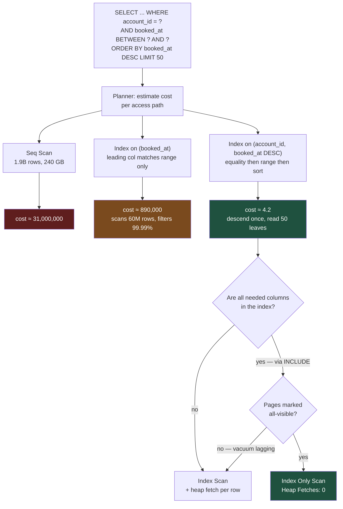

# Indexes Are Not Free: What to Add, What to Delete, and How to Prove It

An index is a bet: you pay on every write to make some reads fast. Most enterprise databases are carrying bets nobody remembers placing, against queries that no longer run.

## The Real-World Problem

A retail bank's contact-centre agents use a transaction-search screen: account, date range, optional merchant text, optional amount range. It returns 50 rows, paginated. The p95 was 340ms at go-live.

Three years and 1.9 billion rows later the p95 is 11 seconds. Agents work around it by asking customers to hold, or by narrowing to a single day and searching four times. Average call handling time is up 40 seconds, which across the contact centre is the cost of eleven full-time agents.

The reflex fix had already been applied, repeatedly. `card_transaction` had accumulated **17 indexes** — one per complaint, added by a different engineer each quarter. Nobody deleted any, because nobody could prove which were unused. The consequences compounded on the write path: the nightly settlement load, which inserts 8–11 million rows, had gone from 22 minutes to 2 hours 50 minutes, overrunning the batch window and delaying the morning reconciliation report. Autovacuum could not keep up with 17 index trees' worth of dead tuples, so the table and its indexes bloated to 2.3× their live size, which made the sequential scans it was falling back to even slower.

The search screen was slow because of a missing index. The batch window was broken because of the other sixteen.

## The Concept

### The index types you actually need in PostgreSQL

| Type | Structure | Use it for | Do not use it for |
|---|---|---|---|
| **B-tree** (default) | Ordered tree | Equality, ranges, `ORDER BY`, `IS NULL`, prefix `LIKE 'abc%'` | Full-text, array containment, `LIKE '%abc'` |
| **Composite B-tree** | Ordered tree on N columns | Multi-predicate queries, sort avoidance | Any query that skips the leading column |
| **Covering** (`INCLUDE`) | B-tree + non-key payload | Index-only scans when you need 1–3 extra columns | Wide payloads — you are duplicating the table |
| **Partial** (`WHERE`) | Index over a row subset | Skewed predicates: `status = 'PENDING'` on 0.1% of rows | Predicates the planner cannot match to the query |
| **GIN** | Inverted index | `jsonb` containment, arrays, full-text `tsvector`, trigram `%text%` | Plain scalar equality — B-tree is smaller and faster |
| **BRIN** | Per-block min/max summary | Huge, physically-ordered columns: append-only timestamps | Randomly-distributed values; selective lookups |

BRIN deserves emphasis for banking: a BRIN index on `booked_at` over a billion-row append-only table is a few megabytes where the equivalent B-tree is tens of gigabytes. It cannot find a single row efficiently, but it excludes 99% of blocks for a month-range scan.

### The leftmost-prefix rule

A composite index on `(a, b, c)` is usable for predicates on `a`, `(a, b)`, and `(a, b, c)`. It is **not** usable as a driving index for `b` alone, or `(b, c)`. The index is sorted by `a` first; without a bound on `a` there is no contiguous range to descend to.

Two practical corollaries:

- **Equality columns first, then the range column, then the sort column.** `WHERE account_id = ? AND booked_at BETWEEN ? AND ? ORDER BY booked_at DESC` wants `(account_id, booked_at DESC)`. Putting `booked_at` first destroys it.
- **One well-ordered composite index replaces three single-column ones.** `(a, b, c)` already serves `a` and `(a, b)`. Adding a separate index on `a` is pure write cost.

PostgreSQL 16/17 can still *use* an index whose leading column is unbound, via a full index scan, if the index is much narrower than the table. Do not design for that — it is a consolation prize, not a plan.

### Index-only scans, and the visibility-map catch

If every column the query touches — filters, output, sort — is present in the index, PostgreSQL can answer from the index alone and never visit the heap. `EXPLAIN` shows `Index Only Scan` and `Heap Fetches: 0`.

`INCLUDE` columns exist for exactly this: they ride along in the leaf pages without widening the sorted key, so they do not affect the tree's shape or its uniqueness semantics.

The catch: index-only scans still consult the visibility map, and if the page is not marked all-visible, the heap fetch happens anyway. A table that never gets vacuumed does not get index-only scans. `Heap Fetches` climbing toward the row count is a vacuum problem, not an index problem.

### Over-indexing is a write-amplification tax

Every non-HOT update writes a new index entry in **every** index on the table, plus WAL for each. Concretely, on that 17-index table:

- One insert becomes 18 page writes (heap + 17 index leaves), plus WAL for all of them.
- Bulk loads slow roughly linearly with index count.
- Each index has its own dead entries to reclaim, so autovacuum's work scales with index count — and autovacuum on a bloated index is itself slow, which is how bloat becomes self-sustaining.
- The planner's search space grows, so planning time rises on every query.

The rule: **an index must be justified by a named query, and the justification must be re-checked.** An index with no reads is a permanent tax paid for nothing.

### MySQL 8 differences that matter

InnoDB clusters the table on the primary key, so every secondary index implicitly contains the PK — a secondary index on `(account_id, booked_at)` covers `id` for free. MySQL has no partial indexes, no `INCLUDE` (put the column in the key instead), no BRIN, and no `CREATE INDEX CONCURRENTLY` — though `ALTER TABLE ... ADD INDEX` is online for most cases. Keep the PK narrow and monotonic; a UUIDv4 primary key in InnoDB fragments every secondary index too.

## How It Works



The decisive factor is not "is there an index" but "does the index's column order let the planner descend directly to the rows the query wants".

## Practical Example

The table, and the query behind the search screen:

```sql
CREATE TABLE card_transaction (
    id                 BIGINT       GENERATED ALWAYS AS IDENTITY PRIMARY KEY,
    account_id         UUID         NOT NULL,
    card_token         TEXT         NOT NULL,
    booked_at          TIMESTAMPTZ  NOT NULL,
    amount_minor_units BIGINT       NOT NULL,
    currency           CHAR(3)      NOT NULL,
    merchant_name      TEXT         NOT NULL,
    merchant_category  CHAR(4)      NOT NULL,
    status             TEXT         NOT NULL,
    dispute_ref        TEXT,
    enrichment         JSONB        NOT NULL DEFAULT '{}'::jsonb
);
```

```sql
SELECT id, booked_at, amount_minor_units, currency, merchant_name, status
  FROM card_transaction
 WHERE account_id = '8f2a...'::uuid
   AND booked_at >= '2026-05-01' AND booked_at < '2026-08-01'
 ORDER BY booked_at DESC
 LIMIT 50;
```

**Before** — 17 indexes on the table, none of them leading with `account_id`:

```
EXPLAIN (ANALYZE, BUFFERS)

 Limit  (cost=0.58..891204.31 rows=50 width=88) (actual time=10974.882..10975.114 rows=50 loops=1)
   Buffers: shared hit=41208 read=1863442
   ->  Index Scan Backward using idx_card_txn_booked_at on card_transaction
         (cost=0.58..1069445.17 rows=60 width=88)
         (actual time=10974.879..10975.101 rows=50 loops=1)
         Index Cond: ((booked_at >= '2026-05-01 00:00:00+00'::timestamptz)
                  AND (booked_at <  '2026-08-01 00:00:00+00'::timestamptz))
         Filter: (account_id = '8f2a...'::uuid)
         Rows Removed by Filter: 58412907
         Buffers: shared hit=41208 read=1863442
 Planning Time: 3.914 ms
 Execution Time: 10975.180 ms
```

Read that carefully: `Rows Removed by Filter: 58412907`. The index gave the planner the *date range* and nothing else, so it walked 58 million rows of that range backwards looking for one account, reading 1.86 million pages from disk. This is the signature of a wrong-order index — an index scan that is doing a sequential scan's work.

**The fix** — one index, built without blocking writes:

```sql
CREATE INDEX CONCURRENTLY idx_card_txn_account_booked
    ON card_transaction (account_id, booked_at DESC)
    INCLUDE (amount_minor_units, currency, merchant_name, status);

ANALYZE card_transaction;
```

`CONCURRENTLY` is mandatory on a live table: the plain form holds an `ACCESS EXCLUSIVE` lock for the whole build, which on 240 GB means hours of blocked writes. `CONCURRENTLY` cannot run inside a transaction block and can leave an `INVALID` index if it fails — check `pg_index.indisvalid` afterwards and drop-and-retry if needed.

**After:**

```
EXPLAIN (ANALYZE, BUFFERS)

 Limit  (cost=0.70..4.21 rows=50 width=88) (actual time=0.041..0.106 rows=50 loops=1)
   Buffers: shared hit=54
   ->  Index Only Scan using idx_card_txn_account_booked on card_transaction
         (cost=0.70..29.84 rows=418 width=88)
         (actual time=0.038..0.094 rows=50 loops=1)
         Index Cond: ((account_id = '8f2a...'::uuid)
                  AND (booked_at >= '2026-05-01 00:00:00+00'::timestamptz)
                  AND (booked_at <  '2026-08-01 00:00:00+00'::timestamptz))
         Heap Fetches: 0
         Buffers: shared hit=54
 Planning Time: 0.221 ms
 Execution Time: 0.138 ms
```

11 seconds to 0.14ms. Note the three things that made it: `Index Cond` now contains **both** predicates (no `Filter`, no `Rows Removed`), `Heap Fetches: 0` because `INCLUDE` covers the projection, and `Buffers: shared hit=54` with zero reads.

**What to read in `EXPLAIN (ANALYZE, BUFFERS)`, in priority order:**

| Signal | Meaning |
|---|---|
| `Rows Removed by Filter` large | Predicate not in `Index Cond` — wrong column order or missing column |
| `actual rows` ≫ or ≪ `rows` estimate | Stale statistics; `ANALYZE`, or raise `default_statistics_target` |
| `Heap Fetches` > 0 on Index Only Scan | Visibility map stale — vacuum lag |
| `read` ≫ `hit` in Buffers | Working set exceeds cache; often a symptom of bloat |
| `Sort` with `external merge Disk` | Missing sort-matching index, or `work_mem` too low |
| `loops=N` with N large | Nested loop over many outer rows; check the inner index |

**Partial index for the skewed predicate** — disputes are 0.03% of rows:

```sql
CREATE INDEX CONCURRENTLY idx_card_txn_open_disputes
    ON card_transaction (account_id, booked_at DESC)
    WHERE status = 'DISPUTED' AND dispute_ref IS NOT NULL;
```

620 KB instead of 41 GB. The query must contain a predicate the planner can prove implies the index's `WHERE` clause — `status = 'DISPUTED'` written literally, not passed as a parameter compared against a variable.

**GIN for merchant substring search**, which the free-text box needs:

```sql
CREATE EXTENSION IF NOT EXISTS pg_trgm;

CREATE INDEX CONCURRENTLY idx_card_txn_merchant_trgm
    ON card_transaction USING gin (merchant_name gin_trgm_ops);

-- now this uses the index instead of scanning
SELECT id, merchant_name FROM card_transaction
 WHERE account_id = '8f2a...'::uuid AND merchant_name ILIKE '%ryanair%';
```

**BRIN for the reporting path** over the same table — analysts scan whole months:

```sql
CREATE INDEX CONCURRENTLY idx_card_txn_booked_brin
    ON card_transaction USING brin (booked_at) WITH (pages_per_range = 64);
```

**Finding the sixteen indexes to delete.** Never delete on intuition; delete on measurement:

```sql
-- Reset once, then wait a full business cycle: a month-end job may be the only reader.
SELECT pg_stat_reset();

SELECT s.relname                          AS table_name,
       s.indexrelname                     AS index_name,
       s.idx_scan                         AS scans,
       pg_size_pretty(pg_relation_size(s.indexrelid)) AS size,
       i.indisunique                      AS is_unique,
       i.indisvalid                       AS is_valid
  FROM pg_stat_user_indexes s
  JOIN pg_index i ON i.indexrelid = s.indexrelid
 WHERE s.relname = 'card_transaction'
   AND NOT i.indisprimary
 ORDER BY s.idx_scan ASC, pg_relation_size(s.indexrelid) DESC;
```

```
 table_name       | index_name                          | scans  | size   | is_unique | is_valid
------------------+-------------------------------------+--------+--------+-----------+---------
 card_transaction | idx_card_txn_currency               |      0 | 9841 MB | f        | t
 card_transaction | idx_card_txn_merchant_category      |      0 | 12 GB   | f        | t
 card_transaction | idx_card_txn_status                 |      0 | 8722 MB | f        | t
 card_transaction | idx_card_txn_card_token_booked      |      0 | 31 GB   | f        | t
 card_transaction | idx_card_txn_account_id             |     14 | 22 GB   | f        | t
 card_transaction | idx_card_txn_booked_at              | 984112 | 41 GB   | f        | t
```

Three rules before dropping: check every replica separately (`idx_scan` is per-node, and a read replica may be the only user), never drop an index backing a constraint or FK, and drop invisibly first where you can — PostgreSQL has no `INVISIBLE` index, so the safe pattern is to script the exact recreate statement into the changeset's rollback block.

```sql
-- Reversible, reviewed, one changeset per index.
DROP INDEX CONCURRENTLY idx_card_txn_account_id;   -- superseded by the composite above
```

Dropping the twelve unused indexes returned the settlement load to 26 minutes and let autovacuum catch up; bloat fell back to 1.1×.

## Enterprise Trade-offs

| Approach | Pros | Cons | When to use (Banking / Insurance / Enterprise) |
|---|---|---|---|
| **Narrow composite, equality→range→sort** | Serves the query and its prefixes; avoids sorts; one write cost | Requires knowing the real query shapes | Default for every OLTP access path: transaction search, policy lookup, order history |
| **Covering index (`INCLUDE`)** | Index-only scans; eliminates heap I/O entirely | Duplicates data; only pays off while vacuum keeps pages all-visible | Hot read paths with a stable, small projection — contact-centre screens, account statements |
| **Partial index** | Tiny; near-zero write cost on non-matching rows | Planner must match the predicate literally; brittle to query changes | Skewed workflow states: open disputes, pending claims, unsettled trades |
| **GIN (trigram / jsonb / FTS)** | Makes `%text%`, array, and JSON containment searchable | Large; slow to build; write-amplifying — mitigate with `fastupdate` | Merchant/counterparty name search, enrichment payload queries, document metadata |
| **BRIN on append-only timestamps** | Kilobytes for billions of rows; trivial write cost | Useless for point lookups; needs physical correlation | Reporting and archival scans on immutable ledgers and event tables |
| **An index per complaint, never reviewed** | Fixes today's ticket in one line | Write amplification, bloat, autovacuum collapse, broken batch window — the scenario above | Never. Index additions belong in the same review gate as any other schema change |

## Why This Still Matters Through 2030

Hardware keeps making bad plans survivable for longer, which is precisely why indexing judgment stays valuable: NVMe and large buffer caches hide a wrong-order index until the table crosses a threshold, and then the failure arrives suddenly, in production, at month-end. The structural forces all point the same way — regulatory retention keeps operational tables growing rather than shrinking, and read paths keep multiplying as analytics, fraud scoring, and agent-driven tooling all query the same OLTP tables from different angles, each one tempting someone to add another index. Automated advisors, including the index-suggestion features arriving in managed Postgres and in AI copilots, are good at proposing indexes and structurally bad at proposing deletions, because a deletion requires knowing that no unseen consumer depends on the index. That asymmetry means the discipline worth building is not "can I add an index" but "can I read `EXPLAIN (ANALYZE, BUFFERS)`, justify each index against a named query, and prove the write cost is worth paying". PostgreSQL's plan output has been stable for over a decade and will still be the ground truth in 2030.

→ Next: [02-partitioning-for-scale.md](02-partitioning-for-scale.md) · Related: [../01-core-concepts/06-performance-budget.md](../01-core-concepts/06-performance-budget.md) · [../00-project-setup-roadmap/07-observability.md](../00-project-setup-roadmap/07-observability.md)
