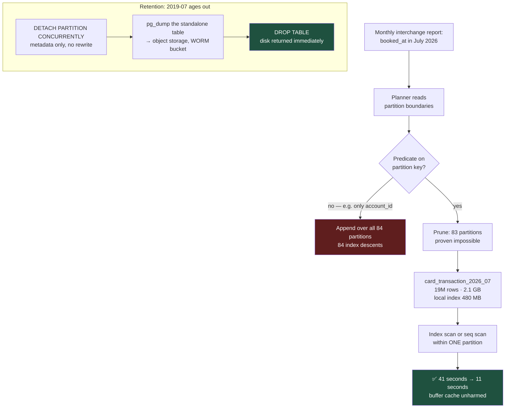

# Partitioning: Making a Billion-Row Table Behave Like a Small One

Partitioning does not make queries faster by magic. It makes them faster by letting the planner ignore data it can prove is irrelevant — and it makes archival a metadata operation instead of a seven-hour `DELETE`.

## The Real-World Problem

The same retail bank from the indexing article now has `card_transaction` correctly indexed. The search screen is fast. Three other things are not.

**Archival.** Regulation requires seven years of retention online and deletion after that. The retention job runs `DELETE FROM card_transaction WHERE booked_at < now() - interval '7 years'` — roughly 140 million rows. It runs for six hours, generates 90 GB of WAL, saturates replication to the standby (replica lag peaks at 40 minutes, breaching the DR RPO), and leaves 140 million dead tuples that autovacuum spends the next two days reclaiming without ever returning the disk space to the operating system. Storage keeps growing after a job whose purpose is to shrink it.

**Reporting.** The monthly interchange-fee report aggregates one month. It reads the full 41 GB `booked_at` index because a range covering 4% of a table is not selective enough for the planner to prefer an index scan over a sequential scan, so it takes 18 minutes and pushes the buffer cache's hit rate off a cliff for everyone else.

**Maintenance.** A single `VACUUM FULL` or a `REINDEX` on the whole table needs a maintenance window nobody will approve, so it never happens.

Every one of these is a whole-table problem. Partitioning turns them into per-month problems.

## The Concept

### The three strategies

| Strategy | Key expression | Enterprise fit |
|---|---|---|
| **Range** | `PARTITION BY RANGE (booked_at)` | Time-series with a retention policy: transactions, ledger entries, audit logs, telemetry. **The default choice in banking.** |
| **List** | `PARTITION BY LIST (region_code)` | Discrete, stable, low-cardinality domains: legal entity, country, product line, tenant — often for data-residency requirements |
| **Hash** | `PARTITION BY HASH (account_id)` | Even distribution when there is no natural boundary; reduces contention and per-index size. No archival benefit — you cannot drop a hash partition |

You can nest them: range by month, then hash by `account_id` within each month. Do this only when you can name the problem it solves; sub-partitioning multiplies the object count and the planning cost.

### Partition pruning is the entire point

Pruning is the planner (or executor) proving a partition cannot contain matching rows and skipping it. It works when the query's predicate is on the **partition key**, in a form the planner can evaluate against the boundaries.

Pruning works:

```sql
WHERE booked_at >= '2026-07-01' AND booked_at < '2026-08-01'   -- explicit range
WHERE booked_at = $1                                            -- runtime pruning on a parameter
```

Pruning fails:

```sql
WHERE date_trunc('month', booked_at) = '2026-07-01'   -- key wrapped in a function
WHERE booked_at::date = '2026-07-15'                  -- cast on the key
WHERE booked_at > now() - interval '30 days'           -- OK in PG12+; was a classic failure before
WHERE account_id = $1                                  -- no key predicate at all → scan every partition
```

That last one is the trap. If half your queries filter only by `account_id`, range partitioning by date makes them *slower*: instead of one index descent you now do 84 index descents, one per monthly partition, and merge the results.

**Choose the partition key from the dominant query predicate, not from the retention policy.** If those disagree, you have a real design decision, not a formality.

### Local indexes only — there are no global indexes

In PostgreSQL, an index created on the partitioned parent is a *template*: it materialises as one physical index per partition. There is no single index tree spanning all partitions. Three consequences:

1. **A `UNIQUE` constraint must include the partition key.** You cannot enforce global uniqueness on `card_reference` alone across partitions. If you need it, either include the key in the constraint, add a separate unpartitioned lookup table with the unique constraint, or accept application-level enforcement — and note that the last option is the exact failure described in [data integrity](../01-core-concepts/04-data-integrity-and-migrations.md).
2. **Primary keys must include the partition key.** `PRIMARY KEY (id, booked_at)` rather than `PRIMARY KEY (id)`. Downstream code and foreign keys must cope with a composite key.
3. **Foreign keys referencing a partitioned table** are supported in PostgreSQL 12+, but only against a key that includes the partition column.

Oracle's global indexes have no PostgreSQL equivalent, and this trips up migrations from Oracle-based core banking systems more than anything else in partitioning.

### Attach and detach: archival as a metadata operation

`DETACH PARTITION CONCURRENTLY` removes a month from the logical table without rewriting anything. The detached table still exists and is queryable on its own — dump it to cold storage, then `DROP TABLE`. The six-hour `DELETE` becomes two statements and a `pg_dump`, generates almost no WAL, and returns the disk immediately.

`ATTACH PARTITION` is the reverse, and it validates that existing rows satisfy the boundary — add a matching `CHECK` constraint to the table *before* attaching, and PostgreSQL skips the validation scan.

### When partitioning does not help

Be blunt about this, because partitioning is frequently applied as a reflex:

- **Small tables.** Under roughly 50–100 GB, or where the whole working set fits in cache, a correct index is better and simpler. Partitioning adds planning overhead, object sprawl, and constraint restrictions.
- **Queries that cannot prune.** If the dominant predicate is not the partition key, you have made every query fan out.
- **`SELECT ... ORDER BY x LIMIT n` across all partitions.** PostgreSQL 16+ handles many of these with `Merge Append`, but not all; some become sort-everything plans.
- **Very high partition counts.** Thousands of partitions inflate planning time and `relcache` memory per backend. Keep it in the low hundreds; monthly for seven years is 84, which is comfortable.
- **As a substitute for indexing.** Pruning to a 2 GB partition and then sequentially scanning it is still a sequential scan.

MySQL 8 supports `RANGE`, `LIST`, `HASH`, and `KEY` partitioning with a hard restriction: **every unique and primary key must contain all partitioning columns**, and there is no equivalent of `DETACH ... CONCURRENTLY` (`ALTER TABLE ... DROP PARTITION` is immediate but takes a metadata lock). Foreign keys are not supported on partitioned InnoDB tables at all — which usually decides the matter in a regulated schema.

## How It Works



Pruning is a planning-time proof about boundaries; nothing at runtime compensates for a query that cannot be pruned.

## Practical Example

**The partitioned table.** Note the composite primary key — required, and a real change for callers:

```sql
CREATE TABLE card_transaction (
    id                 BIGINT       GENERATED ALWAYS AS IDENTITY,
    account_id         UUID         NOT NULL,
    card_token         TEXT         NOT NULL,
    booked_at          TIMESTAMPTZ  NOT NULL,
    amount_minor_units BIGINT       NOT NULL,
    currency           CHAR(3)      NOT NULL,
    merchant_name      TEXT         NOT NULL,
    status             TEXT         NOT NULL,
    CONSTRAINT pk_card_transaction PRIMARY KEY (id, booked_at)   -- key must include partition col
) PARTITION BY RANGE (booked_at);

-- Template indexes: materialised once per partition, automatically for future partitions.
CREATE INDEX idx_card_txn_account_booked
    ON card_transaction (account_id, booked_at DESC)
    INCLUDE (amount_minor_units, currency, merchant_name, status);

CREATE TABLE card_transaction_2026_07 PARTITION OF card_transaction
    FOR VALUES FROM ('2026-07-01') TO ('2026-08-01');
CREATE TABLE card_transaction_2026_08 PARTITION OF card_transaction
    FOR VALUES FROM ('2026-08-01') TO ('2026-09-01');

-- Catch-all so an out-of-range insert errors visibly rather than silently failing.
CREATE TABLE card_transaction_overflow PARTITION OF card_transaction DEFAULT;
```

Keep the `DEFAULT` partition **empty**. A non-empty default blocks `ATTACH` of any overlapping range (PostgreSQL must scan it to prove no conflict), and it quietly hides the fact that partition creation has stopped working. Alert on `count(*) > 0`.

**Proving pruning works:**

```sql
EXPLAIN (ANALYZE, BUFFERS)
SELECT merchant_category, sum(amount_minor_units)
  FROM card_transaction
 WHERE booked_at >= '2026-07-01' AND booked_at < '2026-08-01'
 GROUP BY merchant_category;
```

```
 HashAggregate  (cost=612884.20..612891.44 rows=724 width=44)
                (actual time=10784.113..10784.402 rows=681 loops=1)
   Group Key: merchant_category
   Buffers: shared hit=2204 read=272841
   ->  Seq Scan on card_transaction_2026_07 card_transaction
         (cost=0.00..518110.00 rows=18954840 width=20)
         (actual time=0.019..4021.887 rows=18954812 loops=1)
         Buffers: shared hit=2204 read=272841
 Planning Time: 1.442 ms
 Execution Time: 10784.560 ms
```

One partition appears in the plan. The other 83 are gone — not scanned cheaply, *absent*. Before partitioning this plan read 41 GB of index plus heap; now it reads 2.1 GB.

**Pruning failure, and the fix.** This is the single most common partitioning bug in production:

```sql
-- BROKEN: function on the key → no pruning, Append over all 84 partitions
EXPLAIN SELECT count(*) FROM card_transaction
 WHERE date_trunc('month', booked_at) = '2026-07-01';
```

```
 Aggregate  (cost=48221904.11..48221904.12 rows=1 width=8)
   ->  Append  (cost=0.00..47009551.72 rows=9698591 width=0)
         ->  Seq Scan on card_transaction_2019_08 ...
         ->  Seq Scan on card_transaction_2019_09 ...
         ...  (84 partitions)
```

```sql
-- FIXED: express the same thing as a half-open range on the bare key
EXPLAIN SELECT count(*) FROM card_transaction
 WHERE booked_at >= '2026-07-01' AND booked_at < '2026-08-01';
```

Verify runtime pruning for parameterised queries too — with a bound parameter you should see `Subplans Removed: 83` in the `EXPLAIN ANALYZE` output. If you do not, the ORM is probably casting the parameter.

**Cheap archival — the six-hour `DELETE`, replaced:**

```sql
-- 1. Detach without blocking readers or writers of the live table.
--    Cannot run inside a transaction block.
ALTER TABLE card_transaction
    DETACH PARTITION card_transaction_2019_07 CONCURRENTLY;

-- 2. It is now an ordinary standalone table. Export as retention evidence.
--    $ pg_dump -t card_transaction_2019_07 --format=custom \
--        | aws s3 cp - s3://bank-retention-wormbucket/card_txn/2019-07.dump

-- 3. Reclaim the disk instantly.
DROP TABLE card_transaction_2019_07;
```

Total WAL generated: kilobytes. Replica lag: unaffected. Disk returned: 2.4 GB, immediately.

**Reattaching without a validation scan** — for a restore, or for a bulk-loaded month prepared offline:

```sql
CREATE TABLE card_transaction_2026_09 (LIKE card_transaction INCLUDING ALL);
ALTER TABLE card_transaction_2026_09
    ADD CONSTRAINT chk_range CHECK (booked_at >= '2026-09-01' AND booked_at < '2026-10-01');

-- bulk load here, with no indexes, then create them, then attach

-- Because the CHECK matches the boundary exactly, ATTACH skips the full scan.
ALTER TABLE card_transaction ATTACH PARTITION card_transaction_2026_09
    FOR VALUES FROM ('2026-09-01') TO ('2026-10-01');
ALTER TABLE card_transaction_2026_09 DROP CONSTRAINT chk_range;   -- now redundant
```

**Automated partition creation.** Never rely on someone remembering. A function plus a scheduled job, both under version control:

```sql
CREATE OR REPLACE FUNCTION ensure_card_transaction_partitions(months_ahead INT DEFAULT 3)
RETURNS void
LANGUAGE plpgsql
AS $$
DECLARE
    m           DATE;
    part_name   TEXT;
BEGIN
    FOR i IN 0..months_ahead LOOP
        m         := date_trunc('month', now())::date + (i || ' months')::interval;
        part_name := format('card_transaction_%s', to_char(m, 'YYYY_MM'));

        IF NOT EXISTS (SELECT 1 FROM pg_class WHERE relname = part_name) THEN
            EXECUTE format(
                'CREATE TABLE %I PARTITION OF card_transaction FOR VALUES FROM (%L) TO (%L)',
                part_name, m, (m + interval '1 month')::date);
            RAISE LOG 'created partition %', part_name;
        END IF;
    END LOOP;
END;
$$;

-- pg_cron, or your platform's scheduler — whichever is auditable.
SELECT cron.schedule('card-txn-partitions', '0 3 1 * *',
                     'SELECT ensure_card_transaction_partitions(3)');
```

Three months of headroom, not one: it means a failed job is a warning rather than an outage. And alert on the *absence* of next month's partition, not on the job's exit code — the job succeeding while doing nothing is a real failure mode.

**Monitoring what you now have:**

```sql
SELECT c.relname                                   AS partition,
       pg_size_pretty(pg_total_relation_size(c.oid)) AS total_size,
       c.reltuples::bigint                         AS approx_rows,
       pg_get_expr(c.relpartbound, c.oid)          AS bounds
  FROM pg_class p
  JOIN pg_inherits i ON i.inhparent = p.oid
  JOIN pg_class c    ON c.oid = i.inhrelid
 WHERE p.relname = 'card_transaction'
 ORDER BY c.relname DESC
 LIMIT 5;
```

**Spring Boot note.** With a composite primary key, JPA needs an `@IdClass` or `@EmbeddedId`, and Hibernate's `getReferenceById(id)` no longer works with a bare `Long`. For an append-only ledger this is usually the moment to stop mapping the table as a mutable entity and read it through a projection interface or JDBC instead — which is the honest model for immutable data anyway.

## Enterprise Trade-offs

| Approach | Pros | Cons | When to use (Banking / Insurance / Enterprise) |
|---|---|---|---|
| **Range by month on a timestamp** | Pruning for reports; archival by `DETACH`; per-partition vacuum and reindex | Composite PK required; queries without the date predicate fan out | Card transactions, ledger postings, claims payments, audit logs — anything with a retention policy |
| **List by legal entity or country** | Pruning per entity; supports data-residency and per-entity backup/restore | Skew: one entity may hold 80% of rows; adding an entity needs DDL | Multi-entity banking groups, cross-border insurers with GDPR residency constraints |
| **Hash by account_id** | Even distribution; smaller per-partition indexes; less lock contention | No archival benefit; range scans on other columns touch every partition | Very hot tables with uniform point-lookup access and no retention story |
| **Composite: range then hash** | Both retention and distribution | Object count multiplies; planning cost rises; operationally heavier | Only at genuine scale (tens of billions of rows) with a measured contention problem |
| **One big table + correct indexes** | Simplest; no constraint restrictions; global uniqueness works | Whole-table `DELETE`, `VACUUM`, `REINDEX` all need windows nobody grants | Correct answer below ~100 GB, and for any table without a time or tenancy axis |
| **Partitioning to avoid indexing work** | — | Prunes to one partition and then sequentially scans it; slower than an index on the unpartitioned table | Never. Partition *and* index; they solve different problems |

→ Next: [03-normalization-vs-denormalization.md](03-normalization-vs-denormalization.md) · Related: [01-indexing-strategies-that-actually-work.md](01-indexing-strategies-that-actually-work.md) · [../01-core-concepts/06-performance-budget.md](../01-core-concepts/06-performance-budget.md)
