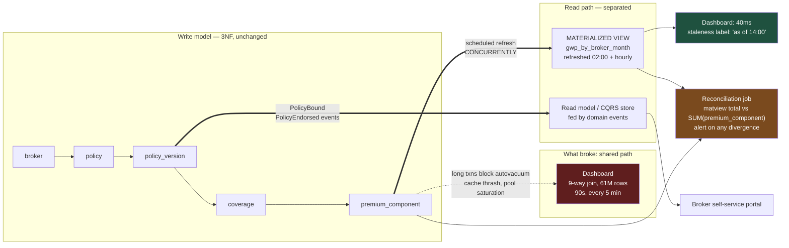

# Normalise Until It Hurts, Denormalise Until It Works — But Never in the Same Place

Third normal form protects writes. Denormalisation accelerates reads. The mistake is not choosing one — it is letting both live in the same table, where every write now has two truths to keep in step.

## The Real-World Problem

A mid-size motor and household insurer runs a policy administration system on a well-designed 3NF PostgreSQL schema: `policy`, `policy_version`, `insured_party`, `risk_item`, `coverage`, `premium_component`, `broker`, `product`. Roughly 4.2 million active policies. The operational workload — quote, bind, endorse, renew — is comfortably fast.

Then the finance and distribution teams get a management dashboard. It shows gross written premium by broker, by product, by month, with loss ratio alongside. The query joins nine tables, aggregates 61 million `premium_component` rows, and runs against the primary database because that is where the data is. It takes 90 seconds.

It refreshes every five minutes. Fourteen people have it open.

The consequences arrive in this order. The dashboard's long-running transactions hold back the oldest active transaction ID, so autovacuum cannot reclaim dead tuples on `policy_version` — a table updated on every endorsement — and it bloats to 3.8× live size. The buffer cache is repeatedly flushed by 61-million-row aggregate scans, so unrelated OLTP queries start reading from disk. Quote-to-bind p95 goes from 180ms to 2.4 seconds. At 09:40 on a Monday, with brokers loading the morning's business, connections queue, the pool saturates, and the broker portal returns errors for eleven minutes.

An outage in the sales channel, caused by a read-only report. Nobody wrote a bug.

The first attempted fix made it worse: an engineer added `broker_name`, `product_name`, and `total_premium_minor_units` directly onto `policy` to flatten the joins, maintained in application code. Nine months later, after a broker rebrand and two endorsement paths that nobody updated, 38,000 policies carried a stale `broker_name` and 1,400 had a `total_premium_minor_units` that did not equal the sum of their components. Finance reconciled the dashboard against the ledger and found a £2.1M discrepancy that took three weeks to explain.

## The Concept

### 3NF is the correct default for the write model

Normalisation exists to make a fact storable in exactly one place, so that changing it is one write and cannot be partially applied. In insurance and banking that property is not an aesthetic preference — it is what makes the data auditable.

Keep 3NF when:

- The data is written or corrected by users, and correctness matters more than read latency.
- A fact has a single owner (a broker's name belongs to `broker`, full stop).
- Regulatory reporting must be reconstructable from source records.
- The access pattern is "one policy at a time" — the join is a handful of index lookups, not a scan.

**A join across indexed foreign keys is cheap.** Do not denormalise to avoid joins; denormalise to avoid *aggregating millions of rows on the read path*. Those are different problems, and only the second one justifies duplication.

### What actually justifies denormalisation

| Symptom | Justifies denormalisation? |
|---|---|
| Report aggregates tens of millions of rows per request | **Yes** |
| Query joins nine tables but returns one policy | No — fix the indexes |
| Analytical query holds long transactions on the OLTP primary | **Yes** — separate the read path |
| Developer finds the joins tedious to write | No — that is what a view is for |
| Read path needs data from three services | **Yes** — a read model, not a shared table |
| Point-in-time snapshot needed for regulatory reporting | **Yes** — and it must be immutable |

### The four mechanisms, in increasing order of cost and power

**1. Indexed view or plain view.** Zero duplication, zero drift. It hides the joins without changing anything about correctness. Start here — it solves "tedious" and never solves "slow aggregate".

**2. Materialised view.** A stored, refreshable result set. One definition, one refresh, no application code touches it. Drift is bounded and *visible*: you know exactly how stale it is, because you know when it last refreshed. `REFRESH MATERIALIZED VIEW CONCURRENTLY` avoids blocking readers but requires a unique index and does more work than a plain refresh.

**3. Duplicated columns on the operational table.** Cheapest to read, most dangerous. Every write path must maintain them, and every write path you forget produces silent drift — the £2.1M discrepancy above. If you do this, the maintenance must be a database trigger or a generated column, not application code, because application code is only one of the writers (see [data integrity](../01-core-concepts/04-data-integrity-and-migrations.md)).

**4. A separate read model (CQRS).** The write model stays 3NF; a projection consumes domain events and maintains a denormalised read store shaped exactly like the screen or report. Highest operational cost, highest ceiling, and the only option that fully removes reporting load from the transactional database.

### Write integrity versus read performance — the actual trade-off

Every denormalisation moves a cost from read time to write time, and adds a **correctness obligation**. The obligation is the part teams underestimate:

| | Normalised | Denormalised |
|---|---|---|
| Cost of a read | Joins / aggregation at query time | Precomputed |
| Cost of a write | One row | N rows, or a refresh |
| Can it be wrong? | No — one place to store the fact | **Yes** — that is the trade |
| Who guarantees correctness | The schema | A process someone must maintain |
| Failure mode | Slow | **Silently wrong** |

Slow is visible in a dashboard. Silently wrong is discovered by an auditor. Price the denormalisation with that asymmetry in mind, and never denormalise a figure that appears in a regulatory return without a reconciliation check against the source.

### How denormalised data drifts, and the three ways to fight it

| Maintenance | Correctness | Drift risk | Notes |
|---|---|---|---|
| **Generated column** (`GENERATED ALWAYS AS ... STORED`) | Guaranteed by the engine | None | Only for same-row expressions. Use it wherever it fits |
| **Database trigger** | Enforced against every writer | Low | Must handle `INSERT`/`UPDATE`/`DELETE` on *every* contributing table; adds write latency and lock scope |
| **Application code** | Only for writers that run that code | **High** | Bulk loads, data fixes, other services, and future teams all bypass it |
| **Scheduled refresh** (matview) | Correct as of refresh time | Bounded and known | Needs staleness monitoring and alerting; the safest of the lot |
| **Event projection** | Eventually correct | Bounded, needs replay | Requires idempotent handlers and a rebuild path |

The non-negotiable, whichever you pick: **a reconciliation job that compares the denormalised figure against the normalised source and alerts on divergence.** Denormalisation without reconciliation is an undetected-defect generator.

## How It Works



The write model does not change. What changes is that reads stop travelling through it, and a reconciliation job makes any drift loud.

## Practical Example

**The 3NF core, kept exactly as it is:**

```sql
CREATE TABLE broker (
    id           UUID PRIMARY KEY DEFAULT gen_random_uuid(),
    agency_code  TEXT NOT NULL UNIQUE,
    legal_name   TEXT NOT NULL,
    valid_from   DATE NOT NULL,
    valid_to     DATE
);

CREATE TABLE policy (
    id            UUID PRIMARY KEY DEFAULT gen_random_uuid(),
    policy_number TEXT NOT NULL UNIQUE,
    broker_id     UUID NOT NULL REFERENCES broker (id) ON DELETE RESTRICT,
    product_id    UUID NOT NULL REFERENCES product (id) ON DELETE RESTRICT,
    inception_date DATE NOT NULL
);

CREATE TABLE policy_version (
    id           UUID PRIMARY KEY DEFAULT gen_random_uuid(),
    policy_id    UUID NOT NULL REFERENCES policy (id) ON DELETE RESTRICT,
    version_no   INT  NOT NULL,
    effective_on DATE NOT NULL,
    status       TEXT NOT NULL CHECK (status IN ('QUOTED','BOUND','LAPSED','CANCELLED')),
    CONSTRAINT uq_policy_version UNIQUE (policy_id, version_no)
);

CREATE TABLE premium_component (
    id                 UUID   PRIMARY KEY DEFAULT gen_random_uuid(),
    policy_version_id  UUID   NOT NULL REFERENCES policy_version (id) ON DELETE RESTRICT,
    component_type     TEXT   NOT NULL,      -- BASE, IPT, BROKER_COMMISSION, FEE
    amount_minor_units BIGINT NOT NULL,
    currency           CHAR(3) NOT NULL
);
```

**The materialised view that replaced the dashboard query:**

```sql
CREATE MATERIALIZED VIEW gwp_by_broker_month AS
SELECT b.id                                      AS broker_id,
       b.agency_code,
       b.legal_name                              AS broker_name,
       pr.code                                   AS product_code,
       date_trunc('month', pv.effective_on)::date AS earned_month,
       count(DISTINCT p.id)                      AS policy_count,
       sum(pc.amount_minor_units) FILTER (WHERE pc.component_type = 'BASE') AS gwp_minor_units,
       sum(pc.amount_minor_units) FILTER (WHERE pc.component_type = 'IPT')  AS ipt_minor_units,
       max(pv.effective_on)                      AS latest_effective_on
  FROM premium_component pc
  JOIN policy_version pv ON pv.id = pc.policy_version_id
  JOIN policy p          ON p.id  = pv.policy_id
  JOIN broker b          ON b.id  = p.broker_id
  JOIN product pr        ON pr.id = p.product_id
 WHERE pv.status = 'BOUND'
 GROUP BY b.id, b.agency_code, b.legal_name, pr.code, date_trunc('month', pv.effective_on)
WITH NO DATA;

-- Required for REFRESH ... CONCURRENTLY, and it is the dashboard's access path anyway.
CREATE UNIQUE INDEX uq_gwp_by_broker_month
    ON gwp_by_broker_month (broker_id, product_code, earned_month);

REFRESH MATERIALIZED VIEW gwp_by_broker_month;
```

Record the refresh so the UI can label staleness honestly — a dashboard showing "as of 14:00" is trustworthy; one silently showing yesterday's numbers is not:

```sql
CREATE TABLE read_model_refresh (
    view_name     TEXT PRIMARY KEY,
    refreshed_at  TIMESTAMPTZ NOT NULL,
    duration_ms   BIGINT      NOT NULL,
    row_count     BIGINT      NOT NULL
);

CREATE OR REPLACE FUNCTION refresh_gwp_by_broker_month() RETURNS void
LANGUAGE plpgsql AS $$
DECLARE started TIMESTAMPTZ := clock_timestamp();
BEGIN
    REFRESH MATERIALIZED VIEW CONCURRENTLY gwp_by_broker_month;
    INSERT INTO read_model_refresh (view_name, refreshed_at, duration_ms, row_count)
    SELECT 'gwp_by_broker_month', now(),
           (EXTRACT(epoch FROM clock_timestamp() - started) * 1000)::bigint,
           count(*) FROM gwp_by_broker_month
    ON CONFLICT (view_name) DO UPDATE
       SET refreshed_at = EXCLUDED.refreshed_at,
           duration_ms  = EXCLUDED.duration_ms,
           row_count    = EXCLUDED.row_count;
END; $$;
```

The dashboard query is now:

```sql
SELECT broker_name, product_code, earned_month, policy_count,
       gwp_minor_units / 100.0 AS gwp
  FROM gwp_by_broker_month
 WHERE earned_month >= date_trunc('month', now()) - interval '12 months'
 ORDER BY earned_month DESC, gwp_minor_units DESC;
```

```
 Index Scan using uq_gwp_by_broker_month on gwp_by_broker_month
   (actual time=0.031..38.442 rows=9184 loops=1)
 Execution Time: 40.118 ms
```

90 seconds to 40ms, zero long transactions on the OLTP tables, and the primary's autovacuum recovers within a day.

**Duplicated columns, done correctly.** Sometimes you genuinely need the total on the row — an insurance renewals list showing 500 policies cannot join and aggregate per row. Use a generated column where the expression is same-row:

```sql
ALTER TABLE premium_component
    ADD COLUMN amount_major NUMERIC(19,4)
    GENERATED ALWAYS AS (amount_minor_units / 100.0) STORED;   -- cannot drift, ever
```

And a trigger — not application code — where it spans rows:

```sql
ALTER TABLE policy_version
    ADD COLUMN total_premium_minor_units BIGINT NOT NULL DEFAULT 0;

CREATE OR REPLACE FUNCTION sync_policy_version_total() RETURNS trigger
LANGUAGE plpgsql AS $$
DECLARE target UUID := COALESCE(NEW.policy_version_id, OLD.policy_version_id);
BEGIN
    UPDATE policy_version pv
       SET total_premium_minor_units = COALESCE(
             (SELECT sum(amount_minor_units) FROM premium_component
               WHERE policy_version_id = target), 0)
     WHERE pv.id = target;
    RETURN NULL;
END; $$;

CREATE TRIGGER trg_sync_policy_version_total
    AFTER INSERT OR UPDATE OR DELETE ON premium_component
    FOR EACH ROW EXECUTE FUNCTION sync_policy_version_total();
```

This is enforced against the bulk loader and the 3am data fix as well as the application. It costs write latency and widens the lock footprint of every premium change — accept that consciously, or use the read model instead.

**The reconciliation job — the control that makes any of this safe:**

```sql
-- Run hourly. Any row returned is an incident, not a warning.
WITH source AS (
    SELECT pv.id AS policy_version_id, sum(pc.amount_minor_units) AS truth
      FROM policy_version pv
      LEFT JOIN premium_component pc ON pc.policy_version_id = pv.id
     GROUP BY pv.id
)
SELECT pv.id, pv.total_premium_minor_units AS denormalised, s.truth,
       pv.total_premium_minor_units - COALESCE(s.truth, 0) AS drift
  FROM policy_version pv
  JOIN source s ON s.policy_version_id = pv.id
 WHERE pv.total_premium_minor_units <> COALESCE(s.truth, 0);
```

**Spring Boot: keep the two models genuinely separate.** The write side is JPA over the 3NF aggregate; the read side is a projection over the matview, read-only, no entity mapping:

```java
public interface GwpByBrokerMonthRepository extends Repository<GwpRow, Void> {

    @Query(value = """
        SELECT broker_name, product_code, earned_month, policy_count, gwp_minor_units
          FROM gwp_by_broker_month
         WHERE earned_month >= :from
         ORDER BY earned_month DESC, gwp_minor_units DESC
        """, nativeQuery = true)
    List<GwpRow> findFrom(@Param("from") LocalDate from);
}

@Service
class DashboardService {

    private final GwpByBrokerMonthRepository rows;
    private final ReadModelRefreshRepository refreshes;

    @Transactional(readOnly = true, timeout = 5)          // hard cap: never a long transaction
    public DashboardView load(LocalDate from) {
        var asOf = refreshes.findById("gwp_by_broker_month")
                            .map(ReadModelRefresh::refreshedAt)
                            .orElseThrow(StaleReadModelException::new);
        if (asOf.isBefore(Instant.now().minus(Duration.ofHours(3)))) {
            // Show the data, but tell the user it is stale. Never present it as live.
            return DashboardView.stale(rows.findFrom(from), asOf);
        }
        return DashboardView.fresh(rows.findFrom(from), asOf);
    }
}
```

The `timeout = 5` is the specific control that would have prevented the outage: a read path that cannot hold a transaction open cannot block autovacuum.

## Enterprise Trade-offs

| Approach | Pros | Cons | When to use (Banking / Insurance / Enterprise) |
|---|---|---|---|
| **Strict 3NF, indexed joins** | One place per fact; cannot drift; fully auditable | Aggregate reports are slow; wide joins in query code | Default for all write models: policy admin, ledger, claims, KYC records |
| **Plain view over 3NF** | Hides join complexity at zero correctness cost | No performance benefit whatsoever | When the complaint is readability, not latency |
| **Materialised view + scheduled refresh** | One definition; drift bounded and measurable; no app changes | Stale between refreshes; refresh cost; needs a unique index for `CONCURRENTLY` | Management reporting, regulatory extracts, broker/agent league tables — the default fix for the scenario above |
| **Duplicated columns via trigger or generated column** | Fastest reads; enforced against every writer | Write latency and lock scope; triggers are invisible to newcomers | Row-level totals on high-volume list screens where a join per row is untenable |
| **Duplicated columns via application code** | Trivial to implement | Bypassed by bulk loads, data fixes, other services — the £2.1M drift | Never for figures with financial or regulatory meaning |
| **Separate read model / CQRS** | Fully isolates reporting load; read store shaped to the screen | Eventual consistency; projection code, replay path, and monitoring to own | Cross-service views, customer-facing portals, anything where reporting load threatens the transactional SLA |

→ Next: [04-ddl-vs-dml-roles-and-ownership.md](04-ddl-vs-dml-roles-and-ownership.md) · Related: [../01-core-concepts/04-data-integrity-and-migrations.md](../01-core-concepts/04-data-integrity-and-migrations.md) · [../03-architecture/05-event-driven-architecture.md](../03-architecture/05-event-driven-architecture.md)
