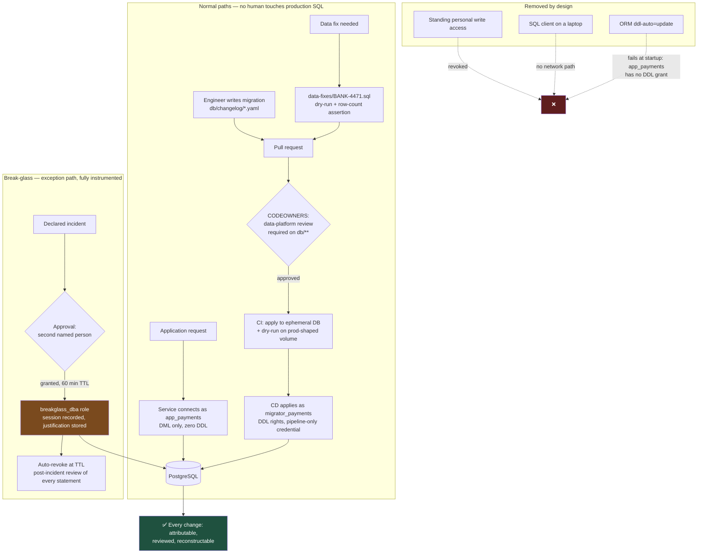

# Nobody Types UPDATE Into Production: Owning DDL and DML Separately

A schema change and a data change are different acts with different owners, different approvals, and different evidence. Systems that treat them as one thing — "someone with production access fixes it" — produce changes that cannot be explained six months later, which in a regulated environment is indistinguishable from not having a control at all.

## The Real-World Problem

A retail bank runs monthly interest capitalisation on 2.4 million savings accounts. In the January run, a rounding change deployed the previous week credits 1,842 accounts with interest calculated on the wrong day-count basis. The amounts are small — between £0.02 and £4.17 — and the total exposure is £2,900.

An engineer on the incident bridge has emergency production access, granted eighteen months earlier during a different incident and never revoked. They open a SQL client, write a corrective `UPDATE` against `account_balance` and a compensating pair of rows in `ledger_entry`, run it, verify the totals look right, and post "fixed, 1842 rows" in the channel. It took nine minutes. The numbers were correct.

Four months later, an internal audit samples the January ledger. It finds 1,842 ledger entries with a `created_by` of `svc_batch` — the batch service account the engineer's session inherited — timestamped at 22:14 on a day when the batch had finished at 19:30. No change ticket. No approval record. No script in any repository. The engineer has left the team.

The findings that follow are not about the £2,900. The bank cannot demonstrate the write was approved or reviewed before it ran. The audit trail names a service account, not a human, so all 1,842 rows are unattributable. A named engineer held standing write access to production financial data with no expiry. And because no artifact exists, the bank cannot prove that *only* those 1,842 accounts were touched — so remediation scope becomes "the whole January run", and reconciling it takes two people three weeks.

The fix was correct. The control was absent. Only the second one appears in the report.

## The Concept

### Three categories, three owners

| Category | Statements | Changes | Owner | Route to production |
|---|---|---|---|---|
| **DDL** | `CREATE`, `ALTER`, `DROP`, `ADD CONSTRAINT`, `CREATE INDEX` | Structure | Data/DBA group, reviewed via CODEOWNERS | Versioned migration, CI-applied |
| **DML** | `INSERT`, `UPDATE`, `DELETE`, `MERGE` | Content | The service that owns the table | Application code, or a reviewed data-fix artifact |
| **DCL** | `GRANT`, `REVOKE`, `CREATE ROLE` | Who can do what | Platform/security, with security review | Versioned, separate changelog, separate approval |

The separation is not bureaucracy. It exists because the three carry different risk shapes: DDL can break every reader at once, DML can silently corrupt a financial record without breaking anything, and DCL failures are invisible until someone abuses them.

### The application user has zero DDL rights

The single highest-value control in this article: the identity your Spring Boot service connects with can read and write rows in the tables it owns, and nothing else. It cannot create a table, cannot drop one, cannot add a column, cannot alter a constraint.

This gives you three things at once. A SQL-injection escalation cannot reshape the schema. An ORM misconfiguration — `hibernate.ddl-auto` set to anything other than `validate` — fails loudly at startup instead of quietly altering production. And "what changed the schema?" has exactly one possible answer: the migration pipeline.

### Four identities, and what each may do

| Identity | DDL | DML | `SELECT` | Used by | Auth |
|---|---|---|---|---|---|
| `app_payments` | ✗ | ✓ on owned tables | ✓ on owned tables | The running service | Short-lived credential (IAM / Vault) |
| `migrator_payments` | ✓ | ✓ (backfills only) | ✓ | Liquibase in the CD pipeline | Pipeline-issued, never held by a person |
| `readonly_support` | ✗ | ✗ | ✓ on non-PII views only | Support tooling, dashboards | SSO group membership |
| `breakglass_dba` | ✓ | ✓ | ✓ | A named human, during a declared incident | Time-boxed, approved, session-recorded |

Note that `migrator_payments` is a *pipeline* identity, not a *DBA* identity. The DBA's control is exercised at review time in the pull request, not at runtime with a SQL client. That is what makes the control scale: one review model for every schema change, no privileged humans in the normal path.

### Intent is irrelevant

An engineer running a correct ad-hoc `UPDATE` in production is a control failure. This is the part teams argue about, so state it plainly: the control being tested is not "was the change correct?" but "can the organisation demonstrate that changes to financial records are authorised, reviewed, attributable, and reconstructable?" A correct unreviewed change fails that test exactly as completely as an incorrect one. It just fails it quietly.

Three consequences make this practical rather than moralistic. You cannot review what does not exist — a pasted statement has no diff and no second pair of eyes on the `WHERE` clause, and a missing `WHERE` clause is the most common production data-fix incident there is. You cannot reverse what was not captured. And you cannot attribute a shared account: if the fix ran as `svc_batch`, the audit trail is actively misleading, which is worse than absent.

### Data fixes are artifacts, not statements

Every production data change that is not made by the application is a reviewed, versioned artifact with five properties:

1. **Versioned** — it lives in the repository, in a `data-fixes/` directory, named with the ticket reference.
2. **Reviewed** — merged via pull request with a CODEOWNERS-mandated reviewer who is not the author.
3. **Dry-runnable** — the default mode reports what it *would* change and commits nothing.
4. **Asserted** — it declares the expected affected row count up front and aborts if reality disagrees.
5. **Reversible** — it captures pre-change values into a snapshot table, so the inverse can be generated.

A fix that satisfies these takes forty minutes to prepare instead of nine. That is the actual cost, and it is the correct price.

### `SELECT` on production is its own privilege question

Teams that lock down writes routinely hand out blanket read access, on the reasoning that reading cannot break anything. Under GDPR, reading is processing. A support engineer running `SELECT * FROM customer` has accessed the personal data of every customer, without purpose limitation, without a record of why, and — if the query ran in a desktop client — with the results now cached on a laptop.

The workable model is layered:

| Need | Grant |
|---|---|
| Debug a specific customer's issue | Access via an application admin screen that logs *which* customer and *why*, not raw SQL |
| Investigate a data-shape problem | `SELECT` on a masked view; PII columns redacted or tokenised |
| Ad-hoc analysis | A separate analytics replica with pseudonymised PII |
| Reproduce a production defect locally | Synthetic or masked extract — never a production dump |
| Raw `SELECT` on base tables holding PII | Break-glass, time-boxed, justified, logged |

## How It Works



The property that matters: there is no arrow from a human directly to the database that is not time-boxed, approved, and recorded.

## Practical Example

**The grant model.** PostgreSQL 16/17, one schema per bounded context. Note the ordering — revoke the defaults first, then grant deliberately:

```sql
-- Roles are NOLOGIN groups; login identities inherit them. Never grant to a login role directly.
CREATE ROLE payments_owner    NOLOGIN;   -- owns the objects; nobody logs in as this
CREATE ROLE payments_rw       NOLOGIN;   -- DML only
CREATE ROLE payments_migrator NOLOGIN;   -- DDL + DML
CREATE ROLE payments_ro_masked NOLOGIN;  -- SELECT on masked views only

CREATE SCHEMA payments AUTHORIZATION payments_owner;

-- 1. Remove the implicit grants PostgreSQL hands out by default.
REVOKE ALL ON DATABASE core_banking FROM PUBLIC;
REVOKE ALL ON SCHEMA public         FROM PUBLIC;
REVOKE CREATE ON SCHEMA payments    FROM PUBLIC;

GRANT CONNECT ON DATABASE core_banking TO payments_rw, payments_migrator, payments_ro_masked;
GRANT USAGE   ON SCHEMA   payments     TO payments_rw, payments_migrator, payments_ro_masked;

-- 2. The application role: DML on existing tables. No CREATE, no ALTER, no DROP.
GRANT SELECT, INSERT, UPDATE, DELETE ON ALL TABLES    IN SCHEMA payments TO payments_rw;
GRANT USAGE, SELECT                  ON ALL SEQUENCES IN SCHEMA payments TO payments_rw;

-- 3. Default privileges: applies to tables the migrator creates LATER.
--    Without this, every new table needs a manual GRANT and someone will forget.
ALTER DEFAULT PRIVILEGES FOR ROLE payments_owner IN SCHEMA payments
    GRANT SELECT, INSERT, UPDATE, DELETE ON TABLES TO payments_rw;
ALTER DEFAULT PRIVILEGES FOR ROLE payments_owner IN SCHEMA payments
    GRANT USAGE, SELECT ON SEQUENCES TO payments_rw;
ALTER DEFAULT PRIVILEGES FOR ROLE payments_owner IN SCHEMA payments
    GRANT SELECT ON TABLES TO payments_ro_masked;   -- narrowed below by column grants/views

-- 4. The migrator: structural rights, and it becomes payments_owner so objects are owned
--    consistently rather than by whichever pipeline run created them.
GRANT CREATE ON SCHEMA payments TO payments_migrator;
GRANT payments_owner TO payments_migrator;

-- 5. Login identities. Credentials come from Vault/IAM; no password literal in the changelog.
CREATE ROLE app_payments      LOGIN INHERIT IN ROLE payments_rw;
CREATE ROLE migrator_payments LOGIN INHERIT IN ROLE payments_migrator;
CREATE ROLE readonly_support  LOGIN INHERIT IN ROLE payments_ro_masked;

-- 6. Prove the negative. This is the assertion worth putting in a test.
SET ROLE app_payments;
-- ERROR: permission denied for schema payments
CREATE TABLE payments.scratch (id int);
RESET ROLE;
```

**PII: read access is granted per column, and base tables stay closed.**

```sql
-- Support sees a masked view, never the base table.
CREATE VIEW payments.customer_support_view AS
SELECT c.id,
       c.customer_reference,
       left(c.full_name, 1) || repeat('*', 6)                     AS name_masked,
       regexp_replace(c.iban, '(.{4}).*(.{4})', '\1********\2')    AS iban_masked,
       c.country_code,
       c.created_at
  FROM payments.customer c;

REVOKE SELECT ON payments.customer FROM payments_ro_masked;
GRANT  SELECT ON payments.customer_support_view TO payments_ro_masked;

-- Belt and braces: RLS on the base table so a future mistaken GRANT
-- does not silently open it up.
ALTER TABLE payments.customer ENABLE ROW LEVEL SECURITY;
ALTER TABLE payments.customer FORCE  ROW LEVEL SECURITY;
CREATE POLICY customer_app_access ON payments.customer FOR ALL TO payments_rw USING (true);
```

**MySQL 8 differences that matter.** Roles exist (`CREATE ROLE`, `SET DEFAULT ROLE`) but there is no `ALTER DEFAULT PRIVILEGES`, so grant at the schema level (`GRANT SELECT, INSERT, UPDATE, DELETE ON payments.* TO payments_rw`) and accept that it covers future tables automatically. More importantly, MySQL DDL is not transactional: a failed multi-statement migration leaves partial structure behind. Split every MySQL changeset to one DDL statement, and never rely on a rollback to undo half-applied DDL.

**CODEOWNERS is where the DBA review actually happens:**

```
# .github/CODEOWNERS
# Schema is owned by the data platform group. Two approvals, one of them theirs.
/db/changelog/**            @bank/data-platform @bank/payments-team
/db/grants/**               @bank/data-platform @bank/security-engineering
/data-fixes/**              @bank/data-platform @bank/payments-team @bank/finance-controls
/src/main/resources/application*.yml   @bank/payments-team
```

Pair it with a branch protection rule requiring review from code owners, and a CI check that fails if a migration file is modified after being applied — see [05-liquibase-yaml-vs-xml-changelogs.md](05-liquibase-yaml-vs-xml-changelogs.md) for why checksums make that check necessary.

**The data-fix artifact.** This is the nine-minute `UPDATE` rewritten as a reviewable, dry-runnable, reversible script. Run with `psql -v dry_run=on` by default; `off` is an explicit, logged decision:

```sql
-- data-fixes/BANK-4471-interest-daycount-correction.sql
-- Ticket:    BANK-4471
-- Approved:  change-advisory 2026-02-03, ref CAB-2026-0211
-- Author:    m.lim          Reviewer: data-platform (see PR #3182)
-- Scope:     1842 accounts credited on an incorrect day-count basis, 2026-01-31 run
-- Reversal:  data-fixes/BANK-4471-reverse.sql, generated from the snapshot table below
--
-- Usage:  psql -v dry_run=on  -f BANK-4471-interest-daycount-correction.sql   (default)
--         psql -v dry_run=off -f BANK-4471-interest-daycount-correction.sql   (approved run only)

\set ON_ERROR_STOP on
\if :{?dry_run} \else \set dry_run on \endif

BEGIN;

-- Fail fast rather than queue behind the batch and block it.
SET LOCAL lock_timeout      = '3s';
SET LOCAL statement_timeout = '120s';

-- Attribution: a named human, recorded on every row this session writes,
-- picked up by the audit trigger on ledger_entry.
SET LOCAL application_name          = 'BANK-4471';
SET LOCAL payments.change_actor     = 'm.lim@bank.example';
SET LOCAL payments.change_reference = 'BANK-4471/CAB-2026-0211';

-- 1. Materialise the target set ONCE. Everything below reads from this,
--    so the dry run and the real run cannot select different rows.
CREATE TEMP TABLE fix_target ON COMMIT DROP AS
SELECT le.id                AS ledger_entry_id,
       le.account_id,
       le.amount_minor_units AS credited_minor,
       round(le.principal_minor_units * le.annual_rate_bps
             * (le.day_count / 365.0) / 10000.0)::bigint AS correct_minor
  FROM payments.ledger_entry le
 WHERE le.entry_type  = 'INTEREST_CAPITALISATION'
   AND le.value_date  = DATE '2026-01-31'
   AND le.day_count_basis = 'ACT_360';   -- the incorrect basis applied by release 26.1

-- 2. Assert the blast radius BEFORE writing anything. A missing WHERE clause,
--    a wrong date, or drifted data all land here instead of in the ledger.
DO $$
DECLARE
    expected CONSTANT bigint := 1842;
    actual   bigint;
    drifted  bigint;
BEGIN
    SELECT count(*) INTO actual  FROM fix_target;
    SELECT count(*) INTO drifted FROM fix_target WHERE credited_minor = correct_minor;

    RAISE NOTICE 'BANK-4471: matched % rows (expected %), % already correct',
                 actual, expected, drifted;

    IF actual <> expected THEN
        RAISE EXCEPTION
          'BANK-4471 aborted: matched % rows, expected %. Re-scope and re-approve.',
          actual, expected;
    END IF;
END $$;

-- 3. Snapshot pre-change values. This is what makes the change reversible
--    and what lets an auditor see exactly what the data looked like before.
CREATE TABLE IF NOT EXISTS payments.data_fix_snapshot (
    fix_reference TEXT        NOT NULL,
    table_name    TEXT        NOT NULL,
    row_id        UUID        NOT NULL,
    before_row    JSONB       NOT NULL,
    captured_at   TIMESTAMPTZ NOT NULL DEFAULT now(),
    captured_by   TEXT        NOT NULL,
    PRIMARY KEY (fix_reference, table_name, row_id)
);

INSERT INTO payments.data_fix_snapshot
       (fix_reference, table_name, row_id, before_row, captured_by)
SELECT 'BANK-4471', 'payments.ledger_entry', le.id, to_jsonb(le),
       current_setting('payments.change_actor')
  FROM payments.ledger_entry le
  JOIN fix_target t ON t.ledger_entry_id = le.id;

-- 4. The correction. Financial records are append-only: post a compensating
--    entry, never mutate the original. "UPDATE the balance" was the original sin.
INSERT INTO payments.ledger_entry
       (account_id, entry_type, value_date, amount_minor_units, currency,
        day_count_basis, corrects_entry_id, created_by, change_reference)
SELECT t.account_id,
       'INTEREST_CORRECTION',
       DATE '2026-01-31',
       t.correct_minor - t.credited_minor,
       'GBP',
       'ACT_365',
       t.ledger_entry_id,
       current_setting('payments.change_actor'),
       current_setting('payments.change_reference')
  FROM fix_target t
 WHERE t.correct_minor <> t.credited_minor;

-- 5. Post-condition: the corrections must net to the reconciled figure
--    finance signed off in the ticket. Not "looks right" — asserted.
DO $$
DECLARE net_minor bigint;
BEGIN
    SELECT COALESCE(sum(amount_minor_units), 0) INTO net_minor
      FROM payments.ledger_entry
     WHERE change_reference = current_setting('payments.change_reference');

    IF net_minor <> -289_412 THEN     -- £2,894.12, per BANK-4471 reconciliation
        RAISE EXCEPTION 'BANK-4471 aborted: net correction % minor units, expected -289412',
                        net_minor;
    END IF;
END $$;

\if :dry_run
    \echo '>>> DRY RUN — all assertions passed, rolling back. Nothing was committed.'
    ROLLBACK;
\else
    \echo '>>> APPLYING — assertions passed, committing.'
    COMMIT;
\endif
```

Everything the audit needs is now available without asking anyone to remember: the ticket, the approval reference, the reviewer, the exact statements, the pre-change snapshot, the asserted row count, and the reconciled total.

**Break-glass, with an expiry that is enforced rather than promised:**

```sql
CREATE TABLE ops.breakglass_grant (
    id            UUID        PRIMARY KEY DEFAULT gen_random_uuid(),
    granted_to    TEXT        NOT NULL,
    granted_by    TEXT        NOT NULL,          -- must differ from granted_to
    incident_ref  TEXT        NOT NULL,
    justification TEXT        NOT NULL,
    granted_at    TIMESTAMPTZ NOT NULL DEFAULT now(),
    expires_at    TIMESTAMPTZ NOT NULL,
    revoked_at    TIMESTAMPTZ,
    reviewed_at   TIMESTAMPTZ,                   -- post-incident review of every statement
    CONSTRAINT chk_not_self       CHECK (granted_to <> granted_by),
    CONSTRAINT chk_max_two_hours  CHECK (expires_at <= granted_at + INTERVAL '2 hours'),
    CONSTRAINT chk_justified      CHECK (length(justification) >= 40)
);
```

```sql
-- Grant. Every statement in the session is logged by pgaudit, and the role
-- self-expires: even if the revoke job fails, the credential stops working.
ALTER ROLE dba_jsmith VALID UNTIL '2026-02-03 15:30:00+00';
GRANT breakglass_dba TO dba_jsmith;

-- Session-level auditing for this role only, so the log stays readable.
ALTER ROLE breakglass_dba SET pgaudit.log = 'all';
ALTER ROLE breakglass_dba SET log_min_duration_statement = 0;

-- Automatic revoke, run every minute by the platform.
REVOKE breakglass_dba FROM dba_jsmith;
UPDATE ops.breakglass_grant SET revoked_at = now()
 WHERE revoked_at IS NULL AND expires_at < now();
```

Two rules make this real rather than decorative: `granted_by` must be a different person from `granted_to`, and every break-glass session produces a post-incident review of the actual statements executed. An unreviewed break-glass session is the same finding as no control at all.

**Stop the ORM from ever holding DDL power:**

```yaml
# application.yml — Spring Boot 3.x
spring:
  jpa:
    hibernate:
      ddl-auto: validate        # never update/create-drop outside a local test container
    open-in-view: false
  liquibase:
    enabled: false              # the app does not migrate itself; the pipeline does
```

With `payments_rw` holding no DDL grant, a mistaken `ddl-auto: update` fails at startup with a permission error rather than altering a production table. That is defence in depth: the configuration is the intent, the grant is the guarantee.

## Enterprise Trade-offs

| Approach | Pros | Cons | When to use (Banking / Insurance / Enterprise) |
|---|---|---|---|
| **Separate app / migrator / read-only / break-glass identities** | Least privilege enforced by the engine; schema changes have exactly one possible source; attribution per identity | Four credentials to provision and rotate; more pipeline plumbing | Default for any system holding financial, policy, or personal data |
| **Migration applied by the CD pipeline, reviewed via CODEOWNERS** | Review happens once, in the PR, with a diff; no privileged humans in the normal path; evidence generated automatically | Requires DBAs to work in Git; emergency schema changes still need break-glass | Standard model for regulated delivery; pairs with [../00-project-setup-roadmap/06-cd-and-deployment.md](../00-project-setup-roadmap/06-cd-and-deployment.md) |
| **Data fixes as reviewed, dry-runnable, reversible scripts** | Blast radius asserted before any write; snapshot enables reversal; audit answerable from the repository | Slower than pasting SQL — roughly forty minutes versus nine | Every production data change not made by the application, without exception |
| **Break-glass with dual approval, TTL, and session recording** | Real emergencies remain solvable; every exception is visible and reviewed | Needs automation to be usable under pressure; requires post-incident review discipline | Incident response in any regulated system; the only legitimate route for a human to write to production |
| **Masked views plus per-column grants for support access** | Support can do their job; GDPR purpose limitation demonstrable; no PII on laptops | View maintenance as the schema evolves; masking sometimes hides the actual problem | Any table holding customer PII — see [../04-security-and-authentication/06-compliance-standards-pci-dss-gdpr-soc2.md](../04-security-and-authentication/06-compliance-standards-pci-dss-gdpr-soc2.md) |
| **Standing personal write access, or a shared DBA account** | — | Unattributable changes; unreviewed `WHERE` clauses; the scenario above | Never. Not for senior engineers, not "just for the migration", not during an incident |

## Why This Still Matters Through 2030

The direction of regulatory attention is toward provable change control rather than documented change control, and this is the layer where that distinction bites. Frameworks like SOC 2 and DORA already ask organisations to evidence that changes to systems of record were authorised and attributable; the practical difference between passing and failing is whether the answer is generated automatically by the pipeline or reconstructed from memory afterwards. Two technical trends push the same way. Credentials are becoming ephemeral by default — IAM database authentication, Vault-issued dynamic roles, workload identity — which quietly deletes the shared-DBA-password model that made ad-hoc production access possible in the first place. And AI-assisted tooling is making it trivially easy to generate a plausible corrective `UPDATE` in seconds, which raises rather than lowers the value of the control: a statement that is easy to produce and confidently phrased still needs a reviewer, a row-count assertion, and a snapshot before it touches a ledger. The grants are the durable part. Application code, ORMs, and migration tools will all be replaced within the decade; a role that has never held `CREATE` privilege on a production schema is a guarantee that survives all of them.

→ Next: [05-liquibase-yaml-vs-xml-changelogs.md](05-liquibase-yaml-vs-xml-changelogs.md) · Related: [../01-core-concepts/04-data-integrity-and-migrations.md](../01-core-concepts/04-data-integrity-and-migrations.md) · [../00-project-setup-roadmap/09-code-review-process.md](../00-project-setup-roadmap/09-code-review-process.md)
