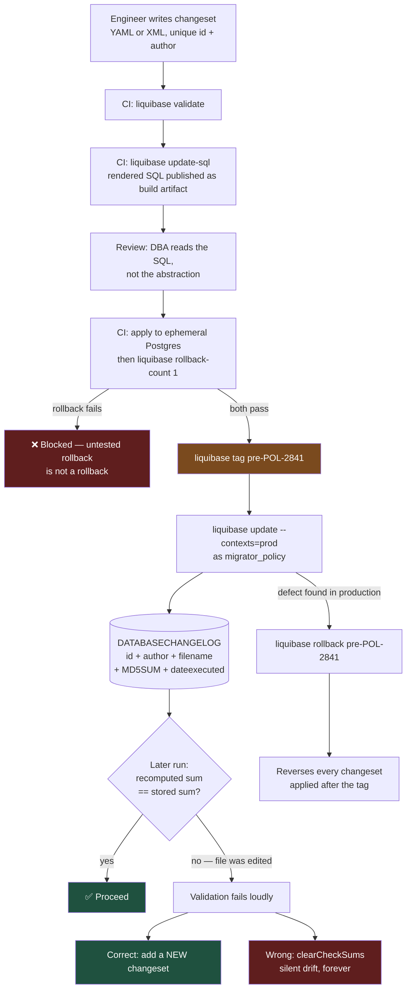

# YAML or XML: Choosing a Liquibase Dialect You Can Still Audit in 2030

The format argument is the least interesting part of Liquibase and the one teams spend the most time on. What actually determines whether your migrations survive five years of production is changeset identity, checksum discipline, and whether anyone ever tested the rollback.

## The Real-World Problem

A mid-size motor insurer adds automatic renewal to its policy administration system. The change is small: two new columns on `policy`, a check constraint, and an index to support the nightly renewal-notice job.

The changeset is written in XML, reviewed, and applied to development, then to the UAT environment on a Tuesday. On Wednesday, a business analyst points out that the renewal notice window should default to 21 days rather than 30 — regulatory guidance on notice periods for consumer motor policies. The engineer opens the changeset already applied to UAT and edits `defaultValueNumeric` from `30` to `21`. It is one character. The pull request is approved in four minutes.

The pipeline promotes to UAT and fails:

```
liquibase.exception.ValidationFailedException: Validation Failed:
  1 changesets check sum
    db/changelog/2026/policy-auto-renewal.xml::2026-03-11-add-auto-renewal::t.okafor
    was: 9:b4b0f6c9c1d3e0a7d2f5c88a1e33bb90
    now: 9:1f7c2ad4e9b6c015a83d40f2ce77aa61
```

The immediate response is the wrong one. Someone runs `liquibase clearCheckSums` against UAT to make the pipeline green. UAT now has `DEFAULT 30`, its checksum records say `21`, and nothing will ever detect the difference again. Production, never yet migrated, gets `DEFAULT 21`.

Six weeks later, renewal notices in UAT go out at the wrong interval during regulatory user-acceptance testing. The test evidence — which the insurer intended to submit as proof that the notice period was implemented correctly — is invalid, because the environment under test did not match production. Re-running the UAT cycle costs three weeks of an eight-week delivery window.

The one-character edit was correct. Editing an *applied* changeset was the defect, and `clearCheckSums` destroyed the only mechanism that would have kept it visible.

## The Concept

### The same change, in both dialects

This is the entire format comparison, and it is worth seeing before the arguments about it. The change: add auto-renewal support to `policy`.

**YAML:**

```yaml
# db/changelog/2026/policy-auto-renewal.yaml
databaseChangeLog:
  - changeSet:
      id: 2026-03-11-add-auto-renewal
      author: t.okafor
      labels: auto-renewal
      context: "!test"
      comment: "POL-2841 — auto-renewal opt-in and notice window on policy."
      preConditions:
        - onFail: HALT
        - tableExists:
            tableName: policy
        - not:
            - columnExists:
                tableName: policy
                columnName: auto_renewal_opt_in
      changes:
        - addColumn:
            tableName: policy
            columns:
              - column:
                  name: auto_renewal_opt_in
                  type: BOOLEAN
                  defaultValueBoolean: false
                  constraints:
                    nullable: false
              - column:
                  name: renewal_notice_days
                  type: SMALLINT
                  defaultValueNumeric: 21
                  constraints:
                    nullable: false
        - addCheckConstraint:
            tableName: policy
            constraintName: chk_policy_renewal_notice_days
            checkConstraint: "renewal_notice_days BETWEEN 14 AND 60"
        - createIndex:
            tableName: policy
            indexName: idx_policy_renewal_due
            columns:
              - column:
                  name: renewal_due_on
              - column:
                  name: auto_renewal_opt_in
      rollback:
        - dropIndex:
            tableName: policy
            indexName: idx_policy_renewal_due
        - dropColumn:
            tableName: policy
            columns:
              - column:
                  name: renewal_notice_days
              - column:
                  name: auto_renewal_opt_in
```

**XML — identical change, identical id and author:**

```xml
<?xml version="1.0" encoding="UTF-8"?>
<!-- db/changelog/2026/policy-auto-renewal.xml -->
<databaseChangeLog
    xmlns="http://www.liquibase.org/xml/ns/dbchangelog"
    xmlns:xsi="http://www.w3.org/2001/XMLSchema-instance"
    xsi:schemaLocation="http://www.liquibase.org/xml/ns/dbchangelog
        http://www.liquibase.org/xml/ns/dbchangelog/dbchangelog-4.31.xsd">

    <changeSet id="2026-03-11-add-auto-renewal" author="t.okafor"
               labels="auto-renewal" context="!test">
        <comment>POL-2841 — auto-renewal opt-in and notice window on policy.</comment>

        <preConditions onFail="HALT">
            <tableExists tableName="policy"/>
            <not>
                <columnExists tableName="policy" columnName="auto_renewal_opt_in"/>
            </not>
        </preConditions>

        <addColumn tableName="policy">
            <column name="auto_renewal_opt_in" type="BOOLEAN" defaultValueBoolean="false">
                <constraints nullable="false"/>
            </column>
            <column name="renewal_notice_days" type="SMALLINT" defaultValueNumeric="21">
                <constraints nullable="false"/>
            </column>
        </addColumn>

        <addCheckConstraint tableName="policy"
                            constraintName="chk_policy_renewal_notice_days"
                            checkConstraint="renewal_notice_days BETWEEN 14 AND 60"/>

        <createIndex tableName="policy" indexName="idx_policy_renewal_due">
            <column name="renewal_due_on"/>
            <column name="auto_renewal_opt_in"/>
        </createIndex>

        <rollback>
            <dropIndex tableName="policy" indexName="idx_policy_renewal_due"/>
            <dropColumn tableName="policy">
                <column name="renewal_notice_days"/>
                <column name="auto_renewal_opt_in"/>
            </dropColumn>
        </rollback>
    </changeSet>
</databaseChangeLog>
```

Same generated SQL, same checksum semantics, same `DATABASECHANGELOG` row. The choice is entirely about the humans and the tooling around the file.

### What actually differs

| Dimension | YAML | XML |
|---|---|---|
| **Schema validation before it runs** | None — a typo in `defaultValueBoolean` is silently ignored | XSD-validated; the IDE or build flags unknown elements immediately |
| **IDE autocomplete** | Little to none | Full, driven by the XSD |
| **Pull-request diffs** | Clean; a one-line change is one line | Noisier; nested elements and attribute reflow |
| **Whitespace sensitivity** | Indentation errors are easy to make and produce confusing failures | Structurally explicit; no indentation semantics |
| **Verbosity** | ~40% fewer lines for the same change | Verbose but self-documenting |
| **Ecosystem examples and vendor docs** | Present, less complete | The canonical form; every edge case is documented in XML first |
| **Comments** | `#` comments, natural | `<comment>` element plus XML comments |
| **New/uncommon change types** | Occasionally lags; attribute names must be looked up | Always covered by the current XSD |

Two honest rules follow. If your team ships schema changes weekly and reviews them in pull requests, YAML's diff quality is a real productivity gain and the missing XSD is manageable — provided CI validates. If your changelogs are reviewed by DBAs who are not primarily developers, or you use uncommon change types, XML's validation and autocomplete are worth the verbosity. What you must not do is mix dialects within one changelog tree; pick one for the root and its includes.

### The XSD gap is closable — close it

The reason YAML feels risky is that a misspelled attribute is silently ignored. Fix it in CI rather than accepting it:

```bash
# CI: fail on anything Liquibase cannot resolve, before it touches a real database.
liquibase --changelog-file=db/changelog/db.changelog-master.yaml validate
liquibase --changelog-file=db/changelog/db.changelog-master.yaml update-sql > /tmp/plan.sql
grep -qi 'auto_renewal_opt_in' /tmp/plan.sql || { echo "expected change missing"; exit 1; }
```

`validate` catches structural problems and duplicate changeset identities. `update-sql` is the stronger check: it renders the exact SQL, so a reviewer sees what will run, and CI can assert that the change is present. Publish that rendered SQL as a build artifact — it is also the review evidence a change board will ask for.

### Formatted SQL: the third option, and when it is the right one

```sql
--liquibase formatted sql

--changeset t.okafor:2026-03-11-add-auto-renewal labels:auto-renewal context:!test
--comment POL-2841 — auto-renewal opt-in and notice window on policy.
--preconditions onFail:HALT
--precondition-sql-check expectedResult:0 SELECT count(*) FROM information_schema.columns WHERE table_name='policy' AND column_name='auto_renewal_opt_in'
ALTER TABLE policy
    ADD COLUMN auto_renewal_opt_in BOOLEAN  NOT NULL DEFAULT false,
    ADD COLUMN renewal_notice_days SMALLINT NOT NULL DEFAULT 21;

ALTER TABLE policy
    ADD CONSTRAINT chk_policy_renewal_notice_days
    CHECK (renewal_notice_days BETWEEN 14 AND 60);
--rollback ALTER TABLE policy DROP CONSTRAINT chk_policy_renewal_notice_days;
--rollback ALTER TABLE policy DROP COLUMN renewal_notice_days, DROP COLUMN auto_renewal_opt_in;

--changeset t.okafor:2026-03-11-renewal-due-index runInTransaction:false
CREATE INDEX CONCURRENTLY idx_policy_renewal_due ON policy (renewal_due_on, auto_renewal_opt_in);
--rollback DROP INDEX CONCURRENTLY idx_policy_renewal_due;
```

Formatted SQL is the right answer in three situations, and only these:

1. **The change cannot be expressed in Liquibase's abstraction** — `CREATE INDEX CONCURRENTLY`, `ADD CONSTRAINT ... NOT VALID`, partition attach/detach, exclusion constraints, `GENERATED ALWAYS AS ... STORED`.
2. **A DBA must review the literal SQL** and will not accept "trust the generated form".
3. **You are single-database and will stay that way.** Formatted SQL gives up Liquibase's database portability entirely — which, for a bank standardised on PostgreSQL for the next decade, costs nothing.

Note `runInTransaction:false` on the concurrent index. PostgreSQL cannot build an index concurrently inside a transaction, and Liquibase wraps changesets in one by default. Forgetting this attribute is the single most common concurrent-index failure.

### Changeset identity: id + author + filename

The primary key of `DATABASECHANGELOG` is `(ID, AUTHOR, FILENAME)`. Three consequences that bite in practice:

- **Renaming or moving a changelog file re-runs every changeset in it.** Use `logicalFilePath` on the changelog if you must reorganise, or accept that the file path is now part of your production schema history.
- **`id: 1` is malpractice.** Use `<date>-<slug>` (`2026-03-11-add-auto-renewal`) or `<ticket>-<n>` (`POL-2841-1`). It must be unique, meaningful in a log line, and greppable back to a ticket.
- **`author` is the person, not the team.** It appears in every validation error and every audit extract. A shared `dev` author makes the history useless for attribution — see [04-ddl-vs-dml-roles-and-ownership.md](04-ddl-vs-dml-roles-and-ownership.md).

**One logical change per changeset.** Liquibase's transaction boundary is the changeset. A changeset containing five `addColumn` operations that fails on the fourth leaves — on PostgreSQL — nothing applied but a confusing log; on MySQL 8, where DDL is not transactional, it leaves three columns added and no `DATABASECHANGELOG` row, which is the worst state possible.

### Checksums, and why you never edit an applied changeset

Liquibase stores an `MD5SUM` of each changeset's normalised content in `DATABASECHANGELOG`. On every `update` it recomputes and compares. A mismatch means the file no longer describes what was applied — the exact condition that makes a schema history untrustworthy.

| Situation | Correct action |
|---|---|
| Changeset applied only to your local database | Drop the local DB, edit freely, re-run |
| Changeset applied to a shared environment (dev/UAT/prod) | **Write a new changeset.** Never edit the old one |
| Genuinely cosmetic edit — a typo in `<comment>`, reformatting | Add `validCheckSum` for the old sum, or better, leave it alone |
| The database was changed outside Liquibase and now matches | `changelog-sync-force` for that changeset only, recorded in a ticket |
| CI is red and you want it green | **Not `clearCheckSums`.** That is what destroyed the evidence above |

`clearCheckSums` recomputes every checksum from the current file contents, asserting that the files are correct without checking anything. It converts a loud, specific, fixable failure into permanent silent drift. Ban it in production and staging; in CI, allow it only against ephemeral databases.

The correct fix for the insurer's problem was a second changeset:

```yaml
  - changeSet:
      id: 2026-03-12-renewal-notice-days-default-21
      author: t.okafor
      comment: "POL-2841 — notice window 30 → 21 days per FCA consumer motor guidance."
      changes:
        - sql:
            sql: "ALTER TABLE policy ALTER COLUMN renewal_notice_days SET DEFAULT 21;"
        - update:
            tableName: policy
            columns:
              - column: { name: renewal_notice_days, valueNumeric: 21 }
            where: "renewal_notice_days = 30"
      rollback:
        - sql:
            sql: "ALTER TABLE policy ALTER COLUMN renewal_notice_days SET DEFAULT 30;"
```

Two changesets and a visible history beats one changeset and a lie. And the history is now the audit answer: the notice period changed on 2026-03-12, for this stated reason, applied to these environments at these times.

### `contexts` and `labels` are not interchangeable

| Feature | Evaluated | Use for |
|---|---|---|
| **`context`** | Boolean expression against the runtime `--contexts` flag | *Whether* a changeset runs at all in this environment: seed data in dev, tuning that only applies to prod |
| **`labels`** | Matched against `--label-filter` at run time | *Selecting* a subset of otherwise-eligible changesets: a feature, a release, a hotfix slice |

Rules that keep this from becoming a mess: never put a structural change behind a context. If a column exists in production but not in UAT because of a context expression, you no longer have one schema — you have two, and your test evidence is worthless. Contexts are for data and for non-structural settings only.

```yaml
  # Reference data the insurer's test suite needs; never in a real environment.
  - changeSet:
      id: 2026-03-11-seed-renewal-test-policies
      author: t.okafor
      context: "dev or test"
      changes:
        - loadData:
            tableName: policy
            file: db/data/dev/policy-renewal-fixtures.csv
            encoding: UTF-8
```

### Preconditions are the guard, not the comment

A precondition turns an assumption into an enforced check. `onFail: HALT` stops the run; `MARK_RAN` records the changeset as applied without executing it — useful for a change already made manually; `CONTINUE` skips it and retries next time. Use `HALT` unless you can articulate why not.

The two preconditions worth putting on almost every risky changeset:

```yaml
      preConditions:
        - onFail: HALT
        - onFailMessage: "policy has unmigrated rows — backfill has not completed."
        - sqlCheck:
            expectedResult: 0
            sql: "SELECT count(*) FROM policy WHERE renewal_notice_days IS NULL"
        - runningAs:
            username: migrator_policy      # never the application role
```

## How It Works



The two gates that carry the weight: CI proves the rollback works before the change is allowed near production, and the checksum comparison makes any later edit impossible to hide.

## Practical Example

**Master changelog — one dialect, ordered includes, no wildcards in production:**

```yaml
# db/changelog/db.changelog-master.yaml
databaseChangeLog:
  - includeAll:
      path: db/changelog/2025
      relativeToChangelogFile: false
      errorIfMissingOrEmpty: true
  - include:
      file: db/changelog/2026/policy-auto-renewal.yaml
  - include:
      file: db/changelog/2026/policy-renewal-notice-default.yaml
  - include:
      file: db/changelog/2026/policy-renewal-index.yaml
```

`includeAll` is convenient and orders alphabetically — which means a filename typo silently reorders your migrations. Use it for closed historical years; use explicit `include` for the year you are actively shipping.

**Spring Boot 3.x wiring, with the app not migrating itself:**

```yaml
# application.yml
spring:
  liquibase:
    enabled: false                 # CD applies migrations; see 04-ddl-vs-dml
  jpa:
    hibernate:
      ddl-auto: validate           # fail at startup if the schema disagrees with the entities
```

```properties
# liquibase.properties — used by the pipeline, not the application
changelogFile=db/changelog/db.changelog-master.yaml
url=jdbc:postgresql://policy-db.prod.internal:5432/policy_admin
username=migrator_policy
liquibase.hub.mode=off
liquibase.showBanner=false
```

`ddl-auto: validate` matters here: it is the cheap check that catches a migration the pipeline applied but the entity model does not expect, at startup, before traffic arrives.

**The rollback strategy — four mechanisms, in order of preference.**

*1. Explicit `rollback` blocks.* Liquibase auto-generates a rollback for `addColumn`, `createTable`, `createIndex`, and similar additive changes. It generates nothing for `sql`, `update`, `delete`, `dropColumn`, or `dropTable`. Write the block yourself for anything in that second group — and if it is genuinely irreversible, say so explicitly:

```yaml
  - changeSet:
      id: 2026-03-14-archive-lapsed-policy-notes
      author: t.okafor
      comment: "POL-2903 — GDPR retention: purge free-text notes on policies lapsed >7y."
      changes:
        - sql:
            sql: |
              UPDATE policy_note SET body = NULL, redacted_at = now()
               WHERE policy_id IN (SELECT id FROM policy
                                    WHERE status = 'LAPSED'
                                      AND lapsed_on < now() - INTERVAL '7 years');
      rollback:
        - empty:
            # Deliberately irreversible. Retention purge under GDPR Art. 5(1)(e);
            # restoring the text would recreate data we are required to have erased.
            # Recovery path if applied in error: PITR restore, approved by DPO. POL-2903.
```

An `empty` rollback with a stated reason is honest engineering. An *absent* rollback that Liquibase cannot auto-generate is a rollback that fails at 03:00 during an incident.

*2. `rollback-sql` — generate and read it before you need it.* Never discover during an incident what a rollback will do:

```bash
liquibase rollback-sql --tag=pre-POL-2841 > evidence/POL-2841-rollback.sql
```

Attach that file to the change record. It is both a review artifact and a runbook.

*3. `tag-database` then `rollback <tag>` — the operational pattern.* Tag immediately before every production run:

```bash
# Pre-deploy
liquibase tag pre-POL-2841
liquibase update --contexts=prod --label-filter=auto-renewal

# If the release is pulled
liquibase rollback pre-POL-2841
```

`rollback <tag>` reverses, in reverse order, every changeset applied after that tag. `rollback-count 1` reverses only the last one — useful in CI, dangerous in production because "the last one" depends on what actually got applied.

*4. Point-in-time recovery.* The backstop for everything below. It is not a rollback strategy; it is a data-loss strategy, because restoring the database to 02:55 discards every transaction after 02:55. In a policy system that means lost quotes and bindings. Treat PITR as the answer to "the migration corrupted data", never to "the release was wrong".

**What is genuinely irreversible — be honest about this list:**

| Change | Why it cannot be undone | What to do instead |
|---|---|---|
| `DROP COLUMN` / `DROP TABLE` | The data is gone; a rollback recreates an empty structure | Expand/contract — see [06-schema-migrations-in-a-regulated-environment.md](06-schema-migrations-in-a-regulated-environment.md) |
| Destructive `UPDATE` (truncation, rounding, redaction) | Pre-change values were not captured | Snapshot table first, or an additive corrective row |
| Type narrowing (`VARCHAR(200)` → `VARCHAR(50)`) | Truncated characters are unrecoverable | New column, backfill, verify, contract |
| `DELETE` without a snapshot | Rows are gone | Soft delete, or capture into a quarantine table |
| GDPR erasure | Reversing it would be a fresh breach | `empty` rollback with a documented reason |
| Anything already read by a downstream consumer | The side effect has escaped your database | Compensating event, not a rollback |

The pattern in that list: **irreversibility comes from destroying information, not from changing structure.** Every additive change is reversible. That is the whole reason expand/contract exists.

## Enterprise Trade-offs

| Approach | Pros | Cons | When to use (Banking / Insurance / Enterprise) |
|---|---|---|---|
| **YAML changelogs** | Terse; clean PR diffs; pleasant to review at volume | No XSD validation — typos silently ignored; indentation errors | Teams shipping schema changes weekly, reviewing in Git, with `validate` and `update-sql` enforced in CI |
| **XML changelogs** | XSD validation and IDE autocomplete; canonical in docs; every change type covered | Verbose; noisier diffs | DBA-reviewed changelogs, uncommon change types, or where a non-developer must edit them confidently |
| **Formatted SQL changelogs** | Exact SQL, reviewable by any DBA; expresses `CONCURRENTLY`, `NOT VALID`, partitioning | Loses database portability; rollback must be hand-written | PostgreSQL-only estates, and mandatory for changes Liquibase cannot abstract |
| **Mixed dialects in one tree** | — | Two mental models, two failure modes, reordered includes | Never within a changelog tree; one dialect per repository |
| **Tag before every prod run + rehearsed `rollback <tag>`** | Reversal is a known command with known output; timed and evidenced | Only reverses what has a real rollback block | Every regulated production deployment, without exception |
| **`clearCheckSums` to fix a red pipeline** | — | Permanent, undetectable environment drift; the scenario above | Never against a shared or production database |

## Why This Still Matters Through 2030

Schema migration tooling has already converged on the same small set of ideas — an ordered, immutable, checksummed history table applied by a pipeline — and nothing on the horizon changes that, because the requirement it serves is regulatory rather than technical. A supervisor asking when a column's default changed, who approved it, and whether UAT matched production is asking to read `DATABASECHANGELOG`, and that answer is only worth having if the checksums were never cleared. The tools will keep improving around the edges: Liquibase's policy checks and drift detection are maturing into real CI gates, generated migrations from entity models are getting better, and AI assistants will happily draft a changeset from a Jira ticket in seconds. All of that increases the value of the discipline rather than replacing it, because a generated changeset still needs a unique id, a real author, a rollback that was actually executed in CI, and a reviewer who read the rendered SQL. The format question will stay a matter of team preference. The immutability of an applied changeset will not.

→ Next: [06-schema-migrations-in-a-regulated-environment.md](06-schema-migrations-in-a-regulated-environment.md) · Related: [../10-example-code/spring-boot/liquibase-changelog-example.md](../10-example-code/spring-boot/liquibase-changelog-example.md) · [../00-project-setup-roadmap/05-ci-pipeline.md](../00-project-setup-roadmap/05-ci-pipeline.md)
