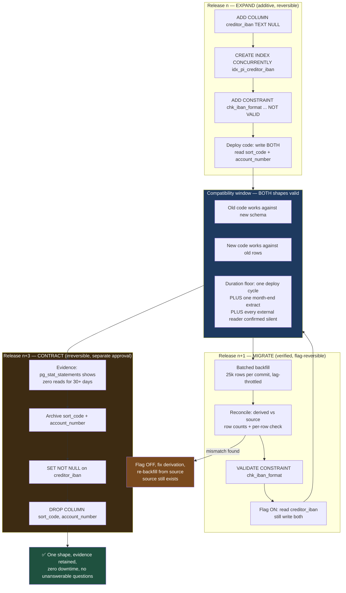

# Three Deploys, One Column: Zero-Downtime Migration When an Auditor Is Watching

Expand/contract is usually sold as an availability technique. Its more important property is evidential: every intermediate state is reversible, and the original value survives long enough to prove the new one was derived correctly. `DROP COLUMN` destroys both guarantees in a single statement.

## The Real-World Problem

A bank's payments platform stores outbound instructions as a domestic sort code and account number. Regulatory and scheme changes require IBAN on every instruction. The `payment_instruction` table holds 61 million rows across seven years of retention.

The plan is sensible on paper: add `creditor_iban`, derive it from `sort_code` and `account_number`, switch the code, drop the old columns. It is executed in one release over a Saturday window.

Three things go wrong, in order.

**The backfill takes a lock.** A single `UPDATE payment_instruction SET creditor_iban = ...` runs for 51 minutes, takes row locks across the whole table, generates 74 GB of WAL, and pushes standby replica lag to 34 minutes — past the documented recovery-point objective for a payment system, which is itself a reportable event.

**The contract step runs anyway.** With the window overrunning, the team drops `sort_code` and `account_number` in the same release to avoid scheduling a second change board. The release is declared complete at 04:50.

**Eleven days later, finance finds 4,187 wrong IBANs.** The check-digit derivation mishandled sort codes belonging to two building societies that had migrated to a new sorting-code range. The instructions are structurally valid IBANs pointing at the wrong institution. Thirty-one payments have already been dispatched.

Now the questions arrive, and none of them are about downtime:

- *"Show me the sort code and account number for these 4,187 instructions before the migration."* They cannot. The columns are gone.
- *"Re-derive the correct IBAN from source."* They cannot. The source was the dropped columns.
- *"Roll back the release."* They cannot. The rollback recreates two empty columns.
- *"Reconcile the migrated data against the pre-migration state."* They cannot, because no verified row-count or checksum evidence was produced at the time.

The recovery path is a point-in-time restore of a 4 TB database into a side environment, extracting 4,187 rows, re-deriving, and posting corrections — nineteen days of work. The audit finding is not "the derivation had a bug". Bugs are expected. The findings are **loss of the source record for a regulated field during a change**, **inability to reverse an applied change**, and **absence of verification evidence for a data transformation affecting payment instructions**.

A correct derivation would have hidden all three problems for years. The migration pattern, not the bug, was the control failure.

## The Concept

### The three deploys, and what each one may contain

| Deploy | Schema change | Code change | Reversible by |
|---|---|---|---|
| **1 — Expand** | Add the new column, nullable, no default that rewrites the table. Add indexes `CONCURRENTLY`. Add constraints `NOT VALID` | Dual-write: write both columns. Read the old one | Redeploying previous code. Schema needs no change — it is additive |
| **2 — Migrate** | Batched backfill. `VALIDATE CONSTRAINT`. Only then `SET NOT NULL` | Read the new column, still write both | A feature flag flip, in seconds |
| **3 — Contract** | Drop the old column — after the retention question has been answered | Stop writing the old column | Nothing. This step is deliberately the only irreversible one, and it is scheduled separately |

The discipline: **deploy 3 never shares a release with deploy 1 or 2.** The moment they share a release, you have recreated the incident above.

### The compatibility window, and how long it must actually be

The compatibility window is the period during which both the old and new shapes are valid — old code can run against the new schema, and new code can run against data written by old code. Teams routinely make it too short. The floor is **one full deploy cycle**, and here is why each word matters.

Your rollback target must remain deployable. If you deploy on Tuesday and could be asked on Thursday to roll back to last week's build, that build must still work against the current schema. A window shorter than your rollback horizon means your rollback is theoretical.

Beyond that floor, the window must outlast every consumer that is not in your release train:

| Consumer | Window it forces |
|---|---|
| Your own service, rolling deploy | Minutes — two versions run simultaneously during the rollout |
| Your rollback horizon | One full deploy cycle, minimum |
| Another team's service reading the same table | Their release cycle, not yours — confirm, do not assume |
| Nightly batch / reconciliation jobs | At least one successful run observed |
| Month-end or quarter-end regulatory extract | **One full reporting period** — this is usually the binding constraint |
| Analytics / reverse-ETL pipelines, BI reports | Their refresh and change cycle; frequently the last thing anyone checks |
| Restore-from-backup during DR test | Your backup retention — a restored older backup must still work with current code |

In a bank, that arithmetic usually lands at **one full month-end plus one deploy cycle**, so expand in release *n*, migrate in *n+1*, contract no earlier than *n+3*. Anyone arguing for a shorter window has to name every reader of the column, and the honest way to settle that argument is evidence rather than opinion — instrument reads before you plan the contract:

```sql
-- Postgres 16/17: is anything still reading the old columns?
-- Requires pg_stat_statements; run for the full window before contracting.
SELECT calls, rows, mean_exec_time, left(query, 120) AS query
  FROM pg_stat_statements
 WHERE query ILIKE '%sort_code%' OR query ILIKE '%account_number%'
 ORDER BY calls DESC;
```

Zero calls across a whole month-end is evidence. "We grepped the repositories" is not, because it does not cover the other team's service, the BI tool, or the stored report someone built in 2021.

### Long locks are the availability risk, and they are avoidable

Almost every migration outage is one statement holding a lock longer than expected. The specific traps in PostgreSQL 16/17:

| Operation | Lock | Safe form |
|---|---|---|
| `ADD COLUMN ... NULL` | `ACCESS EXCLUSIVE`, metadata only | Safe — instant |
| `ADD COLUMN ... NOT NULL DEFAULT x` | Metadata only since PG 11 | Safe in PG 11+; rewrites the whole table in PG ≤10 and in MySQL 8 |
| `ALTER COLUMN ... SET NOT NULL` | `ACCESS EXCLUSIVE` + full scan | Add a `CHECK (col IS NOT NULL) NOT VALID`, `VALIDATE`, then `SET NOT NULL` — the scan is skipped |
| `ADD CONSTRAINT` (FK or CHECK) | `ACCESS EXCLUSIVE` + full scan | `NOT VALID` first, `VALIDATE CONSTRAINT` second |
| `CREATE INDEX` | Blocks writes for the whole build | `CREATE INDEX CONCURRENTLY`, outside a transaction |
| `UPDATE` across the whole table | Row locks + huge WAL + replica lag | Batched loop with a commit per batch |
| `ALTER COLUMN TYPE` | Full table rewrite | New column + backfill + swap. Never in place on a large table |

Two settings turn "the migration blocked the application" into "the migration failed fast and was retried":

```sql
SET lock_timeout      = '3s';     -- give up waiting for the lock; do not queue ahead of queries
SET statement_timeout = '30s';    -- a DDL statement that runs long is a statement to abandon
```

`lock_timeout` is the more important of the two, and the reason is non-obvious. When your `ALTER TABLE` waits for a lock, it queues — and every query arriving *behind* it also queues, even simple `SELECT`s that would otherwise be unaffected. One blocked DDL statement stalls the entire table. With `lock_timeout = '3s'` the migration gives up in three seconds and the pipeline retries, instead of taking the application down while it waits.

### Batched backfills

A backfill must be a loop with a commit per batch, keyset-paginated, with a progress record so it is resumable and observable. Four properties, all non-negotiable:

- **Bounded batches** — 5,000–50,000 rows, sized so each batch commits in under a second.
- **Keyset pagination, not `OFFSET`** — `WHERE id > :last_id ORDER BY id LIMIT :n`. `OFFSET` degrades quadratically.
- **Committed per batch** — so WAL is recycled, replicas keep up, and autovacuum can reclaim dead tuples as you go.
- **Resumable** — progress persisted, so a failure at 60% resumes at 60% rather than restarting.

Add a throttle that watches replica lag. A backfill that outruns replication breaches your RPO just as effectively as a single giant `UPDATE`.

### Why "just drop the column" fails an audit

The availability argument is the weak one. The four real ones:

1. **Retention.** A field used to derive a regulated record is part of that record's provenance. Dropping it inside the retention period destroys data you were required to keep.
2. **Reconstructability.** The auditor's question is "show me the value before the change". A `DROP` makes it unanswerable without a database restore.
3. **Reversibility.** Additive changes are reversible; destructive ones are not. A change control process that requires a documented reversal path cannot approve a `DROP` that has none.
4. **Verification.** You cannot verify a transformation after deleting its input. The reconciliation that catches a 4,187-row derivation bug requires both sides to exist simultaneously.

None of this means the column lives forever. It means the drop is its **own** change, with its own approval, after evidence that nothing reads it, after the transformation has been reconciled, and after retention has been satisfied — often by archiving the old values rather than deleting them:

```sql
-- The contract step that an auditor will accept: archive, then drop.
CREATE TABLE payments.payment_instruction_pre_iban_archive (
    payment_instruction_id UUID        PRIMARY KEY,
    sort_code              CHAR(6)     NOT NULL,
    account_number         CHAR(8)     NOT NULL,
    derived_iban           TEXT        NOT NULL,
    archived_at            TIMESTAMPTZ NOT NULL DEFAULT now(),
    archive_reference      TEXT        NOT NULL   -- PAY-5120 / CAB-2026-0488
);
```

## How It Works



The branch labelled *mismatch found* is the one the incident lacked. It only exists because the source columns are still there in release *n+1*.

## Practical Example

**Release *n* — expand. Additive, and every statement is either instant or concurrent:**

```sql
--liquibase formatted sql

--changeset m.lim:PAY-5120-1-add-creditor-iban
--comment PAY-5120 EXPAND: nullable, metadata-only, old code unaffected.
SET lock_timeout = '3s';
ALTER TABLE payments.payment_instruction ADD COLUMN creditor_iban TEXT NULL;
--rollback ALTER TABLE payments.payment_instruction DROP COLUMN creditor_iban;

--changeset m.lim:PAY-5120-2-iban-index runInTransaction:false
--comment CONCURRENTLY: must not be wrapped in a transaction.
CREATE INDEX CONCURRENTLY IF NOT EXISTS idx_pi_creditor_iban
    ON payments.payment_instruction (creditor_iban)
    WHERE creditor_iban IS NOT NULL;
--rollback DROP INDEX CONCURRENTLY IF EXISTS idx_pi_creditor_iban;

--changeset m.lim:PAY-5120-3-iban-format-not-valid
--comment NOT VALID: enforced on new writes immediately, no scan of 61M rows.
ALTER TABLE payments.payment_instruction
    ADD CONSTRAINT chk_creditor_iban_format
    CHECK (creditor_iban IS NULL OR creditor_iban ~ '^[A-Z]{2}[0-9]{2}[A-Z0-9]{11,30}$')
    NOT VALID;
--rollback ALTER TABLE payments.payment_instruction DROP CONSTRAINT chk_creditor_iban_format;
```

A concurrent index can fail and leave an `INVALID` index behind. Detect and clean it rather than discovering it during the next release:

```sql
SELECT c.relname, i.indisvalid
  FROM pg_class c JOIN pg_index i ON i.indexrelid = c.oid
 WHERE NOT i.indisvalid AND c.relname LIKE 'idx_pi_%';
-- then: DROP INDEX CONCURRENTLY <name>;  and re-create
```

**The progress table — the difference between a resumable job and a nightly gamble:**

```sql
CREATE TABLE payments.backfill_progress (
    job_name        TEXT        PRIMARY KEY,
    reference       TEXT        NOT NULL,          -- PAY-5120
    last_id         UUID,                          -- keyset cursor
    rows_processed  BIGINT      NOT NULL DEFAULT 0,
    rows_expected   BIGINT      NOT NULL,
    batches         INT         NOT NULL DEFAULT 0,
    started_at      TIMESTAMPTZ NOT NULL DEFAULT now(),
    updated_at      TIMESTAMPTZ NOT NULL DEFAULT now(),
    completed_at    TIMESTAMPTZ,
    status          TEXT        NOT NULL DEFAULT 'RUNNING'
        CHECK (status IN ('RUNNING','PAUSED','COMPLETED','FAILED')),
    last_error      TEXT
);

INSERT INTO payments.backfill_progress (job_name, reference, rows_expected)
SELECT 'pay5120_creditor_iban', 'PAY-5120', count(*)
  FROM payments.payment_instruction WHERE creditor_iban IS NULL;
```

**The batching loop.** A PostgreSQL procedure — procedures may `COMMIT`, functions may not, and the commit per batch is the entire point:

```sql
CREATE OR REPLACE PROCEDURE payments.backfill_creditor_iban(
    p_batch_size   INT      DEFAULT 25000,
    p_max_lag      INTERVAL DEFAULT INTERVAL '20 seconds',
    p_max_batches  INT      DEFAULT NULL          -- NULL = run to completion
)
LANGUAGE plpgsql AS $$
DECLARE
    v_last_id   UUID;
    v_batch     INT := 0;
    v_affected  INT;
    v_lag       INTERVAL;
BEGIN
    SELECT last_id INTO v_last_id
      FROM payments.backfill_progress
     WHERE job_name = 'pay5120_creditor_iban';

    LOOP
        EXIT WHEN p_max_batches IS NOT NULL AND v_batch >= p_max_batches;

        -- Throttle on replica lag. Outrunning replication breaches the RPO
        -- exactly as a single 51-minute UPDATE did.
        SELECT COALESCE(max(now() - reply_time), INTERVAL '0') INTO v_lag
          FROM pg_stat_replication;
        IF v_lag > p_max_lag THEN
            RAISE NOTICE 'PAY-5120: replica lag % — pausing 30s', v_lag;
            PERFORM pg_sleep(30);
            CONTINUE;
        END IF;

        -- Fail fast rather than queue ahead of application queries.
        SET LOCAL lock_timeout      = '3s';
        SET LOCAL statement_timeout = '60s';

        WITH batch AS (
            SELECT id, sort_code, account_number
              FROM payments.payment_instruction
             WHERE creditor_iban IS NULL
               AND (v_last_id IS NULL OR id > v_last_id)
             ORDER BY id                       -- keyset, never OFFSET
             LIMIT p_batch_size
             FOR UPDATE SKIP LOCKED            -- never block a live payment write
        ), updated AS (
            UPDATE payments.payment_instruction pi
               SET creditor_iban = payments.derive_gb_iban(b.sort_code, b.account_number)
              FROM batch b
             WHERE pi.id = b.id
            RETURNING pi.id
        )
        SELECT count(*), max(id) INTO v_affected, v_last_id FROM updated;

        EXIT WHEN v_affected = 0;
        v_batch := v_batch + 1;

        UPDATE payments.backfill_progress
           SET last_id        = v_last_id,
               rows_processed = rows_processed + v_affected,
               batches        = batches + 1,
               updated_at     = now()
         WHERE job_name = 'pay5120_creditor_iban';

        COMMIT;   -- WAL recycled, locks released, autovacuum can keep up
        PERFORM pg_sleep(0.1);
    END LOOP;

    UPDATE payments.backfill_progress
       SET status = 'COMPLETED', completed_at = now()
     WHERE job_name = 'pay5120_creditor_iban';
END $$;
```

Driven from Liquibase, outside a transaction, in resumable slices:

```sql
--changeset m.lim:PAY-5120-4-backfill runInTransaction:false
--comment MIGRATE: resumable, lag-throttled, commits per 25k rows.
CALL payments.backfill_creditor_iban(p_batch_size => 25000);
--rollback UPDATE payments.payment_instruction SET creditor_iban = NULL;
```

**Reconciliation — run before the flag flips, while the source still exists:**

```sql
-- Any row returned is a defect. This is the query that would have caught 4,187 rows
-- eleven days early — and it is only possible because sort_code still exists.
SELECT pi.id, pi.sort_code, pi.account_number, pi.creditor_iban,
       payments.derive_gb_iban(pi.sort_code, pi.account_number) AS expected_iban
  FROM payments.payment_instruction pi
 WHERE pi.creditor_iban IS DISTINCT FROM
       payments.derive_gb_iban(pi.sort_code, pi.account_number)
 LIMIT 100;

-- And the counts, recorded as evidence.
SELECT count(*)                                        AS total_rows,
       count(creditor_iban)                            AS migrated_rows,
       count(*) - count(creditor_iban)                 AS remaining_rows,
       md5(string_agg(creditor_iban, '' ORDER BY id))  AS migrated_checksum
  FROM payments.payment_instruction;
```

**Then, and only then, tighten the constraints:**

```sql
--changeset m.lim:PAY-5120-5-validate runInTransaction:false
--preconditions onFail:HALT
--precondition-sql-check expectedResult:0 SELECT count(*) FROM payments.payment_instruction WHERE creditor_iban IS NULL
ALTER TABLE payments.payment_instruction VALIDATE CONSTRAINT chk_creditor_iban_format;

--changeset m.lim:PAY-5120-6-not-null
--comment SET NOT NULL skips the full scan because a validated NOT NULL check exists.
ALTER TABLE payments.payment_instruction
    ADD CONSTRAINT chk_creditor_iban_present CHECK (creditor_iban IS NOT NULL) NOT VALID;
--rollback ALTER TABLE payments.payment_instruction DROP CONSTRAINT chk_creditor_iban_present;
```

**Release *n+3* — contract, with the precondition that makes it auditable:**

```sql
--changeset m.lim:PAY-5120-9-archive-then-drop
--comment CONTRACT: PAY-5120 / CAB-2026-0488. Separate change board approval.
--preconditions onFail:HALT
--precondition-sql-check expectedResult:0 SELECT count(*) FROM payments.payment_instruction WHERE creditor_iban IS NULL
INSERT INTO payments.payment_instruction_pre_iban_archive
       (payment_instruction_id, sort_code, account_number, derived_iban, archive_reference)
SELECT id, sort_code, account_number, creditor_iban, 'PAY-5120/CAB-2026-0488'
  FROM payments.payment_instruction;

ALTER TABLE payments.payment_instruction
    DROP COLUMN sort_code,
    DROP COLUMN account_number;
--rollback ALTER TABLE payments.payment_instruction ADD COLUMN sort_code CHAR(6), ADD COLUMN account_number CHAR(8);
--rollback UPDATE payments.payment_instruction pi SET sort_code = a.sort_code, account_number = a.account_number FROM payments.payment_instruction_pre_iban_archive a WHERE a.payment_instruction_id = pi.id;
```

Because the archive exists, this drop has a genuine rollback. That is the difference between a destructive change and an irreversible one.

**The dual-write code, flag-controlled — release matters more than deploy here:**

```java
@Service
class CreditorAccountWriter {

    private final FeatureFlags flags;
    private final IbanDerivation ibans;

    void apply(PaymentInstructionRow row, CreditorAccount account) {
        // Written in every release from n through n+2: old readers keep working.
        row.setSortCode(account.sortCode());
        row.setAccountNumber(account.accountNumber());
        row.setCreditorIban(ibans.derive(account));
    }

    CreditorAccount read(PaymentInstructionRow row) {
        // Reversal is a flag flip measured in seconds, not a deployment.
        return flags.isEnabled("PAY_5120_READ_IBAN")
            ? CreditorAccount.fromIban(row.getCreditorIban())
            : CreditorAccount.ofDomestic(row.getSortCode(), row.getAccountNumber());
    }
}
```

**Dry-run against production-shaped volume — the step that predicts the 51-minute lock:**

```bash
#!/usr/bin/env bash
# ci/migration-dryrun.sh — runs on every PR touching db/changelog/**
set -euo pipefail

# 1. Restore the most recent masked production snapshot. Full volume: 61M rows.
#    Not 10k seeded rows — the whole point is to measure at real scale.
pg_restore -d dryrun_payments /snapshots/payments-masked-latest.dump

# 2. Render the SQL for review and as change-board evidence.
liquibase --url=jdbc:postgresql://localhost/dryrun_payments \
          --username=migrator_payments update-sql > evidence/PAY-5120-forward.sql

# 3. Apply, timed, with a hard ceiling. Exceeding the window fails the build.
START=$(date +%s)
liquibase --url=jdbc:postgresql://localhost/dryrun_payments \
          --username=migrator_payments update
ELAPSED=$(( $(date +%s) - START ))
echo "migration_duration_seconds=${ELAPSED}" | tee -a evidence/PAY-5120-metrics.txt
[ "${ELAPSED}" -lt 900 ] || { echo "FAIL: exceeded 15-minute budget"; exit 1; }

# 4. Longest lock held during the run — captured by a sampler started beforehand.
psql -d dryrun_payments -Atc "SELECT max(duration_ms) FROM ops.lock_samples" \
  | tee -a evidence/PAY-5120-metrics.txt

# 5. Prove the rollback works. An untested rollback is not a rollback.
liquibase --url=jdbc:postgresql://localhost/dryrun_payments \
          --username=migrator_payments rollback --tag=pre-PAY-5120
liquibase --url=jdbc:postgresql://localhost/dryrun_payments \
          --username=migrator_payments update    # forward again — proves idempotence
```

**The evidence artifact.** Every production migration produces this, generated by the pipeline rather than written by hand:

```yaml
# evidence/PAY-5120-expand.yaml — attached to the change record
migration:
  reference:        PAY-5120
  step:             EXPAND (1 of 3)
  changelog:        db/changelog/2026/pay-5120-expand.sql
  changesets:       [PAY-5120-1, PAY-5120-2, PAY-5120-3]
approval:
  change_board:     CAB-2026-0431
  approved_by:      [a.mensah (DBA), r.iqbal (payments lead)]
  approved_at:      "2026-04-08T14:12:00Z"
  code_review_pr:   "#4471"
  reviewers:        [data-platform, payments-team]
execution:
  applied_by:       migrator_payments        # pipeline identity, never a person
  pipeline_run:     gh-actions/18442917
  applied_at:       "2026-04-09T21:05:11Z"
  duration_seconds: 41
  longest_lock_ms:  180
  forward_sql:      evidence/PAY-5120-forward.sql     # sha256:4c9a…
  rollback_sql:     evidence/PAY-5120-rollback.sql    # sha256:e17b…
verification:
  rows_before:      61_402_887
  rows_after:       61_402_887
  new_column_nulls: 61_402_887               # expected — backfill is release n+1
  constraint_state: "chk_creditor_iban_format: NOT VALID (intended at this step)"
  replica_lag_peak: "1.2s"
rollback_test:
  environment:      dryrun (masked prod snapshot, 61M rows)
  executed_at:      "2026-04-08T09:41:00Z"
  duration_seconds: 12
  result:           PASS
  reapply_result:   PASS
compatibility_window:
  opened:           "2026-04-09"
  contract_earliest: "2026-07-01"            # one month-end + one deploy cycle
  external_readers_confirmed_silent: false   # re-checked before contract
```

Four questions an auditor will ask, answered without anyone recalling anything: who approved it, what SQL ran, what the verified counts were, and whether the rollback was actually tested.

## Enterprise Trade-offs

| Approach | Pros | Cons | When to use (Banking / Insurance / Enterprise) |
|---|---|---|---|
| **Full expand/contract across three releases** | Zero downtime; every step reversible; source retained for reconciliation; evidence generated per step | Three release cycles; dual-write code to remove later; more ceremony | Default for any column change on a regulated table — payment instructions, ledger, policy, claims |
| **Batched, resumable, lag-throttled backfill** | No long locks; replicas keep up; resumes from failure; observable progress | Slower in wall-clock terms; a procedure to write and monitor | Any table above roughly a million rows, always |
| **`NOT VALID` then `VALIDATE CONSTRAINT`** | New writes constrained instantly with no full-table lock; validation takes a weaker lock | Two steps; existing violations must be quarantined first | Every constraint added to a populated production table |
| **`CREATE INDEX CONCURRENTLY`** | Writes continue during the build | Slower; needs `runInTransaction:false`; can leave an `INVALID` index to clean up | All production index creation. The only exception is a table nobody is using yet |
| **Archive the old column, then drop in a later release** | Retention and reconstructability preserved; the drop gains a real rollback | Extra storage; the archive itself needs a retention policy | Whenever the column contributed to a regulated field — the fix for the scenario above |
| **Single-release add + backfill + drop in a maintenance window** | Finished in one change board cycle | Long locks, replica lag, no reconciliation possible, no rollback, unanswerable audit questions | Never on a regulated table. This is precisely the incident |

## Why This Still Matters Through 2030

The pressure on both sides of this pattern is increasing. Availability expectations keep rising — operational-resilience regimes such as DORA set impact tolerances for critical functions, and a payment platform taking a Saturday window is becoming an exception you have to justify rather than a routine practice. At the same time, supervisory attention is shifting toward data lineage and the provenance of reported figures, which is a direct demand for the property expand/contract gives you and a `DROP COLUMN` destroys: the ability to show what a value was before a change and how the new one was derived. The mechanics will get easier. PostgreSQL keeps converting rewriting operations into metadata-only ones, managed platforms are absorbing lock-safety analysis, and migration linters that reject an unbatched `UPDATE` or a non-concurrent index in CI are becoming standard. Generative tooling will draft the changesets faster than any of this, which only raises the value of the gates around them — a plausible migration is not a rehearsed one. What stays constant is the sequencing judgment: how long the compatibility window must be, which readers you have not yet found, and whether the evidence you will need in eighteen months is being produced now or reconstructed later from a 4 TB restore.

→ Next: [../07-frontend-best-practices/01-react-component-architecture.md](../07-frontend-best-practices/01-react-component-architecture.md) · Related: [../00-project-setup-roadmap/06-cd-and-deployment.md](../00-project-setup-roadmap/06-cd-and-deployment.md) · [../08-testing-strategies/05-testing-in-regulated-enterprise-systems.md](../08-testing-strategies/05-testing-in-regulated-enterprise-systems.md)
