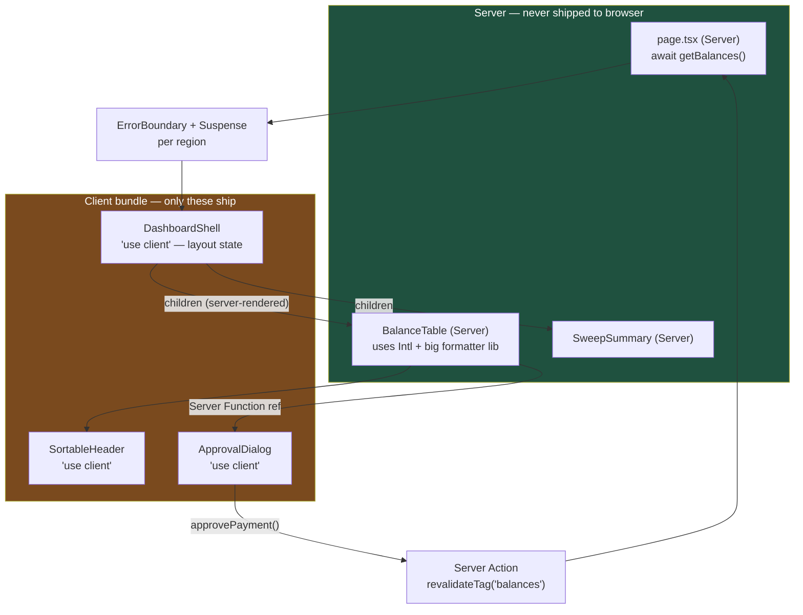

# Composition Is the Architecture: Structuring React 19 for Systems That Outlive Their Authors

React gives you exactly one composition primitive — a component that takes children — and almost every architectural mistake in a large React codebase is a refusal to use it. In React 19 the stakes went up: the boundary between server and client is now a real architectural seam, and drawing it in the wrong place costs you megabytes.

## The Real-World Problem

A corporate-banking team maintains the treasury dashboard used by cash managers at 4,000 corporate clients — balances across 30 currencies, sweep instructions, payment approvals. It began as one `<TreasuryDashboard>` component. Three years later it is 2,100 lines, takes 34 props, and every new requirement is bolted on as another boolean: `isApprovalMode`, `hideSweeps`, `compactCurrencyRow`, `showLegacyBalanceColumn`.

The consequences arrived in order. First, prop drilling: the currency formatter had to be threaded through five layers because the leaf cell needed the client's locale. Then a regression: a change to `compactCurrencyRow` for a new mobile view silently altered the approval screen, because both flowed through the same branch. Then the number that got management's attention — the client bundle for the dashboard route hit **1.9 MB gzipped**, because a single `'use client'` at the top of the page tree pulled the entire currency-formatting library, the charting library, and the date library into the browser for a screen that is 80% static text.

A cash manager on a corporate LAN in a branch office waited 6.2 seconds for first interaction. The fix was not a faster machine. It was moving one directive down four levels and turning thirty-four props into children.

## The Concept

### Composition over configuration, and over prop drilling

Three ways to let a parent influence a child, in descending order of preference:

| Technique | What it looks like | Cost |
|---|---|---|
| **Children / slots** | `<Panel header={<Title/>}>{rows}</Panel>` | None. The parent owns the JSX; the child owns layout |
| **Compound components** | `<DataTable><DataTable.Toolbar/><DataTable.Body/></DataTable>` | A context, internal to the component family |
| **Configuration props** | `<Panel showHeader compact variant="legacy"/>` | Combinatorial: N booleans = 2^N untested states |

Inheritance is not on the list. React has no useful notion of it, and `extends` on a component is a code smell that was already dead in 2019.

**The rule:** when you reach for a third boolean prop, you wanted a slot. When you reach for a fifth level of prop drilling, you wanted either composition (pass the rendered node down from where the data lives) or a scoped context — not a global store.

### Container/presentational, reconsidered

The 2016 pattern — a container that fetches, a dumb component that renders — was a workaround for the absence of hooks. It is now mostly noise: a wrapper component that only calls a hook and forwards props is a layer with no behaviour.

What survives is the *underlying* separation, expressed differently in 2026:

- **Data access lives in hooks** (`useTreasuryBalances`) or in **Server Components**, not in the component that renders markup.
- **Presentational components stay pure and prop-driven** — that is what makes them testable in isolation and usable in Storybook.
- The container/presentational *split into two files* is worth it only when the presentational half is genuinely reused with a second data source.

### The server vs. client mental model

This is the part that changes architecture rather than style.

- **Server Components are the default.** They run on the server, never ship to the browser, and can `await` directly.
- **`'use client'` marks a boundary, not a file.** Everything imported by a client module — transitively — becomes client code. The directive is a *root*, and the whole subtree beneath it is in the bundle.
- **Therefore: push `'use client'` to the leaves.** The interactive thing is the toggle, the popover, the sortable header. Not the page.
- **What crosses the boundary must be serializable.** Props passed from a Server to a Client Component can be primitives, plain objects, arrays, `Date`, `Map`, `Set`, promises, and Server Functions. They cannot be class instances, functions defined on the server, `Symbol`s, or anything with methods. A Decimal.js money object does not cross; `{ amount: "1042.55", currency: "EUR" }` does.

| Needs | Component type |
|---|---|
| `await db.query(...)`, secrets, large formatting/parsing libs | Server |
| `useState`, `useEffect`, event handlers, browser APIs, context provider | Client |
| Renders data, no interactivity | Server — even if it's deep in the tree |
| Interactive shell wrapping mostly-static content | Client shell, static content passed as `children` from the server |

That last row is the highest-leverage trick in the model: a Client Component can receive server-rendered children. `<ClientAccordion>{await <ServerBalanceTable/>}</ClientAccordion>` keeps the table's dependencies on the server.

### Memoization: when, and when it is noise

React 19's compiler removes most of the hand-written cases, but the judgment still matters:

- `memo` earns its place when a component re-renders often with **identical props** and its render is **measurably expensive** (a 500-row grid body, a chart).
- `memo` is noise when props change on every render anyway (a new object literal, a new callback) — you have added a comparison and kept the render.
- Reach for it after a React Profiler measurement, never before. `memo` on every export is a maintenance tax paid for nothing.

### Boundaries are architecture

Error boundaries and Suspense boundaries define your failure and loading *granularity* — they are the component-level expression of graceful degradation.

- One error boundary per **independently valuable region**. If the FX chart throws, the balance table must survive. A single boundary at the page root means every failure is a blank page.
- One Suspense boundary per region that can appear independently. Wrapping the whole page in one `<Suspense>` means the fastest query waits for the slowest.

## How It Works



The shell is interactive but tiny; the expensive formatting stays on the server and arrives as rendered output. The only things in the bundle are the three components that genuinely need a browser.

## Practical Example

**Wrong — one directive at the top, thirty-four props, prop drilling:**

```tsx
// app/treasury/page.tsx
'use client' // ← this one line puts the whole subtree in the browser bundle

import { formatMoney } from '@/lib/money' // 180 KB of currency data
import { TreasuryDashboard } from './treasury-dashboard'

export default function Page() {
  return (
    <TreasuryDashboard
      compactCurrencyRow={false}
      showLegacyBalanceColumn
      isApprovalMode
      hideSweeps={false}
      locale="de-DE"
      formatter={formatMoney}   // a function threaded five levels down
      /* …28 more */
    />
  )
}
```

**Right — server by default, client at the leaves, slots instead of flags:**

```tsx
// app/(authenticated)/treasury/page.tsx  — Server Component
import { Suspense } from 'react'
import { ErrorBoundary } from '@/components/error-boundary'
import { DashboardShell } from './dashboard-shell'
import { BalanceTable } from './balance-table'
import { SweepSummary } from './sweep-summary'
import { TableSkeleton } from '@/components/skeletons'

export default function TreasuryPage({
  params,
}: {
  params: Promise<{ clientId: string }>
}) {
  return (
    <DashboardShell title="Treasury position">
      {/* Two independent regions: one can fail or load without the other */}
      <ErrorBoundary fallback={<RegionError region="Balances" />}>
        <Suspense fallback={<TableSkeleton rows={12} />}>
          <BalanceTable params={params} />
        </Suspense>
      </ErrorBoundary>

      <ErrorBoundary fallback={<RegionError region="Sweeps" />}>
        <Suspense fallback={<TableSkeleton rows={4} />}>
          <SweepSummary params={params} />
        </Suspense>
      </ErrorBoundary>
    </DashboardShell>
  )
}

function RegionError({ region }: { region: string }) {
  return (
    <div role="alert" className="rounded-md border border-amber-600/40 p-4 text-sm">
      {region} is temporarily unavailable. The rest of this page is unaffected.
    </div>
  )
}
```

```tsx
// app/(authenticated)/treasury/balance-table.tsx  — Server Component
import { formatMoney } from '@/lib/money' // stays on the server. Never bundled.
import { getBalances } from '@/server/treasury'
import { SortableHeader } from './sortable-header'
import { ApprovalDialog } from './approval-dialog'
import { approvePayment } from './actions'

export async function BalanceTable({
  params,
}: {
  params: Promise<{ clientId: string }>
}) {
  const { clientId } = await params
  const balances = await getBalances(clientId)

  return (
    <table className="w-full text-sm tabular-nums">
      <thead>
        <tr>
          <SortableHeader field="currency">Currency</SortableHeader>
          <SortableHeader field="available">Available</SortableHeader>
          <th scope="col" className="text-right">Action</th>
        </tr>
      </thead>
      <tbody>
        {balances.map((b) => (
          <tr key={b.currency}>
            <th scope="row" className="text-left font-medium">{b.currency}</th>
            {/* formatted on the server: the browser receives a string */}
            <td className="text-right">{formatMoney(b.available, b.currency, 'de-DE')}</td>
            <td className="text-right">
              <ApprovalDialog
                paymentId={b.pendingApprovalId}
                label={formatMoney(b.pendingAmount, b.currency, 'de-DE')}
                onApprove={approvePayment}  {/* a Server Function reference: serializable */}
              />
            </td>
          </tr>
        ))}
      </tbody>
    </table>
  )
}
```

```tsx
// app/(authenticated)/treasury/dashboard-shell.tsx — the ONLY client shell
'use client'

import { useState, type ReactNode } from 'react'

/**
 * Interactive shell that receives server-rendered children.
 * Layout state lives here; the expensive content never enters the bundle.
 */
export function DashboardShell({
  title,
  children,
}: {
  title: string
  children: ReactNode
}) {
  const [density, setDensity] = useState<'comfortable' | 'compact'>('comfortable')

  return (
    <section data-density={density} className="space-y-6">
      <header className="flex items-center justify-between">
        <h1 className="text-lg font-semibold">{title}</h1>
        <button
          type="button"
          aria-pressed={density === 'compact'}
          onClick={() => setDensity((d) => (d === 'compact' ? 'comfortable' : 'compact'))}
          className="rounded border px-2 py-1 text-xs"
        >
          Compact rows
        </button>
      </header>
      {children}
    </section>
  )
}
```

**Compound components — replacing the flag explosion:**

```tsx
// components/panel.tsx
'use client'

import { createContext, useContext, useId, type ReactNode } from 'react'

const PanelContext = createContext<{ labelId: string } | null>(null)

function usePanel(part: string) {
  const ctx = useContext(PanelContext)
  if (!ctx) throw new Error(`<Panel.${part}> must be used inside <Panel>`)
  return ctx
}

export function Panel({ children }: { children: ReactNode }) {
  const labelId = useId()
  return (
    <PanelContext.Provider value={{ labelId }}>
      <section aria-labelledby={labelId} className="rounded-lg border">
        {children}
      </section>
    </PanelContext.Provider>
  )
}

Panel.Title = function PanelTitle({ children }: { children: ReactNode }) {
  const { labelId } = usePanel('Title')
  return <h2 id={labelId} className="border-b px-4 py-2 font-medium">{children}</h2>
}

Panel.Body = function PanelBody({ children }: { children: ReactNode }) {
  usePanel('Body')
  return <div className="p-4">{children}</div>
}

Panel.Footer = function PanelFooter({ children }: { children: ReactNode }) {
  usePanel('Footer')
  return <div className="border-t px-4 py-2 text-sm">{children}</div>
}
```

Callers now express intent structurally — `<Panel><Panel.Title>…</Panel.Title></Panel>` — and there is no `showHeader` prop to get wrong.

**A test that pins the boundary contract:**

```tsx
// components/panel.test.tsx
import { render, screen } from '@testing-library/react'
import { Panel } from './panel'

it('associates the section with its title for screen readers', () => {
  render(
    <Panel>
      <Panel.Title>Treasury position</Panel.Title>
      <Panel.Body>content</Panel.Body>
    </Panel>,
  )
  expect(screen.getByRole('region', { name: 'Treasury position' })).toBeInTheDocument()
})

it('fails loudly when a part is used outside its parent', () => {
  expect(() => render(<Panel.Body>orphan</Panel.Body>)).toThrow(
    /<Panel.Body> must be used inside <Panel>/,
  )
})
```

## Enterprise Trade-offs

| Approach | Pros | Cons | When to use (Banking / Insurance / Enterprise) |
|---|---|---|---|
| **Server-first, `'use client'` at leaves** | Smallest bundle; secrets and heavy libs stay server-side; fast first paint on constrained hardware | Requires discipline about the serialization boundary; harder to reason about at first | Default for all new Next.js work — especially internal tools accessed over branch-office networks |
| **Compound components with scoped context** | Kills flag explosion; self-documenting call sites; accessible wiring in one place | More files; context misuse throws at runtime, not compile time | Design-system primitives: tables, panels, dialogs, filter bars shared across teams |
| **Slots / `children` composition** | Zero abstraction cost; the parent keeps ownership of its JSX | Deep slot nesting can obscure layout | The first thing to try whenever a component grows a variant prop |
| **Container/presentational split into two files** | Presentational half is trivially testable and reusable | Often a wrapper with no behaviour | Only when the presentational component is genuinely fed by two different data sources |
| **`memo` / `useMemo` on hot subtrees** | Real wins on large grids and charts | Noise everywhere else; hides the actual cause (unstable props) | After a Profiler measurement on a 500+ row grid or a re-rendering chart |
| **One `'use client'` at the route root** | Fast to write; familiar to Pages Router teams | Whole subtree bundled; the 1.9 MB failure above | Migration scaffolding only, with a ticket to push the boundary down |

→ Next: [02-nextjs-app-router-and-rendering-strategies.md](02-nextjs-app-router-and-rendering-strategies.md) · Related: [../01-core-concepts/06-performance-budget.md](../01-core-concepts/06-performance-budget.md) · [../10-example-code/react/component-structure-example.md](../10-example-code/react/component-structure-example.md)
