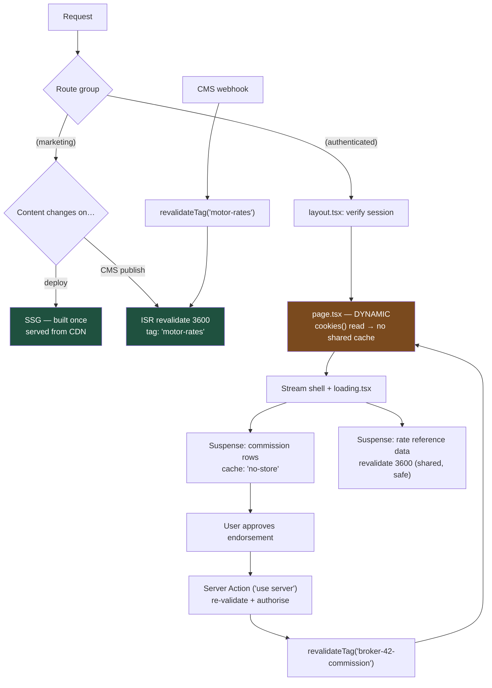

# Dynamic Is Not a Failure: Choosing Rendering Strategies in the Next.js App Router

The App Router does not have one rendering mode; it has five, and they can coexist inside a single page. The teams that struggle are the ones treating "everything static" as the goal — because an authenticated, personalised enterprise dashboard is *supposed* to be dynamic, and forcing it otherwise is how you ship one client's data to another.

## The Real-World Problem

A general insurer runs two Next.js applications from one monorepo: a **public product site** (motor, home, travel quotes; heavy SEO investment) and a **broker portal** where 1,800 independent brokers manage policies, endorsements, and commission statements.

The platform team applied one policy to both — "static export where possible, aggressive caching everywhere" — because a performance review had flagged server cost. On the marketing site this was exactly right: Lighthouse scores went up, CDN hit rate hit 97%.

On the broker portal it produced an incident. The commission-statement page was a Server Component that read the broker's identity from a cookie inside a helper the team had wrapped in `unstable_cache`, keyed only on the reporting period. The first broker to load January's statement populated the cache. For the next eleven minutes, **every broker who opened January saw that broker's commission figures** — names, policy references, payment amounts. Forty-three brokers were affected before the alert fired.

The root cause was one sentence long: they cached a response that depended on the request identity, and the cache key did not include the identity. The remediation was not more caching cleverness. It was accepting that a personalised authenticated page is dynamic, marking it so explicitly, and moving the cacheable work to the parts that are genuinely shared — reference data, product rules, rate tables.

## The Concept

### The five strategies, plainly

| Strategy | Rendered | Cached | Right for |
|---|---|---|---|
| **SSG** (static) | At build time | Indefinitely, at the edge | Marketing pages, legal/T&C, help articles — content that changes on a deploy |
| **ISR** (`revalidate: n`) | At build, then re-rendered in the background after `n` seconds | Yes, with staleness window | Product/pricing pages, rate tables, published policy-wording libraries |
| **SSR** (dynamic) | Per request, on the server | No (or per-request only) | Anything personalised: dashboards, statements, queues, authenticated views |
| **RSC** (React Server Components) | Server, streamed as payload | Depends on the data calls | The default component model across *all* of the above |
| **Streaming** (`<Suspense>` + `loading.tsx`) | Shell first, slow regions later | Orthogonal to the above | Any page where one region is slow and the rest is not |

RSC and streaming are not alternatives to SSR/SSG — they are the *mechanism*. The real choice is: **when is this HTML computed, and is the result shared between users?** If it is not safely shareable, it is dynamic. Full stop.

### The decision table

| Question | Answer → strategy |
|---|---|
| Does the output depend on the signed-in user? | **Yes → dynamic (SSR).** No caching keyed without identity |
| Same for every visitor, changes on deploy? | **SSG** |
| Same for every visitor, changes on a schedule/CMS edit? | **ISR** + `revalidateTag` webhook |
| Same for everyone but expensive and slow? | **ISR** with a short window, or cached `fetch` inside a dynamic page |
| One slow region on an otherwise fast page? | **Streaming** with a per-region `<Suspense>` |
| User-triggered write? | **Server Action** + `revalidateTag` / `revalidatePath` |

### Be explicit about caching. Always.

Next.js's caching defaults have changed across versions, which is exactly why you should never depend on them. Write the intent down at the call site:

```ts
// shared reference data: cache it, tag it, revalidate on publish
await fetch(`${API}/products/motor/rates`, {
  next: { revalidate: 3600, tags: ['motor-rates'] },
})

// personalised: never cached, and say so
await fetch(`${API}/brokers/${brokerId}/commission/2026-01`, {
  cache: 'no-store',
  headers: { authorization: `Bearer ${token}` },
})
```

For non-`fetch` work (a database query, an expensive computation), use React's `cache()` for per-request deduplication and Next's `'use cache'` / cache-tag primitives for cross-request caching — and **include every input that affects the output in the key**. The incident above was a missing key component, not a missing feature.

Two rules that would have prevented it outright:
1. **A function that reads `cookies()`, `headers()`, or `auth()` must never be wrapped in a cross-request cache.**
2. **Per-user data is fetched in the request path, not behind a shared cache — even if it is slower.**

### Route structure and per-segment boundaries

```
app/
├── (marketing)/              # route group: no URL segment, own layout
│   ├── layout.tsx            # public chrome
│   ├── page.tsx              # SSG
│   └── motor/page.tsx        # ISR, revalidate 3600
├── (authenticated)/
│   ├── layout.tsx            # auth check, broker chrome
│   └── portal/
│       ├── layout.tsx
│       ├── page.tsx          # dynamic
│       ├── loading.tsx       # streamed skeleton for this segment
│       ├── error.tsx         # client boundary for this segment
│       └── commission/
│           ├── page.tsx      # dynamic — per broker
│           ├── loading.tsx
│           └── actions.ts    # 'use server'
└── api/
    └── webhooks/cms/route.ts # calls revalidateTag('motor-rates')
```

Every async segment gets its own `loading.tsx` and `error.tsx`. That is not boilerplate — it is the routing-level expression of failure and loading granularity. A single `error.tsx` at the root turns any panel failure into a whole-page error.

### Server Actions for mutations

Mutations belong in Server Actions, not in client-side `fetch` calls to your own route handlers. You get progressive enhancement, automatic request de-duplication of the resulting revalidation, and — critically — a place to re-validate input on the server. Follow every successful write with the narrowest possible invalidation: `revalidateTag('commission-2026-01')` beats `revalidatePath('/portal')`, which beats `revalidatePath('/', 'layout')`.

## How It Works



Note what is shared and what is not: the rate reference data is cached across all brokers because it is identical for all brokers. The commission rows are not cached at all, because they are not.

## Practical Example

**Wrong — the incident, in nine lines:**

```ts
// server/commission.ts  — DO NOT DO THIS
import { unstable_cache } from 'next/cache'
import { cookies } from 'next/headers'

export const getCommission = unstable_cache(
  async (period: string) => {
    const brokerId = (await cookies()).get('broker_id')!.value // identity read INSIDE the cache
    return db.commission.findMany({ where: { brokerId, period } })
  },
  ['commission'],
  { revalidate: 600 },   // key is [period] only → cross-broker leak
)
```

**Right — identity resolved outside, cache keyed on it (or not cached at all):**

```ts
// server/commission.ts
import { cache } from 'react'
import { requireBroker } from '@/server/auth'

export type CommissionRow = {
  policyRef: string
  insuredName: string
  grossPremium: string
  commission: string
}

/** Per-request memoisation only. Never shared between requests. */
export const getCommission = cache(
  async (period: string): Promise<CommissionRow[]> => {
    const broker = await requireBroker()          // throws → error.tsx
    const res = await fetch(
      `${process.env.API_URL}/brokers/${broker.id}/commission/${period}`,
      {
        cache: 'no-store',                        // explicit: personalised
        headers: { authorization: `Bearer ${broker.token}` },
      },
    )
    if (!res.ok) throw new Error(`commission_fetch_failed_${res.status}`)
    return res.json()
  },
)

/** Shared across every broker — safe to cache and tag. */
export async function getRateTable(product: 'motor' | 'home') {
  const res = await fetch(`${process.env.API_URL}/products/${product}/rates`, {
    next: { revalidate: 3600, tags: [`rates:${product}`] },
  })
  if (!res.ok) throw new Error('rate_table_unavailable')
  return res.json() as Promise<{ band: string; factor: number }[]>
}
```

```tsx
// app/(authenticated)/portal/commission/[period]/page.tsx
import { Suspense } from 'react'
import type { Metadata } from 'next'
import { getCommission, getRateTable } from '@/server/commission'
import { CommissionTable } from './commission-table'
import { RateReference } from './rate-reference'
import { TableSkeleton } from '@/components/skeletons'

export const dynamic = 'force-dynamic' // explicit intent: this page is per-broker

export async function generateMetadata({
  params,
}: {
  params: Promise<{ period: string }>
}): Promise<Metadata> {
  const { period } = await params
  return {
    title: `Commission statement — ${period}`,
    robots: { index: false, follow: false }, // authenticated: never indexed
  }
}

export default async function CommissionPage({
  params,
}: {
  params: Promise<{ period: string }>
}) {
  const { period } = await params

  return (
    <div className="space-y-8">
      <h1 className="text-lg font-semibold">Commission — {period}</h1>

      {/* slow, personalised: streams in after the shell */}
      <Suspense fallback={<TableSkeleton rows={10} />}>
        <CommissionRows period={period} />
      </Suspense>

      {/* fast, shared, cached: renders from the ISR cache */}
      <Suspense fallback={<TableSkeleton rows={4} />}>
        <RateReferenceSection />
      </Suspense>
    </div>
  )
}

async function CommissionRows({ period }: { period: string }) {
  const rows = await getCommission(period)
  return <CommissionTable rows={rows} />
}

async function RateReferenceSection() {
  const bands = await getRateTable('motor')
  return <RateReference bands={bands} />
}
```

```tsx
// app/(authenticated)/portal/commission/[period]/loading.tsx
import { TableSkeleton } from '@/components/skeletons'

export default function Loading() {
  return <TableSkeleton rows={10} />
}
```

```tsx
// app/(authenticated)/portal/commission/[period]/error.tsx
'use client'

export default function Error({
  error,
  reset,
}: {
  error: Error & { digest?: string }
  reset: () => void
}) {
  return (
    <div role="alert" className="rounded-md border border-amber-600/40 p-4">
      <p className="text-sm">
        We could not load this statement. Reference{' '}
        <code className="font-mono">{error.digest ?? 'n/a'}</code>.
      </p>
      <button type="button" onClick={reset} className="mt-2 rounded border px-3 py-1 text-sm">
        Try again
      </button>
    </div>
  )
}
```

**A Server Action with server-side authorisation and narrow revalidation:**

```ts
// app/(authenticated)/portal/commission/[period]/actions.ts
'use server'

import { revalidateTag } from 'next/cache'
import { z } from 'zod'
import { requireBroker } from '@/server/auth'

const disputeSchema = z.object({
  policyRef: z.string().regex(/^POL-\d{8}$/),
  reason: z.string().min(20).max(1000),
})

export type DisputeState = { ok: boolean; fieldErrors?: Record<string, string[]> }

export async function raiseCommissionDispute(
  _prev: DisputeState,
  formData: FormData,
): Promise<DisputeState> {
  const broker = await requireBroker() // authorise on the server, every time

  const parsed = disputeSchema.safeParse(Object.fromEntries(formData))
  if (!parsed.success) {
    return { ok: false, fieldErrors: parsed.error.flatten().fieldErrors }
  }

  await db.dispute.create({ data: { ...parsed.data, brokerId: broker.id } })

  // narrowest possible invalidation
  revalidateTag(`commission:${broker.id}`)
  return { ok: true }
}
```

## Enterprise Trade-offs

| Approach | Pros | Cons | When to use (Banking / Insurance / Enterprise) |
|---|---|---|---|
| **SSG** | Cheapest, fastest, CDN-only, no server risk | Content only changes on deploy; unusable for anything per-user | Insurer's public product pages, policy wording PDFs index, careers site |
| **ISR + `revalidateTag`** | Static speed with editorial freshness; one webhook keeps it honest | Staleness window must be acceptable; needs tag discipline | Rate tables, product catalogues, published fee schedules, help centre |
| **Dynamic SSR (`force-dynamic`)** | Correct by construction for personalised data; no cross-tenant leak risk | Server cost per request; latency depends on upstream | Broker portals, banking dashboards, claims queues, anything behind auth |
| **Streaming with per-segment `loading.tsx`** | Shell paints immediately; slow region does not block fast ones | More boundaries to design and test; skeletons must match layout | Any authenticated page mixing a slow report with fast reference data |
| **Client-side fetching (TanStack Query) inside a dynamic page** | Interactive refetch, optimistic updates, background revalidation | Data not in initial HTML; needs hydration care | Filterable/sortable operational tables where the user re-queries constantly |
| **Caching a personalised response** | — | Cross-user data disclosure; a reportable incident under GDPR | Never |

## Why This Still Matters Through 2030

The App Router's specific APIs will keep moving — cache directives have been renamed more than once and will be again — but the underlying decision is stable and framework-independent: *when is this computed, and is the result safe to share?* Every meta-framework now converging on the same model (Nuxt, SvelteKit, Remix/React Router, Angular's hybrid rendering) forces the same question, because it is a question about your data, not about your framework. The regulatory pressure also only increases: with GDPR enforcement mature and operational-resilience regimes now naming data segregation explicitly, "we cached the wrong thing" is an incident with a reporting clock attached, not a performance regression. So the durable practice is not memorising defaults — it is writing caching intent explicitly at every call site, keeping identity out of shared keys, and being unembarrassed that your authenticated dashboard renders per request. That is not a failure to optimise. That is the correct answer.

→ Next: [03-vue-and-nuxt-composition-api.md](03-vue-and-nuxt-composition-api.md) · Related: [../10-example-code/nextjs/app-router-project-structure.md](../10-example-code/nextjs/app-router-project-structure.md) · [../01-core-concepts/05-security-by-default.md](../01-core-concepts/05-security-by-default.md)
