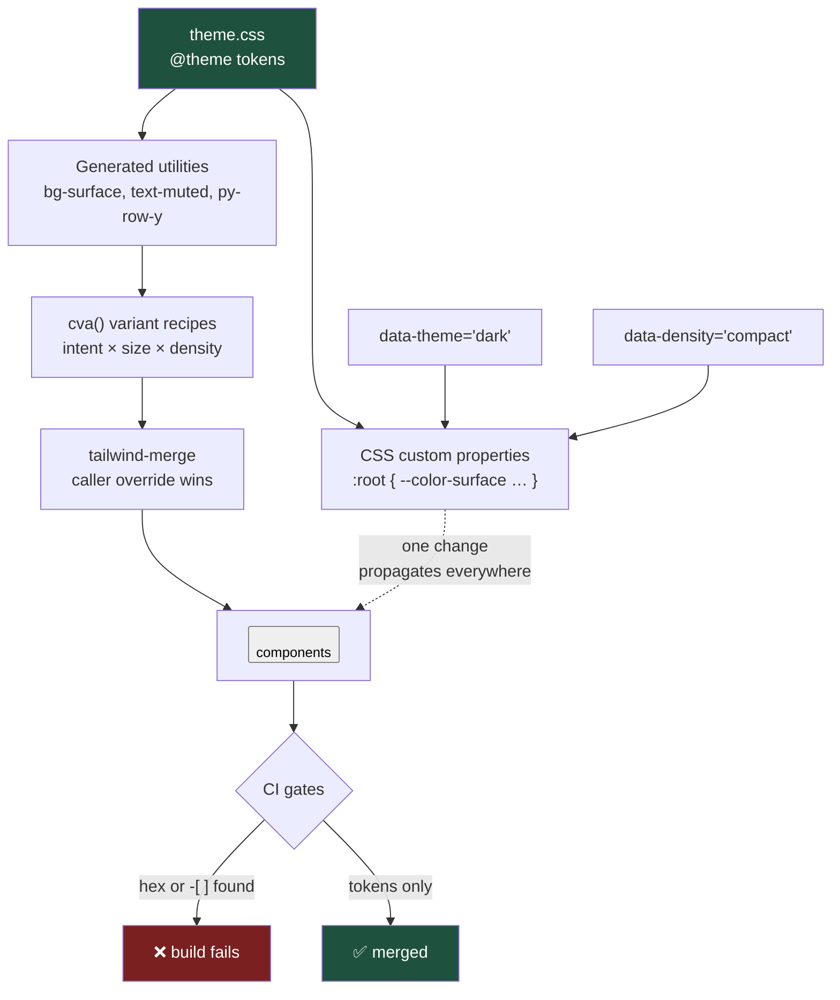

# Utility-First Without the Soup: Tailwind CSS v4 as an Enforced Design System

Tailwind's critics complain about long class strings; the real failure in enterprise codebases is different and worse — arbitrary values. The moment `text-[13.5px]` and `bg-[#1e40b0]` are allowed into a shared codebase, you no longer have a design system, you have suggestions.

## The Real-World Problem

A card-issuing processor built a **back-office dispute-management console** — chargeback queues, evidence upload, network deadlines — used by 260 operations staff across three sites. Four squads contributed screens over eighteen months.

Nobody enforced the token layer. By the audit, the console contained **31 distinct grey values**, nine of which differed by less than 3% luminance, and **14 button implementations**, four of which had focus rings and ten of which did not. Row heights across the six queue tables ranged from 32px to 52px because each squad had picked padding by eye.

Two concrete costs. First, accessibility: an external WCAG 2.2 audit ahead of a regulatory review flagged 47 contrast failures and 10 missing focus indicators — remediation was quoted at 24 engineer-days, because there was no single place to change a colour. Second, a dark-mode request from the night shift was scoped at six weeks and cancelled, because dark mode requires a token layer and there wasn't one; every colour was hard-coded at 4,000 call sites.

The team's diagnosis was wrong at first — "Tailwind made this happen." It didn't. The absence of a token contract and a lint rule made it happen. Tailwind just made it fast.

## The Concept

### Utility-first is a scale decision, not an aesthetic one

Utilities win in large codebases for three specific reasons: styles are colocated with markup so deleting a component deletes its CSS; there is no naming problem, and therefore no dead-CSS problem; and the constrained scale (`p-2`, `p-3`, `p-4`) is a design system in the ergonomics rather than in a document nobody reads.

That last point only holds if the scale is actually constrained. Arbitrary-value syntax is the escape hatch that voids the guarantee, and it is the single thing to police.

### Design tokens with `@theme`

Tailwind v4 is CSS-first: configuration lives in your stylesheet, and `@theme` both defines tokens as real CSS custom properties and generates the corresponding utilities.

```css
/* app/styles/theme.css */
@import "tailwindcss";

@theme {
  /* Semantic colour tokens — the only colours anyone may use */
  --color-surface:            oklch(100% 0 0);
  --color-surface-raised:     oklch(98.4% 0.002 250);
  --color-surface-sunken:     oklch(96.1% 0.004 250);
  --color-border:             oklch(89% 0.006 250);
  --color-text:               oklch(21% 0.01 250);
  --color-text-muted:         oklch(50% 0.012 250);

  --color-brand:              oklch(48% 0.17 262);
  --color-brand-hover:        oklch(42% 0.17 262);
  --color-on-brand:           oklch(100% 0 0);

  /* status tokens: dispute states, not decoration */
  --color-pending:            oklch(72% 0.15 75);
  --color-breach:             oklch(56% 0.20 27);
  --color-resolved:           oklch(58% 0.13 155);

  /* density-aware sizing */
  --spacing-row-y:            0.625rem;
  --text-table:               0.875rem;
  --text-table--line-height:  1.25rem;

  --radius-control:           0.375rem;
  --ease-ui:                  cubic-bezier(0.2, 0, 0, 1);
}
```

Two properties follow from this that matter more than the syntax:

1. **Tokens are CSS custom properties**, so they can be re-declared under a selector — which is how dark mode and density modes work without touching a single component.
2. **`--color-brand` generates `bg-brand`, `text-brand`, `border-brand`** automatically. Nobody needs a hex code.

Colours are in **OKLCH** because perceptual lightness is a number you can reason about: `oklch(48% …)` against `oklch(100% …)` has predictable contrast, which is not true of HSL.

### Dark mode and density, from the token layer

```css
/* Dark theme: redefine tokens only. No component changes. */
@layer base {
  :root { color-scheme: light; }

  :root[data-theme="dark"],
  :root:not([data-theme="light"]) {
    @media (prefers-color-scheme: dark) {
      color-scheme: dark;
      --color-surface:        oklch(19% 0.012 250);
      --color-surface-raised: oklch(23% 0.014 250);
      --color-surface-sunken: oklch(15% 0.010 250);
      --color-border:         oklch(33% 0.016 250);
      --color-text:           oklch(96% 0.004 250);
      --color-text-muted:     oklch(72% 0.012 250);
      --color-brand:          oklch(70% 0.15 262);
      --color-on-brand:       oklch(16% 0.02 262);
    }
  }

  /* Density: the night shift reviews 400 disputes a shift and wants more rows */
  :root[data-density="compact"] {
    --spacing-row-y:           0.3125rem;
    --text-table:              0.8125rem;
    --text-table--line-height: 1.125rem;
  }
}
```

A dispute row written as `py-row-y text-table` now responds to both theme and density with no conditional classes anywhere. That is the entire argument for a token layer, in one sentence.

### Avoiding class soup

Class soup is a symptom of missing components, not of utilities. The ladder, in order:

| Level | Tool | Use when |
|---|---|---|
| 1 | **Extract a component** | The same class string appears twice. This is 90% of cases |
| 2 | **`cva` variant API** | The component has real variants (`intent`, `size`, `density`) |
| 3 | **`tailwind-merge`** | A component accepts `className` and callers must be able to override |
| 4 | **`@apply`** | Almost never. See below |

**`@apply` is a mistake in almost every case.** It moves the class string into a stylesheet, where it loses colocation, loses the "delete the component, delete the CSS" property, and reintroduces the naming and dead-CSS problems Tailwind exists to remove — while gaining nothing a component wouldn't give you. The two defensible uses: styling markup you do not control (third-party widget, CMS-rendered HTML), and a handful of base-layer resets. If `@apply` appears in a component file, the component was the answer.

### Enforcing the token system

A design system that is not enforced in CI is a style guide, and style guides lose. Three layers:

1. **`eslint-plugin-better-tailwindcss`** (or equivalent) with arbitrary values disallowed and class order enforced.
2. **A grep-level CI gate** for hex codes and `-[` arbitrary values in component directories — crude, fast, and impossible to argue with.
3. **A review rule:** a new colour requires a token PR against `theme.css` with a stated contrast ratio. Not a hex code in a component.

## How It Works



The dotted line is the whole point: a contrast fix is one edit in `theme.css`, not 4,000 edits across components.

## Practical Example

**Wrong — the console's actual button, four times over:**

```tsx
// squad A
<button className="bg-[#1e40b0] text-white px-[14px] py-[7px] rounded-[5px] text-[13px]">
  Accept liability
</button>

// squad B — nearly the same, no focus ring, different grey
<button className="bg-[#1E40AF] text-[#fff] px-3.5 py-2 rounded text-sm hover:bg-[#1c3a9e]">
  Accept liability
</button>
```

**Right — one component, tokens only, variants declared:**

```tsx
// components/ui/button.tsx
import { cva, type VariantProps } from 'class-variance-authority'
import { twMerge } from 'tailwind-merge'
import type { ComponentProps } from 'react'

const button = cva(
  [
    'inline-flex items-center justify-center gap-2 font-medium',
    'rounded-control transition-colors duration-150 ease-ui',
    // focus ring is in the base recipe: it cannot be forgotten
    'focus-visible:outline-2 focus-visible:outline-offset-2 focus-visible:outline-brand',
    'disabled:pointer-events-none disabled:opacity-50',
  ],
  {
    variants: {
      intent: {
        primary: 'bg-brand text-on-brand hover:bg-brand-hover',
        secondary: 'border border-border bg-surface text-text hover:bg-surface-sunken',
        danger: 'bg-breach text-on-brand hover:brightness-95',
        ghost: 'text-text-muted hover:bg-surface-sunken hover:text-text',
      },
      size: {
        sm: 'h-8 px-3 text-xs',
        md: 'h-9 px-4 text-sm',
        lg: 'h-11 px-6 text-base',
      },
    },
    defaultVariants: { intent: 'secondary', size: 'md' },
  },
)

export type ButtonProps = ComponentProps<'button'> & VariantProps<typeof button>

export function Button({ intent, size, className, ...props }: ButtonProps) {
  // twMerge lets a caller override without a specificity war
  return <button className={twMerge(button({ intent, size }), className)} {...props} />
}
```

```tsx
// features/disputes/dispute-row.tsx
import { cva } from 'class-variance-authority'
import { Button } from '@/components/ui/button'

const statusPill = cva('rounded-full px-2 py-0.5 text-xs font-medium', {
  variants: {
    status: {
      pending: 'bg-pending/15 text-pending',
      breach: 'bg-breach/15 text-breach',
      resolved: 'bg-resolved/15 text-resolved',
    },
  },
})

export type Dispute = {
  id: string
  cardLast4: string
  amount: string
  network: 'visa' | 'mastercard'
  status: 'pending' | 'breach' | 'resolved'
  deadline: string
}

export function DisputeRow({ dispute }: { dispute: Dispute }) {
  return (
    <tr className="border-b border-border hover:bg-surface-sunken">
      {/* py-row-y + text-table respond to data-density with zero conditionals */}
      <th scope="row" className="py-row-y px-3 text-left font-mono text-table">
        {dispute.id}
      </th>
      <td className="py-row-y px-3 text-table">•••• {dispute.cardLast4}</td>
      <td className="py-row-y px-3 text-right text-table tabular-nums">{dispute.amount}</td>
      <td className="py-row-y px-3 text-table">
        <span className={statusPill({ status: dispute.status })}>{dispute.status}</span>
      </td>
      <td className="py-row-y px-3 text-right">
        <Button intent="primary" size="sm">Respond</Button>
      </td>
    </tr>
  )
}
```

**The density and theme switch — one attribute, no re-render of styles:**

```tsx
// components/ui/display-controls.tsx
'use client'

import { useEffect, useState } from 'react'
import { Button } from './button'

type Density = 'comfortable' | 'compact'

export function DisplayControls() {
  const [density, setDensity] = useState<Density>('comfortable')

  useEffect(() => {
    document.documentElement.dataset.density = density
    localStorage.setItem('density', density)
  }, [density])

  return (
    <Button
      intent="ghost"
      size="sm"
      aria-pressed={density === 'compact'}
      onClick={() => setDensity((d) => (d === 'compact' ? 'comfortable' : 'compact'))}
    >
      Compact rows
    </Button>
  )
}
```

**Enforcement — the lint config and the CI gate:**

```js
// eslint.config.js
import betterTailwind from 'eslint-plugin-better-tailwindcss'

export default [
  {
    files: ['**/*.tsx'],
    plugins: { 'better-tailwindcss': betterTailwind },
    settings: { 'better-tailwindcss': { entryPoint: 'app/styles/theme.css' } },
    rules: {
      'better-tailwindcss/enforce-consistent-class-order': 'error',
      'better-tailwindcss/no-unregistered-classes': 'error',
      // the rule that would have prevented 31 greys:
      'better-tailwindcss/no-restricted-classes': [
        'error',
        { restrict: [{ pattern: '.*-\\[.*\\]', message: 'Arbitrary value — add a token to theme.css instead.' }] },
      ],
    },
  },
]
```

```yaml
# .github/workflows/design-tokens.yml
name: design-tokens
on: [pull_request]
jobs:
  no-raw-values:
    runs-on: ubuntu-latest
    steps:
      - uses: actions/checkout@v4
      - name: Reject hex codes and arbitrary values in components
        run: |
          if grep -rEn '#[0-9a-fA-F]{3,8}\b|(bg|text|border|p|px|py|m|gap|w|h)-\[' \
              --include='*.tsx' --include='*.ts' app components features; then
            echo "::error::Raw colour or arbitrary value found. Add a token to app/styles/theme.css."
            exit 1
          fi
```

**A test that pins the contract the audit cared about:**

```tsx
// components/ui/button.test.tsx
import { render, screen } from '@testing-library/react'
import { Button } from './button'

it('always carries a visible focus indicator', () => {
  render(<Button intent="primary">Respond</Button>)
  expect(screen.getByRole('button').className).toMatch(/focus-visible:outline-2/)
})

it('lets callers extend without duplicating conflicting utilities', () => {
  render(<Button intent="primary" className="w-full">Respond</Button>)
  const cls = screen.getByRole('button').className
  expect(cls).toContain('w-full')
  expect(cls).toContain('bg-brand')
})
```

## Enterprise Trade-offs

| Approach | Pros | Cons | When to use (Banking / Insurance / Enterprise) |
|---|---|---|---|
| **`@theme` semantic tokens + generated utilities** | One place to fix contrast; dark/density modes are free; audits become tractable | Requires naming discipline up front; semantic names need a glossary | Every multi-squad enterprise UI. Non-negotiable for anything facing a WCAG audit |
| **Component extraction as the first response to repetition** | Colocated, deletable, testable; kills soup at the source | Needs review vigilance to prevent a fifth button appearing | Always — this is the default answer to a long class string |
| **`cva` variant recipes** | Variants are explicit and typed; base styles like focus rings cannot be dropped | Another dependency; over-variant-ing recreates the flag explosion | Design-system primitives shared across squads: buttons, pills, inputs, cells |
| **`tailwind-merge` on `className` passthrough** | Callers override cleanly; no `!important` escalation | Slight runtime cost; hides conflicts if abused | Any shared component that accepts `className` |
| **`@apply` for component styles** | Familiar to CSS-first teams | Breaks colocation, resurrects dead CSS and naming problems | Third-party/CMS markup you cannot annotate, and base resets. Nothing else |
| **Arbitrary values (`text-[13.5px]`, `bg-[#1e40b0]`)** | Unblocks one developer for ten minutes | 31 greys, 47 contrast failures, dark mode impossible | Never in shared code. Fail the build |

→ Next: [05-motion-for-purposeful-animation.md](05-motion-for-purposeful-animation.md) · Related: [../09-ux-ui-guidelines/01-ui-consistency-and-design-tokens.md](../09-ux-ui-guidelines/01-ui-consistency-and-design-tokens.md) · [../00-project-setup-roadmap/04-linting-formatting-hooks.md](../00-project-setup-roadmap/04-linting-formatting-hooks.md)
