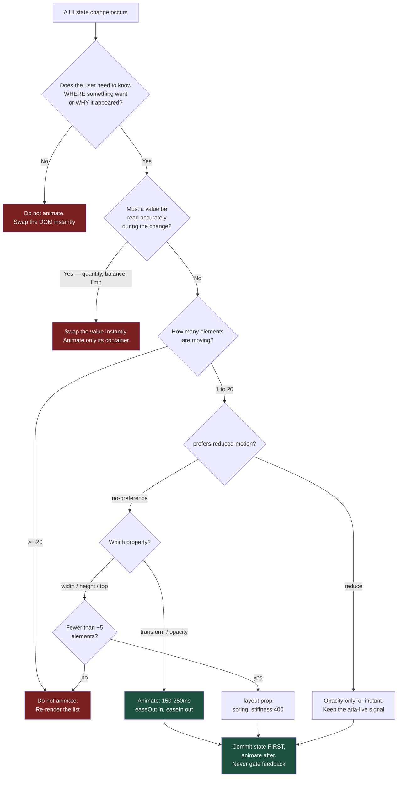

# Motion That Says Something: Animation as Information in Data-Dense Enterprise UIs

Every animation in a back-office tool is a small tax on someone's attention, paid a thousand times a shift. The only ones worth shipping are the ones that answer a question the user was already asking: *what just changed, and where did it go?*

## The Real-World Problem

A global industrial manufacturer replaced the green-screen front end of its ERP with a React **order-fulfilment console** — 40,000 open order lines, allocation against warehouse stock, expediting, backorder release. It is used by 180 planners, eight hours a day, on the standard corporate laptop: an integrated-GPU business machine, docked to two 1080p monitors, running the console next to Outlook, Teams, and a Citrix session.

The redesign brief said "make it feel modern." The team delivered animation liberally, and three things went wrong in production.

First, the order grid. Every column re-sort ran a layout animation across the visible 500 rows. On the developers' machines it was smooth. On a planner's laptop with Teams sharing the GPU it ran at **9 frames per second for 1.4 seconds** — long enough that planners learned to click the header and then look away.

Second, the allocation quantities. Someone had wrapped the available-stock figure in a count-up animation that tweened from the old value to the new one over 600ms. A planner released a backorder against what they read as **1,400** units mid-tween. The settled figure was 140. The console had been telling the truth for 600ms in a row, and the truth was unreadable at every point except the last.

Third, the save confirmation. The success toast was gated behind a 400ms spring entrance. Planners committing 60 allocations an hour reported the system as "slow to respond" — it wasn't; the acknowledgement was.

The remediation removed roughly two-thirds of the animation in the console and kept the third that told planners something. Task completion time on the allocation flow dropped 11%. Nobody described the result as less modern.

## The Concept

### Motion carries information or it carries nothing

Animation in an enterprise UI has exactly three legitimate jobs:

1. **Continuity** — this element is the same element it was a moment ago, and it moved *there*. A row expanding into a detail panel; a card moving between kanban columns.
2. **Causality** — this appeared *because* of what you just did. A validation message sliding under the field you left; a row inserted into a queue.
3. **State legibility** — a panel is opening, not appearing; a record is saving, not saved.

Anything that is not doing one of those three is decoration, and decoration in a tool people use for eight hours is a cost with no revenue.

### The list: what to animate, and what never to

| Never animate | Why |
|---|---|
| **A re-sort or refilter of a large table** | N rows × layout animation = dropped frames on real hardware, and the user already knows why the order changed — they clicked the header |
| **A number a user must read accurately** | A tweening figure is wrong at every frame but the last. Quantities, balances, limits, exposures: swap the value instantly |
| **A confirmation or acknowledgement** | Feedback must appear at the earliest possible frame. Never gate a "saved" behind an entrance flourish |
| **Anything on the critical path of keyboard-driven data entry** | A power user typing at speed is ahead of your 300ms transition |
| **Route transitions in an internal tool** | Cross-fading a whole page delays every single navigation for no informational gain |
| **Scroll-triggered reveals in a data view** | Content that animates as it scrolls into a grid is content the user cannot scan |

| Do animate | Why |
|---|---|
| **Panel / drawer / dialog open and close** | Establishes where it came from and that the page underneath persists |
| **Row inserted, removed, or moved** (a few rows, not 500) | The user did not cause it — a live queue update needs to be noticed, not hunted for |
| **Validation failure** | Causality: the message belongs to the field, and appearing beneath it says so |
| **Record saved / state changed** | A brief, small confirmation change — after the state has already been committed to the DOM |
| **Expand / collapse of a detail region** | Continuity between the summary row and its expansion |
| **Optimistic pending state** | A subtle, sustained indication that the write is in flight |

### The duration and easing budget

Back-office tooling has a much tighter budget than a marketing site. Treat these as limits, not suggestions:

| Interaction | Duration | Easing |
|---|---|---|
| Hover, focus, small state change | **100–150ms** | `easeOut` |
| Micro-feedback, toggle, pill change | **150–200ms** | `easeOut` |
| Panel / dialog / drawer entrance | **200–250ms** | `easeOut` — decelerate into place |
| Exit of anything | **120–180ms** | `easeIn` — exits should be faster than entrances |
| Layout shift of a small list | **200ms** max | spring with high stiffness, low mass |
| Anything at all | **> 400ms feels broken** | there is no easing that fixes it |

Two rules that follow: **exits are always faster than entrances** (the user has already moved on), and **nothing blocks input**. If a 250ms panel entrance is playing and the user tabs into the first field, the field takes focus. Animation is never modal.

### Transform and opacity only — and what layout animation actually costs

The browser has four rendering stages: style, layout, paint, composite. `transform` and `opacity` are handled by the compositor and can run off the main thread. Everything else drags you back up the pipeline.

| Animating | Cost |
|---|---|
| `transform`, `opacity`, `filter` | Composite only. Cheap. This is your default |
| `width`, `height`, `top`, `left`, `margin`, `padding` | Layout + paint + composite, **every frame**, for the element and often its siblings |
| `box-shadow`, `background-position` | Repaint every frame; expensive on large surfaces |

Motion's `layout` prop is genuinely useful — it measures before and after and animates the delta as a transform, which is far better than animating `height`. But it still performs a **measurement pass per animating element per commit**. Ten elements is free. Five hundred rows in a virtualised grid is a stalled main thread. The rule: `layout` is for a handful of elements you can count on one hand.

Also: animate `height: auto` by animating a wrapper's `transform: scaleY` or by using `layout` on a small region — never by tweening `height` across a long list.

### `prefers-reduced-motion` is an obligation, not a courtesy

This is where teams get it wrong by treating it as polish. WCAG 2.2 **2.3.3 Animation from Interactions** (AAA) and **2.2.2 Pause, Stop, Hide** (A) both bear on this, and the practical driver is stronger than the letter: vestibular disorders, migraine, and motion sensitivity affect a meaningful share of any 180-person user base, and large-surface transform animations trigger nausea in those users. In a workplace tool, "I cannot use this software for a full shift" is an accommodation issue, not a preference.

The engineering rule is unambiguous:

- Every animated component reads the preference. `useReducedMotion()` in Motion, or `@media (prefers-reduced-motion: reduce)` in CSS.
- Reduced motion means **no movement**, not slower movement. Replace translate/scale with an opacity change, or with an instant state swap.
- Reduced motion must **never** remove the information. If a row insert was signalled only by a slide, the reduced-motion path needs a non-motion signal — a brief background tint, a count change, an `aria-live` announcement.
- Put the check in the shared primitive, not in each call site, or it will be forgotten at the fourteenth call site.

### Performance on the hardware you actually ship to

Develop with the DevTools CPU throttle at 4× and an integrated GPU in mind. Three concrete guards:

- **Never animate more than ~20 elements simultaneously.** Stagger and cap: animate the first 10 rows of a newly loaded list and let the rest appear.
- **Respect `will-change` sparingly.** Motion manages this; adding it manually to hundreds of rows allocates a compositor layer each and exhausts GPU memory.
- **Measure with the Performance panel, not with your eyes on a workstation.** A 60fps animation on an M-series laptop tells you nothing about a docked business laptop running Citrix.

## How It Works



The load-bearing box is the last one: state commits first, motion decorates afterwards. An animation that delays the state change has inverted the relationship.

## Practical Example

**Wrong — the three production mistakes, verbatim:**

```tsx
// features/orders/order-grid.tsx  — DO NOT DO THIS
'use client'

import { motion } from 'motion/react'

export function OrderGrid({ rows }: { rows: OrderLine[] }) {
  return (
    <tbody>
      {/* 500 layout animations + a per-row stagger = 9fps on a real laptop */}
      {rows.map((row, i) => (
        <motion.tr
          key={row.id}
          layout
          initial={{ opacity: 0, y: 12 }}
          animate={{ opacity: 1, y: 0 }}
          transition={{ duration: 0.5, delay: i * 0.02 }}
        >
          <td>{row.sku}</td>
          {/* a number the planner must read, tweened over 600ms */}
          <td><CountUp to={row.availableQty} duration={0.6} /></td>
        </motion.tr>
      ))}
    </tbody>
  )
}
```

**Right — the shared motion primitives, with the preference handled once:**

```ts
// lib/motion/tokens.ts
import type { Transition } from 'motion/react'

/** Duration budget for a back-office tool. Nothing here exceeds 250ms. */
export const DURATION = {
  instant: 0,
  micro: 0.12,
  feedback: 0.18,
  enter: 0.22,
  exit: 0.14,
} as const

export const EASE_OUT = [0.2, 0, 0, 1] as const
export const EASE_IN = [0.4, 0, 1, 1] as const

export const enterTransition: Transition = { duration: DURATION.enter, ease: EASE_OUT }
export const exitTransition: Transition = { duration: DURATION.exit, ease: EASE_IN }

/** Small-list layout movement only. Never applied to more than a handful of nodes. */
export const layoutSpring: Transition = { type: 'spring', stiffness: 420, damping: 34, mass: 0.6 }
```

```tsx
// lib/motion/use-ui-motion.ts
'use client'

import { useReducedMotion } from 'motion/react'
import { enterTransition, exitTransition } from './tokens'
import type { Transition, Variants } from 'motion/react'

export type UiMotion = {
  reduced: boolean
  /** Slide-and-fade when motion is allowed; fade only when it is not. */
  panel: Variants
  enter: Transition
  exit: Transition
}

/**
 * The single place the accessibility preference is read.
 * Every animated primitive in the console consumes this hook.
 */
export function useUiMotion(): UiMotion {
  const reduced = useReducedMotion() ?? false

  return {
    reduced,
    panel: reduced
      ? {
          hidden: { opacity: 0 },
          visible: { opacity: 1 },
          exit: { opacity: 0 },
        }
      : {
          hidden: { opacity: 0, x: 24 },
          visible: { opacity: 1, x: 0 },
          exit: { opacity: 0, x: 16 },
        },
    enter: reduced ? { duration: 0 } : enterTransition,
    exit: reduced ? { duration: 0 } : exitTransition,
  }
}
```

```tsx
// features/orders/allocation-panel.tsx
'use client'

import { AnimatePresence, motion } from 'motion/react'
import { useUiMotion } from '@/lib/motion/use-ui-motion'
import type { ReactNode } from 'react'

/**
 * A drawer entrance is legitimate motion: it says where this came from
 * and that the grid underneath still exists. transform + opacity only.
 */
export function AllocationPanel({
  open,
  onClose,
  children,
}: {
  open: boolean
  onClose: () => void
  children: ReactNode
}) {
  const { panel, enter, exit } = useUiMotion()

  return (
    <AnimatePresence>
      {open && (
        <motion.aside
          role="dialog"
          aria-modal="true"
          aria-label="Allocate stock"
          variants={panel}
          initial="hidden"
          animate="visible"
          exit="exit"
          transition={enter}
          // exits are faster than entrances
          onAnimationComplete={undefined}
          style={{ willChange: 'transform, opacity' }}
          className="fixed inset-y-0 right-0 w-[28rem] border-l border-border bg-surface-raised p-6"
        >
          <button type="button" onClick={onClose} className="text-sm text-text-muted">
            Close
          </button>
          {children}
        </motion.aside>
      )}
    </AnimatePresence>
  )
}
```

**The grid: no re-sort animation, no tweened numbers, but a signalled insert.**

```tsx
// features/orders/order-rows.tsx
'use client'

import { AnimatePresence, motion } from 'motion/react'
import { useUiMotion } from '@/lib/motion/use-ui-motion'

export type OrderLine = {
  id: string
  sku: string
  availableQty: number
  isNewlyReleased: boolean
}

export function OrderRows({ rows }: { rows: OrderLine[] }) {
  const { reduced, enter, exit } = useUiMotion()

  // Only rows that arrived from a live push get motion. A re-sort gets none.
  return (
    <tbody>
      <AnimatePresence initial={false}>
        {rows.map((row) => (
          <motion.tr
            key={row.id}
            // no `layout`: a re-sort must not animate 500 rows
            initial={row.isNewlyReleased ? { opacity: 0, y: reduced ? 0 : -6 } : false}
            animate={{ opacity: 1, y: 0 }}
            exit={{ opacity: 0 }}
            transition={row.isNewlyReleased ? enter : exit}
            className="border-b border-border"
          >
            <th scope="row" className="px-3 py-2 text-left font-mono text-sm">
              {row.sku}
            </th>
            {/* The figure is swapped, never tweened. tabular-nums stops width jitter. */}
            <td className="px-3 py-2 text-right text-sm tabular-nums">
              {row.availableQty.toLocaleString('en-GB')}
            </td>
          </motion.tr>
        ))}
      </AnimatePresence>
    </tbody>
  )
}
```

**Feedback that is never gated behind an animation:**

```tsx
// features/orders/save-indicator.tsx
'use client'

import { motion, useReducedMotion } from 'motion/react'
import { DURATION, EASE_OUT } from '@/lib/motion/tokens'

export function SaveIndicator({ status }: { status: 'idle' | 'saving' | 'saved' | 'error' }) {
  const reduced = useReducedMotion() ?? false
  if (status === 'idle') return null

  const label =
    status === 'saving' ? 'Saving allocation…' : status === 'saved' ? 'Allocation saved' : 'Save failed'

  return (
    // The live region announces immediately. The visual is present on frame one
    // at opacity 0.6 and settles — it does not fade IN from nothing.
    <motion.p
      role="status"
      aria-live="polite"
      initial={{ opacity: reduced ? 1 : 0.6 }}
      animate={{ opacity: 1 }}
      transition={{ duration: reduced ? 0 : DURATION.feedback, ease: EASE_OUT }}
      className="text-sm text-text-muted"
    >
      {label}
    </motion.p>
  )
}
```

**A test that pins the accessibility contract, because a preference nobody tests regresses:**

```tsx
// lib/motion/use-ui-motion.test.tsx
import { render, screen } from '@testing-library/react'
import { AllocationPanel } from '@/features/orders/allocation-panel'

function mockReducedMotion(reduce: boolean) {
  window.matchMedia = ((query: string) => ({
    matches: query.includes('prefers-reduced-motion') && reduce,
    media: query,
    addEventListener: () => {},
    removeEventListener: () => {},
    addListener: () => {},
    removeListener: () => {},
    dispatchEvent: () => false,
    onchange: null,
  })) as typeof window.matchMedia
}

it('renders the panel with no translation when reduced motion is requested', () => {
  mockReducedMotion(true)
  render(<AllocationPanel open onClose={() => {}}>body</AllocationPanel>)
  const panel = screen.getByRole('dialog', { name: 'Allocate stock' })
  // no horizontal offset was ever applied
  expect(panel.style.transform === '' || panel.style.transform === 'none').toBe(true)
})

it('keeps the panel reachable by keyboard during the entrance', async () => {
  mockReducedMotion(false)
  render(
    <AllocationPanel open onClose={() => {}}>
      <input aria-label="Quantity" />
    </AllocationPanel>,
  )
  screen.getByLabelText('Quantity').focus()
  expect(document.activeElement).toBe(screen.getByLabelText('Quantity'))
})
```

## Enterprise Trade-offs

| Approach | Pros | Cons | When to use (Banking / Insurance / Enterprise) |
|---|---|---|---|
| **Transform/opacity transitions from shared tokens** | Composited, cheap, consistent; one place to change the budget | Requires a primitives layer nobody bypasses | Default for all motion in an enterprise UI: panels, dialogs, pills, validation |
| **Motion `layout` on a small region** | Correct continuity for expand/collapse and reorder without animating `height` | Measurement pass per element per commit; degrades fast past a handful | Detail-row expansion, a kanban card moving column, a 5-item reorder |
| **`AnimatePresence` for insert/remove signalling** | Live queue changes get noticed instead of hunted for | Needs stable keys; noisy if the feed is high-frequency | Claims triage queues, payment-approval inboxes, alert lists — with a rate cap |
| **No animation at all (instant DOM swap)** | Fastest possible perceived response; zero frame risk | Change can go unnoticed if nothing else signals it | Table sort/filter/paginate, numeric updates, keyboard-driven entry grids |
| **Reduced-motion handled in the shared hook** | Compliance holds even as call sites multiply; testable in one place | One indirection between component and library | Always. This is the only design that survives a growing codebase |
| **Long, expressive springs (400ms+), count-up numbers, page cross-fades** | Demos well | Reads as latency; misreadable figures; frame drops on business hardware | Never in an operational tool. Marketing surfaces only |

## Why This Still Matters Through 2030

Two forces make this more durable than the library. The first is regulatory: accessibility legislation across Europe now references WCAG 2.2 for workplace and public-sector software, and motion sensitivity is explicitly in scope — a console that ignores `prefers-reduced-motion` is a finding, not a preference gap. The second is hardware reality, which is not improving in the direction people assume; enterprise fleets are longer-lived and more contended than consumer devices, and browser-based tools now share the GPU with a permanent video-conferencing client. Meanwhile the platform is absorbing the mechanics — the Web Animations API, CSS view transitions, and `@starting-style` cover more of what a library used to be needed for, and Motion itself increasingly delegates to native primitives. That is fine, because none of it touches the judgment: which changes deserve to be noticed, which numbers must never move while being read, and which acknowledgements must never wait. Those questions are about the work the user is doing, and they will read exactly the same in 2030 with a different library name in the import.

→ Next: [06-data-fetching-and-caching-with-tanstack-query.md](06-data-fetching-and-caching-with-tanstack-query.md) · Related: [../09-ux-ui-guidelines/02-accessibility-basics-wcag.md](../09-ux-ui-guidelines/02-accessibility-basics-wcag.md) · [../01-core-concepts/06-performance-budget.md](../01-core-concepts/06-performance-budget.md)
