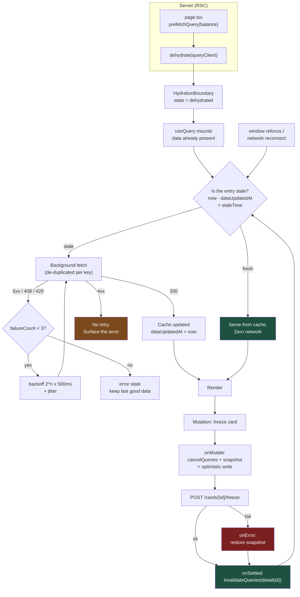

# Server State Is Not Your State: TanStack Query v5 as the Cache You Were Going to Write Badly

Every team that hand-rolls data fetching ends up building a cache. The question is only whether they build it deliberately, or accidentally, out of `useEffect` and hope. The accidental version is the one with the race conditions.

## The Real-World Problem

A retail bank rebuilt its **digital banking account overview** — balances, recent transactions, standing orders, card controls — as a React front end over an existing REST layer. Customers with multiple products (current account, savings, two credit cards, a mortgage) switch between accounts constantly using a left-hand account switcher.

Data fetching was hand-written: `useEffect`, `fetch`, three pieces of state per screen. It passed QA, because QA clicked once and waited.

Production had faster fingers. A customer switching from their current account to a credit card fired request A, then request B 180ms later. The credit-card response (a small payload, warm cache) returned in 120ms. The current-account response (a large transaction list, cold cache) returned 900ms later — and overwrote it. The screen showed the **credit-card header and limit above the current account's transaction list**. Balance figures from one product appeared under another product's name.

Support logged 61 tickets in the first fortnight, categorised as "wrong balance shown." The bank's incident review classified it as a **customer-information integrity issue** and it went to the operational-risk register: a customer who screenshots a balance that was never theirs is a complaint the bank cannot explain away.

The surrounding damage was quieter but larger. There was no request de-duplication, so the account switcher, the header, and the transfer form each fetched the same balance independently — three calls per screen, 4× the API load the capacity model assumed. There was no cache, so navigating back re-fetched everything from cold. There was no retry, so a single 503 from a mid-tier gateway showed the customer a permanent error until they reloaded. And a stale closure in one `useEffect` meant an unmount during flight set state on a dead component, which the team had "fixed" by suppressing the warning.

None of these were exotic bugs. They were the five things a server-state library exists to prevent.

## The Concept

### The founding distinction: server state vs. client state

| | Client state | Server state |
|---|---|---|
| **Owner** | This browser tab | A remote system |
| **Truth** | You are the truth | You hold a *copy*, which is stale the moment it arrives |
| **Examples** | Is the drawer open, which tab is active, unsent form input | Balances, transactions, customer profile, product catalogue |
| **Needs** | Setter, maybe persistence | Caching, de-duplication, invalidation, retry, staleness, background refresh |
| **Right tool** | `useState`, `useReducer`, Zustand, URL params | **TanStack Query** |

Putting server state into a client-state store (Redux, Zustand, a Context) is the original sin: you inherit responsibility for freshness, and you will not discharge it. Query's whole value is that it treats your data as a *cache of someone else's truth* and gives you the vocabulary to manage that.

### Query keys are a typed contract, not strings

A key is the cache identity. Loose keys cause exactly two bugs: collisions (two different things sharing a key) and orphans (an invalidation that misses because the key was typed differently at the mutation site). Both disappear with a **key factory** — one module, hierarchical, typed.

```ts
// features/accounts/queries/keys.ts
export const accountKeys = {
  all: ['accounts'] as const,
  lists: () => [...accountKeys.all, 'list'] as const,
  list: (customerId: string) => [...accountKeys.lists(), customerId] as const,
  details: () => [...accountKeys.all, 'detail'] as const,
  detail: (accountId: string) => [...accountKeys.details(), accountId] as const,
  balance: (accountId: string) => [...accountKeys.detail(accountId), 'balance'] as const,
  transactions: (accountId: string, filters: TxFilters) =>
    [...accountKeys.detail(accountId), 'transactions', filters] as const,
} as const
```

The hierarchy is the invalidation API: `accountKeys.detail(id)` invalidates that account's balance *and* transactions, because prefix matching walks down. `accountKeys.all` nukes the domain. Nothing else in the app writes a key literal.

### `staleTime` and `gcTime` are per-data-type decisions

These are the two settings teams leave at defaults and then complain about behaviour.

- **`staleTime`** — how long the data is considered *fresh*. While fresh, no refetch happens on mount, focus, or reconnect. Default `0`: every mount refetches.
- **`gcTime`** — how long an *unused* (no observers) cache entry survives before collection. Default 5 minutes. This is what makes a back-navigation instant.

Choose per data type, and write down why:

| Data | `staleTime` | `gcTime` | Reasoning |
|---|---|---|---|
| Currency list, transaction categories, branch list | `Infinity` (or 24h) | 24h | Changes on a release. Refetching is pure waste |
| Product terms, fee schedule | `60 * 60_000` | 24h | Editorial cadence, hours not seconds |
| Customer profile, address | `5 * 60_000` | 30 min | Changes rarely, and the user changed it themselves |
| Transaction list | `30_000` | 10 min | New items matter, but not sub-second |
| **Available balance** | `0` | 60_000 | A number the customer may act on. Always revalidate on focus |
| Payment-limit remaining | `0` | 60_000 | Same: acting on a stale limit produces a rejected payment |

The rule: **`staleTime: 0` for any figure a user will make a financial decision against.** Anything a user could screenshot and complain about must revalidate when they come back to the tab.

### Invalidation: targeted, never blanket

`queryClient.invalidateQueries()` with no argument marks *every query in the application* stale. On an account overview that is 14 refetches to reflect one changed standing order, and it will be the reason someone tells you Query is slow.

| Intent | Call |
|---|---|
| One account's data after a transfer | `invalidateQueries({ queryKey: accountKeys.detail(id) })` |
| Both sides of an internal transfer | two targeted calls, or `predicate` matching both ids |
| All lists but no details | `invalidateQueries({ queryKey: accountKeys.lists() })` |
| Only what is on screen right now | add `refetchType: 'active'` |
| Everything | almost always wrong |

Two adjacent tools that are not invalidation: `setQueryData` writes a known-correct value into the cache without a round trip (use it when the mutation response *is* the new resource), and `removeQueries` deletes rather than refetches (use it on logout — a cache surviving a session change is a data-disclosure bug).

### Optimistic updates need a rollback, or they are a lie

The pattern is three callbacks and one snapshot:

1. `onMutate` — cancel in-flight queries for that key, snapshot the current data, write the optimistic value, return the snapshot as context.
2. `onError` — restore the snapshot from context. Non-negotiable.
3. `onSettled` — invalidate so the server's answer wins regardless of outcome.

And a judgment call: **only optimise optimistically what the server will almost certainly accept.** Renaming a payee, toggling a card freeze, marking a notification read — yes. Submitting a payment — no. An optimistic payment that rolls back has told a customer their money moved when it did not.

### Retry policy: never retry a 4xx

A 400, 401, 403, 404, or 422 will not become a 200 on the third attempt. Retrying them wastes latency, triples the load during an incident, and — on a 401 — can burn a rate limit or trip an account lockout. Retry 408, 429 (with respect for `Retry-After`), and 5xx, with exponential backoff **plus jitter**.

### App Router integration: prefetch on the server, hydrate on the client

The App Router gives you the initial data on the server; Query gives you interactivity afterwards. Prefetch into a request-scoped `QueryClient`, ship the dehydrated state, and the client mounts with data already warm — no loading spinner on first paint, and no double fetch.

## How It Works



Two properties do the heavy lifting: **fetches are de-duplicated per key**, so three components asking for the same balance produce one request; and **every path returns to the staleness check**, so the cache converges on the server's answer whether the mutation succeeded or not.

## Practical Example

**Wrong — the code that shipped the incident:**

```tsx
// features/accounts/account-overview.tsx  — DO NOT DO THIS
'use client'

import { useEffect, useState } from 'react'

export function AccountOverview({ accountId }: { accountId: string }) {
  const [account, setAccount] = useState<Account | null>(null)
  const [loading, setLoading] = useState(true)
  const [error, setError] = useState<Error | null>(null)

  useEffect(() => {
    setLoading(true)
    fetch(`/api/accounts/${accountId}`)
      .then((r) => r.json())
      .then((d) => {
        setAccount(d)      // ← no check that accountId still matches: THE RACE
        setLoading(false)
      })
      .catch((e) => {
        setError(e)
        setLoading(false)
      })
  }, [accountId])

  if (loading) return <Spinner />
  if (error) return <p>Something went wrong.</p>
  return <AccountHeader account={account!} />
}
```

Exactly what this gets wrong, enumerated:

1. **Race condition** — no `AbortController`, no request-id guard. A slow earlier response overwrites a fast later one. This is the wrong-balance bug.
2. **No de-duplication** — three components mounting with the same `accountId` issue three identical requests.
3. **No cache** — every navigation refetches from cold; back-navigation shows a spinner for data the browser had 400ms ago.
4. **No retry** — a single transient 503 is a terminal error state for the customer.
5. **Stale closures and unmount writes** — `setAccount` after unmount; and if `accountId` changed mid-flight the closure still holds the old one.
6. **`r.json()` unvalidated** — a shape change in the API becomes an undefined-property crash at render.
7. **No background revalidation** — a balance rendered at 09:00 is still on screen at 11:00 with no indication it is stale.

**Right — one hook per resource, keys from the factory, response validated:**

```ts
// features/accounts/queries/account.queries.ts
import { useQuery, queryOptions } from '@tanstack/react-query'
import { z } from 'zod'
import { accountKeys } from './keys'
import { apiFetch, ApiClientError } from '@/lib/api/client'

const balanceSchema = z.object({
  accountId: z.string(),
  currency: z.string().length(3),
  available: z.string(),          // money as a string. Never a JS number
  ledger: z.string(),
  asOf: z.string().datetime(),
})
export type Balance = z.infer<typeof balanceSchema>

/** queryOptions() gives one typed definition usable by useQuery, prefetch and setQueryData. */
export function balanceQuery(accountId: string) {
  return queryOptions({
    queryKey: accountKeys.balance(accountId),
    queryFn: async ({ signal }) => {
      const json = await apiFetch(`/accounts/${accountId}/balance`, { signal })
      return balanceSchema.parse(json)     // contract enforced at the boundary
    },
    // A figure the customer may act on: always revalidate.
    staleTime: 0,
    gcTime: 60_000,
    refetchOnWindowFocus: true,
  })
}

export function useBalance(accountId: string) {
  return useQuery(balanceQuery(accountId))
}

/** Reference data. Fetch once per session; refetching it is pure waste. */
export function useTransactionCategories() {
  return useQuery({
    queryKey: ['reference', 'transaction-categories'],
    queryFn: ({ signal }) => apiFetch('/reference/transaction-categories', { signal }),
    staleTime: Infinity,
    gcTime: 24 * 60 * 60_000,
  })
}
```

```ts
// lib/api/query-client.ts
import { QueryClient, isServer } from '@tanstack/react-query'
import { ApiClientError } from './client'

export function makeQueryClient() {
  return new QueryClient({
    defaultOptions: {
      queries: {
        staleTime: 30_000,          // a deliberate default, not zero-by-accident
        gcTime: 5 * 60_000,
        retry: (failureCount, error) => {
          // never retry a 4xx: a bad request will not become a good one
          if (error instanceof ApiClientError && error.status < 500 && error.status !== 429) {
            return false
          }
          return failureCount < 3
        },
        retryDelay: (attempt) =>
          Math.min(500 * 2 ** attempt, 8_000) + Math.random() * 250,   // jitter
        refetchOnWindowFocus: false, // opt in per query instead
      },
      mutations: { retry: 0 },       // writes are never blind-retried
    },
  })
}

let browserClient: QueryClient | undefined
export function getQueryClient() {
  if (isServer) return makeQueryClient()      // one per request: never shared across users
  return (browserClient ??= makeQueryClient())
}
```

**Paginated transactions with `placeholderData`, and `select` for derived data:**

```ts
// features/accounts/queries/transaction.queries.ts
import { useQuery, keepPreviousData } from '@tanstack/react-query'
import { accountKeys } from './keys'
import { apiFetch } from '@/lib/api/client'

export type TxFilters = { page: number; pageSize: number; category?: string }

export function useTransactions(accountId: string, filters: TxFilters) {
  return useQuery({
    queryKey: accountKeys.transactions(accountId, filters),
    queryFn: ({ signal }) =>
      apiFetch(`/accounts/${accountId}/transactions`, { params: filters, signal }),
    // keeps page 3 on screen while page 4 loads: no layout collapse, no spinner flash
    placeholderData: keepPreviousData,
    staleTime: 30_000,
    // derived data computed in the cache selector, not in render
    select: (data) => ({
      ...data,
      totalDebits: data.items
        .filter((t: { direction: string }) => t.direction === 'DEBIT')
        .length,
    }),
  })
}
```

**An infinite query for the mobile transaction feed:**

```ts
// features/accounts/queries/transaction-feed.queries.ts
import { useInfiniteQuery } from '@tanstack/react-query'
import { accountKeys } from './keys'
import { apiFetch } from '@/lib/api/client'

type Page = { items: Transaction[]; nextCursor: string | null }

export function useTransactionFeed(accountId: string) {
  return useInfiniteQuery({
    queryKey: [...accountKeys.detail(accountId), 'feed'],
    queryFn: ({ pageParam, signal }) =>
      apiFetch<Page>(`/accounts/${accountId}/transactions`, {
        params: { cursor: pageParam, limit: 25 },
        signal,
      }),
    initialPageParam: null as string | null,
    getNextPageParam: (last) => last.nextCursor,   // cursor pagination, not offset
    staleTime: 30_000,
    maxPages: 8,   // bounds memory on a long-scrolled feed
  })
}
```

**An optimistic mutation with a real rollback:**

```ts
// features/cards/mutations/use-freeze-card.ts
'use client'

import { useMutation, useQueryClient } from '@tanstack/react-query'
import { cardKeys } from '../queries/keys'
import { apiFetch } from '@/lib/api/client'
import type { Card } from '../queries/card.queries'

export function useFreezeCard(cardId: string) {
  const qc = useQueryClient()

  return useMutation({
    mutationFn: (frozen: boolean) =>
      apiFetch(`/cards/${cardId}/freeze`, { method: 'POST', body: { frozen } }),

    onMutate: async (frozen) => {
      // 1. stop in-flight fetches that would clobber the optimistic write
      await qc.cancelQueries({ queryKey: cardKeys.detail(cardId) })
      // 2. snapshot for rollback
      const previous = qc.getQueryData<Card>(cardKeys.detail(cardId))
      // 3. apply optimistically — a card freeze is near-certain to succeed
      qc.setQueryData<Card>(cardKeys.detail(cardId), (old) =>
        old ? { ...old, frozen } : old,
      )
      return { previous }
    },

    onError: (_err, _frozen, ctx) => {
      // rollback is mandatory. Without it the UI is simply lying.
      if (ctx?.previous) qc.setQueryData(cardKeys.detail(cardId), ctx.previous)
    },

    onSettled: () => {
      // targeted: this card only. Never invalidateQueries() with no key.
      void qc.invalidateQueries({ queryKey: cardKeys.detail(cardId) })
    },
  })
}
```

**Server prefetch and hydration in the App Router:**

```tsx
// app/(authenticated)/accounts/[accountId]/page.tsx  — Server Component
import { HydrationBoundary, dehydrate } from '@tanstack/react-query'
import { getQueryClient } from '@/lib/api/query-client'
import { balanceQuery } from '@/features/accounts/queries/account.queries'
import { AccountOverview } from '@/features/accounts/account-overview'

export const dynamic = 'force-dynamic' // per-customer data

export default async function AccountPage({
  params,
}: {
  params: Promise<{ accountId: string }>
}) {
  const { accountId } = await params
  const queryClient = getQueryClient()   // request-scoped on the server

  await queryClient.prefetchQuery(balanceQuery(accountId))

  return (
    <HydrationBoundary state={dehydrate(queryClient)}>
      {/* mounts with data already in cache: no first-paint spinner, no double fetch */}
      <AccountOverview accountId={accountId} />
    </HydrationBoundary>
  )
}
```

**A test that pins the race the incident was about:**

```ts
// features/accounts/queries/account.queries.test.tsx
import { renderHook, waitFor } from '@testing-library/react'
import { QueryClientProvider } from '@tanstack/react-query'
import { makeQueryClient } from '@/lib/api/query-client'
import { useBalance } from './account.queries'
import { server, http, HttpResponse, delay } from '@/test/msw'

it('never renders one account balance under another account id', async () => {
  server.use(
    http.get('*/accounts/:id/balance', async ({ params }) => {
      await delay(params.id === 'CURRENT-1' ? 900 : 100)   // slow first, fast second
      return HttpResponse.json({
        accountId: params.id, currency: 'GBP', available: '1042.55',
        ledger: '1042.55', asOf: '2026-08-10T09:00:00.000Z',
      })
    }),
  )

  const client = makeQueryClient()
  const { result, rerender } = renderHook(({ id }) => useBalance(id), {
    initialProps: { id: 'CURRENT-1' },
    wrapper: ({ children }) => (
      <QueryClientProvider client={client}>{children}</QueryClientProvider>
    ),
  })

  rerender({ id: 'CARD-9' })   // user switches accounts mid-flight

  await waitFor(() => expect(result.current.data).toBeDefined())
  // the key changed, so the slow CURRENT-1 response can never land here
  expect(result.current.data!.accountId).toBe('CARD-9')
})
```

## Enterprise Trade-offs

| Approach | Pros | Cons | When to use (Banking / Insurance / Enterprise) |
|---|---|---|---|
| **TanStack Query with a key factory** | De-dup, cache, retry, staleness, invalidation solved; typed keys make invalidation reliable | A cache mental model the team must learn; keys need review discipline | Default for all client-side server state in an authenticated enterprise app |
| **RSC `await` only, no client cache** | Zero client JS for data; simplest possible model | Every refresh is a server round trip; no optimistic updates or background revalidation | Read-mostly pages: statements, reference tables, printable reports |
| **RSC prefetch + hydrate + Query** | Data in first paint *and* interactive refetch afterwards | Two places data can be fetched; needs a request-scoped client per user | Dashboards and operational tables — the standard shape for enterprise screens |
| **Optimistic update with rollback** | Feels instant on high-confidence writes | A rollback that flickers is worse than a spinner; the failure path needs testing | Card freeze, payee rename, mark-as-read. **Never** payments or claim submissions |
| **`setQueryData` from the mutation response** | Saves a round trip; the cache is exactly right | Only valid when the response is the full new resource | PATCH endpoints that return the updated entity |
| **Hand-rolled `useEffect` + `fetch`** | No dependency | Races, duplicate calls, no cache, no retry, unmount writes — the incident above | Never for real server state. A one-off health-check ping at most |
| **Server state in Redux/Zustand** | Familiar to teams from 2019 | You inherit freshness, invalidation and de-dup, and will implement them worse | Never. Keep those stores for genuine client state |

## Why This Still Matters Through 2030

The distinction between "state I own" and "a cached copy of state someone else owns" is a property of distributed systems, not of a React library, which is why it has outlasted every fetching fashion since jQuery and why the same concepts have been reimplemented in SWR, RTK Query, Apollo's cache, Vue Query, and Angular's resource APIs. Server Components and server functions genuinely reduce how much client-side fetching an enterprise app needs — and that is a good thing — but they do not remove the cases that matter most in these systems: a filterable operational table the user re-queries forty times an hour, a balance that must revalidate when the tab regains focus, an optimistic toggle, a background refresh while the user reads. Those still need a cache with an invalidation vocabulary. What will keep changing is where the boundary sits between framework-provided caching and library-provided caching; what will not change is that a fetch without de-duplication races, a write without invalidation goes stale, and a retry without a 4xx guard amplifies an outage. In a regulated context there is a harder edge to it: showing a customer a figure that was never theirs is not a UI bug, it is an information-integrity incident with a reporting obligation, and the cheapest control against it is a cache keyed on identity by a factory nobody bypasses.

→ Next: [07-url-state-management-with-nuqs.md](07-url-state-management-with-nuqs.md) · Related: [../05-apis-and-integration/04-orval-generating-typed-clients-from-openapi.md](../05-apis-and-integration/04-orval-generating-typed-clients-from-openapi.md) · [../10-example-code/react/tanstack-query-example.md](../10-example-code/react/tanstack-query-example.md)
